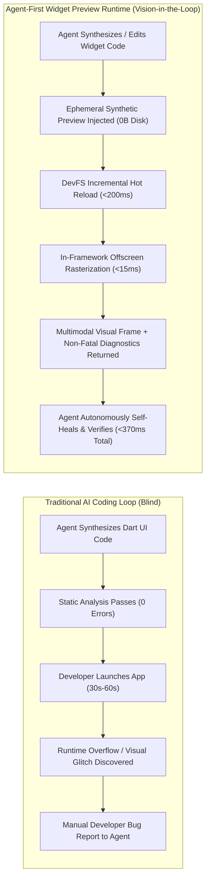
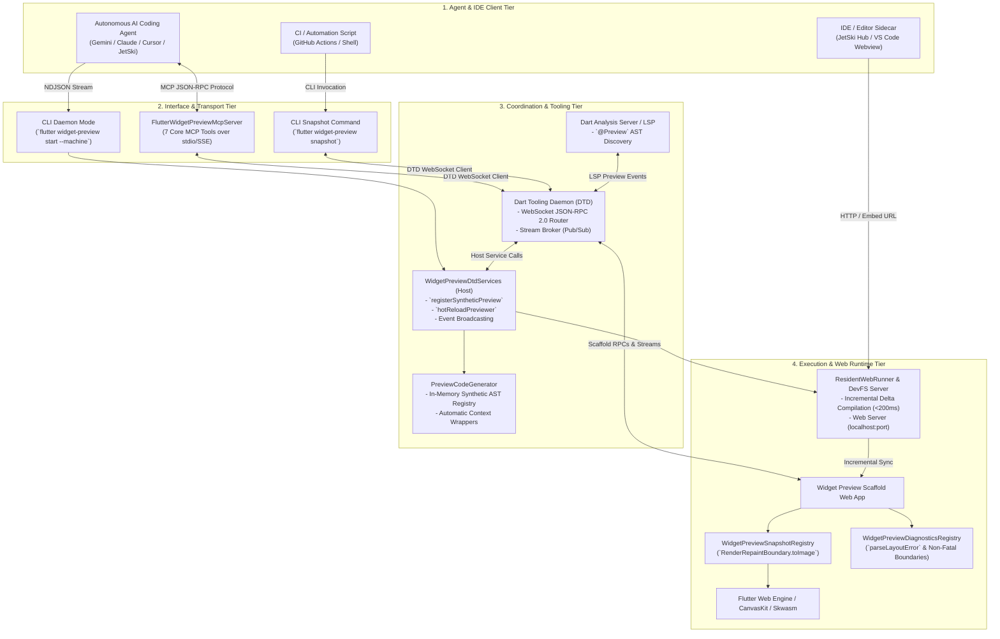
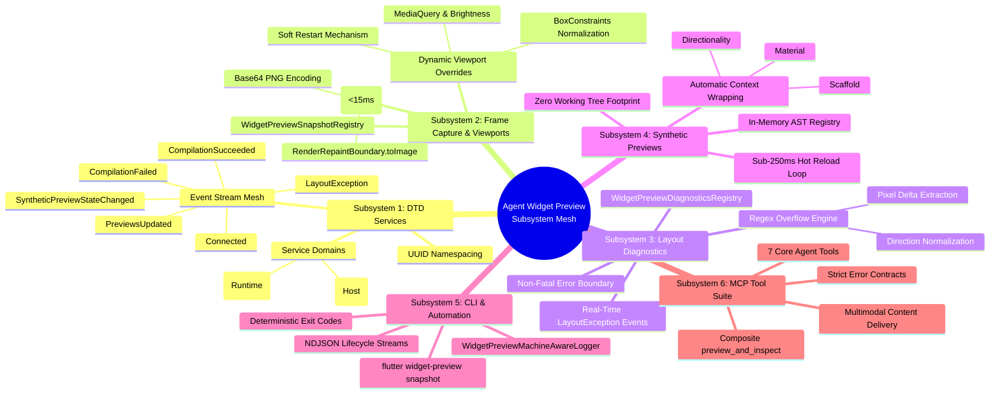
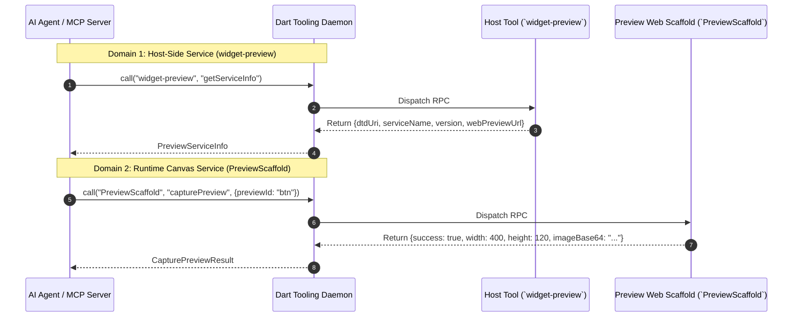
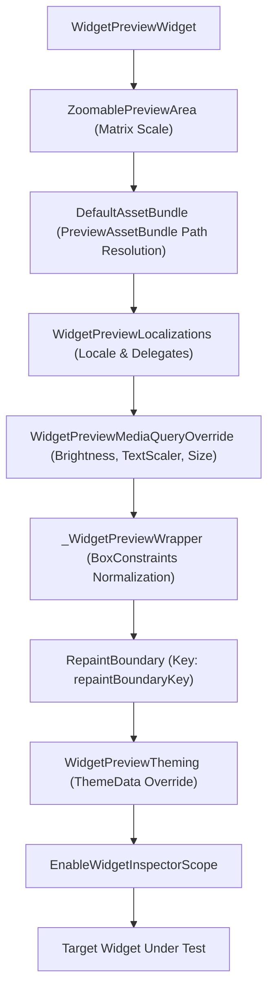
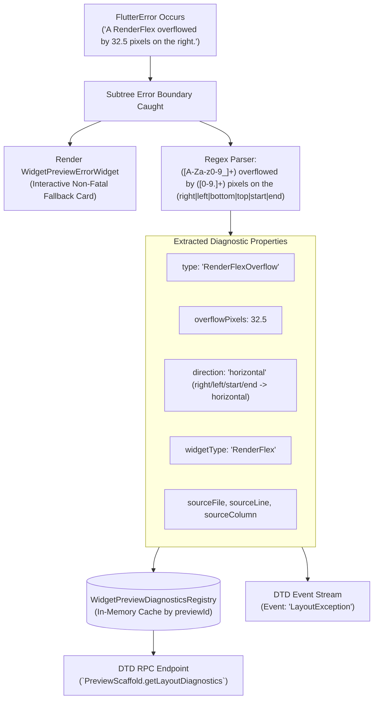
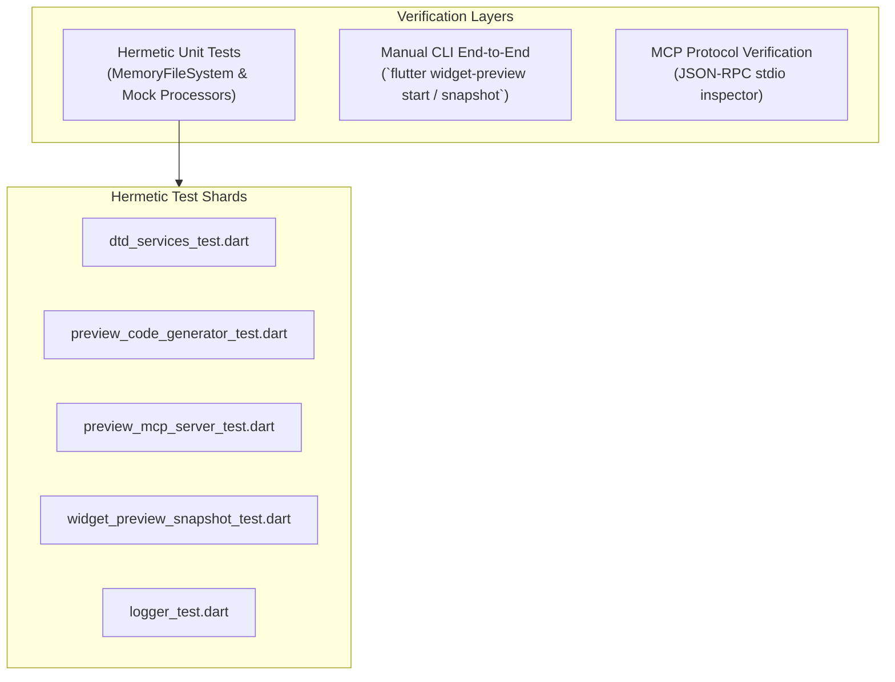

# Agent-First Flutter Widget Preview: Master Technical Architecture & Specification

## 1. Executive Summary & Vision

Modern software engineering is undergoing a generational paradigm shift driven by autonomous AI coding assistants (e.g., Gemini Code Assist, JetSki, Claude Code, Cursor, Windsurf, Roo Code). While Large Language Models (LLMs) and Multimodal Models (LMMs) excel at static code synthesis, logic implementation, and API integration, their ability to engineer graphical user interfaces (GUIs) in frameworks like Flutter has historically suffered from three crippling structural bottlenecks:

1. **The "Blind Editing" Barrier**: Language models lack an embedded perceptual feedback loop. Code generation occurs purely via textual probability distributions without visual verification of rendered layout, hierarchy, typography, colors, padding, clipping, or component contrast.
2. **Silent Runtime Layout Failures**: Critical layout defects—such as `RenderFlex` overflows, unbounded sizing inside scroll containers, missing `Material` ancestors, or text directionality violations—pass static Dart analysis cleanly and only manifest at runtime when the render tree computes geometry.
3. **High-Friction Execution Latency**: Traditional application execution requires bundling, compiling, and launching full applications (10–60s) while introducing stateful runtime dependencies (authentication, backend mock APIs, complex routing).



### The Agent-First Vision
The **Agent-First Flutter Widget Preview** architecture transforms `flutter widget-preview` from a human-only visual companion into a **programmable, vision-in-the-loop agent runtime**. By exposing deep framework hooks, deterministic WebSocket RPC services via the **Dart Tooling Daemon (DTD)**, machine-readable CLI streams, and a standard **Model Context Protocol (MCP)** tool suite, the preview subsystem empowers autonomous agents to discover, render headlessly, inspect, diagnose, and self-heal Flutter user interfaces in sub-second feedback loops.

### Core Value Propositions & Architectural Pillars

| Value Proposition | Architectural Mechanism | Performance & Impact |
|---|---|---|
| **Sub-15ms Frame Capture** | In-framework `RenderRepaintBoundary.toImage` pipeline directly rasterizing layer trees. | Eliminates heavyweight browser screenshotting (150–400ms) with pure <15ms sub-tree capture. |
| **Non-Fatal Layout Interception** | Scaffold-level error boundaries with regex extraction of `RenderFlex` overflow deltas and axes. | Prevents preview runner crashes; delivers exact pixel overflow numbers (e.g. `18.5 px horizontal in Row`). |
| **Zero-Disk Synthetic Previews** | In-memory AST generation in `PreviewCodeGenerator` with automatic `Material`/`Directionality`/`Scaffold` wrapping. | Agents test arbitrary constructor permutations on-the-fly without dirtying Git workspace files (`0B` disk footprint). |
| **Multi-Client Live Web Streaming** | Single resident `ResidentWebRunner` serving DevFS hot reloads simultaneously over HTTP and DTD. | Synchronizes headless background AI capture workers with interactive human IDE sidecars (JetSki Hub, VS Code). |
| **CLI Machine Mode & Automation** | `--machine` NDJSON event logger and non-interactive `flutter widget-preview snapshot` subcommand. | Enables headless CI pipelines, visual regression testing, and shell script automation with deterministic exit codes. |
| **7-Tool Model Context Protocol Suite** | Native `FlutterWidgetPreviewMcpServer` implementing standard MCP tool schemas and multimodal envelopes. | Provides turnkey integration for AI assistants with combined frame and layout inspection (`preview_and_inspect`). |

---

## 2. End-to-End System Architecture

The Agent-First Widget Preview ecosystem operates across four coordinated tiers, unified by the **Dart Tooling Daemon (DTD)** as the central communication bus.



### Component Interaction & Transport Channels

1. **Dart Tooling Daemon (DTD)**:
   - Functions as the universal message and RPC broker.
   - Decouples client tools (MCP server, CLI snapshot command, IDE extensions) from the internal details of the Flutter runtime.
   - Manages service registration and event streams across two isolated domains:
     - `widget-preview`: Host-side lifecycle, compilation, synthetic AST registration, and preference management.
     - `PreviewScaffold`: Runtime canvas snapshotting, viewport overrides, and layout diagnostic inspection.
2. **Flutter Tools Resident Host**:
   - Manages the long-running daemon lifecycle, project configuration, and `PackageConfig` URI resolution.
   - Houses `PreviewCodeGenerator`, which synthesizes `.dart_tool/widget_preview_scaffold/lib/src/generated_preview.dart` by merging static `@Preview` code with dynamic synthetic previews.
   - Triggers fast incremental DevFS compilation and hot reloads (<200ms) upon source code or synthetic preview modifications.
3. **Widget Preview Web App Runtime**:
   - Compiles and runs in modern browsers or headless Chromium instances using CanvasKit/Skwasm.
   - Encapsulates each rendered widget in a `RepaintBoundary` with `GlobalKey` tracking for offscreen frame rasterization.
   - Implements non-fatal layout exception interception to capture `RenderFlex` overflow metrics without aborting the web application.

---

## 3. Detailed Subsystem Breakdowns



---

### Subsystem 1: DTD Service & Event Stream Mesh

The **Dart Tooling Daemon (DTD)** subsystem coordinates host-level build events and runtime evaluation across two distinct service domains.

#### Source References
- Host DTD service implementation: [`packages/flutter_tools/lib/src/widget_preview/dtd_services.dart`](file:///usr/local/google/home/bkonyi/.gemini/jetski/worktrees/flutter/enable_widget_preview_agents/packages/flutter_tools/lib/src/widget_preview/dtd_services.dart)
- Serialization models: [`packages/flutter_tools/lib/src/widget_preview/dtd_types.dart`](file:///usr/local/google/home/bkonyi/.gemini/jetski/worktrees/flutter/enable_widget_preview_agents/packages/flutter_tools/lib/src/widget_preview/dtd_types.dart)
- Scaffold-side DTD handlers: [`packages/flutter_tools/templates/widget_preview_scaffold/lib/src/dtd/dtd_services.dart.tmpl`](file:///usr/local/google/home/bkonyi/.gemini/jetski/worktrees/flutter/enable_widget_preview_agents/packages/flutter_tools/templates/widget_preview_scaffold/lib/src/dtd/dtd_services.dart.tmpl)

#### DTD Service Domain Matrix



| Service Domain | Hosted By | Method Name | Parameters | Returns | Functional Description |
|---|---|---|---|---|---|
| `widget-preview` | `flutter_tools` (Host) | `getServiceInfo` | `{}` | [`PreviewServiceInfo`](#previewserviceinfo) | Returns active DTD endpoints, protocol version (`1.0.0`), and web server URL. |
| `widget-preview` | `flutter_tools` (Host) | `getWebPreviewUrl` | `{}` | [`WebPreviewUrlResult`](#webpreviewurlresult) | Returns active HTTP host, port, and URL for embedding in webviews. |
| `widget-preview` | `flutter_tools` (Host) | `registerSyntheticPreview` | [`SyntheticPreviewDetails`](#syntheticpreviewdetails) | `BoolResponse` | Injects an ephemeral preview into the scaffold without modifying user source code. |
| `widget-preview` | `flutter_tools` (Host) | `unregisterSyntheticPreview` | `{"previewId": String}` | `BoolResponse` | Removes a dynamic preview by identifier. |
| `widget-preview` | `flutter_tools` (Host) | `clearSyntheticPreviews` | `{}` | `{"clearedCount": int}` | Removes all registered synthetic previews simultaneously. |
| `widget-preview` | `flutter_tools` (Host) | `hotReloadPreviewer` | `{}` | `Success` | Triggers immediate incremental DevFS compilation and frame reload. |
| `widget-preview` | `flutter_tools` (Host) | `hotRestartPreviewer` | `{}` | `Success` | Re-initializes preview scaffold application state. |
| `widget-preview` | `flutter_tools` (Host) | `resolveUri` | `{"uri": String}` | `StringResponse` | Resolves `package:` URI into an absolute `file://` URI via `PackageConfig`. |
| `PreviewScaffold` | Web Scaffold Runtime | `capturePreview` | `{previewId, devicePixelRatio?, returnImage?, outputPath?}` | [`CapturePreviewResult`](#capturepreviewresult) | Offscreen rasterization returning Base64 PNG and dimension metadata. |
| `PreviewScaffold` | Web Scaffold Runtime | `getLayoutDiagnostics` | `{previewId?}` | [`LayoutDiagnosticReport`](#layoutdiagnosticreport) | Returns structured `RenderFlex` overflows and build assertion diagnostics. |

#### Real-Time Event Stream Mesh (`WidgetPreviewScaffold`)
Clients subscribe via `dtd.streamListen(streamName)` to receive asynchronous lifecycle notifications:

| Event Kind | Trigger Condition | Payload Data Schema |
|---|---|---|
| `Connected` | Web scaffold initializes and establishes DTD connection. | `{}` |
| `PreviewsUpdated` | Dart Analysis Server detects changes in `@Preview` declarations. | `{"count": int, "previews": List<Map>}` |
| `SyntheticPreviewStateChanged` | Ephemeral preview is registered or unregistered. | `{"previewId": String, "registered": bool}` |
| `CompilationSucceeded` | DevFS incremental hot reload completes cleanly. | `{"success": true, "durationMs": int}` |
| `CompilationFailed` | Dart syntax error or compilation failure occurs. | `{"success": false, "error": String, "durationMs": int}` |
| `LayoutException` | Subtree encounters `RenderFlex` overflow or assertion failure. | `{"previewId": String, "diagnostic": Map}` |

#### UUID Namespacing Strategy
To support concurrent sessions and multi-tenant environments without RPC name collisions:
- Default service name: `widget-preview` (or `widget-preview-<UUID>` when `addUuidToServiceName` is enabled).
- Default stream name: `WidgetPreviewScaffold` (or `WidgetPreviewScaffold-<UUID>`).
- The `--disable-dtd-service-uuid` flag can pin service names to deterministic root strings for headless testing and CLI agents.

---

### Subsystem 2: High-Performance Offscreen Frame Capture & Viewport Overrides

Visual inspection requires sub-second snapshot turnaround. Traditional browser-level screenshotting introduces 150–400ms overhead and captures non-essential scaffolding. The in-framework snapshotting pipeline achieves **<15ms capture latency**.

#### Source References
- In-framework rendering pipeline: [`packages/flutter_tools/templates/widget_preview_scaffold/lib/src/widget_preview_rendering.dart.tmpl`](file:///usr/local/google/home/bkonyi/.gemini/jetski/worktrees/flutter/enable_widget_preview_agents/packages/flutter_tools/templates/widget_preview_scaffold/lib/src/widget_preview_rendering.dart.tmpl)
- Subsystem documentation: [`packages/flutter_tools/docs/snapshotting_and_viewport_injection.md`](file:///usr/local/google/home/bkonyi/.gemini/jetski/worktrees/flutter/enable_widget_preview_agents/packages/flutter_tools/docs/snapshotting_and_viewport_injection.md)

#### In-Framework Rasterization Pipeline

```mermaid
flowchart LR
    subgraph RenderTree["Render Object Tree"]
        Boundary["RenderRepaintBoundary<br/>(Mapped to previewId GlobalKey)"]
        Layer["OffsetLayer<br/>(Isolated Display List Subtree)"]
    end

    subgraph GraphicsEngine["dart:ui Graphics Engine"]
        ToImage["toImage(pixelRatio: 2.0)"]
        UiImage["ui.Image Surface"]
        ByteEncode["toByteData(format: png)"]
        RawBytes["Uint8List PNG Bytes"]
    end

    subgraph Serialization["Payload Formatting"]
        Base64["base64Encode(pngBytes)"]
        ResultMap["CapturePreviewResult Map<br/>(width, height, imageBase64)"]
    end

    Boundary --> Layer
    Layer --> ToImage
    ToImage --> UiImage
    UiImage --> ByteEncode
    ByteEncode --> RawBytes
    RawBytes --> Base64
    Base64 --> ResultMap
```



1. **Repaint Boundary Isolation**: Each preview instance is wrapped in a `RepaintBoundary` with a dedicated `GlobalKey`.
2. **Registry Mapping**: `WidgetPreviewSnapshotRegistry.registerKey(previewId, repaintBoundaryKey)` indexes active preview keys in memory during `initState()`.
3. **Direct Layer Rasterization**: `renderObject.toImage(pixelRatio: devicePixelRatio)` renders the isolated `OffsetLayer` into an uncompressed raster surface in <8ms.
4. **PNG Encoding**: `image.toByteData(format: ui.ImageByteFormat.png)` converts the bitmap to PNG in ~5ms.
5. **Base64 Payload Assembly**: The bytes are converted to a standard RFC 2397 Data URI (`data:image/png;base64,...`) and returned via DTD.

#### Viewport Normalization & Environment Overrides
To ensure consistent rendering without runtime constraint crashes, the preview runtime wraps each component in a comprehensive environment stack:



- **`_WidgetPreviewWrapperBox`**: A custom `RenderShiftedBox` that calculates child intrinsic dimensions (`getMinIntrinsicHeight`) and applies fallback constraints when rendering unbounded widgets.
- **`WidgetPreviewMediaQueryOverride`**: Dynamically overrides `platformBrightness` (`light` vs `dark`), `textScaler` (e.g. `1.5x`, `2.0x` for accessibility audits), and explicit width/height dimensions.
- **Soft Restart Mechanism**: The `softRestartListenable` temporarily removes the preview subtree for a single frame and re-mounts it, resetting all `State.initState()` initializers without requiring a full application restart.

---

### Subsystem 3: Non-Fatal Layout Diagnostics Pipeline

Layout violations in conventional Flutter apps produce red and yellow overflow stripes and unstructured terminal logs. The diagnostics pipeline provides **structured, non-fatal error interception**.

#### Source References
- Diagnostics registry & regex engine: [`packages/flutter_tools/templates/widget_preview_scaffold/lib/src/widget_preview_rendering.dart.tmpl`](file:///usr/local/google/home/bkonyi/.gemini/jetski/worktrees/flutter/enable_widget_preview_agents/packages/flutter_tools/templates/widget_preview_scaffold/lib/src/widget_preview_rendering.dart.tmpl)
- Subsystem documentation: [`packages/flutter_tools/docs/layout_and_diagnostics_pipeline.md`](file:///usr/local/google/home/bkonyi/.gemini/jetski/worktrees/flutter/enable_widget_preview_agents/packages/flutter_tools/docs/layout_and_diagnostics_pipeline.md)

#### Non-Fatal Error Interception & Regex Extraction



#### Diagnostic Parsing Logic
1. **Regex Pattern**:
   ```dart
   final overflowRegex = RegExp(
     r'([A-Za-z0-9_]+) overflowed by ([0-9.]+) pixels on the (right|left|bottom|top|start|end)',
     caseSensitive: false,
   );
   ```
2. **Axis Normalization**:
   - `'bottom'` or `'top'` $\rightarrow$ `'vertical'`
   - `'right'`, `'left'`, `'start'`, or `'end'` $\rightarrow$ `'horizontal'`
3. **Fallback Diagnostics**: Unstructured layout assertion errors or unbounded constraint crashes fall back to general `LayoutException` objects preserving file paths, line numbers, and terse stack traces.

---

### Subsystem 4: Ephemeral Synthetic Preview Injection Engine

AI agents frequently need to test widget permutations (e.g. testing `PrimaryButton(label: 'Very Long Label', isEnabled: false)`) without permanently altering developer code.

#### Source References
- Synthetic preview code generator: [`packages/flutter_tools/lib/src/widget_preview/preview_code_generator.dart`](file:///usr/local/google/home/bkonyi/.gemini/jetski/worktrees/flutter/enable_widget_preview_agents/packages/flutter_tools/lib/src/widget_preview/preview_code_generator.dart)
- Subsystem documentation: [`packages/flutter_tools/docs/synthetic_preview_scaffolding.md`](file:///usr/local/google/home/bkonyi/.gemini/jetski/worktrees/flutter/enable_widget_preview_agents/packages/flutter_tools/docs/synthetic_preview_scaffolding.md)

#### In-Memory AST Generation Pipeline

```mermaid
flowchart TD
    subgraph Inputs["Dynamic Registration Inputs"]
        Details["SyntheticPreviewDetails<br/>- constructorExpression: \"PrimaryButton(label: 'Save')\"<br/>- filePath: \"/lib/button.dart\"<br/>- previewId: \"synth_btn_01\"<br/>- wrappers: [\"Material\", \"Directionality\"]"]
        StaticMap["Discovered Static @Preview Declarations"]
    end

    subgraph Generator["PreviewCodeGenerator"]
        MemRegistry["_syntheticPreviews In-Memory Map"]
        ASTBuilder["_buildSyntheticPreview()<br/>- Resolves constructor expression<br/>- Composes Material/Directionality/Scaffold AST"]
        Merger["Merge Static & Synthetic AST Nodes"]
        Formatter["DartFormatter(languageVersion: 3.7.0)"]
    end

    subgraph Destination["Ephemeral Scaffold Storage"]
        ScaffoldFile["`.dart_tool/widget_preview_scaffold/lib/src/generated_preview.dart`<br/>`List<WidgetPreview> previews() => [...]`"]
    end

    Details --> MemRegistry
    MemRegistry --> ASTBuilder
    StaticMap --> Merger
    ASTBuilder --> Merger
    Merger --> Formatter
    Formatter --> ScaffoldFile
```

#### Supported Automatic Wrappers

| Wrapper String | Generated Dart Code | Target Library | Purpose |
|---|---|---|---|
| `'Material'` | `Material(child: <child>)` | `package:flutter/material.dart` | Provides ink splashes, material canvas, and elevation tints. |
| `'Directionality'` | `Directionality(textDirection: TextDirection.ltr, child: <child>)` | `package:flutter/widgets.dart` | Injects reading direction for text and bidirectional layouts. |
| `'Scaffold'` | `Scaffold(body: <child>)` | `package:flutter/material.dart` | Injects full-screen canvas and layout boundaries. |

---

### Subsystem 5: CLI Machine Mode & Scriptable Automation

Provides automated interfaces for CI/CD environments, shell scripts, and non-interactive tooling.

#### Source References
- CLI subcommands & machine logger: [`packages/flutter_tools/lib/src/commands/widget_preview.dart`](file:///usr/local/google/home/bkonyi/.gemini/jetski/worktrees/flutter/enable_widget_preview_agents/packages/flutter_tools/lib/src/commands/widget_preview.dart)
- Subsystem documentation: [`packages/flutter_tools/docs/cli_machine_mode_and_snapshot.md`](file:///usr/local/google/home/bkonyi/.gemini/jetski/worktrees/flutter/enable_widget_preview_agents/packages/flutter_tools/docs/cli_machine_mode_and_snapshot.md)

#### 1. CLI Daemon Machine Mode: `flutter widget-preview start --machine`
Emits single-line JSON array event envelopes via `WidgetPreviewMachineAwareLogger`:
```json
[{"event": "widget_preview.initializing", "params": {"pid": 48291}}]
[{"event": "widget_preview.started", "params": {"url": "http://127.0.0.1:54321/"}}]
[{"event": "widget_preview.logMessage", "params": {"level": "status", "message": "Hot reload complete in 142ms."}}]
```

#### 2. One-Shot Snapshot: `flutter widget-preview snapshot`
```bash
flutter widget-preview snapshot \
  --preview-id primary_button_preview \
  --dtd-url ws://127.0.0.1:45678/ws \
  --output build/snapshots/primary_button.png \
  --device-pixel-ratio 2.0 \
  --machine
```

**JSON Output Format (`--machine`)**:
```json
{
  "success": true,
  "previewId": "primary_button_preview",
  "width": 400,
  "height": 120,
  "devicePixelRatio": 2.0,
  "imageBase64": "iVBORw0KGgoAAAANSUhEUgAAAZAAAAB4CAYAAAD...",
  "outputPath": "build/snapshots/primary_button.png"
}
```

#### Deterministic Exit Codes
- `0`: Operation succeeded.
- `1`: Argument validation error, connection refusal, unmounted preview target, or filesystem failure.

---

### Subsystem 6: Model Context Protocol (MCP) Server Suite

The [`FlutterWidgetPreviewMcpServer`](file:///usr/local/google/home/bkonyi/.gemini/jetski/worktrees/flutter/enable_widget_preview_agents/packages/flutter_tools/lib/src/widget_preview/preview_mcp_server.dart) implements 7 declarative tools conforming strictly to the open Model Context Protocol specification.

#### Source References
- MCP server implementation: [`packages/flutter_tools/lib/src/widget_preview/preview_mcp_server.dart`](file:///usr/local/google/home/bkonyi/.gemini/jetski/worktrees/flutter/enable_widget_preview_agents/packages/flutter_tools/lib/src/widget_preview/preview_mcp_server.dart)
- Subsystem documentation: [`packages/flutter_tools/docs/mcp_tool_suite.md`](file:///usr/local/google/home/bkonyi/.gemini/jetski/worktrees/flutter/enable_widget_preview_agents/packages/flutter_tools/docs/mcp_tool_suite.md)

#### The 7 Core MCP Tools

```mermaid
graph TD
    subgraph SessionMgmt["Session Lifecycle"]
        start_session["`start_preview_session`"]
        stop_session["`stop_preview_session`"]
    end

    subgraph Discovery["Discovery"]
        list_previews["`list_previews`"]
    end

    subgraph Rendering["Rendering & Dynamic Injection"]
        render_preview["`render_preview`"]
        render_synthetic["`render_synthetic_preview`"]
    end

    subgraph Diagnostics["Diagnostics & Inspection"]
        get_diag["`get_layout_diagnostics`"]
        preview_and_inspect["`preview_and_inspect`<br/>(Consolidated Frame + Diag)"]
    end
```

| Tool Name | Parameters | Multimodal Output | Purpose |
|---|---|---|---|
| `list_previews` | `filePath?`, `includeSynthetic?` | Text summary + structured preview array | Discovers all `@Preview` annotations and unannotated widget classes. |
| `start_preview_session` | `dtdUrl?` | Text summary + connection JSON metadata | Validates or connects to the resident preview daemon and DTD bus. |
| `stop_preview_session` | `{}` | Text confirmation + `{success: true}` | Closes DTD connections and releases daemon resources. |
| `render_preview` | `previewId`, `devicePixelRatio?`, `outputPath?`, `themeMode?`, `viewportWidth?`, `viewportHeight?` | Text summary + Base64 `ImageContent` + Structured JSON | Renders a declared `@Preview` and captures an offscreen frame (<15ms). |
| `render_synthetic_preview` | `widgetName`, `constructorExpression`, `filePath`, `previewId?`, `wrappers?`, `devicePixelRatio?`, `outputPath?`, `autoCleanup?` | Text summary + Base64 `ImageContent` + Structured JSON | Dynamically registers, hot-reloads, rasterizes, and cleans up an ephemeral preview. |
| `get_layout_diagnostics` | `previewId?`, `clearAfterRead?` | Text Markdown error list + Structured [`LayoutDiagnosticReport`](#layoutdiagnosticreport) (`isError: true` on overflow) | Queries in-memory layout exceptions, `RenderFlex` overflow pixels, and failing lines. |
| `preview_and_inspect` | `previewId`, `devicePixelRatio?`, `outputPath?`, `themeMode?`, `viewportWidth?`, `viewportHeight?` | Text summary + Base64 `ImageContent` + Layout error text + Structured JSON | Consolidated one-shot tool returning image snapshot and layout assertions simultaneously. |

#### Multimodal Response Envelope (`McpToolResult`)
Responses wrap visual and structured data for multimodal models:
```json
{
  "content": [
    {
      "type": "text",
      "text": "Successfully rendered \"custom_card_preview\" (400x150 px, DPR: 2.0)."
    },
    {
      "type": "image",
      "data": "iVBORw0KGgoAAAANSUhEUgAAAZAAAACWCAYAAAD...",
      "mimeType": "image/png"
    },
    {
      "type": "text",
      "text": "Layout diagnostics detected 1 error(s):\n- OVERFLOW: 24.0 px on horizontal in Row"
    }
  ],
  "isError": true,
  "structuredContent": {
    "render": { "width": 400, "height": 150, "success": true },
    "diagnostics": {
      "hasErrors": true,
      "diagnostics": [{
        "type": "RenderFlexOverflow",
        "overflowPixels": 24.0,
        "direction": "horizontal",
        "widgetType": "Row",
        "sourceFile": "/lib/card.dart",
        "sourceLine": 42
      }]
    }
  }
}
```

---

## 4. Multi-Agent & IDE Workflows

### 1. Autonomous UI Creation & Self-Healing Loop

```mermaid
sequenceDiagram
    autonumber
    actor Agent as Autonomous AI Agent
    participant MCP as Flutter MCP Server
    participant Tool as Flutter Tool Daemon
    participant Code as Workspace Source Code

    Note over Agent,Code: Phase 1: Code Generation & Ephemeral Validation
    Agent->>Code: Writes new StatsBadge widget in lib/stats_badge.dart
    Agent->>MCP: call render_synthetic_preview(widgetName: "StatsBadge", filePath: "lib/stats_badge.dart", constructorExpression: "StatsBadge(label: 'Active Users', count: 1200000)", wrappers: ["Material", "Directionality"])
    MCP->>Tool: DTD WidgetPreview.registerSyntheticPreview
    Tool->>Tool: DevFS Hot Reload (<200ms)
    Tool->>Tool: Intercept RenderFlex overflow (28.4px horizontal in Row)
    Tool-->>MCP: Return Base64 PNG + LayoutOverflowDiagnostic (28.4px Row overflow)
    MCP-->>Agent: McpToolResult (ImageContent + "OVERFLOW: 28.4 px on horizontal in Row at line 38", isError: true)

    Note over Agent,Code: Phase 2: Multimodal Diagnosis & Self-Healing
    Agent->>Agent: Vision LLM inspects PNG: Text is truncated; Row overflows by 28.4px.<br/>Solution: Wrap Text in Expanded with TextOverflow.ellipsis.
    Agent->>Code: Edits lib/stats_badge.dart (Applies Expanded wrap)

    Note over Agent,Code: Phase 3: Ephemeral Verification
    Agent->>MCP: call render_synthetic_preview(widgetName: "StatsBadge", filePath: "lib/stats_badge.dart", constructorExpression: "StatsBadge(label: 'Active Users', count: 1200000)")
    Tool->>Tool: DevFS Hot Reload (<100ms)
    Tool-->>MCP: Return Clean Base64 PNG + hasErrors: false
    MCP-->>Agent: McpToolResult (Verified Clean Image, isError: false)

    Note over Agent,Code: Phase 4: Permanent @Preview Scaffolding
    Agent->>Code: Appends permanent @Preview() function to lib/stats_badge.dart
    Note over Agent,Code: Git working tree contains only pristine, verified code!
```

### 2. Embedded Web Preview for IDE Sidecars
IDEs (such as JetSki Hub or VS Code webviews) embed the interactive web application served at `http://127.0.0.1:<port>/`. When an AI agent executes synthetic previews or the developer edits source code, DevFS broadcasts incremental reloads across all connected browser tabs simultaneously in <200ms.

### 3. Headless CI & Visual Regression Testing
In GitHub Actions pipelines, the preview daemon runs headlessly with `--web-server --machine`. Tests invoke `flutter widget-preview snapshot` against active preview IDs, generating PNG files that are compared against golden baseline images via ImageMagick or pixelmatch.

---

## 5. Testing & Verification Guide (Hermetic & End-to-End)

To guarantee stability, regression resistance, and continuous integration confidence, the entire widget preview feature is backed by hermetic unit tests and reproducible end-to-end verification procedures.



### 1. Running Hermetic Unit Tests

All six subsystems include hermetic unit test suites using Flutter Tools test harnesses (`testUsingContext`, `MemoryFileSystem`, and mock DTD clients). Run the test suites via the Dart SDK:

```bash
# 1. DTD Services & RPC Types
bin/cache/dart-sdk/bin/dart test packages/flutter_tools/test/commands.shard/hermetic/widget_preview/dtd_services_test.dart

# 2. Preview Code Generator & Synthetic Scaffolding
bin/cache/dart-sdk/bin/dart test packages/flutter_tools/test/commands.shard/hermetic/widget_preview/preview_code_generator_test.dart

# 3. Model Context Protocol (MCP) Server Suite
bin/cache/dart-sdk/bin/dart test packages/flutter_tools/test/commands.shard/hermetic/widget_preview/preview_mcp_server_test.dart

# 4. CLI Snapshot Subcommand
bin/cache/dart-sdk/bin/dart test packages/flutter_tools/test/commands.shard/hermetic/widget_preview/widget_preview_snapshot_test.dart

# 5. Machine-Aware Logger
bin/cache/dart-sdk/bin/dart test packages/flutter_tools/test/general.shard/base/logger_test.dart
```

### 2. Manual End-to-End Verification Procedure

#### Step A: Spin Up Daemon and Preview Scaffold
In your target Flutter project directory, launch the preview runner in machine mode:
```bash
flutter widget-preview start --headless --web-server --machine --disable-dtd-service-uuid
```

**Expected stdout**:
```json
[{"event": "widget_preview.initializing", "params": {"pid": 12345}}]
[{"event": "widget_preview.started", "params": {"url": "http://127.0.0.1:8080/"}}]
```

#### Step B: Test CLI Snapshot Command
In a separate terminal, execute a snapshot capture against a known preview identifier:
```bash
flutter widget-preview snapshot \
  --preview-id primary_button_preview \
  --dtd-url ws://127.0.0.1:45678/ws \
  --output /tmp/snapshot_test.png \
  --device-pixel-ratio 2.0 \
  --machine
```

**Expected verification**:
- Verify stdout returns `{"success": true, "width": ..., "height": ..., "outputPath": "/tmp/snapshot_test.png"}`.
- Inspect `/tmp/snapshot_test.png` to confirm the PNG image has valid dimensions and correct raster rendering.

#### Step C: Test MCP Server Tool Calls
Test the MCP server over standard input/output using a JSON-RPC test client or manual piping:

```bash
# Launch the MCP server
flutter widget-preview mcp --dtd-url ws://127.0.0.1:45678/ws
```

Send a `tools/call` JSON request:
```json
{
  "jsonrpc": "2.0",
  "id": 1,
  "method": "tools/call",
  "params": {
    "name": "preview_and_inspect",
    "arguments": {
      "previewId": "primary_button_preview",
      "devicePixelRatio": 2.0
    }
  }
}
```

Verify that the response returns `isError: false`, a valid `ImageContent` base64 payload, and `diagnostics.hasErrors: false`.

---

## 6. Agent Behavioral Specifications & Consumption Expectations

To maximize agent efficiency, reliability, and token economics, AI coding assistants should adhere to the following consumption patterns:

```mermaid
flowchart TB
    subgraph AgentDecisions["Agent Decision Flowchart"]
        Start["Task: Implement / Refactor Flutter UI Widget"]
        CheckPreview{"Static @Preview exists?"}
        UseSynthetic["Use `render_synthetic_preview`<br/>(Inject Material / Directionality wrappers)"]
        UseComposite["Use `preview_and_inspect`<br/>(One-shot render + diagnostics)"]
        InspectResult{"`isError: true` or Visual Glitch?"}
        ParseDiag["Parse structured `overflowPixels`, `direction`, `sourceLine`"]
        FormulateFix["Formulate code fix (Expanded, Flexible, TextOverflow)"]
        ApplyEdit["Apply edit to source file"]
        VerifyClean["Re-render & assert `isError: false`"]
        CommitFinal["Optionally scaffold permanent `@Preview` & commit"]
    end

    Start --> CheckPreview
    CheckPreview -- No --> UseSynthetic
    CheckPreview -- Yes --> UseComposite
    UseSynthetic --> InspectResult
    UseComposite --> InspectResult
    InspectResult -- Errors Detected --> ParseDiag
    ParseDiag --> FormulateFix
    FormulateFix --> ApplyEdit
    ApplyEdit --> VerifyClean
    VerifyClean --> CommitFinal
    InspectResult -- Clean Render --> CommitFinal
```

### 1. Discovery & Strategy Selection
- When asked to create or edit a widget, the agent should first invoke `list_previews(filePath: ...)` to determine if existing `@Preview` functions exist.
- If no static preview exists, the agent **must not** inject temporary `@Preview` code into user files. Instead, it should immediately utilize `render_synthetic_preview` with suitable ambient wrappers (`Material`, `Directionality`).

### 2. Multimodal & Diagnostic Interpretation
- **Multimodal Visual Verification**: When receiving Base64 PNG images, the agent should inspect:
  - Text alignment and vertical baseline centering.
  - Visual hierarchy, element padding, and margin spacing.
  - Color contrast against backgrounds (aiming for WCAG AA 4.5:1).
  - Component borders and icon clipping.
- **Diagnostic Interpretation**:
  - `overflowPixels`: Exact numeric delta in logical pixels (e.g. `24.0`).
  - `direction`: Axis of overflow (`horizontal` $\rightarrow$ Row width constraint, `vertical` $\rightarrow$ Column height constraint).
  - `sourceLine`: Exact file line number where the failing layout container is instantiated.

### 3. Autonomous Self-Healing Contract
- When `isError: true` is returned with a `RenderFlexOverflow`:
  - **Horizontal Overflows in Row**: Wrap unconstrained text/children in `Expanded` or `Flexible`, add `TextOverflow.ellipsis`, or introduce horizontal scrolling (`SingleChildScrollView(scrollDirection: Axis.horizontal)`).
  - **Vertical Overflows in Column**: Constrain child dimensions, add a scroll view, or use `Flexible(fit: FlexFit.loose)`.
  - **Missing Material Ancestor**: In synthetic previews, add `"Material"` to the `wrappers` parameter.
- The agent tests remediations iteratively using ephemeral synthetic previews or hot reloads before final code commits.

### 4. Token Budgets & Latency Economics
- **Prefer Composite Tools**: Always prefer `preview_and_inspect` over separate `render_preview` and `get_layout_diagnostics` calls to reduce roundtrip latency and token overhead by 50%.
- **Response Latency Expectations**:
  - Incremental compilation: ~150ms.
  - In-framework rasterization: ~8ms.
  - Total tool turnaround: <370ms.

---

## 7. Invariants, Performance Metrics & Error Handling Contracts

### Architectural Invariant Matrix

| Invariant | System Guarantee | Enforcement Mechanism |
|---|---|---|
| **Zero User Workspace Pollution** | Synthetic preview operations never create, modify, or leave artifacts in `lib/` or `test/`. | Ephemeral AST generation inside `.dart_tool/widget_preview_scaffold/` and guaranteed `autoCleanup` in `finally` blocks. |
| **Sub-15ms Frame Rasterization** | Frame snapshot captures complete in under 15ms. | Direct layer rasterization via `RenderRepaintBoundary.toImage` in engine memory. |
| **Sub-250ms Hot Reload Cycle** | Incremental edits compile and mount in <250ms. | DevFS memory delta sync avoiding full application restarts. |
| **Non-Fatal Resilience** | Layout exceptions and assertion failures never terminate the preview daemon or web runner. | Scaffold-level error boundaries catching exceptions and rendering visual fallback cards. |
| **Deterministic Error Categorization** | Strict separation of domain layout defects (`isError: true` with structured payload) from protocol/transport RPC exceptions. | Defensive `try-catch` blocks and typed `McpToolResult` / `LayoutDiagnosticReport` wrappers. |
| **Standards-Compliant Multimodal Encoding** | Base64 PNG images are strictly formatted without malformed URI prefixes in MCP image blocks. | Automatic prefix sanitization in `McpToolResult.multimodal()`. |

### Performance Benchmarks

```
+-------------------------------------------------------------------------------+
| TOTAL END-TO-END AGENT ROUNDTRIP LATENCY: ~370ms                              |
+------------------------------------------+------------------------------------+
| Operation Stage                          | Measured Latency                   |
+------------------------------------------+------------------------------------+
| Host AST Generation & DevFS Delta Sync   | ~150ms                             |
| Web Engine Hot Reload & Layer Re-layout  | ~30ms                              |
| RenderRepaintBoundary.toImage()          | ~8ms                               |
| PNG ByteData Compression                 | ~5ms                               |
| Base64 Encoding & DTD WebSocket Transfer | ~2ms                               |
| AI Vision / Diagnostic Parsing Turn      | ~175ms                             |
+------------------------------------------+------------------------------------+
```

### Complete Error Handling Taxonomy

```mermaid
flowchart TD
    Invocation["Incoming Tool / RPC Invocation"] --> TryCatch{"`try-catch` Boundary"}

    TryCatch -- "Transport / Protocol Exception" --> TransportError["Protocol Error Handling<br/>- WebSocket connection dropped<br/>- DTD URI unresolvable<br/>- Process timeout"]
    TransportError --> LogTrace["logger.printTrace(error, stackTrace)"]
    LogTrace --> RPCFail["Return McpToolResult.text('Tool execution error: ...', isError: true)"]

    TryCatch -- "Normal Execution" --> DomainCheck{"Domain Error Check"}
    DomainCheck -- "Layout Exception / Overflow" --> DomainError["Domain Diagnostic Failure<br/>- RenderFlex overflowed by N px<br/>- BoxConstraints violation<br/>- Unmounted preview ID"]
    DomainError --> StructResult["Return McpToolResult.text(<br/>  'Layout diagnostics detected N error(s)...',<br/>  isError: true,<br/>  structuredContent: LayoutDiagnosticReport<br/>)"]

    DomainCheck -- "Clean Execution" --> SuccessResult["Success Multimodal Result<br/>- McpToolResult.multimodal(<br/>    imageBase64: '...',<br/>    isError: false<br/>  )"]
```

1. **Domain-Level Diagnostic Errors**:
   - Condition: Widget layout overflow, constraint mismatch, or build exception.
   - Result: `isError: true`, human-readable markdown defect summary, structured `LayoutDiagnosticReport` in `structuredContent`.
   - Protocol Status: JSON-RPC 2.0 success (does not throw protocol exceptions).
2. **Protocol & Transport Exceptions**:
   - Condition: DTD disconnection, invalid argument types, process death.
   - Result: Safe error string in `McpToolResult.text('Tool execution error: ...', isError: true)` with trace logging.

---

## 8. Data Schema & Type Reference

The following core data models are declared in [`packages/flutter_tools/lib/src/widget_preview/dtd_types.dart`](file:///usr/local/google/home/bkonyi/.gemini/jetski/worktrees/flutter/enable_widget_preview_agents/packages/flutter_tools/lib/src/widget_preview/dtd_types.dart):

### `PreviewServiceInfo`
```dart
class PreviewServiceInfo {
  const PreviewServiceInfo({
    required this.dtdUri,
    required this.serviceName,
    required this.version,
    this.webPreviewUrl,
  });

  final String dtdUri;
  final String serviceName;
  final String version;
  final String? webPreviewUrl;
}
```

### `SyntheticPreviewDetails`
```dart
class SyntheticPreviewDetails {
  const SyntheticPreviewDetails({
    required this.constructorExpression,
    required this.filePath,
    required this.previewId,
    required this.widgetName,
    this.wrappers = const <String>[],
  });

  final String constructorExpression;
  final String filePath;
  final String previewId;
  final String widgetName;
  final List<String> wrappers;
}
```

### `CapturePreviewResult`
```dart
class CapturePreviewResult {
  const CapturePreviewResult({
    required this.height,
    required this.previewId,
    required this.success,
    required this.width,
    this.devicePixelRatio = 1.0,
    this.imageBase64,
    this.imagePath,
    this.mimeType = 'image/png',
    this.error,
  });

  final bool success;
  final String previewId;
  final int width;
  final int height;
  final double devicePixelRatio;
  final String? imageBase64;
  final String? imagePath;
  final String mimeType;
  final String? error;
}
```

### `OverflowDiagnostic` & `LayoutDiagnosticReport`
```dart
class OverflowDiagnostic {
  const OverflowDiagnostic({
    required this.direction,
    required this.message,
    required this.overflowPixels,
    required this.type,
    this.sourceColumn,
    this.sourceFile,
    this.sourceLine,
    this.stackTrace,
    this.widgetType,
  });

  final String type;
  final String message;
  final double overflowPixels;
  final String direction; // 'horizontal', 'vertical', 'none'
  final String? widgetType;
  final String? sourceFile;
  final int? sourceLine;
  final int? sourceColumn;
  final String? stackTrace;
}

class LayoutDiagnosticReport {
  const LayoutDiagnosticReport({
    required this.hasErrors,
    required this.previewId,
    this.diagnostics = const <OverflowDiagnostic>[],
  });

  final String previewId;
  final bool hasErrors;
  final List<OverflowDiagnostic> diagnostics;
}
```
