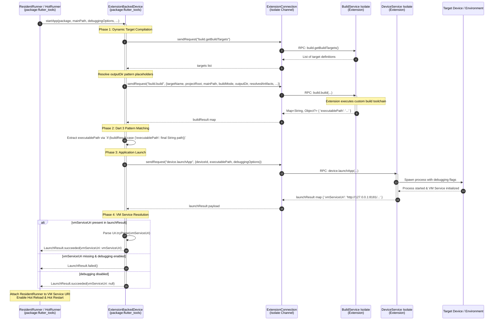
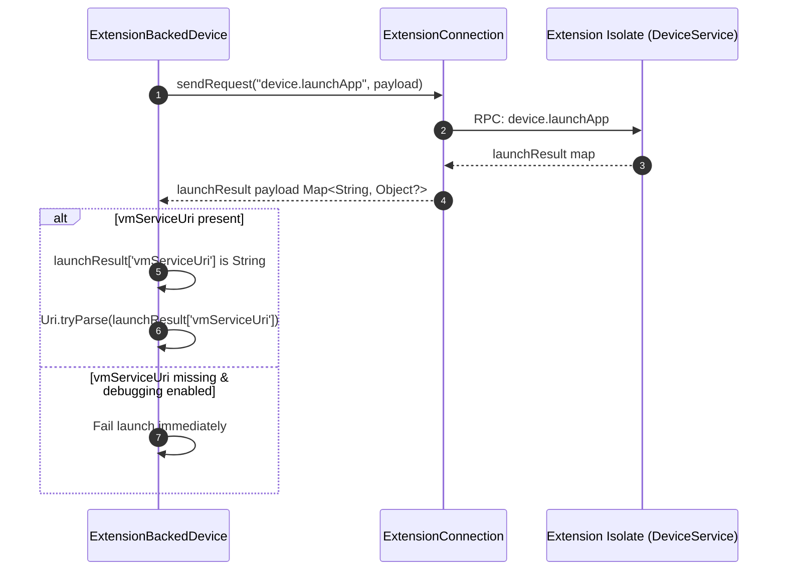
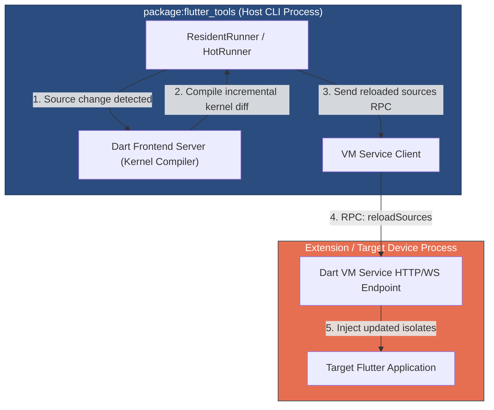
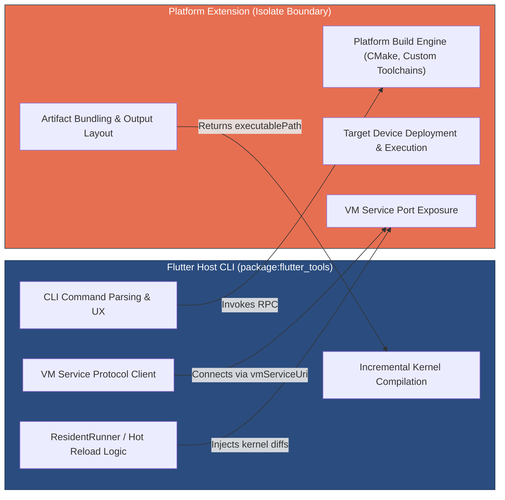

# App Launch, Deployment & Hot Reload Extension Architecture

This document details the architecture of the **App Launch, Deployment & Hot Reload Extension Slice** introduced in `ft-ext-step08-app-launch-hot-reload`. It explains how applications are compiled dynamically, launched on platform extension devices via `ExtensionBackedDevice.startApp`, connected to host debugging infrastructures via VM Service URI resolution, discovered in parallel across multiple services, and managed for Hot Reload and Hot Restart.

---

## 1. Architecture Overview & End-to-End Flow

The App Launch & Hot Reload extension slice enables platform extensions to handle the full application deployment lifecycle on extension-backed devices. It connects dynamic build target execution with device process management while maintaining **zero host-side platform assumptions** in `package:flutter_tools`.

### Component Overview

- **Data Contract (`package:flutter_tools_core`)**:
  - [TargetDevice](file:///usr/local/google/home/bkonyi/.gemini/jetski/worktrees/flutter/resume_handoff_step_08/packages/flutter_tools/packages/flutter_tools_core/lib/src/device.dart#L9-L114): Immutable DTO containing device metadata, including `buildTarget` (the name of the target build assembly registered by the extension).
- **Service Interfaces (`package:flutter_tools_extension`)**:
  - [DeviceService](file:///usr/local/google/home/bkonyi/.gemini/jetski/worktrees/flutter/resume_handoff_step_08/packages/flutter_tools/packages/flutter_tools_extension/lib/src/device.dart#L9-L34): RPC service interface defining RPC endpoints for device operations:
    - `device.getDevices`: Queries contributed target devices.
    - `device.launchApp`: Launches an application binary on the target device.
    - `device.getVmServiceUri`: Queries/resolves the active Dart VM Service URI for a running app process.
  - [BuildService](file:///usr/local/google/home/bkonyi/.gemini/jetski/worktrees/flutter/resume_handoff_step_08/packages/flutter_tools/packages/flutter_tools_extension/lib/src/build.dart#L12-L81): RPC service interface defining build target execution:
    - `build.build`: Triggers compilation for a target build assembly and returns dynamic output maps.
- **Host Context & Discovery Engine (`package:flutter_tools`)**:
  - [ExtensionManager](file:///usr/local/google/home/bkonyi/.gemini/jetski/worktrees/flutter/resume_handoff_step_08/packages/flutter_tools/lib/src/experimental/extension_manager.dart): Extension lifecycle manager instantiated in [executable.dart](file:///usr/local/google/home/bkonyi/.gemini/jetski/worktrees/flutter/resume_handoff_step_08/packages/flutter_tools/lib/executable.dart#L112-L135) and passed via constructor parameter injection to CLI commands (`RunCommand`, `DevicesCommand`, `ConfigCommand`, `DoctorCommand`) without global context.
  - [ExtensionDeviceDiscovery](file:///usr/local/google/home/bkonyi/.gemini/jetski/worktrees/flutter/resume_handoff_step_08/packages/flutter_tools/lib/src/experimental/extension_device_manager.dart#L48-L116): Host `PollingDeviceDiscovery` implementation that queries connected device extensions concurrently using parallel `Future.wait(...)` execution.
  - [ExtensionBackedDevice](file:///usr/local/google/home/bkonyi/.gemini/jetski/worktrees/flutter/resume_handoff_step_08/packages/flutter_tools/lib/src/experimental/extension_device_manager.dart#L119-L310): Concrete host `Device` implementation wrapping a `TargetDevice` DTO. Implements `startApp` to orchestrate dynamic compilation, process launching, and VM Service handshake.
  - **Host Resident Runner (`ResidentRunner` / `HotRunner`)**: Standard Flutter CLI runner responsible for orchestrating incremental Dart kernel compilation, Hot Reload source injection, and Hot Restart via the Dart VM Service.

---

## 2. Dynamic Parallel Device Discovery & Dependency Injection

### 2.1 Parallel Device Discovery via `Future.wait(...)`

To ensure fast discovery when multiple tool extensions are active simultaneously, `ExtensionDeviceDiscovery.pollingGetDevices()` queries all registered `ExtensionDeviceClient` proxies concurrently:

```dart
@override
Future<List<Device>> pollingGetDevices({
  Duration? timeout,
  bool forWirelessDiscovery = false,
}) async {
  _logger.printTrace('ExtensionDeviceDiscovery polling active tool extension devices...');
  await _extensionManager.ensureInitialized();
  final List<DeviceService> deviceServices = _extensionManager.deviceExtensions;
  if (deviceServices.isEmpty) {
    _logger.printTrace('ExtensionDeviceDiscovery found 0 active device extensions.');
    return <Device>[];
  }

  final List<List<Device>> devicesPerService = await Future.wait(
    deviceServices.whereType<ExtensionDeviceClient>().map((service) async {
      try {
        final List<TargetDevice> devices = await service.getDevices();
        return devices
            .map(
              (targetDevice) => ExtensionBackedDevice(
                logger: _logger,
                fileSystem: _fileSystem,
                targetDevice: targetDevice,
                connection: service.connection,
              ),
            )
            .toList();
      } on Object catch (e, st) {
        _logger.printTrace('Error querying device extension service: $e\n$st');
        return <Device>[];
      }
    }),
  );

  final targetDevices = <Device>[for (final deviceList in devicesPerService) ...deviceList];

  _logger.printTrace(
    'ExtensionDeviceDiscovery retrieved ${targetDevices.length} target device(s).',
  );
  return targetDevices;
}
```

#### Key Design Highlights:
1. **Concurrent RPC Requests**: Using `deviceServices.whereType<ExtensionDeviceClient>().map(...)` combined with `Future.wait(...)` dispatches `device.getDevices` RPC calls across all extension isolates concurrently rather than sequentially.
2. **Fault Isolation**: Each service query is wrapped in an isolate-level `try/catch` block. If a single extension fails or throws an exception, the exception is logged to trace output and an empty list is returned for that service, preventing one broken extension from blocking device discovery across the system.
3. **Flawless Adapter Wrapping**: Discovered `TargetDevice` DTOs are mapped into `ExtensionBackedDevice` instances, injecting `_logger`, `_fileSystem`, and the active `ExtensionConnection`.

---

### 2.2 Strict Dependency Injection of `FileSystem` (No `globals.dart`)

To maintain clean architectural boundaries and testability, `ExtensionDeviceDiscovery` and `ExtensionBackedDevice` strictly reject global ambient state.

- **Explicit Constructor Injection**: Both classes receive `FileSystem` and `Artifacts` instances directly via their constructors:
  ```dart
  ExtensionDeviceDiscovery({
    required ExtensionManager extensionManager,
    required Logger logger,
    required FileSystem fileSystem,
    required Artifacts artifacts,
  }) : _extensionManager = extensionManager,
       _logger = logger,
       _fileSystem = fileSystem,
       _artifacts = artifacts,
       super('tool_extension');
  ```
  ```dart
  ExtensionBackedDevice({
    required super.logger,
    required FileSystem fileSystem,
    required TargetDevice targetDevice,
    required this.connection,
    required Artifacts artifacts,
  }) : _targetDevice = targetDevice,
       _logger = logger,
       _fileSystem = fileSystem,
       _artifacts = artifacts,
       ...
  ```
- **Zero Import of `globals.dart`**: `extension_device_manager.dart` **does NOT import `globals.dart`**. All file system and artifact path operations operate exclusively on the injected `FileSystem` and `Artifacts` instances.
- **Hermetic Testing Advantage**: Passing `FileSystem` and `Artifacts` explicitly allows hermetic unit tests to supply `MemoryFileSystem` and `MockArtifacts` instances, enabling complete isolation without modifying ambient context overrides.

---

### 2.3 Constructor Injection of ExtensionManager in RunCommand & Zero Global State

To enable target device discovery across CLI commands (such as `flutter run -d <custom_device>`) while maintaining strict software architecture standards, `RunCommand` receives `ExtensionManager` via clean constructor parameter injection rather than global context:

1. **Constructor Injection in `executable.dart` (`generateCommands`)**:
   - In [executable.dart](file:///usr/local/google/home/bkonyi/.gemini/jetski/worktrees/flutter/resume_handoff_step_08/packages/flutter_tools/lib/executable.dart#L112-L135), `ExtensionManager` is instantiated inside `runInContext` and passed into `generateCommands(...)`:
     ```dart
     final manager = ExtensionManager(
       hostPlatform: globals.platform.operatingSystem,
       logger: globals.logger,
       entryPoints: <ExtensionEntryPoint>[linuxExtensionEntryPoint],
       featureFlags: featureFlags,
     );
     return generateCommands(
       verboseHelp: verboseHelp,
       verbose: verbose,
       extensionManager: manager,
       extensionTemplateManager: templateManager,
       extensionBuildManager: buildManager,
     );
     ```
   - In [generateCommands](file:///usr/local/google/home/bkonyi/.gemini/jetski/worktrees/flutter/resume_handoff_step_08/packages/flutter_tools/lib/executable.dart#L299), `RunCommand` is instantiated with `extensionManager`:
     ```dart
     RunCommand(verboseHelp: verboseHelp, extensionManager: extensionManager),
     ```
   - `RunCommand` accepts optional `extensionManager` in its constructor ([run.dart](file:///usr/local/google/home/bkonyi/.gemini/jetski/worktrees/flutter/resume_handoff_step_08/packages/flutter_tools/lib/src/commands/run.dart#L461-L463)):
     ```dart
     RunCommand({bool verboseHelp = false, ExtensionManager? extensionManager})
       : _extensionManager = extensionManager,
         super(verboseHelp: verboseHelp);
     ```

2. **Device Discovery Registration in `validateCommand()`**:
   - During command execution validation in `RunCommand.validateCommand()` ([run.dart](file:///usr/local/google/home/bkonyi/.gemini/jetski/worktrees/flutter/resume_handoff_step_08/packages/flutter_tools/lib/src/commands/run.dart#L720-L728)), if `_extensionManager` is present, `RunCommand` adds `ExtensionDeviceDiscovery` to `globals.deviceManager.deviceDiscoverers`:
     ```dart
     if (_extensionManager case final extensionManager?) {
       globals.deviceManager?.deviceDiscoverers.add(
         ExtensionDeviceDiscovery(
           extensionManager: extensionManager,
           logger: globals.logger,
           fileSystem: globals.fs,
         ),
       );
     }
     ```

3. **Zero Global Context Registration**:
   - **No `context.get` calls**: Dependencies are passed explicitly via constructors down the invocation chain.
   - **No additions to `globals.dart`**: `ExtensionManager` is not exposed as an ambient global getter or context item.
   - **No overrides in `context_runner.dart`**: `context_runner.dart` is untouched by extension manager registrations, preserving clean separation of core ambient context from experimental extension subsystems.

4. **Seamless Terminal CLI Target Device Resolution (`flutter run -d <custom_device>`)**:
   - When a user executes `FLUTTER_TOOL_EXTENSIONS=true flutter run -d custom_linux_device` (or any extension-contributed target device ID):
     - `RunCommand` executes `validateCommand()`, which registers `ExtensionDeviceDiscovery` in `deviceManager.deviceDiscoverers`.
     - `RunCommand` queries `findAllTargetDevices()`, searching across all registered discoverers in `deviceDiscoverers`.
     - `ExtensionDeviceDiscovery` queries connected `DeviceService` extension isolates concurrently via isolate RPC (`device.getDevices`).
     - `deviceManager` matches `custom_linux_device` and selects the `ExtensionBackedDevice` instance.
     - The host `ResidentRunner` / `HotRunner` proceeds directly to dynamic kernel compilation (`build.build` RPC), process launch (`device.launchApp` RPC), and VM Service handshake.

---

## 3. End-to-End Execution & Handshake Sequence

### 3.1 Complete Application Launch Sequence

When a user executes `flutter run -d <extension_device_id>`, the host `HotRunner` invokes `ExtensionBackedDevice.startApp`. The launch sequence consists of four distinct phases:
1. **Dynamic Target Compilation** (`build.build` RPC)
2. **Executable Path Extraction** (Dart 3 pattern matching)
3. **Application Launch** (`device.launchApp` RPC)
4. **VM Service Handshake & Resident Runner Attachment**



---

### 3.2 VM Service URI Resolution Flow

The host CLI requires a valid VM Service URI to attach debugging tools and enable interactive development features (Hot Reload, Hot Restart, Widget Inspector, DevTools). The host CLI expects the VM Service URI to be returned directly in the `launchApp` response payload, and no longer performs a fallback RPC query.



---

## 4. Dynamic Target Compilation & Executable Resolution

### 4.1 Invocation of `build.build`

When `ExtensionBackedDevice.startApp` is called, it first validates that `debuggingOptions` and `_targetDevice.buildTarget` are non-null. It then retrieves the project directory from `_fileSystem.currentDirectory.path` and issues a `build.build` RPC:

```dart
      String? outputDirPattern;
      ExtensionBuildTarget? matchedTarget;
      try {
        final Object? targetsResult = await connection.sendRequest('build.getBuildTargets');
        if (targetsResult is List) {
          for (final Object? target in targetsResult) {
            if (target is Map<Object?, Object?> && target['name'] == buildTarget) {
              final Map<String, Object?> targetMap = target.cast<String, Object?>();
              matchedTarget = ExtensionBuildTarget.fromJson(targetMap);
              outputDirPattern = matchedTarget.outputDir;
              break;
            }
          }
        }
      } on Object catch (e) {
        _logger.printTrace('Failed to query build targets from extension: $e');
      }

      outputDirPattern ??= '$kProjectDirPlaceholder/build/$kTargetPlatformPlaceholder/$kBuildModePlaceholder';

      final String resolvedOutputDir = _fileSystem.path.normalize(
        outputDirPattern
            .replaceAll(kProjectDirPlaceholder, projectDirectory)
            .replaceAll(kBuildModePlaceholder, debuggingOptions.buildInfo.modeName)
            .replaceAll(kTargetPlatformPlaceholder, _targetDevice.targetPlatform ?? ''),
      );

      final Map<String, String> resolvedArtifacts = <String, String>{};
      if (matchedTarget != null) {
        final BuildMode mode = BuildMode.fromCliName(debuggingOptions.buildInfo.modeName);
        final resolver = ArtifactResolver(
          artifacts: _artifacts,
          targetPlatform: TargetPlatform.fromName(matchedTarget.targetPlatform),
          buildMode: mode,
        );
        for (final Source input in matchedTarget.inputs) {
          input.accept(resolver);
        }
        resolvedArtifacts.addAll(resolver.resolvedArtifacts);
      }

      final Object? buildResult = await connection.sendRequest(
        'build.build',
        <String, Object?>{
          'targetName': buildTarget,
          'projectRoot': projectDirectory,
          'mainPath': mainPath ?? 'lib/main.dart',
          'buildMode': debuggingOptions.buildInfo.modeName,
          'outputDir': resolvedOutputDir,
          'buildDir': _fileSystem.path.join(projectDirectory, '.dart_tool', 'flutter_build'),
          'resolvedArtifacts': resolvedArtifacts,
        },
        const Duration(minutes: 5),
      );
```

---

### 4.2 Safe Executable Path Extraction via Dart 3 Pattern Matching

The host CLI does not assume a predefined binary file name, file extension, or directory location. Instead, the build service extension reports the resolved executable location in its return map.

`ExtensionBackedDevice.startApp` uses **Dart 3 pattern matching** (`if (buildResult case {'executablePath': final String path})`) to extract `executablePath` safely:

```dart
String? executablePath;
if (buildResult case {'executablePath': final String path}) {
  executablePath = path;
}

if (executablePath == null) {
  return LaunchResult.failed();
}
```

#### Rationale for Pattern Matching:
- **Loose Coupling**: The build service can return additional diagnostic or metadata fields in `buildResult` without breaking extraction.
- **Type Safety**: The pattern `{'executablePath': final String path}` guarantees both the presence of the key and that its value is a `String`.
- **Zero Hardcoded Paths**: The host CLI never appends `.elf`, `.exe`, or host system conventions; it respects whatever path the platform extension provides.

---

### 4.3 ZERO Host Assumptions About Build Output Locations

A key principle of the architecture is that **the host makes ZERO assumptions about the build output directory location**.

1. **Target-Defined Output Patterns**: The platform extension targets define their output directory structure using metadata (`outputDir` containing placeholders).
2. **Dynamic Resolution**: The host queries this pattern dynamically over RPC (`build.getBuildTargets`) and resolves placeholders at runtime. The host never hardcodes platform-specific folders (like `linux_extension/x64`) or custom device layouts in core code.
3. **Consistent Output Layout**: Resolving this pattern dynamically ensures that `flutter run` compiles and places binaries in the exact same output layout as `flutter build`.
4. **Dynamic Return Values**: The extension returns the final executable path as part of the `buildResult` map payload.
5. **Absolute Path Resolution**: The host CLI normalizes the returned path via `_fileSystem.path.absolute(executablePath)` and passes it directly to `device.launchApp`.

---

## 5. Host Resident Runner Attachment for Hot Reload & Hot Restart

Once `ExtensionBackedDevice.startApp` returns `LaunchResult.succeeded(vmServiceUri: vmServiceUri)`, the standard host `ResidentRunner` (or `HotRunner`) takes over.

### 5.1 Hot Reload Architecture



1. **Host-Side Compilation**: The host CLI compiles Dart source changes into an incremental kernel file (`.dill`) using the local Dart Frontend Server.
2. **VM Service Protocol Injection**: The host `ResidentRunner` communicates directly with the VM Service URI over WebSocket using standard VM Service protocol RPCs (`reloadSources`, `compileExpression`).
3. **Extension Agnosticism**: Hot reload requires **zero device-side or extension-side custom reload logic**. As long as the target device app embeds a standard Dart VM and exposes its VM Service URI, hot reload works seamlessly across any extension device.

---

### 5.2 Hot Restart Architecture

When a Hot Restart is requested by the user (`r` key in terminal):
1. `ResidentRunner` re-compiles the entrypoint kernel file (`lib/main.dart`).
2. `ResidentRunner` invokes the VM Service `_reloadSources` / isolate lifecycle RPCs to flush main isolate state and re-execute `main()`.
3. The process on the target device remains running while its Dart state resets.

---

## 6. Core Architectural Principle: ZERO Host-Side Platform Assumptions

A foundational design requirement of the Flutter Tools Extensibility project is that `package:flutter_tools` must contain **ZERO host-side platform assumptions** for extension-backed devices.

### 6.1 Prohibited Host Assumptions vs Extensibility Resolutions

| Prohibited Host Assumption | How Extensibility Resolves It |
|---|---|
| No platform-specific build toolchain execution (e.g. running `cmake`, `ninja`, `xcodebuild`, or `gradle` in `package:flutter_tools`). | Delegated to `BuildService` via `build.build` RPC. |
| No executable path guessing or file extension assumptions (`.elf`, `.exe`, `.so`, app bundles). | Extracted dynamically via `executablePath` from `buildResult`. |
| No hardcoded build output folder structures (`build/app/outputs/...`). | The host relies entirely on the extension's returned `executablePath`. |
| No parsing of `pubspec.yaml` platform sections for extension targets. | `TargetDevice` and `ExtensionBuildTarget` DTOs define capability contracts. |
| No custom target device process monitoring or log parsing in host CLI code. | Process launching is delegated via `device.launchApp` (which must return the VM Service URI inline when debugging). |

---

### 6.2 Responsibility Matrix



---

## 7. Debugging Options Forwarding

When launching an app in debug mode, `ExtensionBackedDevice.startApp` serializes the host's `DebuggingOptions` into a standard map for the `device.launchApp` RPC payload:

```dart
if (debuggingOptions.debuggingEnabled)
  'debuggingOptions': <String, Object?>{
    if (debuggingOptions.buildInfo.isDebug) 'buildInfo.isDebug': true,
    if (debuggingOptions.buildInfo.isProfile) 'buildInfo.isProfile': true,
    if (debuggingOptions.buildInfo.isRelease) 'buildInfo.isRelease': true,
    if (debuggingOptions.dartEntrypointArgs.isNotEmpty)
      'dartEntrypointArgs': debuggingOptions.dartEntrypointArgs,
    'deviceVmServicePort': ?debuggingOptions.deviceVmServicePort,
    if (debuggingOptions.disablePortPublication) 'disablePortPublication': true,
    if (debuggingOptions.disableServiceAuthCodes) 'disableServiceAuthCodes': true,
    if (debuggingOptions.enableDartProfiling) 'enableDartProfiling': true,
    if (debuggingOptions.enableImpeller.name != 'none')
      'enableImpeller': debuggingOptions.enableImpeller.name,
    if (debuggingOptions.enableSoftwareRendering) 'enableSoftwareRendering': true,
    if (debuggingOptions.endlessTraceBuffer) 'endlessTraceBuffer': true,
    'hostVmServicePort': ?debuggingOptions.hostVmServicePort,
    if (debuggingOptions.ipv6) 'ipv6': true,
    if (debuggingOptions.skiaDeterministicRendering) 'skiaDeterministicRendering': true,
    if (debuggingOptions.startPaused) 'startPaused': true,
    'traceAllowlist': ?debuggingOptions.traceAllowlist,
    if (debuggingOptions.traceSkia) 'traceSkia': true,
    'traceSkiaAllowlist': ?debuggingOptions.traceSkiaAllowlist,
    if (debuggingOptions.traceSystrace) 'traceSystrace': true,
    if (debuggingOptions.useTestFonts) 'useTestFonts': true,
    if (debuggingOptions.verboseSystemLogs) 'verboseSystemLogs': true,
  },
```

This guarantees that developer configurations (such as starting paused, rendering flags, or custom port assignments) pass seamlessly across the extension isolate boundary.

---

## 8. Testing & Validation Strategy

The launch, deployment, and VM service resolution mechanics are verified through hermetic unit tests and process integration tests:

### 8.1 Hermetic Unit Testing

Hermetic unit tests located in [test/commands.shard/hermetic/tool_extensions_device_test.dart](file:///usr/local/google/home/bkonyi/.gemini/jetski/worktrees/flutter/resume_handoff_step_08/packages/flutter_tools/test/commands.shard/hermetic/tool_extensions_device_test.dart) validate isolation and error handling:
- **RPC Mocking**: Mocks `ExtensionConnection` to validate `ExtensionBackedDevice.startApp` under all success and failure conditions.
- **Parallel Discovery**: Verifies dynamic discovery in `ExtensionDeviceDiscovery.pollingGetDevices()` using concurrent `Future.wait(...)` execution.
- **Dependency Injection**: Ensures strict `FileSystem` injection without ambient `globals.dart` access.
- **Build Target Forwarding**: Verifies that `build.build` RPC payloads accurately pass `targetName`, `projectRoot`, `mainPath`, `buildMode`, and `buildDir`.
- **Dart 3 Pattern Extraction**: Validates pattern matching (`if (buildResult case {'executablePath': final String path})`) for extracting binary locations.
- **VM Service Validation**: Tests that the launch fails when the inline VM Service URI is missing from the launch result and debugging is enabled.
- **Failure Resilience**: Confirms graceful failure (`LaunchResult.failed()`) when `buildTarget` is missing or compilation fails.

### 8.2 End-to-End Integration Testing

Integration tests located in [test/integration.shard/tool_extensions_test.dart](file:///usr/local/google/home/bkonyi/.gemini/jetski/worktrees/flutter/resume_handoff_step_08/packages/flutter_tools/test/integration.shard/tool_extensions_test.dart) validate full process execution under active tool extension environments (`FLUTTER_TOOL_EXTENSIONS=true`):

1. **CLI Device Selection**:
   - Executes `flutter devices` with `FLUTTER_TOOL_EXTENSIONS=true` to verify dynamic discovery of `Linux Custom Extension Prototype Device` (`custom_linux_device`).
   - Asserts that extension devices are omitted when feature flags are disabled.
2. **Project Creation (`--template=custom-linux-app`)**:
   - Executes `flutter create --template=custom-linux-app <project_dir>` to verify custom project template generation.
   - Verifies creation of extension verification metadata files (`.custom_device_extension_info`).
   - Asserts that template options fail cleanly when feature flags are disabled.
3. **Dynamic Build Execution**:
   - Executes `flutter assemble` with target `custom-linux-assemble-only-debug`.
   - Executes `flutter build custom-linux-build` to verify dynamic CLI build subcommands registered by extension build targets.
4. **Host Runner Launch Execution (`flutter run -d custom_linux_device`)**:
   - Executes `flutter run -d custom_linux_device --suppress-analytics` against a created custom Linux application.
   - Validates end-to-end device selection, dynamic target compilation via `build.build` RPC, executable path extraction, binary execution via `device.launchApp` RPC, and host runner launch execution on `custom_linux_device`.

---

## 9. Mandatory Pre-Commit Architecture Documentation Requirement

To ensure long-term maintainability and prevent architectural drift, **architecture documentation must be updated before every commit**.

### Maintenance Protocol:
1. **Synchronous Documentation Updates**: Any commit modifying tool extension interfaces, host device adapters (`ExtensionBackedDevice`, `ExtensionDeviceDiscovery`), RPC protocols, or CLI subcommands must update the corresponding slice documentation under `packages/flutter_tools/docs/architecture/` in the same commit.
2. **Verification of Test Alignment**: Design documentation must reflect verified behaviors tested in `test/integration.shard/tool_extensions_test.dart` and hermetic unit tests.
3. **No Uncaptured Architectural Changes**: PRs or commits that introduce extension features or protocol modifications without accompanying architecture documentation updates are considered incomplete.

---

## Related Architecture Documentation

- [Extensibility Workspace Architecture](extensibility_workspace.md)
- [Protocol & Isolate Runner Architecture](protocol_and_isolate_runner.md)
- [Device Service Slice Architecture](device_service_slice.md)
- [Build Target Slice Architecture](build_target_slice.md)
- [Diagnostics Slice Architecture](diagnostics_slice.md)
- [Configuration Slice Architecture](configuration_slice.md)
- [Templates Slice Architecture](templates_slice.md)
