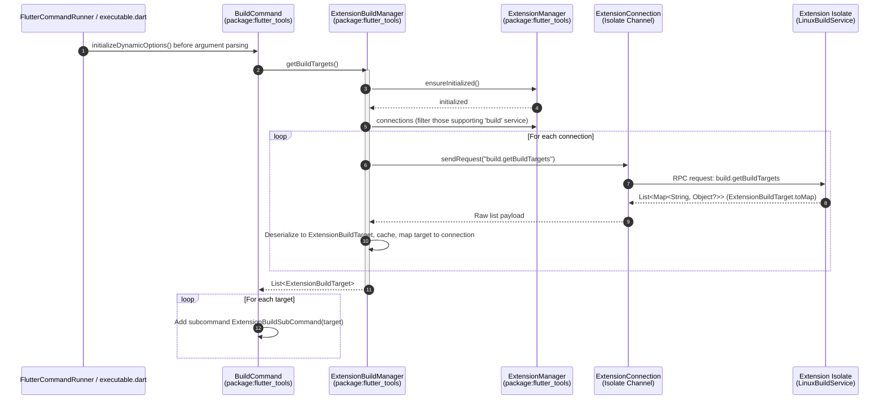
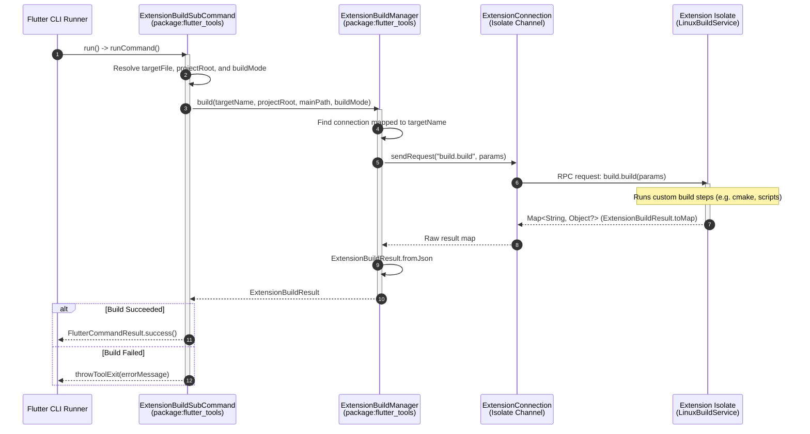
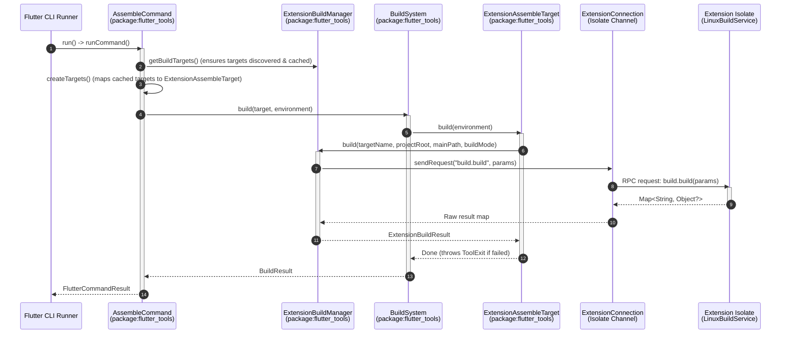
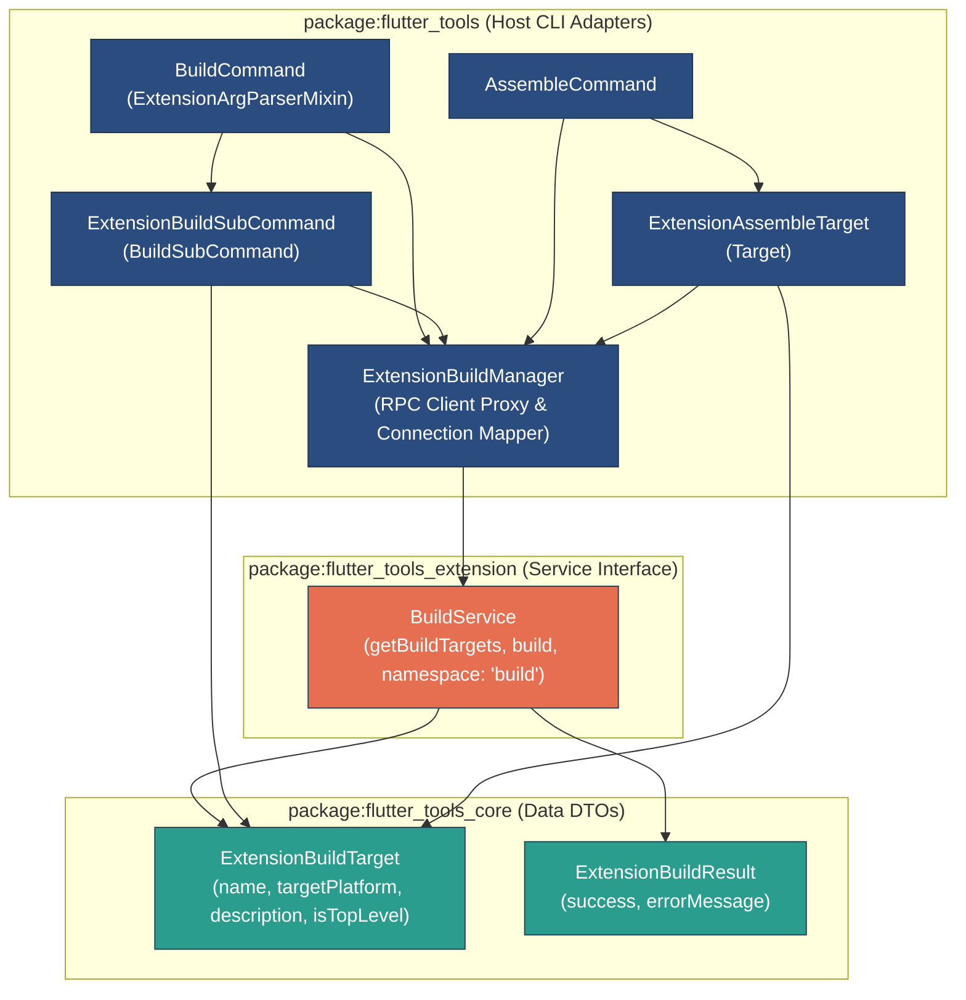

# Build Target Extension Slice & Dynamic Build Integration Architecture

This document details the architecture of the **Build Target Extension Slice** introduced in `ft-ext-step07a-build-target-slice`. It explains how custom, platform-specific build targets contributed by platform extensions are registered, discovered via RPC over Dart isolate boundaries, and integrated dynamically as subcommands of `flutter build`.

---

## 1. Architecture Overview & End-to-End Flow

The Build Target extension slice enables platform extensions to dynamically register custom build commands (e.g., `flutter build custom-linux-build`) with the Flutter host CLI. This eliminates the need to hardcode niche or platform-specific compilation steps in the host CLI, allowing extensions to own their custom build toolchains while preserving the familiar `flutter build` user experience.

### Component Overview

- **Data Contract (`package:flutter_tools_core`)**:
  - [ExtensionBuildTarget](file:///usr/local/google/home/bkonyi/flutter/packages/flutter_tools/packages/flutter_tools_core/lib/src/build.dart#L7-L53): Immutable DTO representing a build target definition. Contains:
    - `name`: The name of the target (e.g., `'custom-linux-build'`), used as the CLI subcommand name.
    - `targetPlatform`: The target platform string (e.g., `'linux-x64'`).
    - `description`: The command description shown in CLI help.
    - `isTopLevel`: A boolean indicating if this target should be exposed as a top-level subcommand under `flutter build` (defaults to `true`).
    - `dependencies`: A list of names of other targets that this target depends on.
    - `inputs`: A list of input file patterns (e.g., `'{PROJECT_DIR}/pubspec.yaml'`), engine artifacts (e.g., `artifact:icuData`), or host artifacts (e.g., `host_artifact:impellerc`).
    - `outputs`: A list of output file patterns (e.g., `'{OUTPUT_DIR}/bundle/*'`).
  - [ExtensionBuildResult](file:///usr/local/google/home/bkonyi/flutter/packages/flutter_tools/packages/flutter_tools_core/lib/src/build.dart#L55-L94): Immutable DTO representing the outcome of a build execution. Contains a `success` boolean and an optional `errorMessage`.
- **Service Contract (`package:flutter_tools_extension`)**:
  - [BuildService](file:///usr/local/google/home/bkonyi/flutter/packages/flutter_tools/packages/flutter_tools_extension/lib/src/build.dart#L12-L81): Abstract RPC service interface extending `ToolExtensionService`. Defines the service namespace `'build'` and RPC methods:
    - `build.getBuildTargets`: Returns a list of target DTO maps.
    - `build.build`: Triggers a build run with parameters `targetName`, `projectRoot`, `mainPath`, and `buildMode`.
- **Platform Extension Prototype (`package:flutter_tools_extension_linux_prototype`)**:
  - [LinuxBuildService](file:///usr/local/google/home/bkonyi/flutter/packages/flutter_tools/packages/flutter_tools_extension_linux_prototype/lib/src/build.dart#L8-L33): Concrete prototype implementation contributing the targets `'custom-linux-build'` (top-level) and `'custom-linux-assemble-only'` (non-top-level) for the `'linux-x64'` platform.
- **Host Adapters & Command Engine (`package:flutter_tools`)**:
  - [ExtensionBuildManager](file:///usr/local/google/home/bkonyi/flutter/packages/flutter_tools/lib/src/experimental/extension_build_manager.dart): Manages handshake initialization, queries connected extensions, caches discovered build targets, and maps target names back to their respective extension connections.
  - [BuildCommand](file:///usr/local/google/home/bkonyi/flutter/packages/flutter_tools/lib/src/commands/build.dart#L46-L230): Subcommand router that mixes in `ExtensionArgParserMixin` to dynamically populate dynamic subcommands when initializing command line options.
  - [ExtensionBuildSubCommand](file:///usr/local/google/home/bkonyi/flutter/packages/flutter_tools/lib/src/commands/build.dart#L245-L290): A dynamic `BuildSubCommand` instance created for each discovered target. It delegates execution to `ExtensionBuildManager.build(...)`.
  - [AssembleCommand](file:///usr/local/google/home/bkonyi/flutter/packages/flutter_tools/lib/src/commands/assemble.dart): Low-level build command that integrates extension targets dynamically.
  - [ExtensionAssembleTarget](file:///usr/local/google/home/bkonyi/flutter/packages/flutter_tools/lib/src/build_system/targets/extension.dart): A wrapper that implements the host build system's `Target` interface, mapping dynamic inputs and outputs from the DTO to `Source.pattern` objects, and delegating execution to `ExtensionBuildManager.build(...)`.

---

## 2. End-to-End RPC & Build Sequence

### 2.1 Dynamic Subcommand Discovery

When a user executes `flutter build --help` or starts argument parsing, the host CLI initializes dynamic options by querying active extensions for build targets:



### 2.2 Build Execution

When a user runs a dynamically registered subcommand (e.g., `flutter build custom-linux-build`), the subcommand invokes the extension's build hook:



### 2.3 Assemble Command Integration & Execution Flow

For lower-level or non-top-level targets (e.g., `custom-linux-assemble-only`), execution is routed through `AssembleCommand` using the Flutter Build System:



---

## 3. Data-Only Contract Separation vs Host Manager & Command

To preserve decoupling between extensions and internal CLI code, build targets are modeled as data structures in `flutter_tools_core`, and the RPC boundaries are defined in `flutter_tools_extension`. The host CLI maps these models to command and build system objects:



---

## 4. CLI Wiring, Dynamic Option Initialization & Feature Flag Gating

### 4.1 CLI Wiring in `executable.dart`

`ExtensionBuildManager` is initialized in the main command runner setup:

```dart
// packages/flutter_tools/lib/executable.dart
final buildManager = ExtensionBuildManager(
  extensionManager: manager,
  logger: globals.logger,
  featureFlags: featureFlags,
);

return generateCommands(
  ...
  extensionBuildManager: buildManager,
);
```

It is then injected into both `BuildCommand` and `AssembleCommand` via their constructors:

```dart
// packages/flutter_tools/lib/src/commands/build.dart
class BuildCommand extends FlutterCommand with ExtensionArgParserMixin {
  BuildCommand({
    ...
    ExtensionBuildManager? extensionBuildManager,
  }) : ...
       _extensionBuildManager = extensionBuildManager {
    // Subcommands populated statically
    _addSubcommand(BuildAarCommand(...));
    ...
  }
}
```

```dart
// packages/flutter_tools/lib/src/commands/assemble.dart
class AssembleCommand extends FlutterCommand {
  AssembleCommand({
    required BuildSystem buildSystem,
    ExtensionBuildManager? extensionBuildManager,
    bool verboseHelp = false,
  }) : _buildSystem = buildSystem,
       _extensionBuildManager = extensionBuildManager,
       _verboseHelp = verboseHelp {
    ...
  }
}
```

### 4.2 Dynamic Option Initialization

Because subcommand registration modifies the command parser structures, `BuildCommand` mixes in `ExtensionArgParserMixin` and implements `initializeDynamicOptions` to query targets asynchronously. Only targets marked as `isTopLevel` are registered as subcommands:

```dart
  @override
  Future<void> initializeDynamicOptions() async {
    if (_extensionBuildManager case final ExtensionBuildManager extensionBuildManager?) {
      final List<ExtensionBuildTarget> targets = await extensionBuildManager.getBuildTargets();
      for (final target in targets) {
        if (target.isTopLevel && !subcommands.containsKey(target.name)) {
          _addSubcommand(
            ExtensionBuildSubCommand(
              target: target,
              buildManager: extensionBuildManager,
              fileSystem: _fileSystem,
              logger: _logger,
              verboseHelp: _verboseHelp,
            ),
          );
        }
      }
    }
  }
```

#### Crucial Mixin Ordering Fix

To prevent duplicate command registration errors during subcommand population, `ExtensionArgParserMixin` overrides `addSubcommand` to pre-access the dynamic `argParser`:

```dart
  @override
  void addSubcommand(Command<void> command) {
    final ArgParser _ = argParser; // Forces dynamic argParser evaluation
    super.addSubcommand(command);
  }
```

In `ExtensionArgParserMixin`, the getter `argParser` evaluates the cache key and reconstructs `_customArgParser` if the dynamic targets have changed. By accessing `argParser` before invoking `super.addSubcommand`, the mixin ensures that subcommands are registered against the rebuilt dynamic parser rather than the base parser, preventing subcommand state discrepancies.

### 4.3 Feature Flag Gating

Build Target extension support is protected by the `isToolExtensionsEnabled` feature flag.
- **Disabled**:
  - `ExtensionBuildManager.getBuildTargets()` immediately returns an empty list `const <ExtensionBuildTarget>[]`.
  - `ExtensionBuildManager.build()` rejects build requests with an error message indicating tool extensions are disabled.
  - As a result, no dynamic subcommands are registered to `BuildCommand`.
- **Enabled**:
  - `ExtensionBuildManager` runs the normal discovery flow and queries the `'build'` service namespace.

### 4.4 Assemble Command Dynamic Target Integration

Unlike `BuildCommand` which registers subcommands during option initialization to satisfy the command line parser, `AssembleCommand` integrates with the build system targets dynamically during execution (`runCommand`).

1. **Target Discovery**: When `AssembleCommand.runCommand()` is invoked, it first triggers target discovery via `ExtensionBuildManager.getBuildTargets()` to ensure the cache is populated.
2. **Target Mapping**: In `AssembleCommand.createTargets()`, all cached targets (both top-level and non-top-level) are mapped to `ExtensionAssembleTarget` instances and added to the build system's target map.
3. **Execution**: If the user requests an extension target (e.g., `flutter assemble -o /out custom-linux-assemble-only`), the build system executes the corresponding `ExtensionAssembleTarget`, which delegates the build request back to the extension via `ExtensionBuildManager.build`.

---


## 5. Testing & Validation Strategy

The build target extension integration is verified through hermetic tests in [tool_extensions_build_test.dart](file:///usr/local/google/home/bkonyi/flutter/packages/flutter_tools/test/commands.shard/hermetic/tool_extensions_build_test.dart).

- **Disabled Feature Tests**:
  - Verifies that `ExtensionBuildManager.getBuildTargets()` returns an empty list.
  - Verifies that `BuildCommand` does not expose dynamic subcommands like `custom-linux-build` in its help or subcommand list.
- **Enabled Feature Tests**:
  - Verifies that `ExtensionBuildManager.getBuildTargets()` returns the dynamic targets (including both top-level and non-top-level targets) exposed by `LinuxBuildService`.
  - Verifies that `BuildCommand` registers only top-level targets (e.g., `custom-linux-build`) as subcommands and successfully executes them, while ignoring non-top-level targets (e.g., `custom-linux-assemble-only`).
  - Verifies that `AssembleCommand` successfully integrates and runs non-top-level targets via the build system.

---

## 6. Engine Artifact Dependencies (Non-Source Inputs)

To allow extensions to participate in the Flutter build cache correctly when they depend on prebuilt engine binaries (like `gen_snapshot`, `libflutter.so`, or `icudtl.dat`), the framework supports referencing these artifacts in `inputs` and `outputs` using special URI prefixes:

- **`artifact:<ArtifactName>[?platform=<platform>&mode=<mode>]`**: Maps to `Source.artifact(...)`.
  - `ArtifactName` must match a value in the `Artifact` enum (e.g., `icuData`, `genSnapshot`).
  - Query parameters `platform` (parsed via `TargetPlatform.fromName`) and `mode` (parsed via `BuildMode.fromCliName`) are optional and allow pinning the artifact dependency to a specific target platform or build mode.
- **`host_artifact:<HostArtifactName>`**: Maps to `Source.hostArtifact(...)`.
  - `HostArtifactName` must match a value in the `HostArtifact` enum (e.g., `impellerc`).

These prefixes are parsed in the host CLI by `ExtensionAssembleTarget._parseSource` and converted to concrete `Source` objects which the build system's `SourceVisitor` resolves to actual files in the local Flutter cache.

---

## Related Architecture Documentation

- [Extensibility Workspace Architecture](extensibility_workspace.md)
- [Protocol & Isolate Runner Architecture](protocol_and_isolate_runner.md)
- [Diagnostics Slice Architecture](diagnostics_slice.md)
- [Configuration Slice Architecture](configuration_slice.md)
- [Templates Slice Architecture](templates_slice.md)
- [Device Service Slice Architecture](device_service_slice.md)
