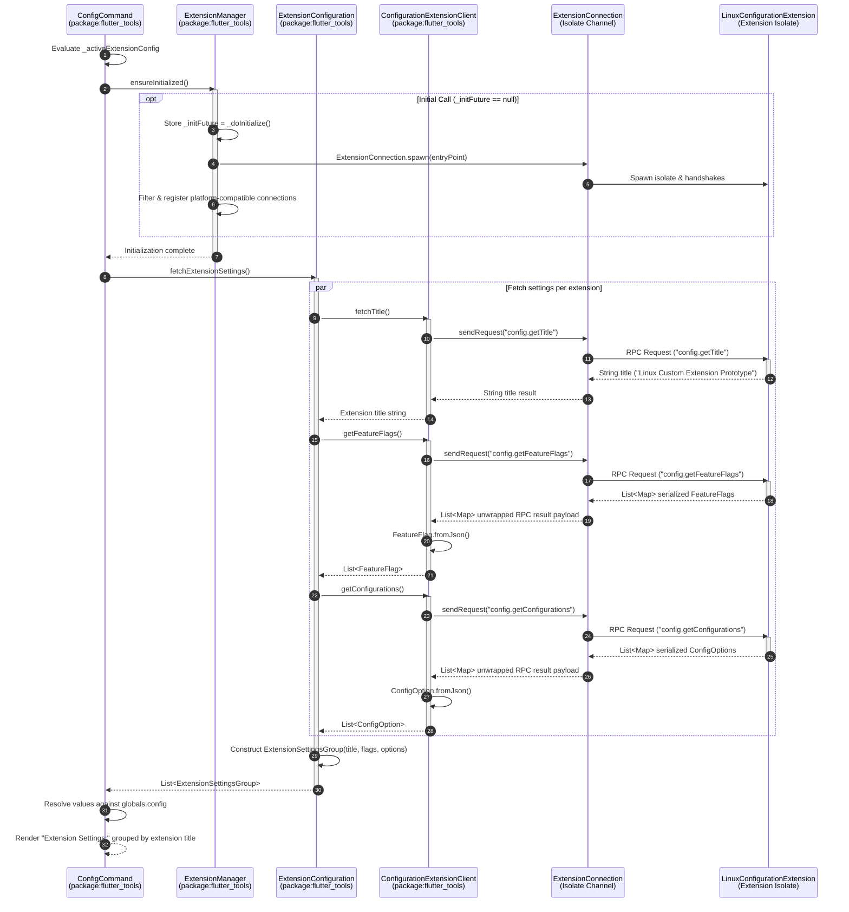

# Configuration Extension Slice Architecture

This document details the architecture of the **Configuration Extension Slice** introduced in `ft-ext-step04-configuration-slice`. It explains the host integration with `flutter config`, the data-only contract models (`FeatureFlag`, `ConfigOption`, and `ExtensionSettingsGroup`), title RPC lookup architecture (`config.getTitle`), host-side grouping and aggregation across multiple extensions, RPC protocol handlers, the lazy `ensureInitialized()` lifecycle in `ExtensionManager`, CLI entrypoint wiring in `executable.dart`, and CLI output formatting.

---

## 1. Architecture Overview & End-to-End Flow

The configuration extension slice enables platform extensions to contribute custom feature flags and configuration settings to the Flutter toolchain without tight coupling to host CLI internals. Configuration options and feature flags are defined in extensions running out-of-process inside dedicated Dart Isolates and queried asynchronously over JSON RPC.

### Component Overview

- **Core Contract Models (`package:flutter_tools_core`)**: Pure Dart immutable models (`FeatureFlag`, `ConfigOption`) with JSON serialization/deserialization (`toMap`, `fromJson`).
- **Service Interface (`package:flutter_tools_extension`)**: The `ConfigurationExtension` RPC service contract defining `config.getTitle`, `config.getFeatureFlags`, and `config.getConfigurations` RPC endpoints, along with the `title` getter interface.
- **Platform Extension Prototype (`package:flutter_tools_extension_linux_prototype`)**: `LinuxConfigurationExtension`, a concrete implementation contributing extension title (`'Linux Custom Extension Prototype'`), Linux platform-specific feature flags (`enable-linux-custom-prototype`), and configuration options (`linux-gtk-version`). Exposed via the `linuxExtensionEntryPoint` top-level constant.
- **Host Adapters & Aggregators (`package:flutter_tools`)**:
  - `ExtensionManager`: Manages active tool extension isolate connections. Accepts `entryPoints` during construction and manages lazy, idempotent initialization via `ensureInitialized()`.
  - `ExtensionSettingsGroup`: Host-side data model holding an extension's human-readable title alongside its contributed feature flags and configuration options.
  - `ConfigurationExtensionClient`: Host-side RPC proxy wrapping `ExtensionConnection` to communicate with extension isolates. Supports `fetchTitle()` caching title RPC lookups via `config.getTitle`, and directly processes unwrapped RPC result payloads from `connection.sendRequest` (`package:json_rpc_2` `Peer.withoutJson`).
  - `ExtensionConfiguration`: Multi-extension aggregator executing parallel queries across all active configuration extensions and grouping results into `ExtensionSettingsGroup` objects via `fetchExtensionSettings()`.
- **CLI Entrypoint Wiring & Command Integration (`executable.dart`, `package:flutter_tools`)**:
  - `executable.dart`: Instantiates `ExtensionManager` passing host OS, logger, feature flags, and default entrypoints (`[linuxExtensionEntryPoint]`), and forwards it explicitly via parameters to `generateCommands`, `ConfigCommand`, `DoctorCommand`, and `DevicesCommand`. `ExtensionManager` is NEVER placed in ambient context or context overrides.
  - `ConfigCommand` & `DoctorCommand`: Accept `ExtensionManager` via constructor parameter injection (`ConfigCommand({..., this.extensionManager})`, `DoctorCommand({..., this.extensionManager})`). `DoctorCommand` passes `extensionManager` down to `Doctor.diagnose(..., extensionManager: ...)` and `Doctor.startValidatorTasks(extensionManager: ...)`. `ConfigCommand` lazily awaits `extensionManager.ensureInitialized()` in `_activeExtensionConfig` before reading `extensionManager.configurationExtensions`, and formats extension settings grouped by extension title under the `Extension Settings:` section in `flutter config` output.

### End-to-End RPC Flow

The following Mermaid sequence diagram illustrates the execution flow when `flutter config --list` (or `settingsText`) is executed on the host CLI:



---

## 2. Core Contract Models (`package:flutter_tools_core`)

All configuration data models are defined in `packages/flutter_tools/packages/flutter_tools_core/lib/src/config.dart`. They are immutable (`@immutable`), implement strict value equality (`==` and `hashCode`), and provide clean JSON serialization maps.

### `FeatureFlag` Model

Represents an experimental or platform-specific feature toggle:

| Property | Type | Description |
|---|---|---|
| `name` | `String` | CLI flag name used in `flutter config --enable-<name>` or `--no-enable-<name>`. |
| `help` | `String` | Human-readable description displayed in `flutter config`. |
| `environmentVariable` | `String?` | Optional environment variable name that overrides this feature flag setting. |
| `enabledByDefault` | `bool` | Whether this feature flag is enabled by default (defaults to `false`). |

#### Serialization & Deserialization
<<<<<<< HEAD
- `toMap()`: Serializes properties into `Map<String, Object?>` using Dart 3.8+ null-aware element syntax (`'environmentVariable': ?environmentVariable`).
- `factory FeatureFlag.fromJson(Map<String, Object?> json)`: Reconstructs a `FeatureFlag` instance from serialized JSON using clean, direct type-safe casting without redundant pattern matching or duplicated temporary variables.
=======
- `toMap()`: Serializes properties into `Map<String, Object?>` (omitting `environmentVariable` if `null`).
- `factory FeatureFlag.fromJson(Map<String, Object?> json)`: Reconstructs a `FeatureFlag` instance from serialized JSON.
>>>>>>> 51a0592d163 ([flutter_tools] Implement Configuration extension slice and flutter config integration)

```dart
@immutable
class FeatureFlag {
  const FeatureFlag({
    required this.name,
    required this.help,
    this.environmentVariable,
    this.enabledByDefault = false,
  });

<<<<<<< HEAD
  factory FeatureFlag.fromJson(Map<String, Object?> json) {
    return FeatureFlag(
      name: json['name'] as String? ?? '',
      help: json['help'] as String? ?? '',
      environmentVariable: json['environmentVariable'] as String?,
      enabledByDefault: json['enabledByDefault'] == true,
    );
  }

  final String name;
  final String help;
  final String? environmentVariable;
  final bool enabledByDefault;

  Map<String, Object?> toMap() => <String, Object?>{
    'name': name,
    'help': help,
    'environmentVariable': ?environmentVariable,
    'enabledByDefault': enabledByDefault,
  };
=======
  factory FeatureFlag.fromJson(Map<String, Object?> json) { ... }
  Map<String, Object?> toMap() => ...;
>>>>>>> 51a0592d163 ([flutter_tools] Implement Configuration extension slice and flutter config integration)
}
```

### `ConfigOption` Model

Represents a custom key-value configuration setting:

| Property | Type | Description |
|---|---|---|
| `name` | `String` | Configuration key name used in `flutter config --<name>=<value>`. |
| `help` | `String` | Description of the configuration option displayed in `flutter config`. |
| `value` | `String?` | Default or currently assigned value for this configuration option, if any. |

#### Serialization & Deserialization
<<<<<<< HEAD
- `toMap()`: Serializes properties into `Map<String, Object?>` using Dart 3.8+ null-aware element syntax (`'value': ?value`).
- `factory ConfigOption.fromJson(Map<String, Object?> json)`: Reconstructs a `ConfigOption` instance from serialized JSON using direct type-safe casting.
=======
- `toMap()`: Serializes properties into `Map<String, Object?>` (omitting `value` if `null`).
- `factory ConfigOption.fromJson(Map<String, Object?> json)`: Reconstructs a `ConfigOption` instance from serialized JSON.
>>>>>>> 51a0592d163 ([flutter_tools] Implement Configuration extension slice and flutter config integration)

```dart
@immutable
class ConfigOption {
  const ConfigOption({
    required this.name,
    required this.help,
    this.value,
  });

<<<<<<< HEAD
  factory ConfigOption.fromJson(Map<String, Object?> json) {
    return ConfigOption(
      name: json['name'] as String? ?? '',
      help: json['help'] as String? ?? '',
      value: json['value'] as String?,
    );
  }

  final String name;
  final String help;
  final String? value;

  Map<String, Object?> toMap() => <String, Object?>{'name': name, 'help': help, 'value': ?value};
=======
  factory ConfigOption.fromJson(Map<String, Object?> json) { ... }
  Map<String, Object?> toMap() => ...;
>>>>>>> 51a0592d163 ([flutter_tools] Implement Configuration extension slice and flutter config integration)
}
```

---

## 3. Extension Service & Isolate Communication

### Extension-Side Service Interface (`package:flutter_tools_extension`)

The `ConfigurationExtension` abstract class in `packages/flutter_tools/packages/flutter_tools_extension/lib/src/config.dart` defines the RPC service interface:

```dart
abstract class ConfigurationExtension extends ToolExtensionService {
  static const String serviceNamespace = 'config';
  static const String getTitleMethod = 'config.getTitle';
  static const String getFeatureFlagsMethod = 'config.getFeatureFlags';
  static const String getConfigurationsMethod = 'config.getConfigurations';

  @override
  String get namespace => serviceNamespace;

  /// The human-readable title of the extension providing these configuration settings.
  String get title;

  Future<List<FeatureFlag>> getFeatureFlags();
  Future<List<ConfigOption>> getConfigurations();

  @override
  Future<Map<String, ExtensionRpcHandler>> initialize() async {
    return <String, ExtensionRpcHandler>{
      'getTitle': _getTitleRpc,
      'getFeatureFlags': _getFeatureFlagsRpc,
      'getConfigurations': _getConfigurationsRpc,
    };
  }

  Future<String> _getTitleRpc(Map<String, Object?> params) async => title;
  Future<List<Map<String, Object?>>> _getFeatureFlagsRpc(Map<String, Object?> params) async { ... }
  Future<List<Map<String, Object?>>> _getConfigurationsRpc(Map<String, Object?> params) async { ... }
}
```

When an extension isolate initializes, `ConfigurationExtension.initialize()` maps RPC calls to internal RPC handlers:
- `_getTitleRpc`: Returns the extension's `title` string (`config.getTitle`).
- `_getFeatureFlagsRpc`: Calls `getFeatureFlags()` and serializes results using `flag.toMap()` (`config.getFeatureFlags`).
- `_getConfigurationsRpc`: Calls `getConfigurations()` and serializes results using `config.toMap()` (`config.getConfigurations`).

### Prototype Extension Implementation (`package:flutter_tools_extension_linux_prototype`)

`LinuxConfigurationExtension` in `packages/flutter_tools/packages/flutter_tools_extension_linux_prototype/lib/src/config.dart` implements concrete settings and title for Linux targets:

```dart
class LinuxConfigurationExtension extends ConfigurationExtension {
  @override
  String get title => 'Linux Custom Extension Prototype';

  @override
  Future<List<FeatureFlag>> getFeatureFlags() async {
    return const <FeatureFlag>[
      FeatureFlag(
        name: 'enable-linux-custom-prototype',
        help: 'Enable custom platform extension prototype workflows for Linux.',
        enabledByDefault: true,
      ),
    ];
  }

  @override
  Future<List<ConfigOption>> getConfigurations() async {
    return const <ConfigOption>[
      ConfigOption(
        name: 'linux-gtk-version',
        help: 'Target GTK version for custom Linux desktop application builds.',
        value: '3',
      ),
    ];
  }
}
```

---

## 4. Host Aggregation & Client Proxies (`package:flutter_tools`)

Host-side configuration logic and management are located in `packages/flutter_tools/lib/src/experimental/extension_manager.dart` and `packages/flutter_tools/lib/src/experimental/config.dart`.

### `ExtensionManager` & Lazy `ensureInitialized()` Lifecycle

`ExtensionManager` in `packages/flutter_tools/lib/src/experimental/extension_manager.dart` centralizes the lifecycle of extension isolate connections and exposes active proxies for capability slices (such as `configurationExtensions` and `diagnosticsExtensions`).

#### Lazy Initialization Design

To avoid spawning extension isolates eagerly during CLI startup when extension capabilities may not be required (for instance, during CLI commands that do not inspect extensions), `ExtensionManager` supports deferred lazy initialization via `ensureInitialized()`:

```dart
class ExtensionManager {
  ExtensionManager({
    required this.hostPlatform,
    required Logger logger,
    List<ExtensionEntryPoint> entryPoints = const <ExtensionEntryPoint>[],
    ExtensionDiscovery? discovery,
  }) : _logger = logger,
       _entryPoints = entryPoints,
       _discovery = discovery ?? ExtensionDiscovery(logger: logger);

  final String hostPlatform;
  final Logger _logger;
  final ExtensionDiscovery _discovery;
  final List<ExtensionEntryPoint> _entryPoints;
  Future<void>? _initFuture;

  /// Ensures entrypoints are initialized; idempotent.
  Future<void> ensureInitialized() {
    return _initFuture ??= _doInitialize();
  }

  Future<void> _doInitialize() async {
    if (_entryPoints.isNotEmpty) {
      await initialize(entryPoints: _entryPoints);
    }
  }

  List<ExtensionConnection> get connections => _discovery.connections;

  List<ConfigurationExtension> get configurationExtensions {
    _logger.printTrace('ExtensionManager querying active configurationExtensions.');
    return _discovery.connections
        .where(
          (ExtensionConnection c) =>
              c.capabilities.services.contains(ConfigurationExtension.serviceNamespace),
        )
        .map<ConfigurationExtension>(
          (ExtensionConnection c) => ConfigurationExtensionClient(c, logger: _logger),
        )
        .toList();
  }
  // ...
}
```

- **Default Entrypoints (`entryPoints`)**: The constructor accepts a `List<ExtensionEntryPoint> entryPoints` parameter. Default entrypoints (such as `linuxExtensionEntryPoint`) are passed here without immediately triggering isolate spawning.
- **Cached `_initFuture` Pattern & Concurrency Safety**: `ensureInitialized()` returns `_initFuture ??= _doInitialize()`. The first caller (e.g. `ConfigCommand._activeExtensionConfig` or `Doctor.diagnose()`) triggers `_doInitialize()` and stores the resulting `Future<void>`. Concurrent or subsequent calls share and await the exact same `Future`, eliminating race conditions where secondary callers might return early while background isolate spawning is still in progress.
- **Platform Filtering (`initialize`)**: When `initialize()` runs, entrypoints are spawned into `ExtensionConnection` isolates. Connections that report support for the host platform (`connection.capabilities.supportsHostPlatform(hostPlatform)`) are registered with `ExtensionDiscovery`, while incompatible connections are disposed immediately.
- **Capability Proxy Accessors**: Once initialized, `configurationExtensions` filters active connections whose service capabilities include `ConfigurationExtension.serviceNamespace` (`'config'`) and wraps them in `ConfigurationExtensionClient` proxies.

### `ExtensionSettingsGroup` Data Structure

`ExtensionSettingsGroup` is an immutable host-side container used to group configuration entries by extension title:

| Property | Type | Description |
|---|---|---|
| `title` | `String` | Human-readable title of the extension (e.g., `'Linux Custom Extension Prototype'`). |
| `featureFlags` | `List<FeatureFlag>` | Feature flags registered by this specific extension. |
| `configOptions` | `List<ConfigOption>` | Configuration options registered by this specific extension. |

```dart
class ExtensionSettingsGroup {
  const ExtensionSettingsGroup({
    required this.title,
    required this.featureFlags,
    required this.configOptions,
  });

  final String title;
  final List<FeatureFlag> featureFlags;
  final List<ConfigOption> configOptions;
}
```

### `ConfigurationExtensionClient` & Title RPC Lookup Architecture

`ConfigurationExtensionClient` acts as the host-side RPC client proxy wrapping an `ExtensionConnection` isolate channel. It requires a non-nullable `Logger logger` parameter (`required Logger logger`) to emit diagnostic traces during RPC calls. It directly processes unwrapped RPC result payloads returned from `connection.sendRequest` (which uses `package:json_rpc_2` `Peer.withoutJson` over `IsolateChannel`).

#### RPC Title Lookup Architecture (`fetchTitle`)

To support grouping settings by extension title, `ConfigurationExtensionClient` performs RPC title lookups and caches the result locally:

- `fetchTitle()`: Issues `connection.sendRequest(ConfigurationExtension.getTitleMethod)` (`config.getTitle`). If `_titleCache` is already populated, it returns the cached string immediately. If the RPC returns a valid `String`, it caches and returns it; otherwise, it falls back to `defaultTitle` (`'Tool Extension Configuration'`).
- `title` getter: Returns `_titleCache ?? _defaultTitle`.

```dart
class ConfigurationExtensionClient extends ConfigurationExtension {
  ConfigurationExtensionClient(
    this.connection, {
    required Logger logger,
    String defaultTitle = 'Tool Extension Configuration',
  }) : _defaultTitle = defaultTitle,
       _logger = logger;

  final ExtensionConnection connection;
  final String _defaultTitle;
  final Logger _logger;
  String? _titleCache;

  @override
  String get title => _titleCache ?? _defaultTitle;

  Future<String> fetchTitle() async {
    if (_titleCache != null) {
      return _titleCache!;
    }
    _logger.printTrace(
      'ConfigurationExtensionClient fetching title via RPC ("${ConfigurationExtension.getTitleMethod}")...',
    );
    final Object? result = await connection.sendRequest(ConfigurationExtension.getTitleMethod);
    if (result is String) {
      _titleCache = result;
      _logger.printTrace('ConfigurationExtensionClient received title: "$result".');
      return result;
    }
    return _defaultTitle;
  }

  @override
  Future<List<FeatureFlag>> getFeatureFlags() async {
    _logger.printTrace(
      'ConfigurationExtensionClient fetching feature flags via RPC ("${ConfigurationExtension.getFeatureFlagsMethod}")...',
    );
    final Object? rawResult = await connection.sendRequest(
      ConfigurationExtension.getFeatureFlagsMethod,
    );
    if (rawResult is List) {
      final List<FeatureFlag> flags = rawResult
          .whereType<Map<String, Object?>>()
          .map((Map<String, Object?> m) => FeatureFlag.fromJson(m))
          .toList();
      _logger.printTrace(
        'ConfigurationExtensionClient received ${flags.length} feature flag(s) via RPC.',
      );
      return flags;
    }
    return <FeatureFlag>[];
  }

  @override
  Future<List<ConfigOption>> getConfigurations() async {
    _logger.printTrace(
      'ConfigurationExtensionClient fetching config options via RPC ("${ConfigurationExtension.getConfigurationsMethod}")...',
    );
    final Object? rawResult = await connection.sendRequest(
      ConfigurationExtension.getConfigurationsMethod,
    );
    if (rawResult is List) {
      final List<ConfigOption> options = rawResult
          .whereType<Map<String, Object?>>()
          .map((Map<String, Object?> m) => ConfigOption.fromJson(m))
          .toList();
      _logger.printTrace(
        'ConfigurationExtensionClient received ${options.length} config option(s) via RPC.',
      );
      return options;
    }
    return <ConfigOption>[];
  }
}
```

#### Unwrapped RPC Result Payload Processing
- **`getFeatureFlags()`**: Issues `connection.sendRequest("config.getFeatureFlags")` to the extension isolate. Directly receives the unwrapped RPC result payload (`Object? rawResult`), checks if `rawResult is List`, filters items matching `Map<String, Object?>`, and instantiates `FeatureFlag` objects using `FeatureFlag.fromJson()`.
- **`getConfigurations()`**: Issues `connection.sendRequest("config.getConfigurations")` to the extension isolate. Directly receives the unwrapped RPC result payload (`Object? rawResult`), checks if `rawResult is List`, filters items matching `Map<String, Object?>`, and instantiates `ConfigOption` objects using `ConfigOption.fromJson()`.
- **`Peer.withoutJson` Efficiency**: By bypassing string JSON encoding/decoding and envelope wrapping overhead, `connection.sendRequest` delivers Dart objects directly across isolate boundaries, keeping memory allocations low and RPC communication zero-copy.

### `ExtensionConfiguration` Multi-Extension Aggregator

When multiple platform extensions are loaded, `ExtensionConfiguration` manages settings queries and grouping. It requires a non-nullable `Logger logger` parameter (`required Logger logger`) to emit diagnostic traces during settings aggregation.

```dart
class ExtensionConfiguration {
  ExtensionConfiguration({
    required List<ConfigurationExtension> extensions,
    required Logger logger,
  }) : extensions = List<ConfigurationExtension>.unmodifiable(extensions),
       _logger = logger;

  final List<ConfigurationExtension> extensions;
  final Logger _logger;

  Future<List<FeatureFlag>> fetchFeatureFlags() async { ... }

  Future<List<ConfigOption>> fetchConfigurations() async { ... }

  Future<List<ExtensionSettingsGroup>> fetchExtensionSettings() async {
    _logger.printTrace(
      'ExtensionConfiguration fetching settings groups across ${extensions.length} extension(s)...',
    );
    final List<ExtensionSettingsGroup> groups = await Future.wait(
      extensions.map((ConfigurationExtension ext) async {
        String title;
        if (ext is ConfigurationExtensionClient) {
          title = await ext.fetchTitle();
        } else {
          title = ext.title;
        }
        final List<FeatureFlag> flags = await ext.getFeatureFlags();
        final List<ConfigOption> options = await ext.getConfigurations();
        return ExtensionSettingsGroup(title: title, featureFlags: flags, configOptions: options);
      }),
    );
    _logger.printTrace('ExtensionConfiguration retrieved ${groups.length} settings group(s).');
    return groups;
  }
}
```

- **Grouped Queries (`fetchExtensionSettings()`)**: Queries all registered extensions in parallel using `Future.wait(...)`. For each extension, resolves its title via `ext.fetchTitle()` (for `ConfigurationExtensionClient` instances) or `ext.title` property, fetches flags and options, and wraps them into an `ExtensionSettingsGroup`.
- **Flat Aggregators (`fetchFeatureFlags()`, `fetchConfigurations()`)**: Maintained for flat list queries when extension-level grouping is not required.

---

## 5. `executable.dart` CLI Entrypoint Wiring & `ConfigCommand` Integration

### CLI Entrypoint Wiring (`executable.dart`)

<<<<<<< HEAD
`packages/flutter_tools/lib/executable.dart` serves as the primary CLI entry point for the `flutter` command toolchain. It configures and instantiates `ExtensionManager` with default platform entrypoints and passes it explicitly via parameters to command constructors (`ConfigCommand`, `DoctorCommand`, `DevicesCommand`). `ExtensionManager` is **NEVER placed in ambient context or context overrides**.
=======
`packages/flutter_tools/lib/executable.dart` serves as the primary CLI entry point for the `flutter` command toolchain. It configures and wires `ExtensionManager` with default platform entrypoints, registers it in context overrides, and passes it explicitly via parameters to command constructors (`ConfigCommand`, `DoctorCommand`).
>>>>>>> 51a0592d163 ([flutter_tools] Implement Configuration extension slice and flutter config integration)

```dart
// packages/flutter_tools/lib/executable.dart

import 'package:flutter_tools_extension_linux_prototype/flutter_tools_extension_linux_prototype.dart';
// ...

Future<void> main(List<String> args) async {
  // ...
<<<<<<< HEAD
=======
  ExtensionManager? extensionManager;

>>>>>>> 51a0592d163 ([flutter_tools] Implement Configuration extension slice and flutter config integration)
  await runner.run(
    args,
    () {
      final manager = ExtensionManager(
        hostPlatform: globals.platform.operatingSystem,
        logger: globals.logger,
        entryPoints: <ExtensionEntryPoint>[linuxExtensionEntryPoint],
<<<<<<< HEAD
        featureFlags: featureFlags,
      );
      final templateManager = ExtensionTemplateManager(
        extensionManager: manager,
        fileSystem: globals.fs,
        logger: globals.logger,
        featureFlags: featureFlags,
      );
=======
      );
      extensionManager = manager;
>>>>>>> 51a0592d163 ([flutter_tools] Implement Configuration extension slice and flutter config integration)
      return generateCommands(
        verboseHelp: verboseHelp,
        verbose: verbose,
        extensionManager: manager,
<<<<<<< HEAD
        extensionTemplateManager: templateManager,
=======
>>>>>>> 51a0592d163 ([flutter_tools] Implement Configuration extension slice and flutter config integration)
      );
    },
    verbose: verbose,
    muteCommandLogging: muteCommandLogging,
    verboseHelp: verboseHelp,
    overrides: <Type, Generator>{
<<<<<<< HEAD
      FlutterHookRunner: () => FlutterHookRunnerNative(),
=======
      ExtensionManager: () => extensionManager,
>>>>>>> 51a0592d163 ([flutter_tools] Implement Configuration extension slice and flutter config integration)
      // ...
    },
    shutdownHooks: globals.shutdownHooks,
  );
}

List<FlutterCommand> generateCommands({
  required bool verboseHelp,
  required bool verbose,
  ExtensionManager? extensionManager,
<<<<<<< HEAD
  ExtensionTemplateManager? extensionTemplateManager,
=======
>>>>>>> 51a0592d163 ([flutter_tools] Implement Configuration extension slice and flutter config integration)
}) => <FlutterCommand>[
  // ...
  ConfigCommand(verboseHelp: verboseHelp, extensionManager: extensionManager),
  DoctorCommand(verbose: verbose, extensionManager: extensionManager),
<<<<<<< HEAD
  DevicesCommand(verboseHelp: verboseHelp, extensionManager: extensionManager),
=======
>>>>>>> 51a0592d163 ([flutter_tools] Implement Configuration extension slice and flutter config integration)
  // ...
];
```

#### Key Architecture Highlights of Entrypoint Wiring:
1. **Default Extension Entrypoint Registration**: `ExtensionManager` is instantiated inside the `runner.run(...)` callback with `entryPoints: <ExtensionEntryPoint>[linuxExtensionEntryPoint]`.
2. **Platform Context Injection**: `globals.platform.operatingSystem` passes the active host operating system (e.g. `'linux'`), and `globals.logger` provides CLI trace logging.
<<<<<<< HEAD
3. **Explicit Parameter Injection**: `ExtensionManager` is passed explicitly via constructor parameters to commands (`ConfigCommand`, `DoctorCommand`, `DevicesCommand`). `ExtensionManager` is **NEVER placed in ambient context (`AppContext`) or context overrides (`overrides`)**.
4. **Command Injection via `generateCommands`**: `generateCommands` accepts `ExtensionManager? extensionManager` as a named parameter and passes it directly into command constructors (`ConfigCommand`, `DoctorCommand`, `DevicesCommand`).
=======
3. **Explicit Parameter Injection**: `ExtensionManager` is passed explicitly via constructor parameters to commands (`ConfigCommand`, `DoctorCommand`). For instance, `DoctorCommand` receives `extensionManager` and forwards it directly to `Doctor.diagnose(..., extensionManager: ...)` and `Doctor.startValidatorTasks(extensionManager: ...)`, avoiding implicit `context.get<ExtensionManager>()` calls and allowing `DoctorValidatorsProvider.defaultInstance` to remain a static final instance.
4. **Command Injection via `generateCommands`**: `generateCommands` accepts `ExtensionManager? extensionManager` as a named parameter and passes it directly into command constructors (`ConfigCommand`, `DoctorCommand`).
>>>>>>> 51a0592d163 ([flutter_tools] Implement Configuration extension slice and flutter config integration)

### `ConfigCommand` Integration & Lazy Initialization

`ConfigCommand` in `packages/flutter_tools/lib/src/commands/config.dart` accepts `ExtensionManager? extensionManager` in its constructor and lazily initializes it when configuration settings are requested.

#### Asynchronous `_activeExtensionConfig` Getter

Rather than accessing `extensionManager.configurationExtensions` synchronously, `_activeExtensionConfig` is implemented as an asynchronous getter (`Future<ExtensionConfiguration?> get _activeExtensionConfig async`) that awaits `extensionManager.ensureInitialized()`:

```dart
class ConfigCommand extends FlutterCommand {
  ConfigCommand({bool verboseHelp = false, ExtensionManager? extensionManager})
    : _extensionManager = extensionManager { ... }

  final ExtensionManager? _extensionManager;

  Future<ExtensionConfiguration?> get _activeExtensionConfig async {
    if (_extensionManager case final extensionManager?) {
      await extensionManager.ensureInitialized();
      final List<ConfigurationExtension> extensions = extensionManager.configurationExtensions;
      if (extensions.isNotEmpty) {
        return ExtensionConfiguration(extensions: extensions, logger: globals.logger);
      }
    }
    return null;
  }
  // ...
}
```

#### Settings Resolution & Output Formatting (`settingsText`)

When running `flutter config` or `flutter config --list`, `ConfigCommand.settingsText` awaits `_activeExtensionConfig`:

```dart
final ExtensionConfiguration? activeConfig = await _activeExtensionConfig;
if (activeConfig != null) {
  final List<ExtensionSettingsGroup> groups = await activeConfig.fetchExtensionSettings();
  if (groups.any(
    (ExtensionSettingsGroup g) => g.featureFlags.isNotEmpty || g.configOptions.isNotEmpty,
  )) {
    buffer.writeln('\nExtension Settings:');
    for (final group in groups) {
      if (group.featureFlags.isEmpty && group.configOptions.isEmpty) {
        continue;
      }
      buffer.writeln('  ${group.title}:');
      for (final FeatureFlag flag in group.featureFlags) {
        final Object val = globals.config.getValue(flag.name) ?? flag.enabledByDefault;
        buffer.writeln('    ${flag.name}: $val');
      }
      for (final ConfigOption option in group.configOptions) {
        final Object val = globals.config.getValue(option.name) ?? option.value ?? '(Not set)';
        buffer.writeln('    ${option.name}: $val');
      }
    }
  }
}
```

#### Formatting & Resolution Logic

1. **Section Header & Group Subheaders**:
   - Outputs an `\nExtension Settings:` header if any group contains feature flags or config options.
   - For each group with settings, prints the extension title as a 2-space indented header (`  <title>:`). Any empty extension group (with 0 flags and 0 options) is skipped.
2. **Indentation**:
   - Feature flags and config options belonging to an extension are indented by 4 spaces (`    <name>: <val>`).
3. **Setting Value Resolution Logic**:
   - **Feature Flags**: Checks host configuration overrides via `globals.config.getValue(flag.name)`. If unconfigured, falls back to `flag.enabledByDefault`.
   - **Config Options**: Checks host configuration overrides via `globals.config.getValue(option.name)`. If unconfigured, falls back to `option.value` specified by the extension. If `option.value` is `null`, displays `'(Not set)'`.

---

## 6. Example Output

Executing `flutter config` (or `flutter config --list`) with active configuration extensions loaded produces output formatted as follows:

```text
All Settings:
  android-sdk: /path/to/android/sdk
  analytics: true

Extension Settings:
  Linux Custom Extension Prototype:
    enable-linux-custom-prototype: true
    linux-gtk-version: 3
```

---

## Related Documentation

For broader architecture context and capability slice details, refer to:

- [Extensibility Workspace Architecture](extensibility_workspace.md)
- [Protocol & Isolate Runner Architecture](protocol_and_isolate_runner.md)
- [Diagnostics Slice Architecture](diagnostics_slice.md)
<<<<<<< HEAD
- [Templates Slice Architecture](templates_slice.md)
- [Extension Authoring Guide](../guides/extension_authoring_guide.md)

=======
- [Extension Authoring Guide](../guides/extension_authoring_guide.md)
>>>>>>> 51a0592d163 ([flutter_tools] Implement Configuration extension slice and flutter config integration)
