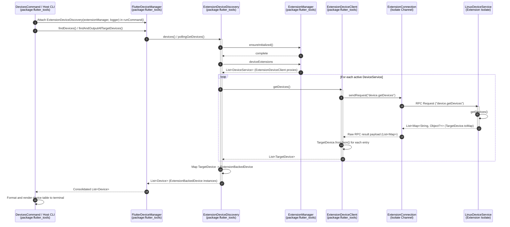
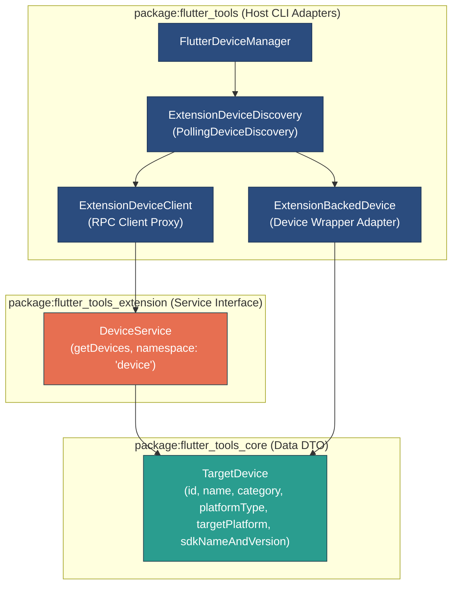

# Device Service Extension Slice & Dynamic Device Discovery Architecture

This document details the architecture of the **Device Service Extension Slice** introduced in `ft-ext-step06-device-slice`. It explains how target devices contributed by platform extensions are registered, discovered via RPC over Dart isolate boundaries, adapted into host `Device` instances, and integrated into Flutter's `DeviceManager` and CLI commands such as `flutter devices`.

---

## 1. Architecture Overview & End-to-End Flow

The Device Service extension slice enables platform extensions to dynamically register custom or platform-specific target devices with the Flutter host CLI without embedding host CLI dependencies into extension isolates. Target device discovery runs asynchronously across isolate RPC boundaries and returns lightweight data transfer objects (DTOs) that the host adapts into full CLI `Device` instances.

### Component Overview

- **Data Contract (`package:flutter_tools_core`)**:
  - `TargetDevice`: An immutable DTO (`packages/flutter_tools/packages/flutter_tools_core/lib/src/device.dart`) describing a target device (`id`, `name`, `category`, `platformType`, optional `targetPlatform`, optional `sdkNameAndVersion`, `ephemeral`, `isSupported`, `isSupportedForProject`). Provides `toMap()` serialization (using Dart 3.8+ null-aware element syntax `'targetPlatform': ?targetPlatform`, `'sdkNameAndVersion': ?sdkNameAndVersion`) and `TargetDevice.fromJson()` deserialization using clean, direct type-safe casting without redundant pattern matching or duplicated instantiation logic.
- **Service Contract (`package:flutter_tools_extension`)**:
  - `DeviceService`: An abstract RPC service interface (`packages/flutter_tools/packages/flutter_tools_extension/lib/src/device.dart`) extending `ToolExtensionService`. Defines the service namespace `'device'`, method `'device.getDevices'`, and registers the RPC handler mapping `_getDevicesRpc`.
- **Platform Extension Prototype (`package:flutter_tools_extension_linux_prototype`)**:
  - `LinuxDeviceService`: A concrete prototype implementation (`packages/flutter_tools/packages/flutter_tools_extension_linux_prototype/lib/src/device.dart`) returning a target device representation (`custom_linux_device`) with `targetPlatform: 'linux-x64'` and `sdkNameAndVersion: 'Custom Linux 1.0.0'`.
- **Host Adapters & Discovery Engine (`package:flutter_tools`)**:
  - `ExtensionDeviceClient`: Host-side `DeviceService` proxy (`packages/flutter_tools/lib/src/experimental/extension_device_manager.dart`) wrapping `ExtensionConnection` to issue `device.getDevices` RPC requests. Filters RPC result list items directly on `Map<String, Object?>` using `.whereType<Map<String, Object?>>()` and maps directly via `.map(TargetDevice.fromJson)`.
  - `ExtensionDeviceDiscovery`: Host `PollingDeviceDiscovery` implementation (`packages/flutter_tools/lib/src/experimental/extension_device_manager.dart`) querying active extension services and converting returned `TargetDevice` DTOs into host `ExtensionBackedDevice` objects.
  - `ExtensionBackedDevice`: Host `Device` adapter (`packages/flutter_tools/lib/src/experimental/extension_device_manager.dart`) wrapping a `TargetDevice` DTO to satisfy Flutter's core device discovery and execution contracts. Dynamically resolves `TargetPlatform` via `getTargetPlatformForName(_targetDevice.targetPlatform ?? _targetDevice.platformType)` instead of assuming a hardcoded target platform. Delegates its `sdkNameAndVersion` getter to `_targetDevice.sdkNameAndVersion ?? 'Tool Extension Device'`.
- **CLI Integration (`package:flutter_tools`)**:
  - `ExtensionManager`: Exposes the `deviceExtensions` getter filtering active connections supporting the `'device'` service namespace.
  - `DevicesCommand`: Receives `ExtensionManager? extensionManager` explicitly via constructor parameter (`DevicesCommand(verboseHelp: verboseHelp, extensionManager: extensionManager)`) in `executable.dart`. In `DevicesCommand.runCommand()`, using modern Dart pattern matching (`if (_extensionManager case final extensionManager?)`), it attaches `ExtensionDeviceDiscovery(extensionManager: extensionManager, logger: globals.logger)` to `globals.deviceManager?.deviceDiscoverers`. `ExtensionManager` is NEVER placed in ambient context or context overrides.
  - `FlutterDeviceManager`: Manages active device discoverers and queries `ExtensionDeviceDiscovery` alongside native discoverers.

---

## 2. End-to-End RPC & Discovery Sequence

The following Mermaid sequence diagram illustrates the discovery lifecycle when `flutter devices` queries available targets:



---

## 3. Data-Only Contract Separation vs Host Device Adapter

The architecture maintains strict decoupling between the lightweight contract package and host CLI device abstractions:



### Pure Data Contract (`TargetDevice`)

Located in `packages/flutter_tools/packages/flutter_tools_core/lib/src/device.dart`:

```dart
@immutable
class TargetDevice {
  const TargetDevice({
    required this.id,
    required this.name,
    required this.category,
    required this.platformType,
    this.targetPlatform,
    this.sdkNameAndVersion,
    this.ephemeral = true,
    this.isSupported = true,
    this.isSupportedForProject = true,
  });

  factory TargetDevice.fromJson(Map<String, Object?> json) {
    return TargetDevice(
      id: json['id'] as String? ?? '',
      name: json['name'] as String? ?? '',
      category: json['category'] as String? ?? 'desktop',
      platformType: json['platformType'] as String? ?? 'custom',
      targetPlatform: json['targetPlatform'] as String?,
      sdkNameAndVersion: json['sdkNameAndVersion'] as String?,
      ephemeral: json['ephemeral'] != false,
      isSupported: json['isSupported'] != false,
      isSupportedForProject: json['isSupportedForProject'] != false,
    );
  }

  final String id;
  final String name;
  final String category;
  final String platformType;
  final String? targetPlatform;
  final String? sdkNameAndVersion;
  final bool ephemeral;
  final bool isSupported;
  final bool isSupportedForProject;

  Map<String, Object?> toMap() => <String, Object?>{
    'id': id,
    'name': name,
    'category': category,
    'platformType': platformType,
    'targetPlatform': ?targetPlatform,
    'sdkNameAndVersion': ?sdkNameAndVersion,
    'ephemeral': ephemeral,
    'isSupported': isSupported,
    'isSupportedForProject': isSupportedForProject,
  };
}
```

### Extension Service Contract (`DeviceService`) & Prototype (`LinuxDeviceService`)

Located in `packages/flutter_tools/packages/flutter_tools_extension/lib/src/device.dart`:

```dart
abstract base class DeviceService extends ToolExtensionService {
  static const String serviceNamespace = 'device';
  static const String getDevicesMethod = 'device.getDevices';

  @override
  String get namespace => serviceNamespace;

  Future<List<TargetDevice>> getDevices();

  @override
  Future<Map<String, ExtensionRpcHandler>> initialize() async {
    return <String, ExtensionRpcHandler>{'getDevices': _getDevicesRpc};
  }

  Future<List<Map<String, Object?>>> _getDevicesRpc(Map<String, Object?> params) async {
    final List<TargetDevice> devices = await getDevices();
    return devices.map((TargetDevice device) => device.toMap()).toList();
  }
}
```

The concrete prototype implementation in `packages/flutter_tools/packages/flutter_tools_extension_linux_prototype/lib/src/device.dart` supplies explicit SDK information:

```dart
final class LinuxDeviceService extends DeviceService {
  @override
  Future<List<TargetDevice>> getDevices() async {
    return <TargetDevice>[
      const TargetDevice(
        id: 'custom_linux_device',
        name: 'Linux Custom Extension Prototype Device',
        category: 'desktop',
        platformType: 'custom',
        targetPlatform: 'linux-x64',
        sdkNameAndVersion: 'Custom Linux 1.0.0',
        ephemeral: false,
      ),
    ];
  }
}
```

### Host Device Client Proxy (`ExtensionDeviceClient`)

Located in `packages/flutter_tools/lib/src/experimental/extension_device_manager.dart`:

`ExtensionDeviceClient` acts as the host-side RPC client proxy wrapping an `ExtensionConnection` isolate channel. It inherits from `DeviceService` and requires a non-nullable `Logger logger` parameter (`required Logger logger`) to emit diagnostic traces during RPC calls.

When querying target devices via `getDevices()`, `ExtensionDeviceClient`:
1. Issues an RPC request `connection.sendRequest(DeviceService.getDevicesMethod)` (`'device.getDevices'`) to the extension isolate.
2. Directly receives the unwrapped RPC result payload (`Object? rawResult`).
3. Verifies `if (rawResult is List)`.
4. Filters items directly matching `Map<String, Object?>` using `.whereType<Map<String, Object?>>()`.
5. Maps each item directly to `TargetDevice.fromJson` using constructor tear-off syntax (`.map(TargetDevice.fromJson)`).

```dart
/// A host-side [DeviceService] client adapter delegating RPC queries to an [ExtensionConnection].
final class ExtensionDeviceClient extends DeviceService {
  /// Creates an [ExtensionDeviceClient] wrapping the host [connection].
  ExtensionDeviceClient(this.connection, {required Logger logger}) : _logger = logger;

  /// The active extension isolate connection.
  final ExtensionConnection connection;
  final Logger _logger;

  @override
  Future<List<TargetDevice>> getDevices() async {
    _logger.printTrace(
      'ExtensionDeviceClient fetching devices via RPC ("${DeviceService.getDevicesMethod}")...',
    );
    final Object? rawResult = await connection.sendRequest(DeviceService.getDevicesMethod);
    if (rawResult is List) {
      final List<TargetDevice> devices = rawResult
          .whereType<Map<String, Object?>>()
          .map(TargetDevice.fromJson)
          .toList();
      _logger.printTrace('ExtensionDeviceClient received ${devices.length} device(s) via RPC.');
      return devices;
    }
    return <TargetDevice>[];
  }
}
```

#### Direct RPC Payload Filtering Rationale

`ExtensionDeviceClient.getDevices` filters items directly on `Map<String, Object?>` via `.whereType<Map<String, Object?>>()` rather than double-casting through `Map<Object?, Object?>` (e.g., `whereType<Map<Object?, Object?>>().map((m) => TargetDevice.fromJson(m.cast<String, Object?>()))`).

This design choice provides key advantages:
- **Type Safety & Simplification**: JSON RPC responses over `IsolateChannel` (`json_rpc_2` `Peer.withoutJson`) yield map elements already typed as `Map<String, Object?>` (or `Map<String, dynamic>`).
- **Zero Redundant Casts**: Eliminates calling `.cast<String, Object?>()` on every map element during iteration.
- **Constructor Tear-Off Support**: Filtering directly on `Map<String, Object?>` enables passing `TargetDevice.fromJson` directly to `.map(TargetDevice.fromJson)` without requiring extra closure wrappers or dynamic double-casting.

---

### Host Device Adapter (`ExtensionBackedDevice`)

Located in `packages/flutter_tools/lib/src/experimental/extension_device_manager.dart`:

`ExtensionBackedDevice` inherits from `Device` (the internal host CLI device abstraction) and maps properties from the `TargetDevice` DTO:

- `name` -> `targetDevice.name`
- `category` -> `Category.fromString(targetDevice.category)`
- `platformType` -> `PlatformType.fromString(targetDevice.platformType)`
- `targetPlatform` -> Dynamically resolved via `getTargetPlatformForName(_targetDevice.targetPlatform ?? _targetDevice.platformType)` (e.g. `'linux-x64'`, `'linux-arm64'`, `'android-arm64'`), falling back to `TargetPlatform.tester` if unparseable, replacing static or hardcoded target platform assumptions.
- `ephemeral` -> `targetDevice.ephemeral`
- `isSupported()` -> `targetDevice.isSupported`
- `isSupportedForProject(project)` -> `targetDevice.isSupportedForProject`
- `sdkNameAndVersion` -> `_targetDevice.sdkNameAndVersion ?? 'Tool Extension Device'`

```dart
class ExtensionBackedDevice extends Device {
  ExtensionBackedDevice({required super.logger, required TargetDevice targetDevice})
    : _targetDevice = targetDevice,
      super(
        targetDevice.id,
        category: Category.fromString(targetDevice.category) ?? Category.desktop,
        platformType: PlatformType.fromString(targetDevice.platformType) ?? PlatformType.custom,
        ephemeral: targetDevice.ephemeral,
      );

  final TargetDevice _targetDevice;

  @override
  Future<TargetPlatform> get targetPlatform async {
    final String? platformName = _targetDevice.targetPlatform;
    if (platformName != null) {
      try {
        return getTargetPlatformForName(platformName);
      } on Object catch (_) {
        // Fall through if unrecognized target platform name supplied.
      }
    }
    try {
      return getTargetPlatformForName(_targetDevice.platformType);
    } on Object catch (_) {
      return TargetPlatform.tester;
    }
  }

  @override
  Future<String> get sdkNameAndVersion async =>
      _targetDevice.sdkNameAndVersion ?? 'Tool Extension Device';
  // ...
}
```

---

## 4. CLI Wiring & Feature Flag Gating

Device extension discovery is integrated via explicit parameter passing in `executable.dart` and gated by the `isToolExtensionsEnabled` feature flag.

### 4.1 CLI Wiring in `executable.dart` & `DevicesCommand`

In `packages/flutter_tools/lib/executable.dart`:
- `ExtensionManager` is instantiated inside `runner.run(...)` and passed explicitly to `generateCommands(..., extensionManager: manager)`.
- `DevicesCommand` receives `ExtensionManager` explicitly via constructor parameter: `DevicesCommand(verboseHelp: verboseHelp, extensionManager: extensionManager)`.
- In `DevicesCommand.runCommand()`, modern Dart pattern matching (`if (_extensionManager case final extensionManager?)`) safely unwraps `_extensionManager` and registers `ExtensionDeviceDiscovery(extensionManager: extensionManager, logger: globals.logger)` onto `globals.deviceManager?.deviceDiscoverers`:

```dart
if (_extensionManager case final extensionManager?) {
  globals.deviceManager?.deviceDiscoverers.add(
    ExtensionDeviceDiscovery(extensionManager: extensionManager, logger: globals.logger),
  );
}
```

- **Architectural Isolation**: `ExtensionManager` is **NEVER placed in ambient context (`AppContext`) or context overrides (`overrides`)**. Relying on explicit constructor parameter passing guarantees clean lifecycle management, predictable dependency injection, and prevents hidden ambient context dependencies.

### 4.2 Feature Flag Behavior

1. **Feature Disabled (`FLUTTER_TOOL_EXTENSIONS=false` or unset)**:
   - `ExtensionManager.ensureInitialized()` short-circuits if `isToolExtensionsEnabled` is `false`.
   - `ExtensionDeviceDiscovery.pollingGetDevices()` finds zero active device extension services and returns an empty list (`<Device>[]`).
   - `flutter devices` output excludes custom extension devices.

2. **Feature Enabled (`FLUTTER_TOOL_EXTENSIONS=true`)**:
   - `ExtensionManager` spawns registered extension isolates and verifies platform capabilities.
   - `ExtensionDeviceDiscovery` queries connected `DeviceService` endpoints and wraps discovered `TargetDevice` DTOs into `ExtensionBackedDevice` instances.
   - `flutter devices` displays custom extension devices alongside built-in host devices.

---

## 5. Testing & Validation Strategy

The device extension slice is verified across two distinct test suites:

### 5.1 Real CLI Process Integration Tests (`packages/flutter_tools/test/integration.shard/tool_extensions_test.dart`)

Process integration tests execute full CLI binary subprocesses to verify real end-to-end integration:

- **Enabled Execution**: Runs `processManager.run([flutterBin, 'devices'])` with environment map containing `FLUTTER_TOOL_EXTENSIONS=true`. On Linux, verifies that stdout contains `'Linux Custom Extension Prototype Device'`.
- **Disabled Execution**: Runs `processManager.run([flutterBin, 'devices'])` with default environment (where `FLUTTER_TOOL_EXTENSIONS` is unset/false). Verifies that stdout does not contain `'Linux Custom Extension Prototype Device'`.

### 5.2 Hermetic Unit Tests (`packages/flutter_tools/test/commands.shard/hermetic/tool_extensions_device_test.dart`)

Hermetic unit tests run under `testUsingContext` with context overrides to verify device discovery and command rendering in isolation without spawning binary subprocesses:

- **Disabled Feature Tests**:
  - Verifies that `ExtensionDeviceDiscovery.devices()` returns an empty list when `isToolExtensionsEnabled` is `false`.
  - Verifies that `DevicesCommand` output does not include custom extension device names when the feature flag is disabled.
- **Enabled Feature Tests**:
  - Verifies that `ExtensionDeviceDiscovery.devices()` discovers `custom_linux_device` with display name `'Linux Custom Extension Prototype Device'` when `isToolExtensionsEnabled` is `true`.
  - Verifies that `DevicesCommand` execution output includes `'Linux Custom Extension Prototype Device'` when the feature flag is enabled.

---

## Related Architecture Documentation

- [Extensibility Workspace Architecture](extensibility_workspace.md)
- [Protocol & Isolate Runner Architecture](protocol_and_isolate_runner.md)
- [Diagnostics Slice Architecture](diagnostics_slice.md)
- [Configuration Slice Architecture](configuration_slice.md)
- [Templates Slice Architecture](templates_slice.md)
