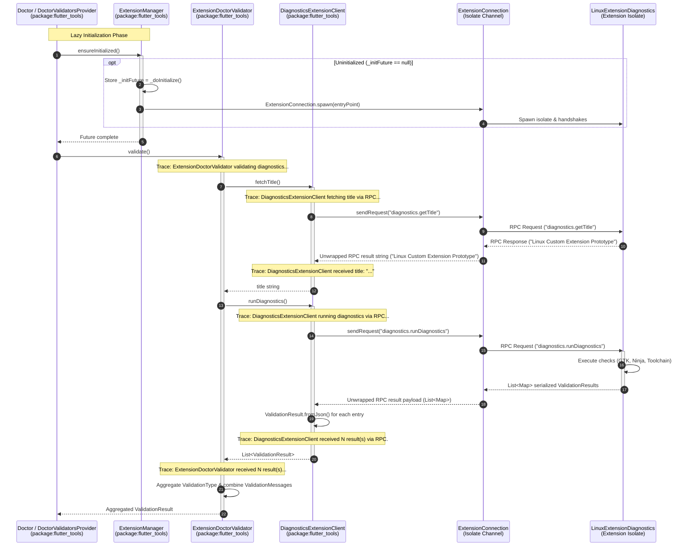
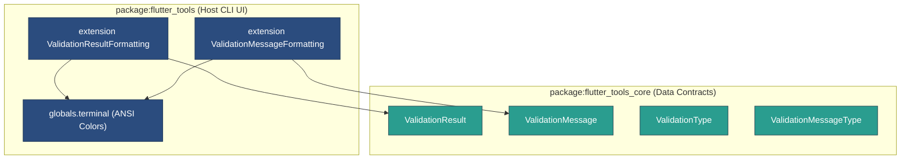

# Diagnostics Extension Slice & Doctor Integration Architecture

This document details the architecture of the **Diagnostics Extension Slice** introduced in `ft-ext-step03-diagnostics-slice`. It explains the host integration with `flutter doctor`, the strict separation between data-only contracts and CLI UI rendering, the title lookup and result aggregation mechanics executed over Dart isolate RPC boundaries, and the verbose trace logging integrated throughout the diagnostic lifecycle.

---

## 1. Architecture Overview & End-to-End Flow

The diagnostics extension slice enables platform extensions to participate in `flutter doctor` health checks without embedding host CLI dependencies into extension isolates. Diagnostic checks run out-of-process inside dedicated Dart Isolates and transmit serialized validation results back to the host CLI.

### Component Overview

- **Data Contracts (`package:flutter_tools_core`)**: Pure Dart data models (`ValidationResult`, `ValidationMessage`, `ValidationType`, `ValidationMessageType`) and JSON serialization methods (`toMap`, `fromJson`).
- **Service Interface (`package:flutter_tools_extension`)**: The `DiagnosticsExtension` RPC service contract defining `diagnostics.runDiagnostics` and `diagnostics.getTitle` RPC handlers.
- **Platform Extension Prototype (`package:flutter_tools_extension_linux_prototype`)**: `LinuxExtensionDiagnostics`, a concrete implementation executing GTK3 header, Ninja target, and Linux toolchain checks.
- **Host Adapters (`package:flutter_tools`)**:
  - `DiagnosticsExtensionClient`: RPC client adapter wrapping `ExtensionConnection` to communicate with extension isolates, featuring trace logging for RPC queries.
  - `ExtensionDoctorValidator`: Host `DoctorValidator` bridge translating extension service responses into host `flutter doctor` results with lifecycle trace logging.
- **CLI Rendering Extensions (`package:flutter_tools`)**: UI formatting extension methods (`ValidationResultFormatting`, `ValidationMessageFormatting`) supplying ANSI terminal icons and status boxes.
- **Doctor Subsystem (`package:flutter_tools`)**: `DoctorCommand` accepts `ExtensionManager` explicitly via constructor parameter (`DoctorCommand({..., this.extensionManager})`) and passes it down to `Doctor.diagnose(..., extensionManager: ...)` and `Doctor.startValidatorTasks(extensionManager: ...)` rather than calling `context.get<ExtensionManager>()`. `DoctorValidatorsProvider.defaultInstance` is a static final instance; when `ExtensionManager` is provided via parameters, `Doctor.startValidatorTasks` uses `DoctorValidatorsProvider.create(..., extensionManager: extensionManager)` to instantiate `_DefaultDoctorValidatorsProvider` with explicit parameter injection and register `ExtensionDoctorValidator` instances.

### End-to-End RPC Flow & Trace Logging Points

The following Mermaid sequence diagram illustrates the complete execution flow from the host `Doctor` invocation (including lazy isolate initialization) to the remote extension isolate RPC handler, result aggregation, and trace logging checkpoints:



---

## 2. Data-Only Contract Separation vs Host CLI UI Rendering

A core design principle of the extensibility system is the decoupling of **data-only domain contracts** from **host CLI rendering logic**.



### Pure Data Contracts (`package:flutter_tools_core`)

All validation result structures are located in `packages/flutter_tools_core/lib/src/diagnostics.dart`:

- **`ValidationType`**: Enum categorizing diagnostic check outcomes: `crash`, `missing`, `partial`, `notAvailable`, and `success`.
- **`ValidationMessageType`**: Enum defining message severity levels: `error`, `hint`, and `information`.
- **`ValidationMessage`**: Immutable data class capturing message text, context URLs, PII-stripped variants, and severity types. Implements `toMap()` (using Dart 3.8+ null-aware map element syntax `'contextUrl': ?contextUrl`) and `factory ValidationMessage.fromJson()`.
- **`ValidationResult`**: Model aggregating a status `ValidationType`, status info string, execution time, and a list of `ValidationMessage` items. Implements `toMap()` (using Dart 3.8+ null-aware map element syntax `'statusInfo': ?statusInfo`) and `factory ValidationResult.fromJson()`.

#### Serialization Mechanics & Dart 3.8+ Null-Aware Map Elements (`toMap`)

Map serialization in `ValidationMessage.toMap()` and `ValidationResult.toMap()` utilizes Dart 3.8+ null-aware map element syntax (`?variable`) to concisely omit null fields without requiring conditional `if (variable != null)` map entry checks:

```dart
// ValidationMessage.toMap()
Map<String, Object?> toMap() => <String, Object?>{
  'type': type.name,
  'message': message,
  'contextUrl': ?contextUrl,
  'piiStrippedMessage': piiStrippedMessage,
};

// ValidationResult.toMap()
Map<String, Object?> toMap() => <String, Object?>{
  'type': type.name,
  'statusInfo': ?statusInfo,
  'messages': messages.map((ValidationMessage m) => m.toMap()).toList(),
};
```

##### Architectural Rationale: Null-Aware Map Element Syntax (`?variable`) vs Conditional Collection `if`
1. **Concise, Declarative Syntax**: Replaces verbose conditional entry expressions (e.g. `if (contextUrl != null) 'contextUrl': contextUrl` or `if (statusInfo != null) 'statusInfo': statusInfo`) with direct null-aware syntax (`'contextUrl': ?contextUrl` and `'statusInfo': ?statusInfo`).
2. **Standardized Null Omission Across Slices**: Aligns serialization across data contract models in `package:flutter_tools_core` with Dart 3.8+ language feature standards.

#### Deserialization Mechanics & Direct Type-Safe Casting

JSON deserialization in `ValidationMessage.fromJson` and `ValidationResult.fromJson` relies on direct type-safe casting (`as String? ?? default`) to extract map values cleanly:

```dart
factory ValidationMessage.fromJson(Map<String, Object?> json) {
  final String message = json['message'] as String? ?? '';
  final piiStrippedMessage = json['piiStrippedMessage'] as String?;
  final contextUrl = json['contextUrl'] as String?;
  final String typeName = json['type'] as String? ?? 'information';
  final ValidationMessageType type = ValidationMessageType.values.byName(typeName);

  return switch (type) {
    ValidationMessageType.error => ValidationMessage.error(
      message,
      piiStrippedMessage: piiStrippedMessage,
    ),
    ValidationMessageType.hint => ValidationMessage.hint(
      message,
      piiStrippedMessage: piiStrippedMessage,
    ),
    ValidationMessageType.information => ValidationMessage(
      message,
      contextUrl: contextUrl,
      piiStrippedMessage: piiStrippedMessage,
    ),
  };
}
```

Similarly, `ValidationResult.fromJson` uses direct type-safe casting for type resolution:
```dart
factory ValidationResult.fromJson(Map<String, Object?> json) {
  final String typeName = json['type'] as String? ?? 'success';
  final ValidationType type = ValidationType.values.byName(typeName);
  final statusInfo = json['statusInfo'] as String?;
  // ...
}
```

##### Architectural Rationale: Direct Casting vs Redundant Pattern Matching
1. **Elimination of Duplicated Logic**: Avoids extracting values into temporary variables followed by `is String` check conditionals before default fallback assignment.
2. **Concise, Consistent Field Extraction**: Standardizes field extraction across all nullable/non-nullable string fields (`message`, `piiStrippedMessage`, `contextUrl`, `typeName`, and `statusInfo`).
3. **Strict Type Safety**: Using `as String?` combined with null-coalescing (`??`) guarantees type safety without introducing redundant pattern matching constructs solely for basic default value assignment.

Because `package:flutter_tools_core` contains zero dependencies on terminal utilities, logger singletons, or process managers, extension authors can construct and serialize diagnostic results without pulling in host CLI dependencies.

### Host CLI UI Rendering (`package:flutter_tools`)

Terminal presentation logic is defined entirely on the host side via Dart extension methods in `packages/flutter_tools/lib/src/doctor_validator.dart`:

| Host Extension Method | Target Class | Property | Output / Behavior |
|---|---|---|---|
| `ValidationResultFormatting` | `ValidationResult` | `leadingBox` | Status brackets: `[✓]` for success, `[✗]` for missing, `[!]` for partial/notAvailable, `[☠]` for crash. |
| `ValidationResultFormatting` | `ValidationResult` | `typeStr` | Returns enum string representation (`type.name`). |
| `ValidationResultFormatting` | `ValidationResult` | `coloredLeadingBox` | Applies ANSI terminal coloring via `globals.terminal` (`green` for success, `red` for missing/crash, `yellow` for partial). |
| `ValidationMessageFormatting` | `ValidationMessage` | `indicator` | Bullet icon: `✓` for error, `!` for hint, `•` for information. |
| `ValidationMessageFormatting` | `ValidationMessage` | `coloredIndicator` | Applies ANSI terminal coloring via `globals.terminal`. |

### Architectural Rationale

1. **Zero Terminal Dependency Bloat in Extensions**: Extension isolates remain lightweight, eliminating transitive dependencies on ANSI terminal libraries or host globals (`globals.terminal`).
2. **Platform-Agnostic RPC Transport**: Transport payloads consist strictly of primitive Dart/JSON data structures transmitted via `package:json_rpc_2` `Peer.withoutJson`. `connection.sendRequest` unwraps the result field directly from the RPC payload, making the RPC boundary transparent and robust against schema wrapper changes.
3. **Consistent Host Styling**: Host CLI controls all formatting, ensuring extension check results match the visual style and coloring of built-in Flutter doctor checks.

---

## 3. Extension Service Interface & Isolate Execution

### Service Contract (`package:flutter_tools_extension`)

The `DiagnosticsExtension` class in `packages/flutter_tools_extension/lib/src/diagnostics.dart` defines the extension-side contract:

```dart
abstract class DiagnosticsExtension extends ToolExtensionService {
  static const String serviceNamespace = 'diagnostics';
  static const String runDiagnosticsMethod = 'diagnostics.runDiagnostics';
  static const String getTitleMethod = 'diagnostics.getTitle';

  String get title;
  Future<List<ValidationResult>> runDiagnostics();
  // ...
}
```

When an extension isolate initializes, `DiagnosticsExtension.initialize()` registers two RPC endpoint handlers:
- `'getTitle'`: Invokes the extension's `title` getter and returns the title string.
- `'runDiagnostics'`: Invokes `runDiagnostics()` and returns `List<Map<String, Object?>>` using `ValidationResult.toMap()`.

### Concrete Extension Implementation (`package:flutter_tools_extension_linux_prototype`)

The reference prototype in `packages/flutter_tools_extension_linux_prototype/lib/src/diagnostics.dart` implements `LinuxExtensionDiagnostics`:

```dart
class LinuxExtensionDiagnostics extends DiagnosticsExtension {
  @override
  String get title => 'Linux Custom Extension Prototype';

  @override
  Future<List<ValidationResult>> runDiagnostics() async {
    final messages = <ValidationMessage>[
      const ValidationMessage('Linux custom extension toolchain is operational'),
      const ValidationMessage('GTK 3.0 headers and libraries detected'),
      const ValidationMessage('Ninja build target generator available'),
    ];
    return <ValidationResult>[
      ValidationResult(ValidationType.success, messages, statusInfo: 'Linux Prototype Extension OK'),
    ];
  }
}
```

---

## 4. Host Adapters & Result Aggregation

Host-side integration logic resides in `packages/flutter_tools/lib/src/experimental/diagnostics.dart`.

### `DiagnosticsExtensionClient`

`DiagnosticsExtensionClient` acts as a host-side proxy adapter for a remote `DiagnosticsExtension`:

- Implements `DiagnosticsExtension`.
- Wraps an active `ExtensionConnection`.
- Accepts a required non-nullable `Logger logger` instance to emit verbose diagnostic traces.
- **Direct RPC Result Handling**: Uses `connection.sendRequest` (backed by `package:json_rpc_2` `Peer.withoutJson`), which directly receives the unwrapped RPC result payload from `peer.sendRequest(method)`.
- `fetchTitle()`:
  - Emits trace log: `DiagnosticsExtensionClient fetching title via RPC ("diagnostics.getTitle")...`
  - Sends RPC request `diagnostics.getTitle` to the extension isolate.
  - Caches and returns the title string.
  - Emits trace log: `DiagnosticsExtensionClient received title: "$result".`
- `runDiagnostics()`:
  - Emits trace log: `DiagnosticsExtensionClient running diagnostics via RPC ("diagnostics.runDiagnostics")...`
  - Sends RPC request `diagnostics.runDiagnostics`, directly receiving the unwrapped `List` payload of serialized `ValidationResult` maps.
  - Deserializes each entry via `ValidationResult.fromJson(m)`.
  - Emits trace log: `DiagnosticsExtensionClient received ${results.length} result(s) via RPC.`

```dart
class DiagnosticsExtensionClient extends DiagnosticsExtension {
  DiagnosticsExtensionClient(
    this.connection, {
    required Logger logger,
    String defaultTitle = 'Tool Extension Diagnostics',
  }) : _defaultTitle = defaultTitle,
       _logger = logger;

  final ExtensionConnection connection;
  final String _defaultTitle;
  final Logger _logger;
  String? _titleCache;

  @override
  String get title => _titleCache ?? _defaultTitle;

  Future<String> fetchTitle() async {
    if (_titleCache != null) {
      return _titleCache!;
    }
    _logger.printTrace(
      'DiagnosticsExtensionClient fetching title via RPC ("${DiagnosticsExtension.getTitleMethod}")...',
    );
    final Object? result = await connection.sendRequest(DiagnosticsExtension.getTitleMethod);
    if (result is String) {
      _titleCache = result;
      _logger.printTrace('DiagnosticsExtensionClient received title: "$result".');
      return result;
    }
    return _defaultTitle;
  }

  @override
  Future<List<ValidationResult>> runDiagnostics() async {
    _logger.printTrace(
      'DiagnosticsExtensionClient running diagnostics via RPC ("${DiagnosticsExtension.runDiagnosticsMethod}")...',
    );
    final Object? rawResult = await connection.sendRequest(
      DiagnosticsExtension.runDiagnosticsMethod,
    );
    if (rawResult is List) {
      final List<ValidationResult> results = rawResult
          .whereType<Map<String, Object?>>()
          .map((Map<String, Object?> m) => ValidationResult.fromJson(m))
          .toList();
      _logger.printTrace(
        'DiagnosticsExtensionClient received ${results.length} result(s) via RPC.',
      );
      return results;
    }
    return <ValidationResult>[];
  }
}
```

### `ExtensionDoctorValidator` & Title Lookup

`ExtensionDoctorValidator` extends the standard host `DoctorValidator` with a constructor signature accepting a required `DiagnosticsExtension` instance and a required `Logger` instance:

```dart
class ExtensionDoctorValidator extends DoctorValidator {
  /// Creates an [ExtensionDoctorValidator] for the given diagnostic [extension].
  ExtensionDoctorValidator({required this.extension, required Logger logger})
    : _logger = logger,
      super(extension.title);

  /// The active extension service executing diagnostic checks.
  final DiagnosticsExtension extension;
  final Logger _logger;

  @override
  String get title => extension.title;
}
```

During validation (`validateImpl()`), `ExtensionDoctorValidator`:
1. Emits trace log: `ExtensionDoctorValidator validating diagnostics for extension "${extension.title}".`
2. Executes `fetchTitle()` if `extension` is a `DiagnosticsExtensionClient`.
3. Calls `extension.runDiagnostics()`.
4. Emits trace log: `ExtensionDoctorValidator received ${results.length} validation result(s) from "${extension.title}".`
5. Aggregates the returned list of `ValidationResult` items into a single unified `ValidationResult`.

### Validation Result Aggregation Logic

An extension service may return multiple `ValidationResult` items from `runDiagnostics()`. `ExtensionDoctorValidator` aggregates these into a single status according to a strict severity hierarchy:

1. **Combined Messages**: Concatenates all `ValidationMessage` lists into a single `allMessages` collection.
2. **Status Hierarchy Rules**:
   - `ValidationType.crash` overrides all other statuses.
   - `ValidationType.missing` overrides `partial`, `notAvailable`, and `success`.
   - `ValidationType.partial` overrides `notAvailable` and `success`.
   - `ValidationType.notAvailable` overrides `success`.
   - `ValidationType.success` is assigned only if no issues or non-success statuses exist.

```dart
for (final result in results) {
  allMessages.addAll(result.messages);
  if (result.type == ValidationType.crash) {
    aggregateType = ValidationType.crash;
  } else if (result.type == ValidationType.missing && aggregateType != ValidationType.crash) {
    aggregateType = ValidationType.missing;
  } else if (result.type == ValidationType.partial &&
      aggregateType != ValidationType.crash &&
      aggregateType != ValidationType.missing) {
    aggregateType = ValidationType.partial;
  } else if (result.type == ValidationType.notAvailable &&
      aggregateType != ValidationType.crash &&
      aggregateType != ValidationType.missing &&
      aggregateType != ValidationType.partial) {
    aggregateType = ValidationType.notAvailable;
  }
}
```

### Verbose Trace Logging Reference

When running `flutter doctor -v` (or `--verbose`), trace logs emitted via `logger.printTrace` allow developers and maintainers to inspect isolate communication, RPC dispatching, title resolution, and result aggregation in real time:

| Component | Lifecycle Phase | Triggering Condition | Trace Log String Format |
|---|---|---|---|
| `ExtensionDoctorValidator` | Validation Start | `validateImpl()` entered | `ExtensionDoctorValidator validating diagnostics for extension "<title>".` |
| `DiagnosticsExtensionClient` | Title RPC Lookup | `fetchTitle()` initiated | `DiagnosticsExtensionClient fetching title via RPC ("diagnostics.getTitle")...` |
| `DiagnosticsExtensionClient` | Title RPC Lookup | `fetchTitle()` RPC result received | `DiagnosticsExtensionClient received title: "<title>".` |
| `DiagnosticsExtensionClient` | Diagnostics Execution | `runDiagnostics()` initiated | `DiagnosticsExtensionClient running diagnostics via RPC ("diagnostics.runDiagnostics")...` |
| `DiagnosticsExtensionClient` | Diagnostics Execution | `runDiagnostics()` RPC result parsed | `DiagnosticsExtensionClient received <count> result(s) via RPC.` |
| `ExtensionDoctorValidator` | Result Aggregation | `ext.runDiagnostics()` returned | `ExtensionDoctorValidator received <count> validation result(s) from "<title>".` |

---

## 5. `flutter doctor` Integration & Lazy Isolate Lifecycle

Diagnostic extensions seamlessly inject into the host CLI validator loop within `packages/flutter_tools/lib/src/doctor.dart`.

### 5.1 Explicit Parameter Injection & Provider Wiring

To ensure that extension diagnostics are included when running `flutter doctor` or `flutter doctor -v`, `ExtensionManager` is passed explicitly via constructor and method parameters through `DoctorCommand`, `Doctor.diagnose()`, and `Doctor.startValidatorTasks()`, rather than being queried from global context:

```dart
// In executable.dart:
DoctorCommand(verbose: verbose, extensionManager: extensionManager)

// In DoctorCommand (packages/flutter_tools/lib/src/commands/doctor.dart):
class DoctorCommand extends FlutterCommand {
  DoctorCommand({this.verbose = false, this.extensionManager}) { ... }

  final ExtensionManager? extensionManager;

  @override
  Future<FlutterCommandResult> runCommand() async {
    final bool success = await globals.doctor?.diagnose(
      androidLicenses: boolArg('android-licenses'),
      verbose: verbose,
      androidLicenseValidator: androidLicenseValidator,
      extensionManager: extensionManager,
    ) ?? false;
    return FlutterCommandResult(success ? ExitStatus.success : ExitStatus.warning);
  }
}
```

#### Architectural Rationale: Explicit Parameter Injection vs Context Lookup
Previously, `DoctorValidatorsProvider.defaultInstance` dynamically queried `context.get<ExtensionManager>()` to resolve `ExtensionManager`. However, relying on ambient `AppContext` lookup introduced implicit dependency coupling and ordering dependencies with context overrides.

By refactoring `DoctorCommand`, `Doctor.diagnose()`, and `Doctor.startValidatorTasks()` to accept `ExtensionManager` explicitly:
1. **Reverted `defaultInstance` to `static final`**: `DoctorValidatorsProvider.defaultInstance` is a static final instance (`static final DoctorValidatorsProvider defaultInstance = _DefaultDoctorValidatorsProvider(...)`).
2. **Explicit Parameter Passing**: `DoctorCommand` receives `extensionManager` via constructor parameter and forwards it to `Doctor.diagnose(..., extensionManager: extensionManager)`.
3. **Dynamic Provider via `DoctorValidatorsProvider.create`**: When `extensionManager` is explicitly passed to `Doctor.startValidatorTasks({ExtensionManager? extensionManager})`, it delegates to `DoctorValidatorsProvider.create(..., extensionManager: extensionManager)` to instantiate `_DefaultDoctorValidatorsProvider` with explicit parameter injection.

### 5.2 Lazy Isolate Initialization (`diagnose` & `startValidatorTasks`)

To prevent spawning extension isolates eagerly during tool startup when doctor diagnostics may not be executed, extension initialization is deferred until `Doctor` execution begins.

Both `Doctor.diagnose()` and `Doctor.startValidatorTasks()` accept an explicit `ExtensionManager? extensionManager` parameter. `Doctor.startValidatorTasks()` awaits `extensionManager.ensureInitialized()` if non-null:

```dart
// In Doctor.diagnose():
Future<bool> diagnose({
  bool androidLicenses = false,
  bool verbose = true,
  AndroidLicenseValidator? androidLicenseValidator,
  bool showPii = true,
  List<ValidatorTask>? startedValidatorTasks,
  bool sendEvent = true,
  ExtensionManager? extensionManager,
}) async {
  // ...
  for (final ValidatorTask validatorTask in startedValidatorTasks ??
      await startValidatorTasks(extensionManager: extensionManager)) {
    // ...
  }
}

// In Doctor.startValidatorTasks():
Future<List<ValidatorTask>> startValidatorTasks({
  ExtensionManager? extensionManager,
}) async {
  if (extensionManager != null) {
    await extensionManager.ensureInitialized();
  }
  final List<DoctorValidator> validatorList = extensionManager != null
      ? DoctorValidatorsProvider.create(
          platform: globals.platform,
          featureFlags: featureFlags,
          extensionManager: extensionManager,
        ).validators
      : validators;
  // ...
}
```

Awaiting `ensureInitialized()` prior to running validator tasks ensures that all platform-compatible extension isolates are spawned and their service capabilities registered before `validators` is accessed.

### 5.3 Shared `_initFuture` Pattern in `ExtensionManager.ensureInitialized()`

To handle concurrent or background calls safely (e.g. when `Doctor.diagnose()` and `Doctor.startValidatorTasks()` or parallel commands call `ensureInitialized()` simultaneously), `ExtensionManager` caches its initialization `Future`:

```dart
class ExtensionManager {
  // ...
  Future<void>? _initFuture;

  /// Ensures entrypoints are initialized; idempotent.
  Future<void> ensureInitialized() {
    return _initFuture ??= _doInitialize();
  }

  Future<void> _doInitialize() async {
    if (_entryPoints.isNotEmpty) {
      await initialize(entryPoints: _entryPoints);
    }
  }
}
```

#### Concurrency and Race Prevention
- **Elimination of Early Return Races**: A simple boolean flag (`_isInitialized`) setting `_isInitialized = true` at the beginning of initialization creates a race condition where a secondary caller sees `_isInitialized == true` and returns immediately while isolates are still spawning in the background.
- **Single In-Flight Future**: Storing `_initFuture ??= _doInitialize()` ensures that all concurrent callers share and await the exact same `Future<void>`. No secondary caller proceeds until isolate spawning and platform capability filtering are complete.

### 5.4 Extension Validator Injection

Once initialization completes, `_DefaultDoctorValidatorsProvider` (instantiated via `DoctorValidatorsProvider.create` when `extensionManager` is passed explicitly) injects `ExtensionDoctorValidator` wrappers for each discovered extension supporting the `'diagnostics'` capability:

```dart
class _DefaultDoctorValidatorsProvider implements DoctorValidatorsProvider {
  _DefaultDoctorValidatorsProvider({
    required this.platform,
    required this.featureFlags,
    this.extensionManager,
  });

  final ExtensionManager? extensionManager;

  @override
  List<DoctorValidator> get validators {
    // ...
    if (extensionManager != null)
      for (final DiagnosticsExtension extension in extensionManager!.diagnosticsExtensions)
        ExtensionDoctorValidator(extension: extension, logger: globals.logger),
    // ...
  }
}
```

`Doctor` then executes `ExtensionDoctorValidator` alongside standard built-in validators (`FlutterValidator`, `LinuxDoctorValidator`, `XcodeValidator`, etc.), and CLI formatting extensions render the aggregated status (`[✓]`, `[✗]`, `[!]`) and messages in `flutter doctor` CLI output.

---

## Related Documentation

For broader architecture context and capability slice details, refer to:

- [Extensibility Workspace Architecture](extensibility_workspace.md)
- [Protocol & Isolate Runner Architecture](protocol_and_isolate_runner.md)
- [Configuration Slice Architecture](configuration_slice.md)
- [Templates Slice Architecture](templates_slice.md)
- [Extension Authoring Guide](../guides/extension_authoring_guide.md)


