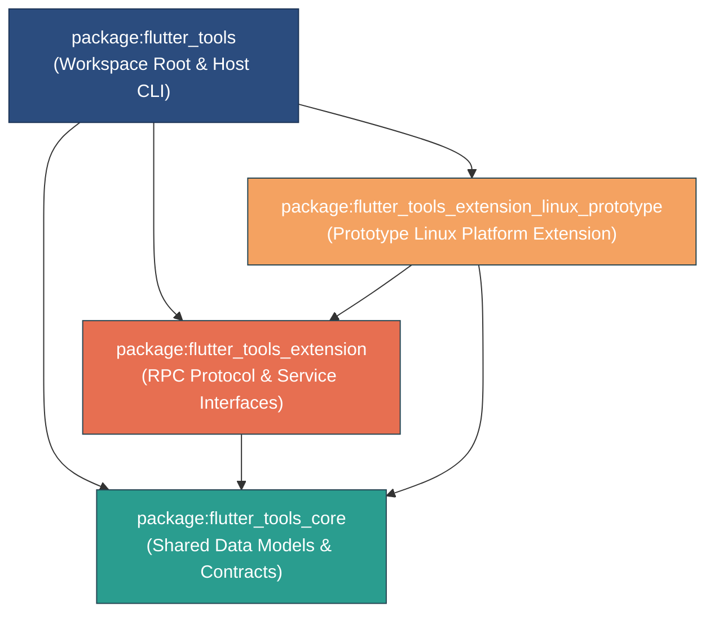

# Flutter Tools Extensibility Pub Workspace Architecture

This document describes the pub workspace architecture for Flutter Tools extensibility introduced in `ft-ext-step01-pub-workspace`, expanded in `ft-ext-step02-protocol-and-runner-base`, and augmented with capability slices in `ft-ext-step03-diagnostics-slice`, `ft-ext-step04-configuration-slice`, `ft-ext-step06-device-slice`, and `ft-ext-step07a-build-target-slice`. It details the multi-package hierarchy, responsibility boundaries across workspace members, and the architectural rationale for isolating extension author contracts from internal CLI implementation details.

---

## Workspace Overview & Package Hierarchy

The Flutter Tooling extensibility architecture employs a **Pub Workspace** structure root-configured at `packages/flutter_tools/pubspec.yaml`. By organizing extensibility abstractions into distinct, focused Dart packages, the architecture enforces strict dependency boundaries, guarantees minimal dependency overhead for extension authors, and ensures API stability.

### Pub Workspace Configuration

The main `flutter_tools` package acts as the workspace root:

```yaml
# packages/flutter_tools/pubspec.yaml
name: flutter_tools
# ...
workspace:
  - packages/flutter_tools_core
  - packages/flutter_tools_extension
  - packages/flutter_tools_extension_linux_prototype

dependencies:
  flutter_tools_core:
  flutter_tools_extension:
  flutter_tools_extension_linux_prototype:
```

Sub-packages configure their resolution back to the workspace root:

```yaml
# packages/flutter_tools/packages/flutter_tools_core/pubspec.yaml
name: flutter_tools_core
resolution: workspace
```

### Package Dependency Graph

The following Mermaid diagram illustrates the package hierarchy and dependency flow across host tooling, core contracts, extension protocols, and concrete platform extensions:



---

## Responsibility Boundaries

Each package in the workspace occupies a well-defined layer in the extensibility system.

| Package | Path | Primary Responsibility | Target Audience | Key Dependencies |
|---|---|---|---|---|
| `flutter_tools_core` | `packages/flutter_tools/packages/flutter_tools_core` | Platform-agnostic data models, domain contracts (`ValidationResult`, `ValidationMessage`, `FeatureFlag`, `ConfigOption`, `TargetDevice`, `ExtensionBuildTarget`, `ExtensionBuildResult`, templates), and shared serialization formats. | Extension authors & Host CLI | `meta` |
| `flutter_tools_extension` | `packages/flutter_tools/packages/flutter_tools_extension` | `package:json_rpc_2` RPC protocol framing (`Peer.withoutJson`), `IsolateChannel` transport, isolate runner/entrypoint helpers (`ToolExtensionEntryPoint`), and service contracts (`ToolExtensionService`, `DiagnosticsExtension`, `ConfigurationExtension`, `DeviceService`, `BuildService`). | Extension authors | `flutter_tools_core`, `json_rpc_2`, `stream_channel`, `meta` |
| `flutter_tools_extension_linux_prototype` | `packages/flutter_tools/packages/flutter_tools_extension_linux_prototype` | Concrete prototype extension implementing Linux platform capabilities (`LinuxExtensionDiagnostics`, `LinuxConfigurationExtension`, `LinuxDeviceService`, doctor checks, build targets). | Reference implementation for developers | `flutter_tools_core`, `flutter_tools_extension`, `meta` |
| `flutter_tools` | `packages/flutter_tools` | Host CLI entry point, extension discovery (`ExtensionDiscovery`), host connection lifecycle (`ExtensionConnection` using `IsolateChannel` and `json_rpc.Peer.withoutJson`), RPC proxy adapters (`DiagnosticsExtensionClient`, `ConfigurationExtensionClient`, `ExtensionDeviceClient`), CLI UI rendering extensions (`ValidationResultFormatting`), `Doctor` validator injection (`ExtensionDoctorValidator`), `ConfigCommand` settings rendering (`ExtensionConfiguration`), `DeviceManager` integration (`ExtensionDeviceDiscovery`, `ExtensionBackedDevice`), and build target manager (`ExtensionBuildManager`, `BuildCommand` subcommands). | End-user Flutter developers | All workspace packages + CLI dependencies |

### 1. `flutter_tools_core`
- **Role**: Serves as the lightweight foundational data layer shared between the host CLI and external extensions.
- **Scope**: Contains platform-agnostic representations of devices (`TargetDevice` including optional `targetPlatform` (e.g., `'linux-x64'`, `'linux-arm64'`, `'android-arm64'`) and `sdkNameAndVersion` properties, `TargetDevice.fromJson` direct type-safe casting without redundant pattern matching, and `toMap()` null-aware elements), build targets (`ExtensionBuildTarget`, `ExtensionBuildResult`), diagnostic validators (`ValidationResult`, `ValidationMessage`), configuration models (`FeatureFlag`, `ConfigOption`), project templates, and plugin bindings.
- **Constraints**: Contains no RPC protocol logic, transport code, process execution logic, or heavy CLI dependencies.

### 2. `flutter_tools_extension`
- **Role**: Defines generic protocol mechanics and interface contracts that extension implementations must satisfy.
- **Scope**: Implements RPC protocol framing using `package:json_rpc_2` (`Peer.withoutJson`) over `package:stream_channel` (`IsolateChannel`), isolate entrypoint abstractions (`ToolExtensionEntryPoint`), service handlers (`ToolExtensionService`, `DiagnosticsExtension`, `ConfigurationExtension`, `DeviceService`, `BuildService`), and capability exchange schemas (`ToolExtensionCapabilities`).
- **Protocol Optimization**: Uses `Peer.withoutJson` over `IsolateChannel` to avoid raw JSON string encoding/decoding overhead and to enable transmitting non-JSON isolate-serializable Dart objects (such as `TransferableTypedData` or `SendPort`) directly across isolate ports.
- **Constraints**: Completely platform-agnostic. Does not depend on host `flutter_tools` CLI internals or OS-specific implementations.

### 3. `flutter_tools_extension_linux_prototype`
- **Role**: Demonstrates a concrete platform extension implementing device discovery (`LinuxDeviceService` defining `sdkNameAndVersion: 'Custom Linux 1.0.0'`), doctor checks (`LinuxExtensionDiagnostics`), platform configuration options (`LinuxConfigurationExtension`), and custom build targets (`LinuxBuildService`).
- **Scope**: Encapsulates platform-specific logic and serves as a blueprint for third-party or out-of-tree extension packages.
- **Constraints**: Only communicates with the host CLI through public contracts provided by `flutter_tools_core` and `flutter_tools_extension`.

### 4. `flutter_tools` (Host CLI)
- **Role**: Main CLI host binary (`bin/flutter_tools.dart`).
- **Scope**: Discovers available extensions, manages isolate/process lifecycles for extension execution (`ExtensionManager`, `ExtensionConnection`), connects via `IsolateChannel` & `json_rpc.Peer.withoutJson`, delegates RPC queries via client proxies (`DiagnosticsExtensionClient`, `ConfigurationExtensionClient`, `ExtensionDeviceClient`) that directly process unwrapped RPC result payloads returned from `connection.sendRequest`, formats UI via terminal extension methods, routes requests to extension services, aggregates extension configuration settings (`ConfigCommand`, `ExtensionConfiguration`), discovers target devices (`ExtensionDeviceDiscovery`, `ExtensionBackedDevice`), and manages dynamic build targets (`ExtensionBuildManager` registering custom subcommands under `BuildCommand`).
- **Explicit Dependency Injection & Modern Dart Patterns**: Instantiates `ExtensionManager` and `ExtensionBuildManager` in `executable.dart` and passes them explicitly via constructor parameters to commands (e.g. `DevicesCommand(extensionManager: extensionManager)`, `ConfigCommand(extensionManager: extensionManager)`, `DoctorCommand(extensionManager: extensionManager)`, `BuildCommand(extensionBuildManager: buildManager)`). Managers are **NEVER placed in ambient context (`AppContext`) or context overrides (`overrides`)**. In `DevicesCommand.runCommand()`, modern Dart pattern matching is used to attach discoverers, and `BuildCommand` dynamically populates dynamic subcommands.
- **Testing Verification**: Verified via real CLI process integration tests (`packages/flutter_tools/test/integration.shard/tool_extensions_test.dart` executing `processManager.run([flutterBin, 'devices'])` with `FLUTTER_TOOL_EXTENSIONS=true`) and hermetic unit tests (`packages/flutter_tools/test/commands.shard/hermetic/tool_extensions_device_test.dart` verifying device discovery under context overrides).

---

## Architecture Documentation Map

For deeper technical specifications on specific subsystems, refer to:

- [Protocol & Isolate Runner Architecture](protocol_and_isolate_runner.md): Details `IsolateChannel` & `json_rpc.Peer.withoutJson` transport, handshake sequence, RPC request/response flows, lifecycle management, and capability-driven platform filtering (`supportsHostPlatform`).
- [Diagnostics Slice & Doctor Integration Architecture](diagnostics_slice.md): Details data-only diagnostic contracts (`ValidationResult`, `ValidationMessage`), extension service RPC interface (`DiagnosticsExtension`), title lookup, host `ExtensionDoctorValidator` aggregation, and CLI rendering decoupling.
- [Configuration Slice & flutter config Architecture](configuration_slice.md): Details core configuration models (`FeatureFlag`, `ConfigOption`), RPC service interface (`ConfigurationExtension`), host multi-extension aggregator (`ExtensionConfiguration`), client proxy (`ConfigurationExtensionClient` directly processing unwrapped RPC result payloads from `connection.sendRequest`), and `ConfigCommand` integration.
- [Templates Slice & flutter create Architecture](templates_slice.md): Details custom project templates, `ParsedFlutterTemplateType` dynamic parsing, `ExtensionTemplateManager` queries, `ExtensionArgParserMixin` dynamic options reconstruction, and host-side rendering delegation.
- [Device Service Slice & Dynamic Device Discovery Architecture](device_service_slice.md): Details target device DTOs (`TargetDevice`), extension service interface (`DeviceService`), host client proxy (`ExtensionDeviceClient`), device discovery adapter (`ExtensionDeviceDiscovery`), host device wrapper (`ExtensionBackedDevice`), and `FlutterDeviceManager` CLI integration.
- [Build Target Slice & Dynamic Build Integration Architecture](build_target_slice.md): Details build target DTOs (`ExtensionBuildTarget`, `ExtensionBuildResult`), extension service interface (`BuildService`), host manager (`ExtensionBuildManager`), and dynamic `BuildCommand` subcommands integration.


---

## Design Rationale: Isolating Extension Author Contracts

A central architectural goal of the Pub Workspace structure is isolating extension author contracts from internal host CLI code (`package:flutter_tools`).

### 1. Decoupling from Internal CLI Churn & Dependencies
The `flutter_tools` package contains extensive internal machinery (build systems, artifact downloaders, analytics, shelf web servers, static analysis engines, and native tool wrappers). Exposing internal host classes to extension authors would cause:
- **Fragile Extensions**: Minor internal refactoring in `flutter_tools` would break third-party extensions.
- **Heavy Dependency Bloat**: Extension authors would inherit hundreds of transitive dependencies (`analyzer`, `web_socket_channel`, `shelf`, `dwds`, `dds`, etc.), leading to slow compilation and version locks.

### 2. Isolate & Process Boundary Safety
Extensions run out-of-process or inside dedicated Dart Isolates. Maintaining lightweight packages (`flutter_tools_core` and `flutter_tools_extension`) with high-performance `json_rpc.Peer.withoutJson` RPC transport over `IsolateChannel` ensures fast isolate startup times, low-latency zero-copy data transfer, minimal memory consumption, and zero risk of state pollution between the host CLI and extensions.

### 3. Versioning & API Stability
By maintaining distinct packages with semantic versioning:
- Host tool internal refactorings occur without impacting extension compatibility.
