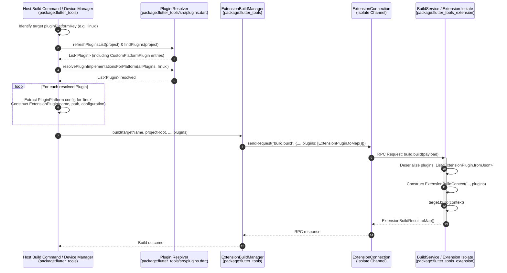
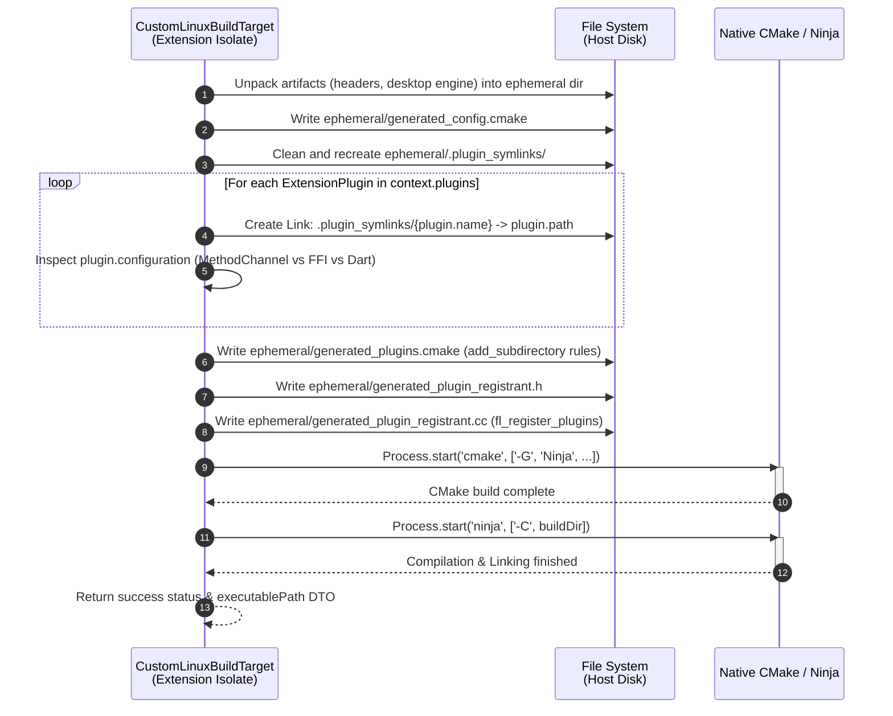
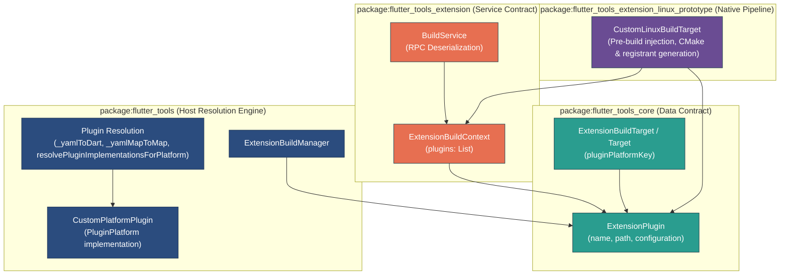

# Plugins Extension Slice & Dynamic Plugin Resolution Architecture

This document details the architecture of the **Plugins Extension Slice** introduced in `ft-ext-step09-plugins-slice`. It explains how custom platform plugins are dynamically resolved on the host, passed across isolate IPC boundaries without host-side platform assumptions, symlinked into transient build directories, and injected into extension-driven native build pipelines (such as CMake configuration generation). It also highlights the modern Dart 3 refactorings in `package:flutter_tools/src/plugins.dart`.

---

## 1. Architecture Overview & End-to-End Flow

The Plugins extension slice decouples platform-specific plugin handling from the host CLI (`flutter_tools`). Traditionally, `flutter_tools` contained hardcoded assumptions about supported platforms (`android`, `ios`, `linux`, `macos`, `windows`, `web`), including platform-specific YAML parsing, code generation, and directory structures.

With the Plugins extension slice:
1. **Host-Side Neutrality**: The host CLI parses pubspec plugin definitions for unrecognized/custom platform keys into generic [CustomPlatformPlugin](file:///usr/local/google/home/bkonyi/.gemini/jetski/worktrees/flutter/resume_handoff_step_08/packages/flutter_tools/lib/src/platform_plugins.dart#L668-L675) instances.
2. **IPC Data Transfer**: Resolved plugins for a target platform are serialized into lightweight [ExtensionPlugin](file:///usr/local/google/home/bkonyi/.gemini/jetski/worktrees/flutter/resume_handoff_step_08/packages/flutter_tools/packages/flutter_tools_core/lib/src/build/plugin.dart#L5-L44) Data Transfer Objects (DTOs) and passed to extension isolates inside [ExtensionBuildContext](file:///usr/local/google/home/bkonyi/.gemini/jetski/worktrees/flutter/resume_handoff_step_08/packages/flutter_tools/packages/flutter_tools_extension/lib/src/build.dart#L10-L42).
3. **Extension-Driven Pre-Build Injection**: Extension isolates handle pre-build plugin injection, transient symlinking, registrant code generation, and native tool invocation (e.g. CMake, Ninja) completely within the extension runtime.

### Component Overview

- **Data Contract (`package:flutter_tools_core`)**:
  - [ExtensionPlugin](file:///usr/local/google/home/bkonyi/.gemini/jetski/worktrees/flutter/resume_handoff_step_08/packages/flutter_tools/packages/flutter_tools_core/lib/src/build/plugin.dart#L5-L44): Immutable DTO representing a plugin resolved for an extension target platform. Contains:
    - `name`: The plugin package name (e.g., `'url_launcher'`).
    - `path`: The absolute file system path to the plugin root directory on the host.
    - `configuration`: Untyped `Map<String, Object?>` extracted from the platform section of `pubspec.yaml`.
  - [Target](file:///usr/local/google/home/bkonyi/.gemini/jetski/worktrees/flutter/resume_handoff_step_08/packages/flutter_tools/packages/flutter_tools_core/lib/src/build/target.dart#L33) & [ExtensionBuildTarget](file:///usr/local/google/home/bkonyi/.gemini/jetski/worktrees/flutter/resume_handoff_step_08/packages/flutter_tools/packages/flutter_tools_core/lib/src/build.dart#L79): Exposes optional `pluginPlatformKey` String getter (e.g. `'linux'`), linking build targets to pubspec platform keys.
- **Service Contract (`package:flutter_tools_extension`)**:
  - [ExtensionBuildContext](file:///usr/local/google/home/bkonyi/.gemini/jetski/worktrees/flutter/resume_handoff_step_08/packages/flutter_tools/packages/flutter_tools_extension/lib/src/build.dart#L42): Updated to include `List<ExtensionPlugin> plugins`.
  - [BuildService](file:///usr/local/google/home/bkonyi/.gemini/jetski/worktrees/flutter/resume_handoff_step_08/packages/flutter_tools/packages/flutter_tools_extension/lib/src/build.dart#L142-L175): Deserializes `plugins` from `build.build` RPC parameter maps and populates `ExtensionBuildContext`.
- **Host Resolution Engine (`package:flutter_tools`)**:
  - [CustomPlatformPlugin](file:///usr/local/google/home/bkonyi/.gemini/jetski/worktrees/flutter/resume_handoff_step_08/packages/flutter_tools/lib/src/platform_plugins.dart#L668-L675): Generic `PluginPlatform` subclass storing unhandled platform configuration maps.
  - [Plugin._fromMultiPlatformYaml](file:///usr/local/google/home/bkonyi/.gemini/jetski/worktrees/flutter/resume_handoff_step_08/packages/flutter_tools/lib/src/plugins.dart#L172-L176): Updated to instantiate `CustomPlatformPlugin` for non-builtin platform keys.
  - [BuildCommand](file:///usr/local/google/home/bkonyi/.gemini/jetski/worktrees/flutter/resume_handoff_step_08/packages/flutter_tools/lib/src/commands/build.dart#L348-L365) & [ExtensionDeviceManager](file:///usr/local/google/home/bkonyi/.gemini/jetski/worktrees/flutter/resume_handoff_step_08/packages/flutter_tools/lib/src/experimental/extension_device_manager.dart#L212-L226): Queries `project` dependencies for the target's `pluginPlatformKey`, converts resolved plugins into `ExtensionPlugin` DTOs, and includes them in the build RPC request.
- **Platform Extension Prototype (`package:flutter_tools_extension_linux_prototype`)**:
  - [CustomLinuxBuildTarget](file:///usr/local/google/home/bkonyi/.gemini/jetski/worktrees/flutter/resume_handoff_step_08/packages/flutter_tools/packages/flutter_tools_extension_linux_prototype/lib/src/build.dart#L31-L40): Declares `pluginPlatformKey => 'linux'`.
  - [CustomLinuxBuildTarget.build](file:///usr/local/google/home/bkonyi/.gemini/jetski/worktrees/flutter/resume_handoff_step_08/packages/flutter_tools/packages/flutter_tools_extension_linux_prototype/lib/src/build.dart#L113-L232): Receives `context.plugins`, creates transient symlinks under `linux/flutter/ephemeral/.plugin_symlinks`, generates `generated_config.cmake`, `generated_plugins.cmake`, `generated_plugin_registrant.h`, and `generated_plugin_registrant.cc`, then invokes Ninja/CMake.

---

## 2. End-to-End Plugin Discovery & Build Injection Sequence

### 2.1 Dynamic Plugin Resolution and Host IPC Transfer

When a build is initiated (e.g. `flutter build custom-linux-build` or launching on an extension custom device), the host CLI resolves applicable plugins for the target platform key and transmits them over isolate RPC boundaries:



### 2.2 Pre-Build Plugin Injection & Native Code Generation within Extension Isolate

Once the extension isolate receives `ExtensionBuildContext`, it manages transient directory creation, symlinking, CMake configuration writing, and native compilation:



---

## 3. Data-Only Contract Separation vs Host Resolution Logic

The architecture enforces strict boundary separation between data contracts in `flutter_tools_core`, service contracts in `flutter_tools_extension`, host parsing/resolution in `flutter_tools`, and native code generation in extension prototypes:



### Pure Data Model (`ExtensionPlugin`)

Located in [packages/flutter_tools_core/lib/src/build/plugin.dart](file:///usr/local/google/home/bkonyi/.gemini/jetski/worktrees/flutter/resume_handoff_step_08/packages/flutter_tools/packages/flutter_tools_core/lib/src/build/plugin.dart):

```dart
@immutable
class ExtensionPlugin {
  const ExtensionPlugin({
    required this.configuration,
    required this.name,
    required this.path,
  });

  factory ExtensionPlugin.fromJson(Map<String, Object?> json) {
    return ExtensionPlugin(
      configuration: (json['configuration'] as Map<Object?, Object?>?)?.cast<String, Object?>() ?? const <String, Object?>{},
      name: json['name'] as String? ?? '',
      path: json['path'] as String? ?? '',
    );
  }

  final Map<String, Object?> configuration;
  final String name;
  final String path;

  Map<String, Object?> toMap() => <String, Object?>{
    'configuration': configuration,
    'name': name,
    'path': path,
  };
}
```

---

## 4. Zero Host-Side Platform Assumptions & Generic Custom Plugins

Prior to Step 9, `Plugin._fromMultiPlatformYaml` in `flutter_tools` only recognized standard host platforms:

```dart
// Legacy approach: Unknown platform keys in pubspec.yaml were ignored or dropped
if (key == AndroidPlugin.kConfigKey) { ... }
else if (key == IOSPlugin.kConfigKey) { ... }
else if (key == LinuxPlugin.kConfigKey) { ... }
else if (key == MacOSPlugin.kConfigKey) { ... }
else if (key == WebPlugin.kConfigKey) { ... }
else if (key == WindowsPlugin.kConfigKey) { ... }
```

In Step 9, host parsing was decoupled using [CustomPlatformPlugin](file:///usr/local/google/home/bkonyi/.gemini/jetski/worktrees/flutter/resume_handoff_step_08/packages/flutter_tools/lib/src/platform_plugins.dart#L668-L675):

```dart
class CustomPlatformPlugin extends PluginPlatform {
  const CustomPlatformPlugin({required this.configuration});

  final Map<String, Object?> configuration;

  @override
  Map<String, dynamic> toMap() => configuration;
}
```

And `Plugin._fromMultiPlatformYaml` was updated to capture custom platform entries automatically:

```dart
// Modern approach in package:flutter_tools/src/plugins.dart
} else {
  if (_providesImplementationForPlatform(platformsYaml, key)) {
    platforms[key] = CustomPlatformPlugin(configuration: _yamlMapToMap(value));
  }
}
```

When building for a target platform (e.g., `'linux'` or any custom platform key), `flutter_tools` resolves plugins supporting that key and extracts `platformConfig.toMap()`. The host CLI does not need to understand what keys exist inside `configuration` (e.g. `ffiPlugin`, `pluginClass`, `filename`); it simply forwards the serialized `ExtensionPlugin` map to the extension isolate.

---

## 5. Pre-Build Injection, Symlinking, & Native Build Generation

The extension isolate handles platform-specific build generation without host CLI assistance. For example, in `package:flutter_tools_extension_linux_prototype`:

### 5.1 Transient Plugin Symlinks
Before native build tools are invoked, plugin paths are symlinked into the ephemeral build tree:
```dart
final symlinkDirectory = Directory('${ephemeralDir.path}/.plugin_symlinks');
if (symlinkDirectory.existsSync()) {
  symlinkDirectory.deleteSync(recursive: true);
}
symlinkDirectory.createSync(recursive: true);

for (final ExtensionPlugin plugin in context.plugins) {
  final link = Link('${symlinkDirectory.path}/${plugin.name}');
  link.createSync(plugin.path);
}
```

### 5.2 CMake Integration File Generation
The extension isolate parses each plugin's generic `configuration` map to classify plugin types (Method Channel vs. FFI) and generates `generated_plugins.cmake`:
```cmake
# Generated by extension isolate in ephemeral/generated_plugins.cmake
list(APPEND FLUTTER_PLUGIN_LIST
  url_launcher_linux
)

foreach(plugin ${FLUTTER_PLUGIN_LIST})
  add_subdirectory(flutter/ephemeral/.plugin_symlinks/${plugin}/linux plugins/${plugin})
  target_link_libraries(${BINARY_NAME} PRIVATE ${plugin}_plugin)
endforeach(plugin)
```

### 5.3 Native Registrant Code Generation
The extension generates `generated_plugin_registrant.h` and `generated_plugin_registrant.cc` directly in the project's ephemeral directory:
```cpp
// Generated by extension isolate in ephemeral/generated_plugin_registrant.cc
#include "generated_plugin_registrant.h"
#include <url_launcher_linux/url_launcher_plugin.h>

void fl_register_plugins(FlPluginRegistry* registry) {
  g_autoptr(FlPluginRegistrar) url_launcher_linux_registrar =
      fl_plugin_registry_get_registrar_for_plugin(registry, "UrlLauncherPlugin");
  url_launcher_plugin_register_with_registrar(url_launcher_linux_registrar);
}
```

---

## 6. Modern Dart 3 Refactoring in `plugins.dart`

As part of Step 9, legacy YAML conversion helper functions in `packages/flutter_tools/lib/src/plugins.dart` were modernized using Dart 3 switch expressions, type pattern matching, pattern destructuring in `for` loops, and tear-offs.

### Comparison: `_yamlToDart` & `_yamlMapToMap`

#### Legacy Implementation (Pre-Step 9)

```dart
Object? _yamlToDart(Object? value) {
  if (value is YamlMap) {
    return _yamlMapToMap(value);
  }
  if (value is YamlList) {
    return value.map((dynamic e) => _yamlToDart(e)).toList();
  }
  return value;
}

Map<String, Object?> _yamlMapToMap(YamlMap map) {
  final result = <String, Object?>{};
  for (final MapEntry<Object?, Object?> entry in map.entries) {
    final Object? key = entry.key;
    if (key is String) {
      final Object? value = entry.value;
      result[key] = _yamlToDart(value);
    }
  }
  return result;
}
```

#### Modernized Dart 3 Implementation (Step 9)

```dart
Object? _yamlToDart(Object? value) => switch (value) {
  YamlMap() => _yamlMapToMap(value),
  YamlList() => value.map(_yamlToDart).toList(),
  _ => value,
};

Map<String, Object?> _yamlMapToMap(YamlMap map) => <String, Object?>{
  for (final MapEntry<Object?, Object?>(:key, :value) in map.entries)
    if (key is String) key: _yamlToDart(value),
};
```

### Improvements
1. **Switch Expressions**: Replaces explicit `if (value is T)` chains with a concise expression-bodied switch expression.
2. **Type Pattern Matching**: `YamlMap()` and `YamlList()` patterns handle type checking cleanly.
3. **Tear-offs**: `value.map(_yamlToDart)` replaces redundant closure lambdas (`(dynamic e) => _yamlToDart(e)`).
4. **Pattern Destructuring in Collection For**: `for (final MapEntry<Object?, Object?>(:key, :value) in map.entries)` uses property extraction pattern matching directly in a collection literal map comprehension.
