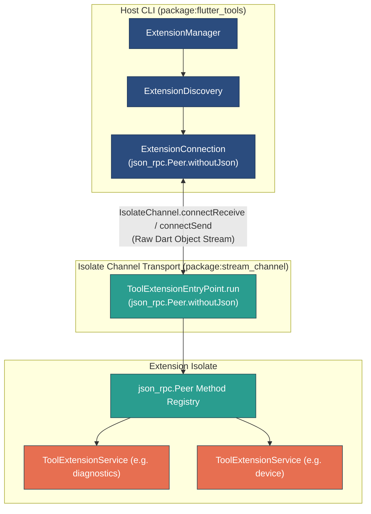
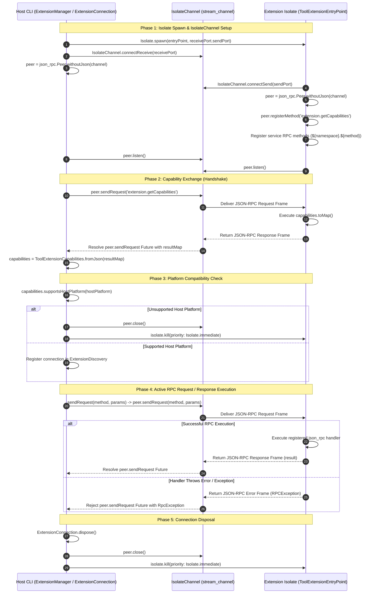

# Flutter Tools Extension Protocol & Isolate Runner Architecture

This document describes the inter-process communication (IPC) protocol, isolate runner lifecycle, and capability-driven platform filtering for Flutter Tool Extensions, introduced in `ft-ext-step02-protocol-and-runner-base`.

---

## Architecture Overview

Flutter Tool Extensions run in dedicated Dart Isolates to maintain strict process isolation, fast host startup times, and stability. Communication between the host `flutter_tools` CLI and extension isolates occurs via Dart `SendPort` / `ReceivePort` message channels integrated with `package:json_rpc_2` over `package:stream_channel` (`IsolateChannel`).



---

## 1. Isolate IPC Transport & JSON-RPC 2 Architecture

### `package:json_rpc_2` and `IsolateChannel` Integration

The host CLI (`flutter_tools`) and extension isolates exchange messages using standard **JSON-RPC 2.0** semantics via `package:json_rpc_2` layered on top of `package:stream_channel` (`IsolateChannel`).

- **Host Side (`ExtensionConnection.spawn`)**:
  1. Opens a host `ReceivePort`.
  2. Spawns the extension isolate, passing `receivePort.sendPort`.
  3. Wraps `receivePort` with `IsolateChannel<Object?>.connectReceive(receivePort)` to create a `StreamChannel<Object?>`.
  4. Binds the channel to `json_rpc.Peer.withoutJson(channel)`.
  5. Receives a required non-nullable `Logger logger` parameter to manage trace logging across isolate lifecycle events and RPC operations.

- **Isolate Side (`ToolExtensionEntryPoint.run`)**:
  1. Receives the host's `SendPort`.
  2. Connects to the host using `IsolateChannel<Object?>.connectSend(sendPort)`.
  3. Binds the channel to `json_rpc.Peer.withoutJson(channel)`.

### Why `Peer.withoutJson` Is Used

`json_rpc.Peer` normally expects string-encoded JSON inputs/outputs and invokes `jsonEncode` and `jsonDecode`. For isolate-based IPC, `json_rpc.Peer.withoutJson` is configured instead for two primary reasons:

1. **Bypassing Raw String Parsing / Encoding Overhead**: Dart isolate channels (`SendPort` and `ReceivePort`) transmit objects directly within the VM heap or via optimized isolate memory transfers. Encoding payload objects to UTF-8 / JSON strings on send and parsing them with `jsonDecode` on receive adds unnecessary CPU cycles and garbage collection pressure. `Peer.withoutJson` passes in-memory `Map<String, Object?>` structures directly across `IsolateChannel`.
2. **Support for Non-JSON Isolate-Serializable Dart Objects**: Native isolate ports support sending Dart objects that are not valid JSON primitives (e.g., `TransferableTypedData`, `SendPort`, `Capability`, native byte buffers, and `RegExp`). By using `Peer.withoutJson`, extensions and host tools can pass isolate-serializable Dart types directly in method parameters and return payloads without losing type fidelity or requiring custom string serialization layers.

### RPC Framing & Endpoint Namespacing

`json_rpc_2` formats requests, responses, and errors according to the standard JSON-RPC 2.0 specification:

- **Request Frame**: Contains `jsonrpc` ("2.0"), `method` name, optional `params` object, and a unique request `id`.
- **Response Frame (Success)**: Contains `jsonrpc` ("2.0"), `result` payload, and matching `id`.
- **Response Frame (Error)**: Contains `jsonrpc` ("2.0"), `error` object (containing `code`, `message`, and optional `data`), and matching `id`.

#### RPC Endpoint Namespacing

Extension RPC methods follow a namespaced pattern: `${service.namespace}.${method}`.
- Extension services implement `ToolExtensionService` and declare a `namespace` string (e.g. `'diagnostics'`, `'device'`, `'build'`).
- During isolate initialization, `ToolExtensionEntryPoint` iterates over registered services, invokes `service.initialize()`, and registers handlers onto `json_rpc.Peer` under full method keys (`${service.namespace}.${method}`).
- Handlers receive parameters via `json_rpc.Parameters params` and return `FutureOr<Object?>`.
- The system endpoint `extension.getCapabilities` is automatically registered by `ToolExtensionEntryPoint` to serve extension capabilities during handshake.

---

## 2. Protocol & Lifecycle Sequence Diagram

The following sequence diagram illustrates the complete handshake, capability verification, RPC execution over `IsolateChannel`, and disposal flow between Host CLI and Extension Isolate:



---

## 3. Isolate Lifecycle Breakdown

The lifecycle of a tool extension isolate proceeds through five distinct phases:

### 1. Spawning & Channel Initialization
1. The Host CLI invokes `ExtensionConnection.spawn(entryPoint, logger: logger)`.
2. A host-side `ReceivePort` is created.
3. `Isolate.spawn(entryPoint, receivePort.sendPort)` boots the Dart isolate.
4. Host wraps `receivePort` using `IsolateChannel<Object?>.connectReceive(receivePort)` and constructs `json_rpc.Peer.withoutJson(channel)`.
5. Inside the isolate, `ToolExtensionEntryPoint.run(sendPort, services)` constructs `IsolateChannel<Object?>.connectSend(sendPort)` and `json_rpc.Peer.withoutJson(channel)`.

### 2. Service Initialization & Method Registration
1. Inside the isolate, `ToolExtensionEntryPoint.run` iterates over each registered `ToolExtensionService`.
2. Invokes `service.initialize()` asynchronously to retrieve method handlers.
3. Registers each handler onto `peer` using `peer.registerMethod('${service.namespace}.$method', ...)`:
   ```dart
   rpcHandlers.forEach((String fullMethod, ExtensionRpcHandler handler) {
     peer.registerMethod(fullMethod, (json_rpc.Parameters params) async {
       final Object? rawValue = params.value;
       final Map<String, Object?> paramMap = rawValue is Map
           ? rawValue.cast<String, Object?>()
           : <String, Object?>{};
       return handler(paramMap);
     });
   });
   ```
4. Registers `extension.getCapabilities` to expose `capabilities.toMap()`.
5. Calls `await peer.listen()` to begin serving requests.

### 3. Capability Exchange (Handshake)
1. Upon initializing `peer`, the Host starts `unawaited(peer.listen())` and issues `peer.sendRequest('extension.getCapabilities')`.
2. The isolate handles `'extension.getCapabilities'`, serializes capabilities via `toMap()`, and returns the result.
3. Host deserializes the result map into `ToolExtensionCapabilities.fromJson(resultMap)` and constructs the `ExtensionConnection`.

### 4. Asynchronous RPC Request Dispatch
1. The Host calls `ExtensionConnection.sendRequest(method, params, timeout)`.
2. Delegates directly to `_peer.sendRequest(method, params).timeout(timeout)`.
3. `json_rpc_2` manages request IDs, completers, parameter formatting, and error propagation automatically over `IsolateChannel`.
4. If the handler returns a value, the Host's future resolves; if the handler throws an exception, `json_rpc_2` transmits a JSON-RPC error frame and rejects the Host's future with a `json_rpc.RpcException`.

### 5. Connection Disposal & Teardown
1. When Host completes execution or detects an incompatible host platform, `ExtensionConnection.dispose()` is invoked.
2. The Host closes the peer (`await _peer.close()`).
3. The Host forcibly terminates the isolate via `_isolate?.kill(priority: Isolate.immediate)`.
4. If a timeout or error occurs during `spawn` or handshake, cleanup closes `receivePort` and kills `isolate`.

---

## 4. Capability-Driven Platform Filtering & Extension Management

### Declarative Extension Capabilities

Extension capabilities are represented by `ToolExtensionCapabilities`:

```dart
@immutable
class ToolExtensionCapabilities {
  const ToolExtensionCapabilities({
    required this.services,
    this.supportedPlatforms = const <String>['linux', 'macos', 'windows'],
  });

  factory ToolExtensionCapabilities.fromJson(Map<String, Object?> json) { ... }

  final List<String> services;
  final List<String> supportedPlatforms;

  bool supportsHostPlatform(String hostPlatform) {
    return supportedPlatforms.contains(hostPlatform.toLowerCase());
  }

  Map<String, Object?> toMap() => <String, Object?>{
    'services': services,
    'supportedPlatforms': supportedPlatforms,
  };
}
```

- **`services`**: List of service namespaces exported by the extension (e.g. `['diagnostics', 'linux_device']`).
- **`supportedPlatforms`**: List of host operating system names supported by the extension (defaults to `['linux', 'macos', 'windows']`).

### Host Connection Lifecycle (`ExtensionConnection`)

```dart
class ExtensionConnection {
  ExtensionConnection._({
    required Isolate isolate,
    required json_rpc.Peer peer,
    required this.capabilities,
    required Logger logger,
  }) : _isolate = isolate,
       _peer = peer,
       _logger = logger;

  Isolate? _isolate;
  final json_rpc.Peer _peer;
  final Logger _logger;

  /// The capabilities and supported service namespaces of the extension.
  final ToolExtensionCapabilities capabilities;

  bool _isDisposed = false;

  /// Sends an RPC request to the extension isolate.
  Future<Object?> sendRequest(
    String method, [
    Object? params,
    Duration timeout = const Duration(seconds: 5),
  ]) async {
    if (_isDisposed) {
      throw StateError('ExtensionConnection has been disposed.');
    }
    _logger.printTrace('ExtensionConnection sending RPC request "$method"...');
    try {
      final Object? result = await _peer.sendRequest(method, params).timeout(timeout);
      _logger.printTrace('ExtensionConnection received response for RPC request "$method".');
      return result;
    } catch (error) {
      _logger.printTrace('ExtensionConnection RPC request "$method" failed with error: $error');
      rethrow;
    }
  }

  /// Spawns an extension isolate from [entryPoint] and completes handshake.
  static Future<ExtensionConnection> spawn(
    ExtensionEntryPoint entryPoint, {
    required Logger logger,
    Duration timeout = const Duration(seconds: 5),
  }) async {
    logger.printTrace('ExtensionConnection spawning extension isolate...');
    final receivePort = ReceivePort();
    Isolate? isolate;

    try {
      isolate = await Isolate.spawn(entryPoint, receivePort.sendPort);
      logger.printTrace('ExtensionConnection isolate spawned; connecting IsolateChannel...');
      final channel = IsolateChannel<Object?>.connectReceive(receivePort);
      final peer = json_rpc.Peer.withoutJson(channel);

      unawaited(peer.listen());

      logger.printTrace('ExtensionConnection querying extension.getCapabilities...');
      final Object? responseObj = await peer
          .sendRequest('extension.getCapabilities')
          .timeout(timeout);
      final Map<String, Object?> resultMap = responseObj is Map
          ? responseObj.cast<String, Object?>()
          : <String, Object?>{};
      final capabilities = ToolExtensionCapabilities.fromJson(resultMap);
      logger.printTrace(
        'ExtensionConnection handshake complete. Capabilities: ${capabilities.services}',
      );

      return ExtensionConnection._(
        isolate: isolate,
        peer: peer,
        capabilities: capabilities,
        logger: logger,
      );
    } on TimeoutException {
      logger.printTrace('ExtensionConnection handshake timed out.');
      receivePort.close();
      isolate?.kill(priority: Isolate.immediate);
      throw TimeoutException('Handshake with tool extension isolate timed out.');
    } on Object catch (error) {
      logger.printTrace('ExtensionConnection spawn failed with error: $error');
      receivePort.close();
      isolate?.kill(priority: Isolate.immediate);
      rethrow;
    }
  }

  /// Disposes the extension isolate connection.
  Future<void> dispose() async {
    if (_isDisposed) {
      return;
    }
    _isDisposed = true;
    _logger.printTrace('ExtensionConnection disposing isolate connection.');
    await _peer.close();
    _isolate?.kill(priority: Isolate.immediate);
    _isolate = null;
  }
}
```

### Host Extension Discovery & Management (`ExtensionDiscovery` and `ExtensionManager`)

`ExtensionDiscovery` and `ExtensionManager` manage connection pools and filtering, and both require a non-nullable `Logger logger` parameter:

```dart
class ExtensionDiscovery {
  /// Creates an [ExtensionDiscovery] instance with required [logger].
  ExtensionDiscovery({required Logger logger}) : _logger = logger;

  final List<ExtensionConnection> _connections = <ExtensionConnection>[];
  final Logger _logger;

  /// Active extension connections.
  List<ExtensionConnection> get connections => List<ExtensionConnection>.unmodifiable(_connections);

  /// Registers an active [connection].
  void registerConnection(ExtensionConnection connection) {
    _logger.printTrace('ExtensionDiscovery registering active connection.');
    _connections.add(connection);
  }

  /// Registers multiple active [connections].
  void registerConnections(Iterable<ExtensionConnection> connections) {
    _logger.printTrace('ExtensionDiscovery registering ${connections.length} connection(s).');
    _connections.addAll(connections);
  }

  /// Spawns and registers multiple extension isolates concurrently.
  Future<List<ExtensionConnection>> spawnAll(
    List<ExtensionEntryPoint> entryPoints, {
    Duration timeout = const Duration(seconds: 5),
  }) async {
    _logger.printTrace('ExtensionDiscovery spawning ${entryPoints.length} extension isolate(s)...');
    final List<ExtensionConnection> newConnections = await Future.wait(
      entryPoints.map(
        (entryPoint) => ExtensionConnection.spawn(entryPoint, logger: _logger, timeout: timeout),
      ),
    );
    _connections.addAll(newConnections);
    return newConnections;
  }

  /// Disposes all registered extension isolate connections.
  Future<void> dispose() async {
    _logger.printTrace('ExtensionDiscovery disposing all registered connections.');
    for (final ExtensionConnection connection in _connections) {
      await connection.dispose();
    }
    _connections.clear();
  }
}

class ExtensionManager {
  /// Creates an [ExtensionManager] targeting the active [hostPlatform].
  ExtensionManager({
    required this.hostPlatform,
    required Logger logger,
    ExtensionDiscovery? discovery,
  }) : _logger = logger,
       _discovery = discovery ?? ExtensionDiscovery(logger: logger);

  /// The active host operating system platform (e.g. `'linux'`, `'macos'`, `'windows'`).
  final String hostPlatform;
  final Logger _logger;
  final ExtensionDiscovery _discovery;

  /// Active extension connections compatible with [hostPlatform].
  List<ExtensionConnection> get connections => _discovery.connections;

  /// Spawns entrypoints without host OS checks; disposes any extension that reports
  /// it does not support [hostPlatform].
  Future<void> initialize({
    List<ExtensionEntryPoint> entryPoints = const <ExtensionEntryPoint>[],
  }) async {
    _logger.printTrace(
      'ExtensionManager initializing for platform "$hostPlatform" with ${entryPoints.length} entrypoint(s).',
    );
    for (final entryPoint in entryPoints) {
      final ExtensionConnection connection = await ExtensionConnection.spawn(
        entryPoint,
        logger: _logger,
      );
      if (connection.capabilities.supportsHostPlatform(hostPlatform)) {
        _logger.printTrace(
          'Extension connection supported on host platform "$hostPlatform"; registering.',
        );
        _discovery.registerConnection(connection);
      } else {
        _logger.printTrace(
          'Extension connection does not support host platform "$hostPlatform" '
          '(supported platforms: ${connection.capabilities.supportedPlatforms}); disposing connection.',
        );
        await connection.dispose();
      }
    }
  }

  /// Disposes all active extension isolate connections.
  Future<void> dispose() async {
    _logger.printTrace('ExtensionManager disposing all active connections.');
    await _discovery.dispose();
  }
}
```

### Mandatory Non-Nullable Logger Requirement

Across `ExtensionConnection`, `ExtensionDiscovery`, and `ExtensionManager`, `Logger logger` is specified as a non-nullable required parameter (`required Logger logger`):

- **Trace Diagnostics & Observability**: Every step of the isolate lifecycle—spawning, `IsolateChannel` linking, capability querying, platform validation filtering, RPC dispatch, and connection disposal—emits trace logs via `_logger.printTrace(...)` / `logger.printTrace(...)`.
- **Explicit Dependency Injection**: Requiring an explicit non-nullable `Logger` avoids hidden reliance on global singletons, promoting modular architecture and predictable log behavior during testing and production CLI usage.

### Isolate Entry Point Runner (`ToolExtensionEntryPoint`)

```dart
class ToolExtensionEntryPoint {
  static Future<void> run(SendPort sendPort, List<ToolExtensionService> services) async {
    final channel = IsolateChannel<Object?>.connectSend(sendPort);
    final peer = json_rpc.Peer.withoutJson(channel);

    final rpcHandlers = <String, ExtensionRpcHandler>{};

    for (final service in services) {
      final Map<String, ExtensionRpcHandler> handlers = await service.initialize();
      handlers.forEach((String method, ExtensionRpcHandler handler) {
        final fullMethod = '${service.namespace}.$method';
        rpcHandlers[fullMethod] = handler;
      });
    }

    final capabilities = ToolExtensionCapabilities(
      services: services.map((ToolExtensionService s) => s.namespace).toList(),
    );

    peer.registerMethod('extension.getCapabilities', () => capabilities.toMap());

    rpcHandlers.forEach((String fullMethod, ExtensionRpcHandler handler) {
      peer.registerMethod(fullMethod, (json_rpc.Parameters params) async {
        final Object? rawValue = params.value;
        final Map<String, Object?> paramMap = rawValue is Map
            ? rawValue.cast<String, Object?>()
            : <String, Object?>{};
        return handler(paramMap);
      });
    });

    await peer.listen();
  }
}
```

### Filtering Flow & Benefits
1. **Lazy Validation After Spawn**: Rather than parsing external configuration files prior to spawning, `ExtensionManager` performs an inline spawn and capability check via `connection.capabilities.supportsHostPlatform(hostPlatform)`.
2. **Immediate Cleanup for Incompatible Extensions**: If an extension does not support the host OS, `connection.dispose()` closes the `Peer` channel and kills the isolate immediately.
3. **Zero Host Resource Leaks**: Incompatible extension isolates consume no background threads, memory, or RPC routes.
4. **Active Connection Registry**: Only connections passing platform filtering are registered into `ExtensionDiscovery`.
5. **Explicit Dependency Injection & Modern Dart Pattern Matching**: In `executable.dart`, `ExtensionManager` is instantiated and passed explicitly via constructor parameters to commands (`DevicesCommand(extensionManager: extensionManager)`, `ConfigCommand(extensionManager: extensionManager)`, `DoctorCommand(extensionManager: extensionManager)`). `ExtensionManager` is **NEVER placed in ambient context (`AppContext`) or context overrides (`overrides`)**. In `DevicesCommand.runCommand()`, modern Dart pattern matching (`if (_extensionManager case final extensionManager?)`) is used to dynamically register `ExtensionDeviceDiscovery` onto `globals.deviceManager?.deviceDiscoverers`.
6. **Testing Verification**: Implementation correctness is validated via real CLI process integration tests (`packages/flutter_tools/test/integration.shard/tool_extensions_test.dart` running `processManager.run([flutterBin, 'devices'])` with `FLUTTER_TOOL_EXTENSIONS=true`) and hermetic unit tests (`packages/flutter_tools/test/commands.shard/hermetic/tool_extensions_device_test.dart`).

---

## Related Documentation

For broader architecture context and capability slice details, refer to:

- [Extensibility Workspace Architecture](extensibility_workspace.md)
- [Diagnostics Slice Architecture](diagnostics_slice.md)
- [Configuration Slice Architecture](configuration_slice.md)
- [Templates Slice Architecture](templates_slice.md)
- [Device Service Slice Architecture](device_service_slice.md)
- [Extension Authoring Guide](../guides/extension_authoring_guide.md)


