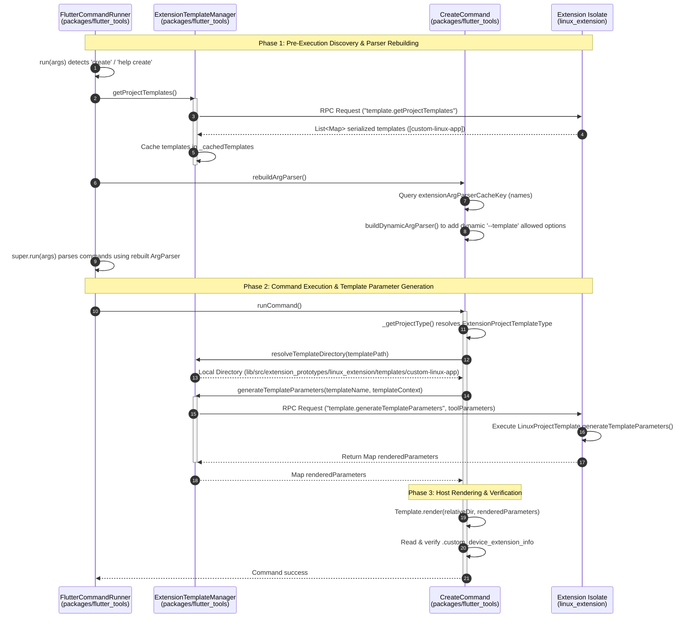
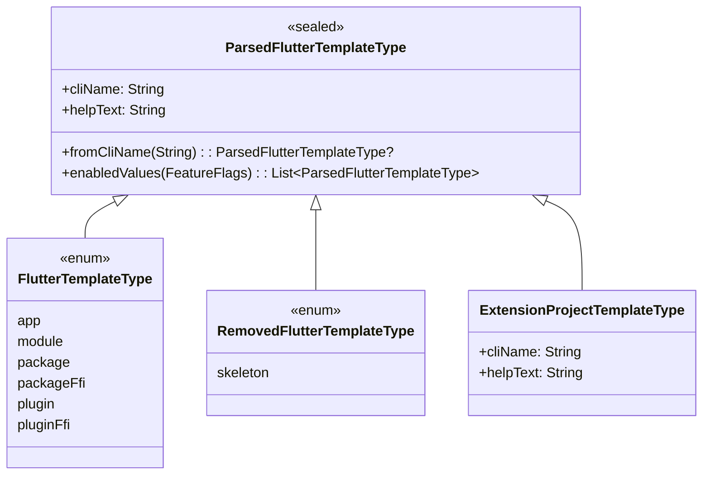

# Templates Extension Slice Architecture

This document describes the architecture of the **Templates Extension Slice** introduced in Step 5 of the Tool Extensions feature. It explains how dynamically loaded tool extensions register custom project templates, how the CLI reconstructs its option parser dynamically at runtime, and how project creation is delegated to extension isolates over the extension protocol RPC.

---

## 1. Architecture Overview & End-to-End Flow

The templates extension slice enables custom platform extensions to inject new project templates into the `flutter create` command. The host CLI manages the physical layout and rendering, but delegates the definition of files, templates, and variable parameter generation to the remote extension isolate over Dart isolate RPC boundaries.

### Component Overview

- **Core Data Contracts (`packages/flutter_tools_core`)**:
  - `ProjectTemplate`: Abstract base class specifying the template metadata (`name`, `hidden`, `templateDependencies`, `templateSources`, `templatePath`).
  - `ExtensionProjectTemplate`: Concrete host-side deserialized representation of an extension's template, which throws `UnimplementedError` on direct parameter generation calls.
- **Protocol Service Interfaces (`packages/flutter_tools_extension`)**:
  - `TemplateService`: Abstract RPC service handler exposing methods to get app, plugin, and project templates, and to generate template parameters.
- **Platform Extension Prototype (`packages/flutter_tools_extension_linux_prototype`)**:
  - `LinuxProjectTemplate`: Concrete extension-side implementation of `ProjectTemplate` representing `'custom-linux-app'`.
  - `LinuxTemplateService`: Concrete template service exposing `'custom-linux-app'` to the host CLI.
- **Host Adapters & CLI Infrastructure (`packages/flutter_tools`)**:
  - `ExtensionTemplateManager`: Host-side service manager that queries templates from extensions over RPC (`template.getProjectTemplates`), caches them, resolves package URIs to local paths, and delegates parameter generation over RPC (`template.generateTemplateParameters`).
  - `ParsedFlutterTemplateType`: Sealed template enumeration root class supporting standard, removed, and dynamic custom extension template types (`ExtensionProjectTemplateType`).
  - `ExtensionArgParserMixin`: Mixin on `FlutterCommand` enabling dynamic, lazy reconstruction of `ArgParser` options when extension capabilities change.
  - `FlutterCommandRunner`: Runner interception that triggers extension template discovery and rebuilds the CLI argument parser prior to executing command parsing for `create` or `help create`.
  - `CreateCommand`: The command that parses `--template`, fetches custom parameters, resolves local templates, and renders output.

### End-to-End Templates Lifecycle

The following sequence diagram illustrates the lifecycle of dynamic template registration, option parser rebuilding, parameter delegation, and file rendering:



---

## 2. Core Data Contracts & ExtensionProjectTemplate Deserialization

All project template domain contracts are defined in `packages/flutter_tools/packages/flutter_tools_core/lib/src/templates.dart`.

- **`ProjectTemplate`**: Abstract base class specifying the template metadata (`name`, `hidden`, `templateDependencies`, `templateSources`, `templatePath`) and `generateTemplateParameters` interface. Implements `toMap()` for serializing templates over RPC.
- **`ExtensionProjectTemplate`**: Concrete host-side deserialized representation of an extension's template. Its `generateTemplateParameters` method throws an `UnimplementedError` because parameter generation must be delegated to the extension isolate via RPC.

### Deserialization Mechanics & Safe Type-Safe Casting

JSON deserialization in `ExtensionProjectTemplate.fromJson` uses a factory constructor with safe, direct type-safe casting (`as T? ?? default`) to extract properties from JSON maps, replacing unsafe `!` bang operators:

```dart
factory ExtensionProjectTemplate.fromJson(Map<String, Object?> json) {
  return ExtensionProjectTemplate(
    name: json['name'] as String? ?? '',
    hidden: json['hidden'] as bool? ?? false,
    templateDependencies:
        (json['templateDependencies'] as List<Object?>?)?.cast<String>().toSet() ??
        const <String>{},
    templateSources:
        (json['templateSources'] as List<Object?>?)?.cast<String>().toSet() ?? const <String>{},
    templatePath: json['templatePath'] as String? ?? '',
  );
}
```

### Safe Bulk Deserialization (`listFromJson`)

RPC responses containing lists of dynamic templates are parsed using `ExtensionProjectTemplate.listFromJson`:

```dart
static List<ExtensionProjectTemplate> listFromJson(Object? rpcResult) =>
    <ExtensionProjectTemplate>[
      if (rpcResult case final List<Object?> l)
        for (final item in l)
          if (item case final Map<String, Object?> m) ExtensionProjectTemplate.fromJson(m),
    ];
```

#### Architectural Rationale: Direct Type-Safe Casting vs Unsafe Bang Casts
1. **Runtime Null Safety & Resilience**: Replacing unsafe bang operators (`json['name']! as String`) with direct null-aware casting (`as String? ?? ''`) prevents runtime `TypeError` / `NullThrownError` exceptions if an extension isolate returns partial or malformed template JSON fields.
2. **Consistent Core Deserialization**: Aligns `ExtensionProjectTemplate.fromJson` with other `flutter_tools_core` deserializers (`ValidationMessage.fromJson`, `ValidationResult.fromJson`, `FeatureFlag.fromJson`, `ConfigOption.fromJson`), standardizing on direct type-safe casting with default fallback values.
3. **Avoidance of Redundant Logic**: Directly casts values using `as T? ?? default` without duplicating pattern-matching conditionals when extracting primitive map values.

---

## 3. Sealed Template Types & project_metadata.dart

To integrate dynamic extension-provided templates cleanly while preserving Dart's exhaustive compiler checks on sealed types, the template representation in `packages/flutter_tools/lib/src/flutter_project_metadata.dart` is structured as a class hierarchy:



### `ParsedFlutterTemplateType`

The root class is a sealed class that defines the core CLI name and help description:

- **`fromCliName(String cliName)`**: Attempts to match standard templates first. If none match, it queries `ExtensionTemplateManager.cachedTemplates` to see if a dynamic template matches the input name. If so, it returns an `ExtensionProjectTemplateType`.
- **`enabledValues(FeatureFlags)`**: Combines standard enabled template types with any dynamic templates discovered in `ExtensionTemplateManager`.
- **`ExtensionProjectTemplateType`**: An instance of this class is constructed dynamically for extension-defined templates, holding the custom CLI name.
- **`RemovedFlutterTemplateType`**: Contains deprecated/removed templates (such as `skeleton`), allowing the tool to intercept them and print user-friendly migration recommendations instead of generic parsing errors.

---

## 4. ExtensionTemplateManager & Client Proxy

Host-side interactions with templates are managed by `ExtensionTemplateManager` in `packages/flutter_tools/lib/src/experimental/templates.dart`. It extends the core `TemplateService` class, linking the host's CLI tools to remote isolate APIs.

```dart
base class ExtensionTemplateManager extends core.TemplateService {
  ExtensionTemplateManager({
    required ToolExtensionManager extensionManager,
    required FileSystem fileSystem,
    required Logger logger,
    required Platform platform,
  }) : ...
}
```

### Core Operations

#### 1. Discovery (`getProjectTemplates`)
Queries active extension isolates using the `'template.getProjectTemplates'` RPC method. It parses the results into a list of `ExtensionProjectTemplate` models and caches them:
- Once cached, subsequent calls return the cached values immediately to prevent redundant RPC traffic.
- If the tool extensions feature is disabled, it returns an empty list.

#### 2. Local Path Resolution (`resolveTemplateDirectory`)
Resolves extension template paths (e.g. `'package:flutter_tools/src/extension_prototypes/linux_extension/templates/custom-linux-app'`) into local file system directories. Currently, it translates package URIs relative to `Cache.flutterRoot`.

#### 3. Variable Generation (`generateTemplateParameters`)
Delegates parameter rendering to the extension isolate:
- Issues a `template.generateTemplateParameters` RPC request with `templateName` and `toolParameters` (the current host creation context, such as project name, description, and organizational details).
- If the isolate fails to respond or encounters an error, the host catches the error, logs a trace, and falls back to using the unchanged `toolParameters` to guarantee resilience.

---

## 5. Dynamic CLI Option Registration

`package:args` does not support modifying the option structure of `ArgParser` instances once options are registered. To support registering dynamic templates (such as adding custom template values to the `--template` option allowed list), the CLI implements dynamic parser reconstruction.

### `ExtensionArgParserMixin`

Defined in `packages/flutter_tools/lib/src/experimental/extension_arg_parser.dart`, this mixin is applied to `FlutterCommand` subclasses (like `CreateCommand`):

- **Base vs. Rebuilt Parser**: Static options (such as `--org`, `--android-language`, and `--description`) are populated on a static parser via `populateBaseArgParser(parser)`.
- **Cache Key (`extensionArgParserCacheKey`)**: Subclasses implement this getter to return a string representing the current dynamic state (e.g., a comma-separated list of cached template names: `'custom-linux-app'`).
- **Parser Interception**: The `argParser` getter checks if the cache key has changed. If it has, it clones the base static parser, injects the dynamic template entries into the `--template` option allowed list and allowed-help map, and caches the reconstructed parser.

### Runner Hook (`FlutterCommandRunner.run`)

Because commands are resolved and parsed immediately upon entry, the argument parser must be rebuilt *before* standard parsing occurs:

```dart
// In packages/flutter_tools/lib/src/runner/flutter_command_runner.dart:
if (featureFlags.isToolExtensionsEnabled &&
    (commandName == 'create' || (commandName == 'help' && args.contains('create')))) {
  final ExtensionTemplateManager? templateManager = extensionTemplateManager;
  if (templateManager != null) {
    await templateManager.getProjectTemplates();
    rebuildArgParser();
  }
}
```

This guarantees that when the runner executes option parsing or generates help usage displays, the `CreateCommand`'s parser has already resolved and incorporated all extension-provided templates.

---

## 6. Host-Side Creation Delegation

When `CreateCommand.runCommand()` executes and matches an `ExtensionProjectTemplateType`:

```dart
// In CreateCommand.runCommand():
case ExtensionProjectTemplateType():
  final ExtensionTemplateManager? manager = extensionTemplateManager;
  if (manager == null) {
    throwToolExit('ExtensionTemplateManager is not registered.');
  }

  // 1. Resolve cached template configuration metadata
  core.ProjectTemplate? customTemplate = manager.cachedTemplates.firstWhere((t) => t.name == template.cliName);

  // 2. Resolve template path to physical directory
  final Directory templateDir = manager.resolveTemplateDirectory(customTemplate.templatePath);

  // 3. Delegate parameter calculations to the extension isolate
  final Map<String, Object?> renderedParameters = await manager.generateTemplateParameters(
    customTemplate.name,
    templateContext,
  );

  // 4. Render using standard host Mustache template engine
  final t = Template(templateDir, null, ...);
  generatedFileCount += t.render(relativeDir, renderedParameters, ...);

  // 5. Run safety verification
  final File verificationFile = relativeDir.childFile('.custom_device_extension_info');
  if (!verificationFile.existsSync() || verificationFile.readAsStringSync().trim() != 'Custom Linux Device Extension App Template Verified') {
    throwToolExit('Verification file mismatch.');
  }
```

### Key Creation Flow Highlights

1. **Parameter Generation**: Instead of predicting native project variables on the host side, the host sends the base `templateContext` to the extension. The extension runs its custom logic (e.g. configuring CMake targets, setting up specific library dependencies, or generating unique files) and returns a complete variables map.
2. **Standard Host Rendering**: The host CLI reads, filters, and renders mustache files (`.tmpl` and `.copy.tmpl`) directly. The extension does not need to implement file rendering or write files itself, which prevents file permission conflicts and path traversal security vulnerabilities.
3. **Template Verification**: To verify that the extension template rendered correctly, the host checks for a verification file `.custom_device_extension_info` in the output project directory, ensuring the target matches the expected string output.

---

## Related Documentation

- [Extensibility Workspace Architecture](extensibility_workspace.md)
- [Protocol & Isolate Runner Architecture](protocol_and_isolate_runner.md)
- [Diagnostics Slice Architecture](diagnostics_slice.md)
- [Configuration Slice Architecture](configuration_slice.md)
- [Extension Authoring Guide](../guides/extension_authoring_guide.md)
