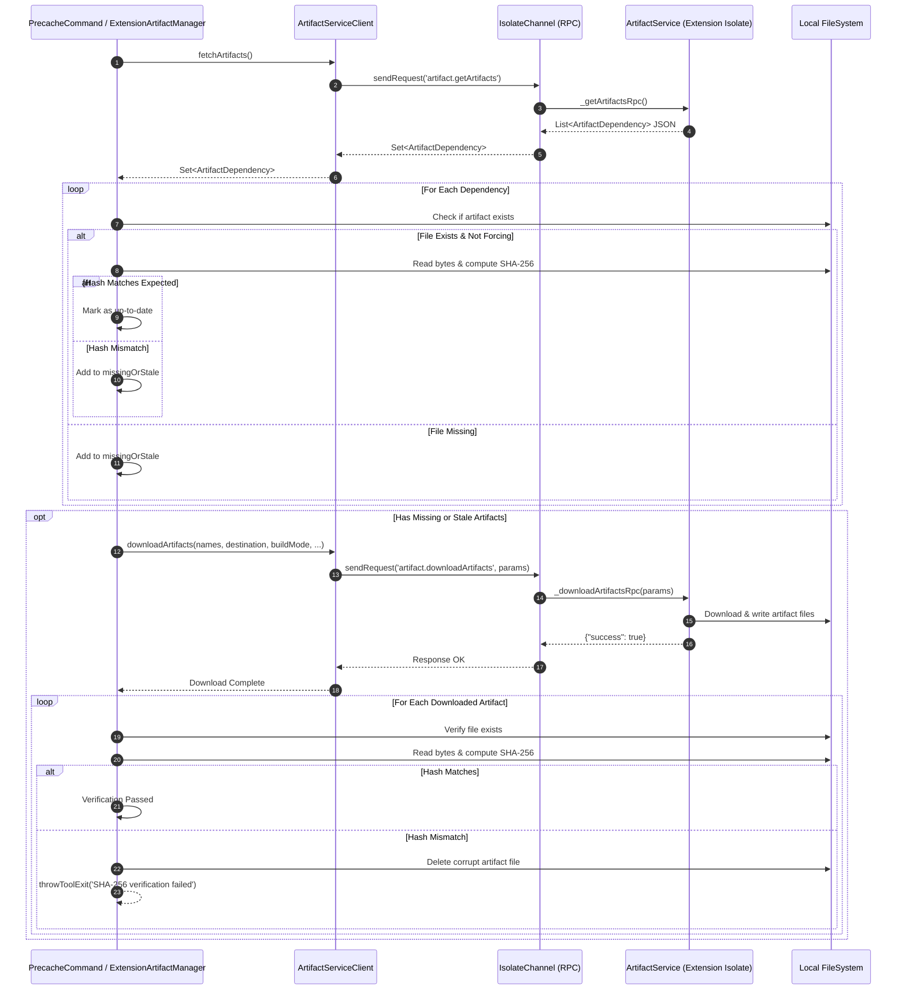
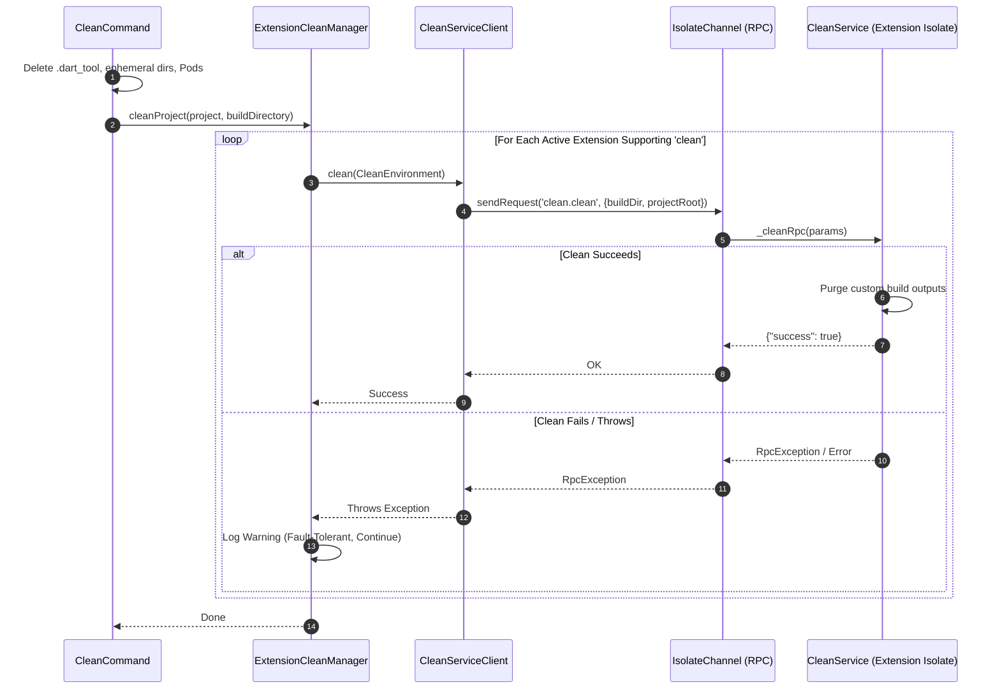

# Artifact and Clean Services Architecture in Flutter Tool Extensions

This document details the architectural specification, protocol contracts, security controls, and lifecycle integration of the **Artifact Service** and **Clean Service** within the Flutter Tooling Extensibility system.

---

## Table of Contents

1. [Overview & Architectural Context](#overview--architectural-context)
2. [Artifact Service Subsystem](#artifact-service-subsystem)
   - [Domain Contract: `ArtifactDependency`](#domain-contract-artifactdependency)
   - [Protocol Interface: `ArtifactService`](#protocol-interface-artifactservice)
   - [Client Adapter: `ArtifactServiceClient`](#client-adapter-artifactserviceclient)
   - [Host Orchestrator: `ExtensionArtifactManager`](#host-orchestrator-extensionartifactmanager)
3. [Cryptographic SHA-256 Verification Pipeline](#cryptographic-sha-256-verification-pipeline)
   - [Threat Model & Security Rationale](#threat-model--security-rationale)
   - [Checksum Resolution Precedence](#checksum-resolution-precedence)
   - [Pre-Download & Post-Download Validation Flow](#pre-download--post-download-validation-flow)
4. [Dynamic `flutter precache` Integration](#dynamic-flutter-precache-integration)
   - [CLI Flag: `--[no-]tool-extension-artifacts`](#cli-flag---no-tool-extension-artifacts)
   - [Command Lifecycle & Execution Timing](#command-lifecycle--execution-timing)
5. [Clean Service Subsystem](#clean-service-subsystem)
   - [Domain Contract: `CleanEnvironment`](#domain-contract-cleanenvironment)
   - [Protocol Interface: `CleanService`](#protocol-interface-cleanservice)
   - [Client Adapter: `CleanServiceClient`](#client-adapter-cleanserviceclient)
   - [Host Orchestrator: `ExtensionCleanManager`](#host-orchestrator-extensioncleanmanager)
6. [Isolate-Based Cleaning & Fault-Tolerant Integration](#isolate-based-cleaning--fault-tolerant-integration)
   - [Integration into `flutter clean`](#integration-into-flutter-clean)
   - [Fault-Tolerant Exception Isolation](#fault-tolerant-exception-isolation)
7. [System Boundary & Interaction Diagrams](#system-boundary--interaction-diagrams)
   - [RPC and Isolate Boundary Architecture](#rpc-and-isolate-boundary-architecture)
   - [Artifact Precache & Verification Sequence](#artifact-precache--verification-sequence)
   - [Clean Execution Sequence](#clean-execution-sequence)

---

## Overview & Architectural Context

Custom platform extensions (such as out-of-tree platforms, embedded targets, or specialized hardware toolchains) frequently require:
1. **Target Artifacts & Precompiled Binaries**: Platform-specific compilers, engine embedding libraries (`libflutter_engine.so`), runtime headers, or pre-built tools (`gen_snapshot`) that must be fetched or updated dynamically before build or launch commands can execute.
2. **Build Output & Workspace Sanitation**: Platform-specific temporary files, intermediate build artifacts, ephemeral CMake/Ninja configurations, and generated bindings that must be cleaned when a user executes `flutter clean`.

To fulfill these requirements without exposing host internals or granting extensions arbitrary unconstrained access to host execution contexts, the extensibility architecture introduces two dedicated RPC capability slices:
- **`ArtifactService`**: Encapsulates artifact dependency declaration, network acquisition, and strict cryptographic SHA-256 validation.
- **`CleanService`**: Encapsulates isolated project cleanup logic executed via JSON-RPC across Dart isolate boundaries.

Both subsystems operate across strict package boundaries:
- **`package:flutter_tools_core`**: Declares lightweight, pure Dart Data Transfer Objects (`ArtifactDependency`, `CleanEnvironment`).
- **`package:flutter_tools_extension`**: Defines RPC service contracts and JSON-RPC 2.0 protocol interfaces (`ArtifactService`, `CleanService`).
- **`package:flutter_tools`**: Hosts CLI orchestrators (`ExtensionArtifactManager`, `ExtensionCleanManager`) that discover active extensions, manage isolates, and invoke services fault-tolerantly.

---

## Artifact Service Subsystem

### Domain Contract: `ArtifactDependency`

Located in [`package:flutter_tools_core/lib/src/artifacts.dart`](file:///usr/local/google/home/bkonyi/.gemini/jetski/brain/e6f0353b-1146-45e5-b9b8-c08467d3ff59/.system_generated/worktrees/subagent-Gemini-Tech-Writer-GeminiTechWriter-bab70a0b/packages/flutter_tools/packages/flutter_tools_core/lib/src/artifacts.dart), [`ArtifactDependency`](file:///usr/local/google/home/bkonyi/.gemini/jetski/brain/e6f0353b-1146-45e5-b9b8-c08467d3ff59/.system_generated/worktrees/subagent-Gemini-Tech-Writer-GeminiTechWriter-bab70a0b/packages/flutter_tools/packages/flutter_tools_core/lib/src/artifacts.dart#L9-L96) is an immutable domain model declaring an external artifact required by a tool extension.

```dart
@immutable
class ArtifactDependency {
  const ArtifactDependency({
    required this.hostPlatform,
    required this.name,
    required this.sha256Checksums,
    required this.targetArchitecture,
    required this.targetPlatform,
  });

  final String hostPlatform;
  final String name;
  final Map<String, String> sha256Checksums;
  final String targetArchitecture;
  final String targetPlatform;
  // ...
}
```

#### Field Specifications

| Field | Type | Description | Example Values |
|---|---|---|---|
| `name` | `String` | Unique identifier for the required artifact file or bundle. | `'gen_snapshot'`, `'libflutter_engine.so'`, `'custom_runner'` |
| `hostPlatform` | `String` | Host operating system and architecture required to run the host-side tool. | `'darwin-x64'`, `'darwin-arm64'`, `'linux-x64'`, `'windows-x64'` |
| `targetPlatform` | `String` | Target OS or platform running the Flutter embedding. | `'linux'`, `'webos'`, `'tizen'`, `'android'` |
| `targetArchitecture` | `String` | CPU architecture of the target device. | `'arm64'`, `'arm'`, `'x64'`, `'riscv64'` |
| `sha256Checksums` | `Map<String, String>` | Map of platform keys or artifact names to cryptographic SHA-256 hex digests. | `{'linux-x64': 'e3b0c442...', 'linux': 'e3b0c442...'}` |

### Protocol Interface: `ArtifactService`

Located in [`package:flutter_tools_extension/lib/src/artifacts.dart`](file:///usr/local/google/home/bkonyi/.gemini/jetski/brain/e6f0353b-1146-45e5-b9b8-c08467d3ff59/.system_generated/worktrees/subagent-Gemini-Tech-Writer-GeminiTechWriter-bab70a0b/packages/flutter_tools/packages/flutter_tools_extension/lib/src/artifacts.dart), [`ArtifactService`](file:///usr/local/google/home/bkonyi/.gemini/jetski/brain/e6f0353b-1146-45e5-b9b8-c08467d3ff59/.system_generated/worktrees/subagent-Gemini-Tech-Writer-GeminiTechWriter-bab70a0b/packages/flutter_tools/packages/flutter_tools_extension/lib/src/artifacts.dart#L14-L81) is the abstract base class that platform extensions implement to provide artifacts:

```dart
abstract base class ArtifactService extends ToolExtensionService {
  static const String serviceNamespace = 'artifact';
  static const String getArtifactsMethod = 'artifact.getArtifacts';
  static const String downloadArtifactsMethod = 'artifact.downloadArtifacts';

  @override
  String get namespace => serviceNamespace;

  Set<ArtifactDependency> get artifacts;

  Future<void> downloadArtifacts(
    Set<String> artifactNames, {
    required BuildMode buildMode,
    required Uri destinationDirectory,
    required HostPlatform hostPlatform,
    required TargetPlatform targetPlatform,
  });
  // ...
}
```

#### Protocol Methods

1. **`artifact.getArtifacts`**:
   - **Invocation**: Triggered during extension capability discovery and cache population.
   - **Request Payload**: None (`{}`).
   - **Response Payload**: `List<Map<String, Object?>>` representing serialized [`ArtifactDependency`](file:///usr/local/google/home/bkonyi/.gemini/jetski/brain/e6f0353b-1146-45e5-b9b8-c08467d3ff59/.system_generated/worktrees/subagent-Gemini-Tech-Writer-GeminiTechWriter-bab70a0b/packages/flutter_tools/packages/flutter_tools_core/lib/src/artifacts.dart#L9-L96) objects.
2. **`artifact.downloadArtifacts`**:
   - **Invocation**: Triggered when artifacts are missing, stale, or explicitly forced.
   - **Request Payload**:
     ```json
     {
       "artifactNames": ["gen_snapshot", "libflutter_engine.so"],
       "buildMode": "debug",
       "destinationDirectory": "file:///path/to/project/.dart_tool/flutter_tools/artifacts/my_extension/",
       "hostPlatform": "linux-x64",
       "targetPlatform": "linux-x64"
     }
     ```
   - **Response Payload**: `{"success": true}` upon completion. If an error occurs inside the extension isolate, an `RpcException` is thrown back across the channel.

### Client Adapter: `ArtifactServiceClient`

[`ArtifactServiceClient`](file:///usr/local/google/home/bkonyi/.gemini/jetski/brain/e6f0353b-1146-45e5-b9b8-c08467d3ff59/.system_generated/worktrees/subagent-Gemini-Tech-Writer-GeminiTechWriter-bab70a0b/packages/flutter_tools/packages/flutter_tools_extension/lib/src/artifacts.dart#L84-L124) wraps the raw JSON-RPC `_sendRequest` function. It provides:
- Caching of fetched dependencies via `_cachedArtifacts`.
- Type-safe deserialization from raw JSON-RPC responses to `Set<ArtifactDependency>`.
- Parameter serialization for `downloadArtifacts` calls.

### Host Orchestrator: `ExtensionArtifactManager`

Located in [`packages/flutter_tools/lib/src/experimental/extension_artifact_manager.dart`](file:///usr/local/google/home/bkonyi/.gemini/jetski/brain/e6f0353b-1146-45e5-b9b8-c08467d3ff59/.system_generated/worktrees/subagent-Gemini-Tech-Writer-GeminiTechWriter-bab70a0b/packages/flutter_tools/lib/src/experimental/extension_artifact_manager.dart), [`ExtensionArtifactManager`](file:///usr/local/google/home/bkonyi/.gemini/jetski/brain/e6f0353b-1146-45e5-b9b8-c08467d3ff59/.system_generated/worktrees/subagent-Gemini-Tech-Writer-GeminiTechWriter-bab70a0b/packages/flutter_tools/lib/src/experimental/extension_artifact_manager.dart#L20-L207) coordinates querying, downloading, and verifying artifacts across all active extensions.

#### Storage Path Resolution
Artifacts are isolated per extension to avoid file collisions:
```
<project_root>/.dart_tool/flutter_tools/artifacts/<extension_name>/<artifact_file>
```
If no `projectRoot` is provided, the resolution defaults to the host CLI's current working directory.

---

## Cryptographic SHA-256 Verification Pipeline

### Threat Model & Security Rationale

Tool extensions run external code and can download third-party native binaries (e.g., custom engine binaries or compilers). Without verification, the host CLI is susceptible to:
- **Corrupted Downloads**: Incomplete downloads due to intermittent network failures causing obscure compile or runtime crashes.
- **Man-in-the-Middle (MITM) Attacks**: Tampered binary payloads delivered over untrusted network links.
- **Malicious Extension Payloads**: Compromised extensions attempting to replace core platform binaries with rogue executables.

To mitigate these threats, the Flutter tool enforces mandatory cryptographic SHA-256 validation. Downloaded binaries that do not match declared checksums are immediately deleted from disk and aborted before execution.

### Checksum Resolution Precedence

When evaluating a binary against `dependency.sha256Checksums`, [`ExtensionArtifactManager`](file:///usr/local/google/home/bkonyi/.gemini/jetski/brain/e6f0353b-1146-45e5-b9b8-c08467d3ff59/.system_generated/worktrees/subagent-Gemini-Tech-Writer-GeminiTechWriter-bab70a0b/packages/flutter_tools/lib/src/experimental/extension_artifact_manager.dart#L20-L207) inspects keys in strict order:

```dart
final String? expectedHash =
    dependency.sha256Checksums[currentHostPlatform.cliName] ??
    dependency.sha256Checksums[currentHostPlatform.platformName] ??
    dependency.sha256Checksums[dependency.name] ??
    dependency.sha256Checksums.values.firstOrNull;
```

1. **Host CLI Platform Name** (e.g. `'linux-x64'`, `'darwin-arm64'`): Most specific match for host-dependent binaries.
2. **Host Platform Name** (e.g. `'linux'`, `'macos'`): OS-level match.
3. **Artifact Name** (e.g. `'gen_snapshot'`): Target-agnostic or universal artifact match.
4. **First Available Value**: Fallback when only a single checksum is provided in the map.

### Pre-Download & Post-Download Validation Flow

```
   [ Check Existing File ]
              │
              ├─ File Missing ───────────────► Mark for Download
              │
              └─ File Exists
                     │
                     ▼
          [ Compute SHA-256 ]
                     │
                     ├─ Hash Matches ────────► Keep (Up-to-Date)
                     │
                     └─ Hash Mismatch ───────► Mark for Download
                                                      │
                                                      ▼
                                            [ Execute Download ]
                                                      │
                                                      ▼
                                            [ Verify File Exists ]
                                                      │
                                                      ├─ Not Found ──► Throw ToolExit
                                                      │
                                                      ▼
                                            [ Re-Compute SHA-256 ]
                                                      │
                                                      ├─ Matches ────► SUCCESS
                                                      │
                                                      └─ Mismatch
                                                             │
                                                             ▼
                                                    [ Delete File ]
                                                             │
                                                             ▼
                                                     Throw ToolExit
```

#### Detailed Steps

1. **Pre-Download Audit**:
   - For every declared [`ArtifactDependency`](file:///usr/local/google/home/bkonyi/.gemini/jetski/brain/e6f0353b-1146-45e5-b9b8-c08467d3ff59/.system_generated/worktrees/subagent-Gemini-Tech-Writer-GeminiTechWriter-bab70a0b/packages/flutter_tools/packages/flutter_tools_core/lib/src/artifacts.dart#L9-L96), check if `$destinationDirectory/<dependency.name>` exists.
   - If the file exists and `force == false`, read its bytes and compute `sha256.convert(bytes)`.
   - If the hash matches the resolved `expectedHash`, the artifact is marked up-to-date and skipped.
   - If the hash differs, the artifact is marked stale and added to `missingOrStaleArtifacts`.
2. **Download Execution**:
   - If `missingOrStaleArtifacts` is non-empty, invoke `client.downloadArtifacts(...)`.
3. **Post-Download Verification**:
   - Verify that the downloaded file exists. If missing, fail immediately via `throwToolExit`.
   - If an `expectedHash` is configured, read the newly downloaded bytes and compute `actualHash = sha256.convert(bytes).toString()`.
   - If `actualHash.toLowerCase() != expectedHash.toLowerCase()`:
     - **Delete the corrupt file**: `artifactFile.deleteSync()`.
     - **Halt execution**: `throwToolExit('SHA-256 verification failed for artifact "${dependency.name}"...')`.

---

## Dynamic `flutter precache` Integration

### CLI Flag: `--[no-]tool-extension-artifacts`

The `flutter precache` command ([`packages/flutter_tools/lib/src/commands/precache.dart`](file:///usr/local/google/home/bkonyi/.gemini/jetski/brain/e6f0353b-1146-45e5-b9b8-c08467d3ff59/.system_generated/worktrees/subagent-Gemini-Tech-Writer-GeminiTechWriter-bab70a0b/packages/flutter_tools/lib/src/commands/precache.dart)) includes built-in support for tool extension artifacts:

```dart
argParser.addFlag(
  'tool-extension-artifacts',
  defaultsTo: true,
  help: 'Precache artifacts provided by active tool extensions.',
  hide: !verboseHelp,
);
```

### Command Lifecycle & Execution Timing

During `flutter precache`:
1. Host tools precache core engine artifacts (Flutter Engine, Gradle wrappers, web SDKs).
2. If `boolArg('tool-extension-artifacts')` is `true` and `_extensionArtifactManager != null`:
   ```dart
   if (boolArg('tool-extension-artifacts') && _extensionArtifactManager != null) {
     await _extensionArtifactManager.precache(force: boolArg('force'));
   }
   ```
3. [`ExtensionArtifactManager.precache`](file:///usr/local/google/home/bkonyi/.gemini/jetski/brain/e6f0353b-1146-45e5-b9b8-c08467d3ff59/.system_generated/worktrees/subagent-Gemini-Tech-Writer-GeminiTechWriter-bab70a0b/packages/flutter_tools/lib/src/experimental/extension_artifact_manager.dart#L193-L206) queries all active extensions for required artifacts and executes downloads with cryptographic verification.

In addition to `flutter precache`, [`ExtensionArtifactManager.ensureArtifactsDownloaded`](file:///usr/local/google/home/bkonyi/.gemini/jetski/brain/e6f0353b-1146-45e5-b9b8-c08467d3ff59/.system_generated/worktrees/subagent-Gemini-Tech-Writer-GeminiTechWriter-bab70a0b/packages/flutter_tools/lib/src/experimental/extension_artifact_manager.dart#L75-L190) is invoked by:
- **`flutter build <target>`**: Prior to build target compilation.
- **`flutter run`**: Prior to launching the target device runner.
- **`flutter assemble`**: During assemble target resolution.

---

## Clean Service Subsystem

### Domain Contract: `CleanEnvironment`

Located in [`package:flutter_tools_core/lib/src/clean.dart`](file:///usr/local/google/home/bkonyi/.gemini/jetski/brain/e6f0353b-1146-45e5-b9b8-c08467d3ff59/.system_generated/worktrees/subagent-Gemini-Tech-Writer-GeminiTechWriter-bab70a0b/packages/flutter_tools/packages/flutter_tools_core/lib/src/clean.dart), [`CleanEnvironment`](file:///usr/local/google/home/bkonyi/.gemini/jetski/brain/e6f0353b-1146-45e5-b9b8-c08467d3ff59/.system_generated/worktrees/subagent-Gemini-Tech-Writer-GeminiTechWriter-bab70a0b/packages/flutter_tools/packages/flutter_tools_core/lib/src/clean.dart#L8-L48) carries project directory references across the RPC boundary:

```dart
@immutable
class CleanEnvironment {
  const CleanEnvironment({required this.buildDir, required this.projectRoot});

  factory CleanEnvironment.fromJson(Map<String, Object?> json) => ...;

  final Uri buildDir;
  final Uri projectRoot;

  Map<String, Object?> toJson() => <String, Object?>{
    'buildDir': buildDir.toString(),
    'projectRoot': projectRoot.toString(),
  };
}
```

### Protocol Interface: `CleanService`

Located in [`package:flutter_tools_extension/lib/src/clean.dart`](file:///usr/local/google/home/bkonyi/.gemini/jetski/brain/e6f0353b-1146-45e5-b9b8-c08467d3ff59/.system_generated/worktrees/subagent-Gemini-Tech-Writer-GeminiTechWriter-bab70a0b/packages/flutter_tools/packages/flutter_tools_extension/lib/src/clean.dart), [`CleanService`](file:///usr/local/google/home/bkonyi/.gemini/jetski/brain/e6f0353b-1146-45e5-b9b8-c08467d3ff59/.system_generated/worktrees/subagent-Gemini-Tech-Writer-GeminiTechWriter-bab70a0b/packages/flutter_tools/packages/flutter_tools_extension/lib/src/clean.dart#L14-L49) defines the RPC contract for cleaning operations:

```dart
abstract base class CleanService extends ToolExtensionService {
  static const String serviceNamespace = 'clean';
  static const String cleanMethod = 'clean.clean';

  @override
  String get namespace => serviceNamespace;

  Future<void> clean(CleanEnvironment environment);
  // ...
}
```

### Client Adapter: `CleanServiceClient`

[`CleanServiceClient`](file:///usr/local/google/home/bkonyi/.gemini/jetski/brain/e6f0353b-1146-45e5-b9b8-c08467d3ff59/.system_generated/worktrees/subagent-Gemini-Tech-Writer-GeminiTechWriter-bab70a0b/packages/flutter_tools/packages/flutter_tools_extension/lib/src/clean.dart#L52-L61) proxies clean requests over the JSON-RPC channel:

```dart
base class CleanServiceClient extends CleanService {
  CleanServiceClient(this._sendRequest);

  final Future<Object?> Function(String method, [Object? params]) _sendRequest;

  @override
  Future<void> clean(CleanEnvironment environment) async {
    await _sendRequest(CleanService.cleanMethod, environment.toJson());
  }
}
```

### Host Orchestrator: `ExtensionCleanManager`

Located in [`packages/flutter_tools/lib/src/experimental/extension_clean_manager.dart`](file:///usr/local/google/home/bkonyi/.gemini/jetski/brain/e6f0353b-1146-45e5-b9b8-c08467d3ff59/.system_generated/worktrees/subagent-Gemini-Tech-Writer-GeminiTechWriter-bab70a0b/packages/flutter_tools/lib/src/experimental/extension_clean_manager.dart), [`ExtensionCleanManager`](file:///usr/local/google/home/bkonyi/.gemini/jetski/brain/e6f0353b-1146-45e5-b9b8-c08467d3ff59/.system_generated/worktrees/subagent-Gemini-Tech-Writer-GeminiTechWriter-bab70a0b/packages/flutter_tools/lib/src/experimental/extension_clean_manager.dart#L18-L59) oversees the invocation of all active clean services:

```dart
base class ExtensionCleanManager {
  ExtensionCleanManager({
    required ExtensionManager extensionManager,
    required FeatureFlags featureFlags,
    required Logger logger,
  }) : _extensionManager = extensionManager,
       _featureFlags = featureFlags,
       _logger = logger;
  // ...
}
```

---

## Isolate-Based Cleaning & Fault-Tolerant Integration

### Integration into `flutter clean`

In [`packages/flutter_tools/lib/src/commands/clean.dart`](file:///usr/local/google/home/bkonyi/.gemini/jetski/brain/e6f0353b-1146-45e5-b9b8-c08467d3ff59/.system_generated/worktrees/subagent-Gemini-Tech-Writer-GeminiTechWriter-bab70a0b/packages/flutter_tools/lib/src/commands/clean.dart), [`ExtensionCleanManager`](file:///usr/local/google/home/bkonyi/.gemini/jetski/brain/e6f0353b-1146-45e5-b9b8-c08467d3ff59/.system_generated/worktrees/subagent-Gemini-Tech-Writer-GeminiTechWriter-bab70a0b/packages/flutter_tools/lib/src/experimental/extension_clean_manager.dart#L18-L59) is injected via constructor and invoked at the end of the standard cleaning sequence:

```dart
// packages/flutter_tools/lib/src/commands/clean.dart
final ExtensionCleanManager? extensionCleanManager = _extensionCleanManager;
if (extensionCleanManager != null) {
  await extensionCleanManager.cleanProject(flutterProject, buildDirectory: buildDir);
}
```

Standard clean tasks (deleting `.dart_tool`, deleting ephemeral build directories, cleaning Xcode workspaces) run first. Then, active extensions are requested to remove their specific artifacts.

### Fault-Tolerant Exception Isolation

A misconfigured, crashing, or unresponsive extension must never prevent a developer from cleaning their workspace. [`ExtensionCleanManager.cleanProject`](file:///usr/local/google/home/bkonyi/.gemini/jetski/brain/e6f0353b-1146-45e5-b9b8-c08467d3ff59/.system_generated/worktrees/subagent-Gemini-Tech-Writer-GeminiTechWriter-bab70a0b/packages/flutter_tools/lib/src/experimental/extension_clean_manager.dart#L32-L58) wraps every extension invocation in a guarded `try / catch` block:

```dart
for (final ExtensionConnection connection in _extensionManager.connections) {
  if (!connection.capabilities.services.contains(CleanService.serviceNamespace)) {
    continue;
  }
  final String extensionName = connection.capabilities.extensionName ?? 'default';
  final client = CleanServiceClient(connection.sendRequest);
  try {
    _logger.printTrace('Cleaning extension build artifacts for "$extensionName"...');
    await client.clean(environment);
  } on Object catch (e) {
    _logger.printWarning('Extension "$extensionName" failed during clean: $e');
  }
}
```

#### Guarantees
1. **No Fatal ToolExits**: If an extension throws an exception, times out, or encounters a filesystem permission error, the host CLI logs a warning and continues.
2. **Multi-Extension Isolation**: A failure in Extension A does not prevent Extension B from executing its clean logic.
3. **Primary Clean Integrity**: Standard Flutter build outputs are always purged before extension clean logic executes.

---

## System Boundary & Interaction Diagrams

### RPC and Isolate Boundary Architecture

The following ASCII diagram illustrates the boundary between the host CLI process and the remote extension isolate:

```
+-------------------------------------------------------------------------------+
|                             FLUTTER TOOLS HOST PROCESS                        |
|                                                                               |
|  +---------------------------+             +-------------------------------+  |
|  |     PrecacheCommand       |             |         CleanCommand          |  |
|  +-------------+-------------+             +---------------+---------------+  |
|                |                                           |                  |
|                v                                           v                  |
|  +---------------------------+             +-------------------------------+  |
|  |  ExtensionArtifactManager |             |     ExtensionCleanManager     |  |
|  +-------------+-------------+             +---------------+---------------+  |
|                |                                           |                  |
|                v                                           v                  |
|  +---------------------------+             +-------------------------------+  |
|  |   ArtifactServiceClient   |             |      CleanServiceClient       |  |
|  +-------------+-------------+             +---------------+---------------+  |
|                |                                           |                  |
|                +---------------------+---------------------+                  |
|                                      |                                        |
|                                      v                                        |
|                       +------------------------------+                        |
|                       |     ExtensionConnection      |                        |
|                       |  (Peer.withoutJson via IPC)  |                        |
|                       +--------------+---------------+                        |
+--------------------------------------|----------------------------------------+
                                       |
                       IsolateChannel / SendPort / ReceivePort
                                       |
+--------------------------------------|----------------------------------------+
|                                      v                                        |
|                       +------------------------------+                        |
|                       |  ToolExtensionEntryPoint     |                        |
|                       |  (Peer.withoutJson via IPC)  |                        |
|                       +--------------+---------------+                        |
|                                      |                                        |
|                +---------------------+---------------------+                  |
|                |                                           |                  |
|                v                                           v                  |
|  +---------------------------+             +-------------------------------+  |
|  |      ArtifactService      |             |         CleanService          |  |
|  |  ('artifact' namespace)   |             |    ('clean' namespace)        |  |
|  +-------------+-------------+             +---------------+---------------+  |
|                |                                           |                  |
|                v                                           v                  |
|  +---------------------------+             +-------------------------------+  |
|  | Concrete Extension Logic  |             | Concrete Extension Logic      |  |
|  | (Fetch & Write Binaries)  |             | (Purge Extension Cache/Files) |  |
|  +---------------------------+             +-------------------------------+  |
|                                                                               |
|                         EXTENSION DART ISOLATE                                |
+-------------------------------------------------------------------------------+
```

### Artifact Precache & Verification Sequence



### Clean Execution Sequence


