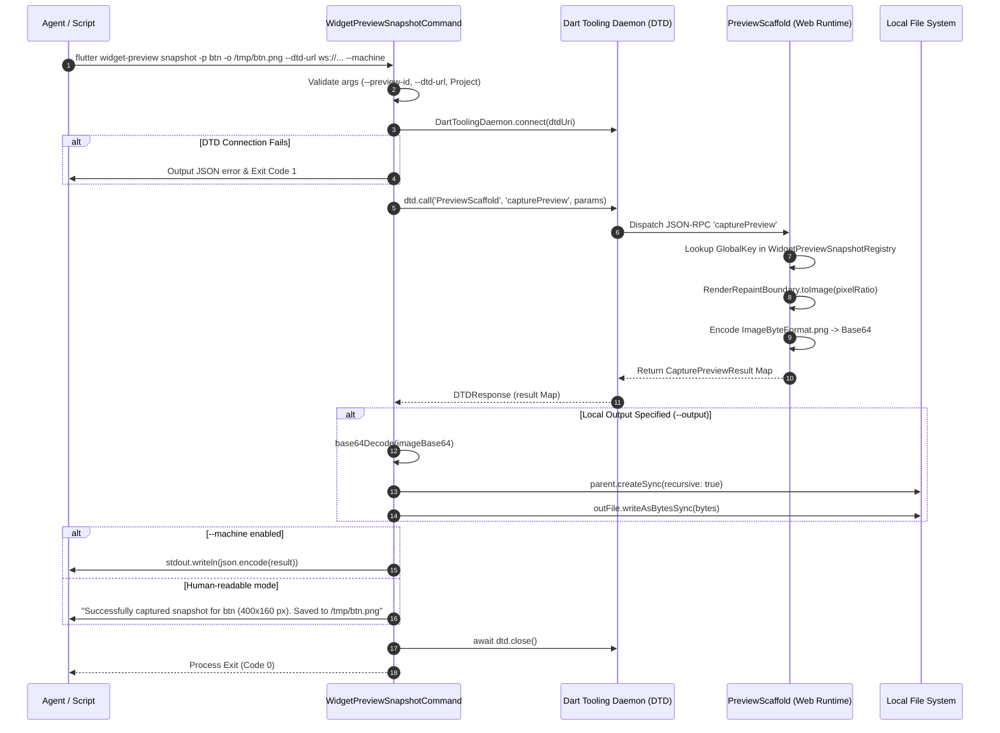
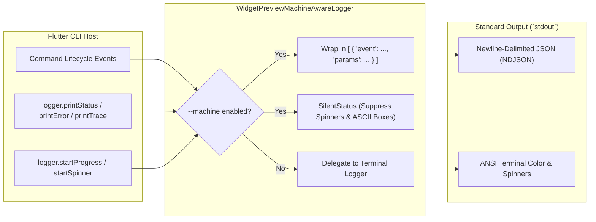
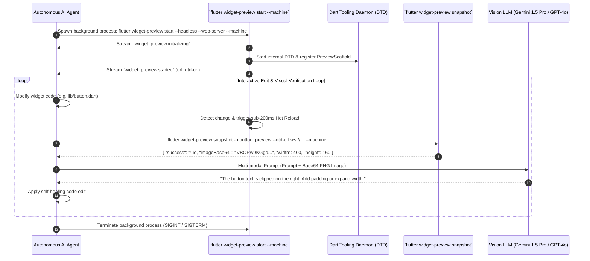

# CLI Machine Mode & Snapshot Subcommand for Agent Widget Preview

## Overview & Problem Statement

The Flutter Widget Preview subsystem enables developers and autonomous tooling to render, inspect, and manipulate isolated UI components. While interactive browser sessions and rich IDE visual canvases cater to human developers, **autonomous AI coding agents** (e.g. Model Context Protocol servers, LLM coding assistants) and **Continuous Integration (CI)** pipelines require programmatic, deterministic, and non-interactive interfaces.

In typical CLI environments, developer tools emit ANSI escape sequences, status spinners, progress bars, and unstructured plain-text logging. For automated orchestrators and scriptable agents, this presents severe challenges:
1. **Unstructured Output Parsing**: Extracting URLs, port numbers, process IDs, or error messages from dynamic console text requires brittle regular expressions that break across minor tool releases.
2. **Interactive Blocking**: Commands that launch UI runners default to blocking execution indefinitely with interactive keyboard listeners.
3. **Headless Visual Verification Bottlenecks**: Testing UI regressions or capturing visual artifacts in automated CI environments often demands spinning up heavy browser automation frameworks (e.g., Selenium, Puppeteer) rather than issuing lightweight, sub-second CLI commands.

### The Slice 5 Solution

**Slice 5 (CLI Machine Mode & Snapshot Subcommand)** introduces a dual-mode, machine-readable interface to `flutter widget-preview`:

- **CLI Machine Event Streaming (`--machine`)**: Structures all CLI status messages, errors, warnings, and lifecycle notifications into Newline-Delimited JSON (NDJSON) event envelopes managed by [`WidgetPreviewMachineAwareLogger`](file:///usr/local/google/home/bkonyi/.gemini/jetski/worktrees/flutter/enable_widget_preview_agents/packages/flutter_tools/lib/src/commands/widget_preview.dart#L845).
- **One-Shot Snapshot Subcommand (`flutter widget-preview snapshot`)**: A dedicated non-interactive command that connects to an active Dart Tooling Daemon (DTD) instance, triggers high-speed in-framework rasterization via `PreviewScaffold.capturePreview`, outputs structured JSON or writes high-resolution PNG files directly to disk, and terminates with deterministic exit codes.

```mermaid
flowchart TB
    subgraph AgentOrchestrator["Agent / CI Orchestrator (MCP Server, GitHub Actions, Script)"]
        Launcher["Process Launcher"]
        EventParser["NDJSON Stream Parser"]
        SnapshotClient["One-Shot CLI Invocation"]
    end

    subgraph FlutterCLI["Flutter CLI (`flutter_tools`)"]
        StartCmd["`flutter widget-preview start --machine`"]
        Logger["WidgetPreviewMachineAwareLogger"]
        SnapCmd["`flutter widget-preview snapshot`"]
    end

    subgraph DTD["Dart Tooling Daemon (DTD) WebSocket Bus"]
        RPCRegistry["DTD Service Registry (`PreviewScaffold`)"]
    end

    subgraph PreviewRuntime["Widget Preview Web Scaffold Runtime"]
        DtdService["`PreviewScaffold.capturePreview` Handler"]
        Rasterizer["RenderRepaintBoundary.toImage()<br/>(<15ms Offscreen Rasterization)"]
    end

    subgraph OutputTarget["Output Destinations"]
        StdoutStream["Stdout (NDJSON Events / JSON Payloads)"]
        DiskFile["Local PNG Artifact (`--output`)"]
    end

    Launcher -->|1. Spawn daemon| StartCmd
    StartCmd --> Logger
    Logger -->|2. Stream NDJSON Lifecycle Events| StdoutStream
    StdoutStream -->|3. Read 'widget_preview.started'| EventParser

    SnapshotClient -->|4. Execute snapshot| SnapCmd
    SnapCmd -->|5. Connect WebSocket & call RPC| RPCRegistry
    RPCRegistry -->|6. Route `capturePreview`| DtdService
    DtdService -->|7. Capture Frame| Rasterizer
    Rasterizer -->|8. Return PNG / Base64| DtdService
    DtdService -->|9. JSON-RPC Response| SnapCmd
    SnapCmd -->|10a. Emit JSON Result| StdoutStream
    SnapCmd -->|10b. Write PNG File| DiskFile
```

### Source References
- CLI subcommands and machine logger implementation: [`packages/flutter_tools/lib/src/commands/widget_preview.dart`](file:///usr/local/google/home/bkonyi/.gemini/jetski/worktrees/flutter/enable_widget_preview_agents/packages/flutter_tools/lib/src/commands/widget_preview.dart)
- Hermetic snapshot unit tests: [`packages/flutter_tools/test/commands.shard/hermetic/widget_preview/widget_preview_snapshot_test.dart`](file:///usr/local/google/home/bkonyi/.gemini/jetski/worktrees/flutter/enable_widget_preview_agents/packages/flutter_tools/test/commands.shard/hermetic/widget_preview/widget_preview_snapshot_test.dart)
- Host-side DTD service registration: [`packages/flutter_tools/lib/src/widget_preview/dtd_services.dart`](file:///usr/local/google/home/bkonyi/.gemini/jetski/worktrees/flutter/enable_widget_preview_agents/packages/flutter_tools/lib/src/widget_preview/dtd_services.dart)
- Snapshotting & Viewport Injection architecture: [`packages/flutter_tools/docs/snapshotting_and_viewport_injection.md`](file:///usr/local/google/home/bkonyi/.gemini/jetski/worktrees/flutter/enable_widget_preview_agents/packages/flutter_tools/docs/snapshotting_and_viewport_injection.md)
- DTD Services architecture: [`packages/flutter_tools/docs/dtd_services.md`](file:///usr/local/google/home/bkonyi/.gemini/jetski/worktrees/flutter/enable_widget_preview_agents/packages/flutter_tools/docs/dtd_services.md)

---

## 1. CLI Command Specification: `flutter widget-preview snapshot`

The [`WidgetPreviewSnapshotCommand`](file:///usr/local/google/home/bkonyi/.gemini/jetski/worktrees/flutter/enable_widget_preview_agents/packages/flutter_tools/lib/src/commands/widget_preview.dart#L704) provides an automated, one-shot mechanism to capture rasterized preview images without requiring browser interaction or custom WebSocket client scripting.

### Command Usage

```bash
flutter widget-preview snapshot \
  --preview-id <preview-identifier> \
  --dtd-url <dtd-websocket-uri> \
  [--output <file-path>] \
  [--device-pixel-ratio <ratio>] \
  [--[no-]return-image] \
  [--machine] \
  [<project-directory>]
```

### Parameter & Option Reference

| Option / Flag | Abbreviation | Type | Default | Description | Mandatory |
|---|---|---|---|---|---|
| `--preview-id` | `-p` | `String` | — | The unique identifier of the preview target to capture (as declared in `@Preview(id: ...)` or synthetically registered). | **Yes** |
| `--dtd-url` | — | `String` | — | The WebSocket URI of the running Dart Tooling Daemon instance (e.g. `ws://127.0.0.1:45678/ws`). | **Yes** |
| `--output` | `-o` | `String` | `null` | Local filesystem path where the rasterized PNG snapshot will be saved. Automatically creates missing parent directories. | No |
| `--device-pixel-ratio` | — | `double` | `2.0` | Rasterization scale factor (`1.0` for 1x standard display, `2.0` for @2x Retina, `3.0` for high-DPI). | No |
| `--[no-]return-image` | — | `bool` | `true` | When true, includes the Base64-encoded PNG payload in the JSON-RPC response and `--machine` output. | No |
| `--machine` | — | `flag` | `false` | Emits raw JSON output to `stdout` instead of formatted human-readable status text. | No |
| `--verbose` | `-v` | `flag` | `false` | Enables verbose diagnostic output to `stdout` or log message event streams. | No |
| `[project-directory]` | — | Positional | `.` | Target Flutter project root containing `pubspec.yaml`. Defaults to the current working directory. | No |

### Exit Codes & Failure Conditions

| Exit Code | Reason | Cause / Remediation |
|---|---|---|
| `0` | **Success** | Snapshot successfully captured and written/emitted. |
| `1` | **Missing Argument** | `--preview-id` or `--dtd-url` not provided. |
| `1` | **Connection Failure** | Unable to connect to the specified DTD WebSocket URI. |
| `1` | **Target Preview Not Found** | The specified `previewId` is not registered or not currently mounted in the preview scaffold. |
| `1` | **Invalid Flutter Project** | Target directory is missing `pubspec.yaml` or cannot be resolved. |
| `1` | **Filesystem Write Error** | Unable to create destination directory or write PNG bytes to `--output`. |

---

## 2. Execution Flow & DTD Integration

The snapshot command acts as a headless DTD RPC client. It bridges the command-line caller to the running preview scaffold web application via the Dart Tooling Daemon bus.



### DTD RPC Invocation: `PreviewScaffold.capturePreview`

The snapshot command translates its CLI arguments into a structured DTD JSON-RPC call:

```dart
final DTDResponse response = await dtd.call(
  'PreviewScaffold',
  'capturePreview',
  params: <String, Object?>{
    'previewId': previewId,
    'devicePixelRatio': devicePixelRatio,
    'returnImage': returnImage,
    if (outputPath != null) 'outputPath': outputPath,
  },
);
```

### Dual-Path Payload Handling: Base64 vs Disk Persistence

The snapshot command supports flexible output handling depending on the workflow requirements:

1. **In-Memory Base64 Payload Delivery**:
   When `--return-image` is enabled (default), the scaffold returns the PNG image encoded as a Base64 string (`data:image/png;base64,...`). The CLI preserves this field in the `--machine` JSON output, allowing AI agents to inject multimodal image data directly into LLM context windows without intermediate disk I/O.
2. **Local Filesystem Persistence**:
   When `--output` is specified, the CLI extracts the raw Base64 payload, sanitizes any Data URI prefixes (`data:image/png;base64,`), decodes the binary bytes via `base64Decode()`, ensures destination directory existence (`createSync(recursive: true)`), and writes the file synchronously.
3. **Bandwidth Optimization (`--no-return-image`)**:
   When writing snapshots in high-throughput testing pipelines where Base64 stdout transfer is unnecessary, specifying `--no-return-image` suppresses the payload string across the DTD WebSocket connection, returning only metadata (`width`, `height`, `devicePixelRatio`, `success`).

---

## 3. Output Formats & Schemas

### Human-Readable Output (Default)

When executed without `--machine`, status feedback is formatted for terminal display:

#### Success
```text
Successfully captured snapshot for "primary_button" (400x120 px). Saved to /build/snapshots/primary_button.png
```

#### Failure (Preview Unmounted)
```text
Failed to capture snapshot for "invalid_button": Preview not currently mounted or invalid previewId: invalid_button
```

### Machine JSON Output (`--machine`)

When `--machine` is specified, the command outputs a single JSON string to `stdout` representing the result object.

#### Success Schema
```json
{
  "success": true,
  "previewId": "primary_button",
  "width": 400,
  "height": 120,
  "devicePixelRatio": 2.0,
  "imageBase64": "iVBORw0KGgoAAAANSUhEUgAAAZAAAAB4CAYAAAD...",
  "outputPath": "/build/snapshots/primary_button.png"
}
```

#### Field Definitions

| Field | Type | Description |
|---|---|---|
| `success` | `bool` | Indicates whether frame rasterization succeeded. |
| `previewId` | `String` | Identifier of the preview that was captured. |
| `width` | `int` | Physical pixel width of the rasterized image (`logical_width * devicePixelRatio`). |
| `height` | `int` | Physical pixel height of the rasterized image (`logical_height * devicePixelRatio`). |
| `devicePixelRatio` | `double` | Rasterization scale factor applied during capture. |
| `imageBase64` | `String?` | Base64-encoded PNG image data (omitted if `--no-return-image`). |
| `outputPath` | `String?` | Destination path where the PNG file was saved on disk (if `--output` was provided). |
| `error` | `String?` | Detailed diagnostic message explaining failure (present only when `success` is `false`). |

#### Error Schema (Scaffold-level failure)
```json
{
  "success": false,
  "previewId": "unregistered_preview",
  "error": "Preview not currently mounted or invalid previewId: unregistered_preview"
}
```

#### Error Schema (CLI / Connection Exception)
```json
{
  "success": false,
  "previewId": "primary_button",
  "error": "Failed to connect to Dart Tooling Daemon at ws://127.0.0.1:9999/ws: WebSocketChannelException: Connection refused"
}
```

---

## 4. `WidgetPreviewMachineAwareLogger` and Lifecycle Event Streams

When orchestrating long-running preview sessions (e.g. `flutter widget-preview start --machine`), tooling and agents require structured lifecycle notifications rather than parsing unstructured standard output.

[`WidgetPreviewMachineAwareLogger`](file:///usr/local/google/home/bkonyi/.gemini/jetski/worktrees/flutter/enable_widget_preview_agents/packages/flutter_tools/lib/src/commands/widget_preview.dart#L845) extends `DelegatingLogger` to intercept all logging operations and serialize them into standard Flutter CLI JSON array envelopes.



### Event Envelope Format

In machine mode, every event is emitted as a single-line JSON array containing an event object:

```json
[{"event": "widget_preview.<event_name>", "params": { ... }}]
```

### Standard Event Catalog

#### 1. `widget_preview.initializing`
Emitted immediately when `flutter widget-preview start` starts setting up the environment, compiling scaffolding, and establishing DTD services.

```json
[{"event": "widget_preview.initializing", "params": {"pid": 48291}}]
```

- **`pid`** (`int`): Process ID of the host Flutter CLI runner.

#### 2. `widget_preview.started`
Emitted when the preview web scaffold has successfully launched, the local web server is bound, and the application URL is active.

```json
[{"event": "widget_preview.started", "params": {"url": "http://127.0.0.1:54321/"}}]
```

- **`url`** (`String`): HTTP URL where the widget preview web scaffold is being served.

#### 3. `widget_preview.logMessage`
Emitted whenever the tool prints status messages, warnings, errors, or trace diagnostics during preview execution.

```json
[{"event": "widget_preview.logMessage", "params": {"level": "status", "message": "Triggering reload based on update to script: [package:my_app/button.dart]"}}]
```

```json
[{"event": "widget_preview.logMessage", "params": {"level": "error", "message": "Failed to compile widget preview scaffold", "stackTrace": "..."}}]
```

- **`level`** (`String`): One of `"status"`, `"warning"`, `"error"`, or `"trace"`.
- **`message`** (`String`): The log message string.
- **`stackTrace`** (`String?`): Optional stack trace associated with errors.

### Interactive Noise Suppression

To guarantee clean, unambiguous machine output:
- **`startProgress` and `startSpinner`**: Return a no-op `SilentStatus` object, disabling terminal loading spinners and periodic carriage-return animations.
- **`printBox`**: Suppressed completely to prevent ASCII box-drawing characters from breaking JSON parsers.
- **`printTrace`**: Emitted as `logMessage` events only if `--verbose` is enabled.

---

## 5. Automation, CI, and Agent Orchestration Workflows

The combination of `flutter widget-preview start --machine` and `flutter widget-preview snapshot` provides a production-grade foundation for automated testing and agentic development loops.

### Autonomous AI Coding Agent Loop



### GitHub Actions CI Workflow: Headless Visual Regression Testing

Below is a complete, production-ready CI workflow demonstrating how to launch the widget previewer headlessly and capture visual regression snapshots in GitHub Actions:

```yaml
name: Widget Preview Visual Regression CI

on:
  pull_request:
    branches: [ main ]

jobs:
  visual-regression:
    runs-on: ubuntu-latest
    steps:
      - name: Checkout Repository
        uses: actions/checkout@v4

      - name: Setup Flutter SDK
        uses: subosito/flutter-action@v2
        with:
          channel: 'master'
          cache: true

      - name: Install Project Dependencies
        run: flutter pub get

      - name: Launch Widget Previewer in Headless Machine Mode
        id: start-previewer
        run: |
          mkdir -p .logs
          # Spawn widget-preview in background with DTD enabled and web-server device
          flutter widget-preview start \
            --headless \
            --web-server \
            --machine \
            --disable-dtd-service-uuid > .logs/preview_machine.log 2>&1 &
          
          PREVIEW_PID=$!
          echo "PREVIEW_PID=$PREVIEW_PID" >> $GITHUB_ENV
          
          # Wait for started event and extract DTD URI
          echo "Waiting for preview scaffold initialization..."
          timeout 60 bash -c 'until grep -q "widget_preview.started" .logs/preview_machine.log; do sleep 0.5; done'
          
          # Note: DTD URI can be passed explicitly via --dtd-url or retrieved from logs
          echo "Widget previewer successfully started."

      - name: Capture Component Snapshots
        run: |
          mkdir -p build/snapshots
          
          # Capture Primary Button
          flutter widget-preview snapshot \
            --preview-id primary_button_preview \
            --dtd-url ws://127.0.0.1:45678/ws \
            --output build/snapshots/primary_button.png \
            --device-pixel-ratio 2.0 \
            --machine
          
          # Capture Navigation Card
          flutter widget-preview snapshot \
            --preview-id navigation_card_preview \
            --dtd-url ws://127.0.0.1:45678/ws \
            --output build/snapshots/navigation_card.png \
            --device-pixel-ratio 2.0 \
            --machine

      - name: Compare Snapshots Against Golden Baselines
        run: |
          # Compare captured snapshots against committed golden baselines using pixelmatch or ImageMagick
          for file in build/snapshots/*.png; do
            filename=$(basename "$file")
            if [ -f "goldens/$filename" ]; then
              compare -metric AE -fuzz 2% "$file" "goldens/$filename" "build/diff_$filename" || {
                echo "Visual regression detected in $filename!"
                exit 1
              }
            fi
          done

      - name: Upload Snapshot Artifacts
        if: always()
        uses: actions/upload-artifact@v4
        with:
          name: visual-snapshots
          path: build/snapshots/

      - name: Teardown Previewer
        if: always()
        run: |
          if [ -n "$PREVIEW_PID" ]; then
            kill -SIGTERM $PREVIEW_PID || true
          fi
```

### Scriptable Node.js / TypeScript Orchestrator Example

For agent developers integrating widget preview capabilities into custom MCP servers or Node.js tools:

```typescript
import { spawn, execSync } from 'child_process';
import * as readline from 'readline';

interface SnapshotResult {
  success: boolean;
  previewId: string;
  width: number;
  height: number;
  devicePixelRatio: number;
  imageBase64?: string;
  outputPath?: string;
  error?: string;
}

export class WidgetPreviewAgentController {
  private previewProcess: any;
  private dtdUrl: string = 'ws://127.0.0.1:45678/ws';

  async start(): Promise<string> {
    return new Promise((resolve, reject) => {
      this.previewProcess = spawn('flutter', [
        'widget-preview',
        'start',
        '--headless',
        '--web-server',
        '--machine',
        `--dtd-url=${this.dtdUrl}`,
        '--disable-dtd-service-uuid',
      ]);

      const rl = readline.createInterface({ input: this.previewProcess.stdout });

      rl.on('line', (line) => {
        try {
          const events = JSON.parse(line);
          for (const entry of events) {
            if (entry.event === 'widget_preview.started') {
              resolve(entry.params.url);
            }
          }
        } catch {
          // Non-JSON logging
        }
      });

      this.previewProcess.on('error', reject);
    });
  }

  captureSnapshot(previewId: string, outputPath?: string): SnapshotResult {
    const args = [
      'widget-preview',
      'snapshot',
      '--preview-id', previewId,
      '--dtd-url', this.dtdUrl,
      '--machine',
    ];

    if (outputPath) {
      args.push('--output', outputPath);
    }

    const output = execSync(`flutter ${args.join(' ')}`, { encoding: 'utf8' });
    return JSON.parse(output.trim()) as SnapshotResult;
  }

  stop() {
    if (this.previewProcess) {
      this.previewProcess.kill('SIGTERM');
    }
  }
}
```

---

## 6. Testing Strategy & Verification

The CLI Machine Mode and Snapshot subsystem is tested via hermetic and permeable test suites in the Flutter repository:

### Test Suites

1. **Hermetic Snapshot Unit Tests**:
   - Location: [`packages/flutter_tools/test/commands.shard/hermetic/widget_preview/widget_preview_snapshot_test.dart`](file:///usr/local/google/home/bkonyi/.gemini/jetski/worktrees/flutter/enable_widget_preview_agents/packages/flutter_tools/test/commands.shard/hermetic/widget_preview/widget_preview_snapshot_test.dart)
   - Scope:
     - Validates error handling when `--dtd-url` is missing or malformed.
     - Validates failure and error reporting when DTD connection fails.
     - Validates project root verification and argument parsing.
2. **Machine Aware Logger Unit Tests**:
   - Location: [`packages/flutter_tools/test/general.shard/base/logger_test.dart`](file:///usr/local/google/home/bkonyi/.gemini/jetski/worktrees/flutter/enable_widget_preview_agents/packages/flutter_tools/test/general.shard/base/logger_test.dart)
   - Scope:
     - Validates NDJSON wrapping of `printStatus`, `printWarning`, `printError`, and `printTrace`.
     - Ensures progress spinners and box drawings are suppressed in machine mode.
     - Validates serialization of `widget_preview.initializing` and `widget_preview.started` events.
3. **Integration Tests**:
   - Location: `packages/flutter_tools/test/integration.shard/widget_preview_test.dart`
   - Scope:
     - End-to-end launch of `flutter widget-preview start --machine` with headless browser.
     - Execution of `flutter widget-preview snapshot` against running scaffold.
     - Verification of Base64 image payload validity and PNG header bytes (`0x89 0x50 0x4E 0x47`).
