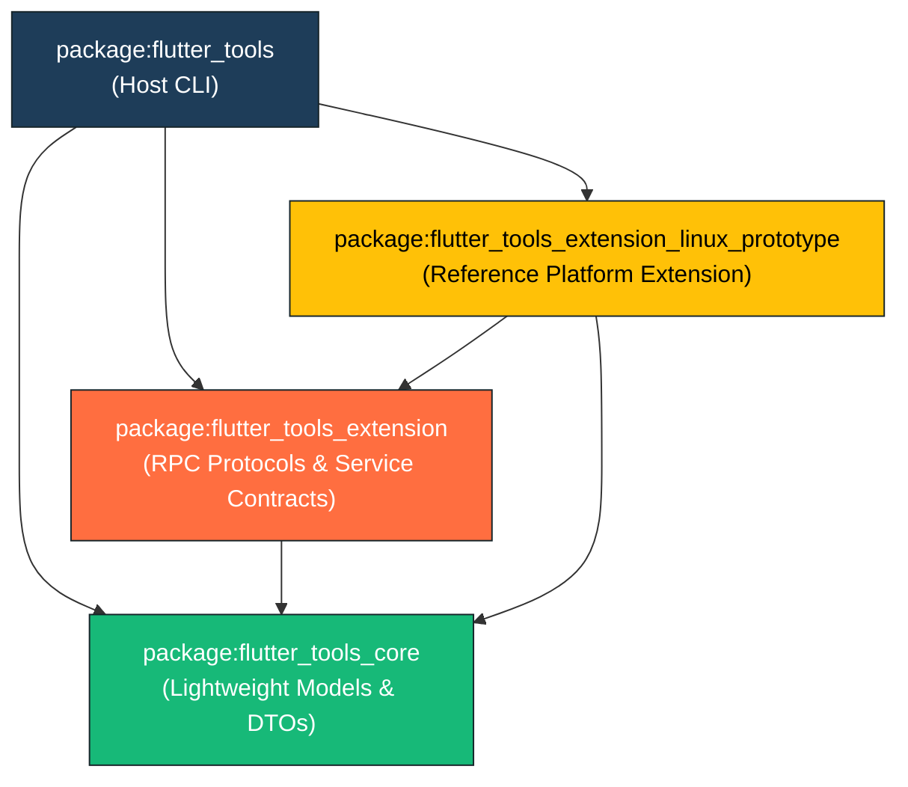
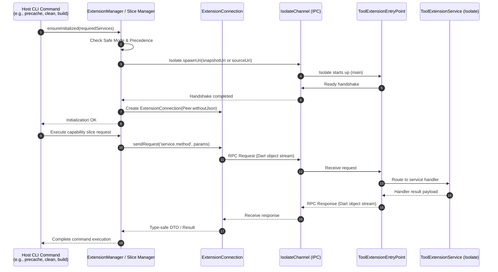

# Flutter Tool Extension System Architecture

This document provides a comprehensive, high-level architectural overview of the **Flutter Tooling Extensibility System**. It details the multi-package hierarchy, isolate execution runtime, JSON-RPC communication protocol, discovery and precedence hierarchy, global registry management, and the complete suite of extension capability slices.

---

## Table of Contents

1. [Executive Summary & Architectural Goals](#executive-summary--architectural-goals)
2. [Multi-Package Workspace Architecture](#multi-package-workspace-architecture)
   - [Workspace Layout & Dependency Boundaries](#workspace-layout--dependency-boundaries)
   - [Package Responsibilities](#package-responsibilities)
3. [Isolate Execution & Communication Runtime](#isolate-execution--communication-runtime)
   - [Isolate Isolation Boundary](#isolate-isolation-boundary)
   - [RPC Protocol: `json_rpc_2` over `IsolateChannel`](#rpc-protocol-json_rpc_2-over-isolatechannel)
   - [High-Performance AppJIT Snapshot Acceleration](#high-performance-appjit-snapshot-acceleration)
4. [Discovery, Scoping & Precedence Hierarchy](#discovery-scoping--precedence-hierarchy)
   - [Multi-Tier Resolution Flow](#multi-tier-resolution-flow)
   - [Workspace Manifests (`flutter_extensions.yaml`)](#workspace-manifests-flutter_extensionsyaml)
   - [Global Extension Registry (`GlobalExtensionRegistry`)](#global-extension-registry-globalextensionregistry)
   - [Safe Mode Bypass (`FLUTTER_NO_EXTENSIONS`)](#safe-mode-bypass-flutter_no_extensions)
5. [CLI Extension Management: `flutter extensions`](#cli-extension-management-flutter-extensions)
   - [Command Suite Overview](#command-suite-overview)
   - [Installation & Compilation Pipeline](#installation--compilation-pipeline)
6. [Extension Capability Slices](#extension-capability-slices)
   - [1. Diagnostics Slice (`DiagnosticsExtension`)](#1-diagnostics-slice-diagnosticsextension)
   - [2. Configuration Slice (`ConfigurationExtension`)](#2-configuration-slice-configurationextension)
   - [3. Device Service Slice (`DeviceService`)](#3-device-service-slice-deviceservice)
   - [4. Build Target Slice (`BuildService`)](#4-build-target-slice-buildservice)
   - [5. Template Service Slice (`TemplateService`)](#5-template-service-slice-templateservice)
   - [6. Custom Platform Plugins Slice](#6-custom-platform-plugins-slice)
   - [7. App Launch & Run Slice](#7-app-launch--run-slice)
   - [8. Artifact Service Slice (`ArtifactService`)](#8-artifact-service-slice-artifactservice)
   - [9. Clean Service Slice (`CleanService`)](#9-clean-service-slice-cleanservice)
7. [System Architecture Diagrams](#system-architecture-diagrams)
   - [High-Level Ecosystem & Subsystem Architecture](#high-level-ecosystem--subsystem-architecture)
   - [Host CLI to Extension Isolate Interaction Model](#host-cli-to-extension-isolate-interaction-model)
8. [Documentation Index & References](#documentation-index--references)

---

## Executive Summary & Architectural Goals

The Flutter Tooling Extensibility system enables first-party and third-party platform authors (such as embedded systems, automotive platforms, alternative desktop environments, and specialized operating systems) to seamlessly integrate custom platform targets into the standard `flutter` CLI without modifying the core Flutter SDK codebase.

### Primary Architectural Objectives

1. **Strict Dependency Decoupling**: Extension authors depend only on lightweight, public, semantically versioned packages (`flutter_tools_core` and `flutter_tools_extension`). They never depend on internal `flutter_tools` implementation classes, eliminating breaking changes from internal CLI refactorings.
2. **Process & State Isolation**: Extensions run within dedicated Dart isolates. A crashing, misbehaving, or slow extension cannot corrupt host CLI memory or leak state across command invocations.
3. **Low Latency & High Performance**: Communication uses binary-capable JSON-RPC over native isolate ports (`Peer.withoutJson` over `IsolateChannel`), avoiding string encoding/decoding overhead. Global extensions are pre-compiled into AppJIT snapshots (`.jit`), eliminating JIT compilation delays.
4. **Deterministic Precedence**: Workspace-level manifests always override machine-global extensions, ensuring reproducible builds across developer machines and CI pipelines.
5. **Emergency Recovery (Safe Mode)**: Instant bypass mechanisms (`--no-extensions`, `FLUTTER_NO_EXTENSIONS=1`) allow developers to disable all extensions immediately if an extension misbehaves.

---

## Multi-Package Workspace Architecture

### Workspace Layout & Dependency Boundaries

The Flutter tool extensibility framework is structured as a **Dart Pub Workspace** rooted at `packages/flutter_tools/pubspec.yaml`:

```
packages/flutter_tools/
├── packages/
│   ├── flutter_tools_core/                 # Lightweight domain models & DTOs
│   ├── flutter_tools_extension/            # JSON-RPC service contracts & isolate protocol
│   └── flutter_tools_extension_linux_prototype/ # Prototype platform extension
├── lib/                                    # Host CLI implementation
│   ├── src/
│   │   ├── commands/                       # CLI commands (extensions, precache, clean, etc.)
│   │   └── experimental/                   # Extension orchestrators & managers
│   └── executable.dart                     # Host CLI entrypoint & DI container
└── pubspec.yaml                            # Workspace root
```



### Package Responsibilities

| Package | Purpose | Exposed Capabilities | Key Dependencies |
|---|---|---|---|
| [`flutter_tools_core`](file:///usr/local/google/home/bkonyi/.gemini/jetski/brain/e6f0353b-1146-45e5-b9b8-c08467d3ff59/.system_generated/worktrees/subagent-Gemini-Tech-Writer-GeminiTechWriter-bab70a0b/packages/flutter_tools/packages/flutter_tools_core) | Data models & DTOs | [`ArtifactDependency`](file:///usr/local/google/home/bkonyi/.gemini/jetski/brain/e6f0353b-1146-45e5-b9b8-c08467d3ff59/.system_generated/worktrees/subagent-Gemini-Tech-Writer-GeminiTechWriter-bab70a0b/packages/flutter_tools/packages/flutter_tools_core/lib/src/artifacts.dart#L9-L96), [`CleanEnvironment`](file:///usr/local/google/home/bkonyi/.gemini/jetski/brain/e6f0353b-1146-45e5-b9b8-c08467d3ff59/.system_generated/worktrees/subagent-Gemini-Tech-Writer-GeminiTechWriter-bab70a0b/packages/flutter_tools/packages/flutter_tools_core/lib/src/clean.dart#L8-L48), `TargetDevice`, `ExtensionBuildTarget`, `ExtensionBuildResult`, `ValidationResult`, `ValidationMessage`, `FeatureFlag`, `ConfigOption`, templates. | `meta` |
| [`flutter_tools_extension`](file:///usr/local/google/home/bkonyi/.gemini/jetski/brain/e6f0353b-1146-45e5-b9b8-c08467d3ff59/.system_generated/worktrees/subagent-Gemini-Tech-Writer-GeminiTechWriter-bab70a0b/packages/flutter_tools/packages/flutter_tools_extension) | RPC contracts & protocol | [`ArtifactService`](file:///usr/local/google/home/bkonyi/.gemini/jetski/brain/e6f0353b-1146-45e5-b9b8-c08467d3ff59/.system_generated/worktrees/subagent-Gemini-Tech-Writer-GeminiTechWriter-bab70a0b/packages/flutter_tools/packages/flutter_tools_extension/lib/src/artifacts.dart#L14-L81), [`CleanService`](file:///usr/local/google/home/bkonyi/.gemini/jetski/brain/e6f0353b-1146-45e5-b9b8-c08467d3ff59/.system_generated/worktrees/subagent-Gemini-Tech-Writer-GeminiTechWriter-bab70a0b/packages/flutter_tools/packages/flutter_tools_extension/lib/src/clean.dart#L14-L49), `DeviceService`, `BuildService`, `DiagnosticsExtension`, `ConfigurationExtension`, `ToolExtensionEntryPoint`, `ToolExtensionService`, `ToolExtensionCapabilities`. | `flutter_tools_core`, `json_rpc_2`, `stream_channel`, `meta` |
| [`flutter_tools_extension_linux_prototype`](file:///usr/local/google/home/bkonyi/.gemini/jetski/brain/e6f0353b-1146-45e5-b9b8-c08467d3ff59/.system_generated/worktrees/subagent-Gemini-Tech-Writer-GeminiTechWriter-bab70a0b/packages/flutter_tools/packages/flutter_tools_extension_linux_prototype) | Prototype platform implementation | Concrete implementation of Linux platform capabilities (devices, build targets, doctor checks, artifacts, clean). | `flutter_tools_core`, `flutter_tools_extension`, `meta` |
| [`flutter_tools`](file:///usr/local/google/home/bkonyi/.gemini/jetski/brain/e6f0353b-1146-45e5-b9b8-c08467d3ff59/.system_generated/worktrees/subagent-Gemini-Tech-Writer-GeminiTechWriter-bab70a0b/packages/flutter_tools) | Host CLI binary | Discovery, isolate spawning, connection caching, client adapters, command routing, UI rendering, safe mode enforcement. | All workspace packages + CLI dependencies |

---

## Isolate Execution & Communication Runtime

### Isolate Isolation Boundary

Extensions execute inside dedicated Dart isolates spawned via `Isolate.spawnUri`. This execution model guarantees:
- **Crash Resilience**: An uncaught exception, memory leak, or fatal error inside an extension isolate does not abort the host Flutter CLI process.
- **Dependency Isolation**: Extensions can depend on different package versions than the host CLI without dependency conflicts or diamond dependency locks.
- **Resource Containment**: Extension isolates can be terminated and cleaned up promptly when commands complete.

### RPC Protocol: `json_rpc_2` over `IsolateChannel`

Communication between the host CLI and extension isolates occurs via bidirectional JSON-RPC 2.0 messages:
- **Transport**: `package:stream_channel` (`IsolateChannel`) connecting a `ReceivePort` and `SendPort`.
- **Peer Framing**: `Peer.withoutJson` from `package:json_rpc_2`. By operating directly over Dart object streams instead of serializing to raw JSON strings, the protocol eliminates string serialization/deserialization overhead and enables passing isolate-native objects (such as `TransferableTypedData` or ports) directly across the channel.

### High-Performance AppJIT Snapshot Acceleration

To eliminate cold-start compilation overhead (which can add 200ms to 600ms of JIT parsing per extension):
1. **Compilation at Install Time**: When an extension is installed or upgraded via `flutter extensions install` or `flutter extensions upgrade`, the CLI compiles the extension entrypoint into an AppJIT snapshot (`.jit`) via:
   ```bash
   dart compile jit-snapshot -o <snapshotPath> <entrypointPath> --train
   ```
2. **Fast-Path Execution**: When [`ExtensionManager`](file:///usr/local/google/home/bkonyi/.gemini/jetski/brain/e6f0353b-1146-45e5-b9b8-c08467d3ff59/.system_generated/worktrees/subagent-Gemini-Tech-Writer-GeminiTechWriter-bab70a0b/packages/flutter_tools/lib/src/experimental/extension_manager.dart) spawns the isolate, it targets `snapshotPath`. Snapshot startup takes **under 30ms**.
3. **Resilient Source Fallback**: If the snapshot is missing, corrupt, or compiled under a different Dart SDK version (`entry.dartSdkVersion != platform.version`), [`ExtensionManager`](file:///usr/local/google/home/bkonyi/.gemini/jetski/brain/e6f0353b-1146-45e5-b9b8-c08467d3ff59/.system_generated/worktrees/subagent-Gemini-Tech-Writer-GeminiTechWriter-bab70a0b/packages/flutter_tools/lib/src/experimental/extension_manager.dart) automatically falls back to spawning directly from source (`entrypointPath`), ensuring commands never fail due to stale snapshots.

---

## Discovery, Scoping & Precedence Hierarchy

### Multi-Tier Resolution Flow

When a Flutter command runs, extensions are discovered and filtered through a deterministic multi-tier pipeline:

```
+-------------------------------------------------------------------------------+
| 1. Safe Mode Audit                                                            |
|    - FLUTTER_NO_EXTENSIONS=1 or --no-extensions                               |
|    - If active: Bypass ALL extensions completely                              |
+---------------------------------------+---------------------------------------+
                                        | (Not in safe mode)
                                        v
+-------------------------------------------------------------------------------+
| 2. Workspace Manifest Discovery                                               |
|    - Search upwards for flutter_extensions.yaml                               |
|    - Parse declared extensions into workspaceDeclarations                     |
+---------------------------------------+---------------------------------------+
                                        |
                                        v
+-------------------------------------------------------------------------------+
| 3. Global Extension Registry                                                  |
|    - Load $DART_DATA_HOME/flutter_tool_extensions/extension_registry.json     |
|    - Parse global extension entries                                           |
+---------------------------------------+---------------------------------------+
                                        |
                                        v
+-------------------------------------------------------------------------------+
| 4. Precedence & Scoping Merging                                               |
|    - Rule: If workspace contains extension 'foo', global 'foo' is SKIPPED     |
|    - Rule: If global extension is disabled ('enabled: false'), SKIP          |
+---------------------------------------+---------------------------------------+
                                        |
                                        v
+-------------------------------------------------------------------------------+
| 5. Capability & Platform Filtering                                            |
|    - Filter by Host OS: extension must support current host platform          |
|    - Filter by Required Services: only spawn if extension provides service    |
+---------------------------------------+---------------------------------------+
                                        |
                                        v
+-------------------------------------------------------------------------------+
| 6. Isolate Spawning & Connection                                              |
|    - If valid AppJIT snapshot exists -> Spawn from .jit                       |
|    - Else -> Fallback and spawn from .dart source                             |
|    - Perform JSON-RPC handshake & register connection                         |
+-------------------------------------------------------------------------------+
```

### Workspace Manifests (`flutter_extensions.yaml`)

Projects declare local extensions in a `flutter_extensions.yaml` manifest in their root directory:

```yaml
extensions:
  - name: custom_linux
    path: ../extensions/custom_linux
    entrypoint: bin/custom_linux.dart
```

### Global Extension Registry (`GlobalExtensionRegistry`)

Globally installed extensions are tracked in:
```
$DART_DATA_HOME/flutter_tool_extensions/extension_registry.json
```
(Falling back to `$HOME/.flutter_tool_extensions/extension_registry.json` or `%USERPROFILE%\.flutter_tool_extensions\extension_registry.json`).

The registry records the extension name, version, source type (`path`, `pub`, or `git`), installation directory, entrypoint path, compiled snapshot path, enabled flag, capabilities, and the Dart SDK version.

### Safe Mode Bypass (`FLUTTER_NO_EXTENSIONS`)

Safe mode provides an immediate, foolproof bypass:
- **CLI Flags**: `--no-extensions`, `--no-tool-extensions`, `--extensions=false`, `--tool-extensions=false`.
- **Environment Variable**: `FLUTTER_NO_EXTENSIONS=1`, `true`, `yes`.

Evaluated before argument parsing completes, safe mode ensures that a broken extension can never lock a developer out of running `flutter clean`, `flutter doctor`, or `flutter extensions uninstall`.

---

## CLI Extension Management: `flutter extensions`

### Command Suite Overview

The `flutter extensions` command group provides comprehensive lifecycle management:

```bash
# List all globally installed extensions
flutter extensions list
flutter extensions list --machine

# Install an extension from path, pub, or git
flutter extensions install ../path/to/my_extension
flutter extensions install pub:my_extension
flutter extensions install git:https://github.com/example/my_extension.git

# Disable or re-enable an extension
flutter extensions disable my_extension
flutter extensions enable my_extension

# Upgrade one or all extensions (recompiles AppJIT snapshots)
flutter extensions upgrade my_extension
flutter extensions upgrade

# Uninstall an extension and delete its scaffolding directory
flutter extensions uninstall my_extension
```

### Installation & Compilation Pipeline

When `flutter extensions install <source>` executes:
1. **Source Detection**: Determines whether the source is a local directory (`path`), a pub package (`pub`), or a Git repository (`git`).
2. **Scaffolding Creation**: Creates `$registryDir/<name>/` and writes a scaffolding `pubspec.yaml` referencing the extension.
3. **Entrypoint Generation**: Generates `bin/generated_entrypoint.dart` with a `--train` bypass hook.
4. **Pub Resolution**: Executes `dart pub get` to download and resolve dependencies.
5. **AppJIT Compilation**: Compiles `bin/generated_entrypoint.jit` using `dart compile jit-snapshot ... --train`.
6. **Capability Query**: Spawns a temporary isolate from the snapshot, performs a handshake, extracts [`ToolExtensionCapabilities`](file:///usr/local/google/home/bkonyi/.gemini/jetski/brain/e6f0353b-1146-45e5-b9b8-c08467d3ff59/.system_generated/worktrees/subagent-Gemini-Tech-Writer-GeminiTechWriter-bab70a0b/packages/flutter_tools/packages/flutter_tools_extension/lib/src/protocol_base/service.dart), and saves the entry to `extension_registry.json`.

---

## Extension Capability Slices

The extensibility system organizes features into modular **capability slices**. Each slice defines:
- A core DTO in `flutter_tools_core`.
- A service interface in `flutter_tools_extension`.
- A manager and client proxy in `flutter_tools`.

### 1. Diagnostics Slice (`DiagnosticsExtension`)
- **CLI Integration**: `flutter doctor`.
- **Protocol**: `DiagnosticsExtension` defines `diagnostics.getValidators` and `diagnostics.validate`.
- **Functionality**: Allows extensions to inject custom doctor checks (e.g., verifying custom SDK paths, Linux packages, or hardware devices). Returns [`ValidationResult`](file:///usr/local/google/home/bkonyi/.gemini/jetski/brain/e6f0353b-1146-45e5-b9b8-c08467d3ff59/.system_generated/worktrees/subagent-Gemini-Tech-Writer-GeminiTechWriter-bab70a0b/packages/flutter_tools/packages/flutter_tools_core/lib/src/diagnostics.dart) data objects formatted by the host CLI.

### 2. Configuration Slice (`ConfigurationExtension`)
- **CLI Integration**: `flutter config`.
- **Protocol**: `ConfigurationExtension` defines `config.getConfigOptions` and `config.getFeatureFlags`.
- **Functionality**: Enables extensions to register custom feature flags and configuration settings that can be queried or toggled via `flutter config`.

### 3. Device Service Slice (`DeviceService`)
- **CLI Integration**: `flutter devices`, `flutter run`, `flutter attach`.
- **Protocol**: `DeviceService` defines `device.discoverDevices`, `device.startApp`, `device.stopApp`.
- **Functionality**: Discovers custom target devices represented by [`TargetDevice`](file:///usr/local/google/home/bkonyi/.gemini/jetski/brain/e6f0353b-1146-45e5-b9b8-c08467d3ff59/.system_generated/worktrees/subagent-Gemini-Tech-Writer-GeminiTechWriter-bab70a0b/packages/flutter_tools/packages/flutter_tools_core/lib/src/devices.dart) and exposes them to the Flutter device manager as [`ExtensionBackedDevice`](file:///usr/local/google/home/bkonyi/.gemini/jetski/brain/e6f0353b-1146-45e5-b9b8-c08467d3ff59/.system_generated/worktrees/subagent-Gemini-Tech-Writer-GeminiTechWriter-bab70a0b/packages/flutter_tools/lib/src/experimental/extension_device_manager.dart) instances.

### 4. Build Target Slice (`BuildService`)
- **CLI Integration**: `flutter build <target>`, `flutter assemble`.
- **Protocol**: `BuildService` defines `build.getTargets` and `build.buildTarget`.
- **Functionality**: Injects custom build subcommands dynamically into `flutter build` (e.g. `flutter build custom-linux`) and integrates with the Flutter build system graph.

### 5. Template Service Slice (`TemplateService`)
- **CLI Integration**: `flutter create --template=<name>`.
- **Protocol**: `TemplateService` defines `template.getTemplates` and `template.renderTemplate`.
- **Functionality**: Extends `flutter create` with custom project templates. Dynamically rebuilds the `flutter create` `ArgParser` to accept extension template options.

### 6. Custom Platform Plugins Slice
- **Integration**: Flutter plugin build pipeline.
- **Functionality**: Allows extensions to register platform plugin bindings for out-of-tree platforms in `pubspec.yaml`, enabling Flutter apps to consume plugins tailored to custom targets.

### 7. App Launch & Run Slice
- **CLI Integration**: `flutter run -d <custom-device>`.
- **Functionality**: Manages application launch, VM service URI discovery, port forwarding, and hot reload/hot restart forwarding over the RPC channel.

### 8. Artifact Service Slice (`ArtifactService`)
- **CLI Integration**: `flutter precache`, `flutter build`, `flutter run`.
- **Protocol**: `ArtifactService` defines `artifact.getArtifacts` and `artifact.downloadArtifacts`.
- **Security**: Mandatory SHA-256 cryptographic validation prevents execution of corrupted or tampered binaries. Downloaded files failing verification are deleted immediately.
- **Dynamic Precache**: `--[no-]tool-extension-artifacts` controls whether extension artifacts are downloaded during `flutter precache`.

### 9. Clean Service Slice (`CleanService`)
- **CLI Integration**: `flutter clean`.
- **Protocol**: `CleanService` defines `clean.clean` passing [`CleanEnvironment`](file:///usr/local/google/home/bkonyi/.gemini/jetski/brain/e6f0353b-1146-45e5-b9b8-c08467d3ff59/.system_generated/worktrees/subagent-Gemini-Tech-Writer-GeminiTechWriter-bab70a0b/packages/flutter_tools/packages/flutter_tools_core/lib/src/clean.dart#L8-L48) (`buildDir`, `projectRoot`).
- **Fault-Tolerant Execution**: In [`ExtensionCleanManager`](file:///usr/local/google/home/bkonyi/.gemini/jetski/brain/e6f0353b-1146-45e5-b9b8-c08467d3ff59/.system_generated/worktrees/subagent-Gemini-Tech-Writer-GeminiTechWriter-bab70a0b/packages/flutter_tools/lib/src/experimental/extension_clean_manager.dart#L18-L59), all extension clean invocations are isolated inside guarded `try / catch` blocks so that a failing or hanging extension cannot abort the overall clean operation.

---

## System Architecture Diagrams

### High-Level Ecosystem & Subsystem Architecture

```
+-----------------------------------------------------------------------------------------+
|                                    FLUTTER TOOLS HOST                                   |
|                                                                                         |
|  +-----------------------------------------------------------------------------------+  |
|  |                              FlutterCommandRunner                                 |  |
|  |  (Evaluates --no-extensions, FLUTTER_NO_EXTENSIONS=1, and command-line arguments)   |  |
|  +-----------------------------------------+-----------------------------------------+  |
|                                            |                                            |
|                                            v                                            |
|  +-----------------------------------------------------------------------------------+  |
|  |                                  executable.dart                                  |  |
|  |  (Instantiates managers via explicit constructor injection; NO AppContext leaks)  |  |
|  +----+-----------------+------------------+------------------+-----------------+----+  |
|       |                 |                  |                  |                 |       |
|       v                 v                  v                  v                 v       |
|  +---------+     +--------------+    +------------+    +-------------+    +----------+  |
|  |Extension|     |GlobalExtReg  |    |ExtArtifact |    |  ExtClean   |    | ExtBuild |  |
|  | Manager |     |(CLI Registry)|    |  Manager   |    |   Manager   |    | Manager  |  |
|  +----+----+     +-------+------+    +-----+------+    +------+------+    +----+-----+  |
|       |                  |                 |                  |                |        |
|       |   Resolves       | Spawns &        | Queries &        | Invokes        | Injects|
|       |   Precedence     | Compiles        | Verifies         | Clean          | Build  |
|       |                  v                 v                  v                v        |
|  +----+------------------------------------------------------------------------+----+  |
|  |                             ExtensionConnection                                   |  |
|  |                     (json_rpc_2 Peer.withoutJson Client)                          |  |
|  +-----------------------------------------+-----------------------------------------+  |
+--------------------------------------------|--------------------------------------------+
                                             |
                          IsolateChannel / SendPort / ReceivePort
                                             |
+--------------------------------------------|--------------------------------------------+
|                                            v                                            |
|  +-----------------------------------------------------------------------------------+  |
|  |                           ToolExtensionEntryPoint                                 |  |
|  |                     (json_rpc_2 Peer.withoutJson Server)                          |  |
|  +----+-----------------+------------------+------------------+-----------------+----+  |
|       |                 |                  |                  |                 |       |
|       v                 v                  v                  v                 v       |
|  +---------+     +--------------+    +------------+    +-------------+    +----------+  |
|  |Diagnostics    |Configuration |    |   Device   |    |   Artifact  |    |  Clean   |  |
|  | Extension     |  Extension   |    |  Service   |    |   Service   |    | Service  |  |
|  +---------+     +--------------+    +------------+    +-------------+    +----------+  |
|                                                                                         |
|                                EXTENSION DART ISOLATE                                   |
+-----------------------------------------------------------------------------------------+
```

### Host CLI to Extension Isolate Interaction Model



---

## Documentation Index & References

For in-depth specifications of individual subsystems, refer to the following companion documents:

- **[Artifact & Clean Services Architecture](artifact_and_clean_services.md)**: Details `ArtifactService`, `ArtifactDependency`, SHA-256 cryptographic verification, dynamic precache, `CleanService`, `CleanEnvironment`, and fault-tolerant clean integration.
- **[Global Extension CLI & Registry Architecture](global_extension_cli_and_registry.md)**: Details `GlobalExtensionRegistry`, `extension_registry.json` storage schema, the `flutter extensions` CLI command suite, AppJIT snapshot compilation, and safe mode bypass.
- **[Extensibility Pub Workspace Architecture](architecture/extensibility_workspace.md)**: Details workspace multi-package structure, dependency rules, and architectural decoupling rationale.
- **[Protocol & Isolate Runner Architecture](architecture/protocol_and_isolate_runner.md)**: Details `IsolateChannel`, `Peer.withoutJson` transport, handshake protocol, and connection lifecycles.
- **[Diagnostics Slice Architecture](architecture/diagnostics_slice.md)**: Details `DiagnosticsExtension`, `ValidationResult`, and `flutter doctor` integration.
- **[Configuration Slice Architecture](architecture/configuration_slice.md)**: Details `ConfigurationExtension`, `FeatureFlag`, `ConfigOption`, and `flutter config` integration.
- **[Device Service Slice Architecture](architecture/device_service_slice.md)**: Details `DeviceService`, `TargetDevice`, `ExtensionBackedDevice`, and `flutter devices` discovery.
- **[Build Target Slice Architecture](architecture/build_target_slice.md)**: Details `BuildService`, `ExtensionBuildTarget`, and dynamic `flutter build` subcommands.
- **[Templates Slice Architecture](architecture/templates_slice.md)**: Details `TemplateService`, dynamic `ArgParser` reconstruction, and `flutter create` templates.
- **[Plugins Slice Architecture](architecture/plugins_slice.md)**: Details custom platform plugin injection and pubspec platform definitions.
- **[App Launch & Hot Reload Slice Architecture](architecture/app_launch_and_hot_reload_slice.md)**: Details application launch, VM service discovery, hot reload, and hot restart.
- **[Extension Authoring Guide](guides/extension_authoring_guide.md)**: Step-by-step developer tutorial for building and publishing Flutter tool extensions.
