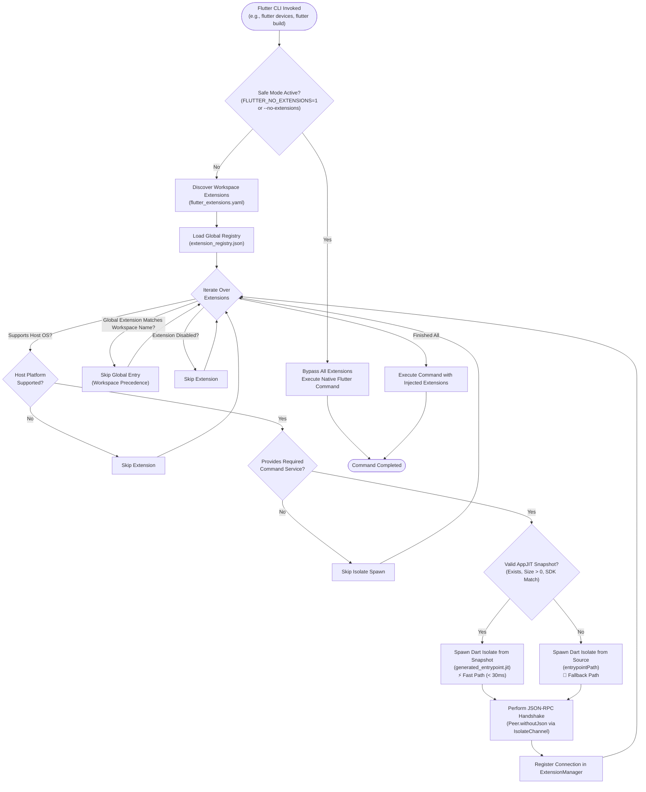

# Global Extension Registry and CLI Management Architecture

This document details the architectural specification, storage schema, AppJIT snapshot compilation pipeline, CLI management suite, precedence hierarchy, and safe-mode controls for globally installed Flutter Tool Extensions.

---

## Table of Contents

1. [Overview & Architectural Context](#overview--architectural-context)
2. [GlobalExtensionRegistry Specification](#globalextensionregistry-specification)
   - [Architectural Role & Location Resolution](#architectural-role--location-resolution)
   - [Storage Schema: `extension_registry.json`](#storage-schema-extension_registryjson)
   - [Domain Model: `GlobalExtensionEntry`](#domain-model-globalextensionentry)
   - [Registry Management API](#registry-management-api)
3. [AppJIT Snapshot Compilation Pipeline](#appjit-snapshot-compilation-pipeline)
   - [The Cold-Start Latency Challenge](#the-cold-start-latency-challenge)
   - [Compilation Pipeline Architecture](#compilation-pipeline-architecture)
   - [Generated Entrypoint & Training Hook (`--train`)](#generated-entrypoint--training-hook---train)
   - [Snapshot Validation & Resilient Source Fallback](#snapshot-validation--resilient-source-fallback)
4. [The `flutter extensions` CLI Command Suite](#the-flutter-extensions-cli-command-suite)
   - [`flutter extensions list`](#flutter-extensions-list)
   - [`flutter extensions install <source>`](#flutter-extensions-install-source)
   - [`flutter extensions uninstall <name>`](#flutter-extensions-uninstall-name)
   - [`flutter extensions enable <name>`](#flutter-extensions-enable-name)
   - [`flutter extensions disable <name>`](#flutter-extensions-disable-name)
   - [`flutter extensions upgrade [<name>]`](#flutter-extensions-upgrade-name)
5. [Scoping & Precedence Hierarchy](#scoping--precedence-hierarchy)
   - [Resolution Ordering](#resolution-ordering)
   - [Workspace Override Semantics](#workspace-override-semantics)
   - [Platform & Capability Filtering](#platform--capability-filtering)
6. [Safe Mode Bypass Mechanics](#safe-mode-bypass-mechanics)
   - [Emergency Disabling Rationale](#emergency-disabling-rationale)
   - [CLI Flags & Environment Overrides](#cli-flags--environment-overrides)
   - [Early Command Runner Evaluation](#early-command-runner-evaluation)
7. [System Architecture & Lifecycle Flowcharts](#system-architecture--lifecycle-flowcharts)
   - [Global Extension Installation & Compilation Flowchart](#global-extension-installation--compilation-flowchart)
   - [Command Invocation & Resolution Flowchart](#command-invocation--resolution-flowchart)

---

## Overview & Architectural Context

Flutter Tool Extensions allow external packages to augment the Flutter CLI with new target devices, custom build targets, doctor validators, configuration options, and project templates. Extensions can be declared at two distinct scopes:
1. **Workspace Scope**: Declared within a project or workspace via `flutter_extensions.yaml`. These extensions are tied to a specific project repository.
2. **Global Scope**: Installed system-wide on the developer machine and managed via the `flutter extensions` command suite. Globally installed extensions are available across all Flutter projects executed by the developer.

To manage global extensions reliably, the extensibility architecture implements:
- **`GlobalExtensionRegistry`**: Manages on-disk state, installation scaffolding, dependency resolution, AppJIT snapshot compilation, and status persistence.
- **`ExtensionsCommand`**: A unified CLI command group providing lifecycle subcommands (`list`, `install`, `uninstall`, `enable`, `disable`, and `upgrade`).
- **AppJIT Snapshot Pipeline**: Pre-compiles extension Dart source into AppJIT bytecode snapshots to eliminate JIT compilation latency during CLI command execution.
- **Deterministic Precedence Hierarchy**: Guarantees that local workspace declarations always override global extensions of the same name.
- **Safe Mode Bypass**: Provides instant command-line and environment variable escape hatches to disable extensions during debugging or emergency recovery.

---

## GlobalExtensionRegistry Specification

### Architectural Role & Location Resolution

Located in [`packages/flutter_tools/lib/src/experimental/extension_registry.dart`](file:///usr/local/google/home/bkonyi/.gemini/jetski/brain/e6f0353b-1146-45e5-b9b8-c08467d3ff59/.system_generated/worktrees/subagent-Gemini-Tech-Writer-GeminiTechWriter-bab70a0b/packages/flutter_tools/lib/src/experimental/extension_registry.dart), [`GlobalExtensionRegistry`](file:///usr/local/google/home/bkonyi/.gemini/jetski/brain/e6f0353b-1146-45e5-b9b8-c08467d3ff59/.system_generated/worktrees/subagent-Gemini-Tech-Writer-GeminiTechWriter-bab70a0b/packages/flutter_tools/lib/src/experimental/extension_registry.dart#L130-L636) governs the persistent state of all globally installed extensions.

#### Directory Resolution Algorithm

The root directory for global extensions (`registryDir`) is resolved using the following order:

```dart
// packages/flutter_tools/lib/src/experimental/extension_registry.dart
Directory get registryDir {
  if (_customRegistryDir != null) {
    return _customRegistryDir;
  }
  if (_platform.environment[kDartDataHomeEnvKey] case final String dataHome
      when dataHome.trim().isNotEmpty) {
    return _fs.directory(dataHome.trim()).childDirectory(kDefaultDirName);
  }
  final String? home = _platform.isWindows
      ? (_platform.environment['USERPROFILE'] ?? _platform.environment['HOME'])
      : (_platform.environment['HOME'] ?? _platform.environment['USERPROFILE']);
  if (home != null && home.trim().isNotEmpty) {
    return _fs.directory(home.trim()).childDirectory('.$kDefaultDirName');
  }
  return _fs.systemTempDirectory.childDirectory('.$kDefaultDirName');
}
```

1. **Explicit Custom Directory**: Passed via `customRegistryDir` constructor parameter (primarily used in unit and integration testing).
2. **`DART_DATA_HOME` Environment Variable**: If defined and non-empty, resolves to `$DART_DATA_HOME/flutter_tool_extensions/`.
3. **User Home Directory Fallback**:
   - **Windows**: `%USERPROFILE%\.flutter_tool_extensions` (falling back to `%HOME%`).
   - **POSIX (macOS / Linux)**: `$HOME/.flutter_tool_extensions` (falling back to `$USERPROFILE`).
4. **System Temporary Directory Fallback**: `$TEMP/.flutter_tool_extensions` if no home directory is configured.

The registry metadata file is stored directly under the registry directory as:
```
$registryDir/extension_registry.json
```

---

### Storage Schema: `extension_registry.json`

The registry file uses a structured JSON schema:

```json
{
  "version": 1,
  "extensions": {
    "custom_linux": {
      "name": "custom_linux",
      "version": "1.2.0",
      "source": "path",
      "installDir": "/home/user/.flutter_tool_extensions/custom_linux",
      "entrypointPath": "/home/user/.flutter_tool_extensions/custom_linux/bin/generated_entrypoint.dart",
      "snapshotPath": "/home/user/.flutter_tool_extensions/custom_linux/bin/generated_entrypoint.jit",
      "enabled": true,
      "capabilities": {
        "extensionName": "custom_linux",
        "services": [
          "artifact",
          "clean",
          "config",
          "device",
          "diagnostics"
        ],
        "supportedPlatforms": [
          "linux"
        ]
      },
      "dartSdkVersion": "3.11.0-16.0.dev (build 3.11.0-16.0.dev)"
    }
  }
}
```

#### JSON Schema Field Breakdown

| JSON Key | Type | Description |
|---|---|---|
| `version` | `int` | Schema version number (currently `1`). Enables future forward/backward compatibility migrations. |
| `extensions` | `Map<String, Object?>` | Map of unique extension names to their installation records. |
| `extensions.<name>.name` | `string` | The unique name identifying the tool extension. |
| `extensions.<name>.version` | `string` | The resolved semantic version string. |
| `extensions.<name>.source` | `string` | Source type: `'path'`, `'pub'`, or `'git'`. |
| `extensions.<name>.installDir` | `string` | Absolute path to the extension's scaffolding directory. |
| `extensions.<name>.entrypointPath` | `string` | Absolute path to the Dart source entrypoint (`generated_entrypoint.dart`). |
| `extensions.<name>.snapshotPath` | `string?` | Absolute path to the pre-compiled AppJIT snapshot (`generated_entrypoint.jit`). |
| `extensions.<name>.enabled` | `bool` | Current activation state (`true` if active, `false` if disabled). |
| `extensions.<name>.capabilities` | `object` | Serialized [`ToolExtensionCapabilities`](file:///usr/local/google/home/bkonyi/.gemini/jetski/brain/e6f0353b-1146-45e5-b9b8-c08467d3ff59/.system_generated/worktrees/subagent-Gemini-Tech-Writer-GeminiTechWriter-bab70a0b/packages/flutter_tools/packages/flutter_tools_extension/lib/src/protocol_base/service.dart) object detailing supported services and host platforms. |
| `extensions.<name>.dartSdkVersion` | `string` | The exact Dart SDK version string used to compile the AppJIT snapshot. |

---

### Domain Model: `GlobalExtensionEntry`

Defined in [`packages/flutter_tools/lib/src/experimental/extension_registry.dart`](file:///usr/local/google/home/bkonyi/.gemini/jetski/brain/e6f0353b-1146-45e5-b9b8-c08467d3ff59/.system_generated/worktrees/subagent-Gemini-Tech-Writer-GeminiTechWriter-bab70a0b/packages/flutter_tools/lib/src/experimental/extension_registry.dart#L21-L127), [`GlobalExtensionEntry`](file:///usr/local/google/home/bkonyi/.gemini/jetski/brain/e6f0353b-1146-45e5-b9b8-c08467d3ff59/.system_generated/worktrees/subagent-Gemini-Tech-Writer-GeminiTechWriter-bab70a0b/packages/flutter_tools/lib/src/experimental/extension_registry.dart#L21-L127) is an immutable representation of an installed extension:

```dart
class GlobalExtensionEntry {
  const GlobalExtensionEntry({
    required this.capabilities,
    required this.dartSdkVersion,
    required this.enabled,
    required this.entrypointPath,
    required this.installDir,
    required this.name,
    required this.source,
    required this.version,
    this.snapshotPath,
  });

  final ToolExtensionCapabilities capabilities;
  final String dartSdkVersion;
  final bool enabled;
  final String entrypointPath;
  final String installDir;
  final String name;
  final String? snapshotPath;
  final String source;
  final String version;

  GlobalExtensionEntry copyWith({ ... });
  Map<String, Object?> toJson() => ...;
  static GlobalExtensionEntry? fromJson(Map<String, Object?> json) => ...;
}
```

---

### Registry Management API

[`GlobalExtensionRegistry`](file:///usr/local/google/home/bkonyi/.gemini/jetski/brain/e6f0353b-1146-45e5-b9b8-c08467d3ff59/.system_generated/worktrees/subagent-Gemini-Tech-Writer-GeminiTechWriter-bab70a0b/packages/flutter_tools/lib/src/experimental/extension_registry.dart#L130-L636) provides synchronous and asynchronous methods for registry mutations:

```dart
// Synchronous state queries and mutations
Map<String, GlobalExtensionEntry> loadEntries();
void saveEntries(Map<String, GlobalExtensionEntry> entries);
GlobalExtensionEntry? getEntry(String name);
bool hasExtension(String name);
void register(GlobalExtensionEntry entry);
bool unregister(String name);
bool setEnabled(String name, bool enabled);
bool enable(String name);
bool disable(String name);

// Asynchronous lifecycle pipelines
Future<GlobalExtensionEntry> install({
  required String source,
  String? dartBinaryPath,
  String? name,
  String? version,
});

Future<bool> uninstall(String name);

Future<List<GlobalExtensionEntry>> upgrade({
  String? dartBinaryPath,
  String? name,
});
```

---

## AppJIT Snapshot Compilation Pipeline

### The Cold-Start Latency Challenge

Every Flutter CLI invocation (e.g. `flutter devices`, `flutter precache`, `flutter doctor`) is an ephemeral command where process startup time directly impacts developer perceived latency. Spawning a Dart isolate from raw source files (`.dart`) requires the Dart VM to:
1. Parse dozens of transitive Dart files.
2. Build kernel ASTs (`.dill`).
3. JIT-compile entrypoint code.

For multiple active extensions, this JIT parsing overhead incurs a cumulative delay of **200ms to 600ms** before commands begin execution.

### Compilation Pipeline Architecture

To achieve near-instantaneous isolate spawning, [`GlobalExtensionRegistry`](file:///usr/local/google/home/bkonyi/.gemini/jetski/brain/e6f0353b-1146-45e5-b9b8-c08467d3ff59/.system_generated/worktrees/subagent-Gemini-Tech-Writer-GeminiTechWriter-bab70a0b/packages/flutter_tools/lib/src/experimental/extension_registry.dart#L130-L636) implements an automated **AppJIT snapshot compilation pipeline** during `install` and `upgrade`.

```
  Source Path / Pub / Git
             │
             ▼
   [ Scaffold Package ] ──────────► Create $registryDir/<name>/pubspec.yaml
             │
             ▼
   [ Generate Entrypoint ] ───────► Create $registryDir/<name>/bin/generated_entrypoint.dart
             │
             ▼
   [ dart pub get ] ──────────────► Resolve dependencies into package_config.json
             │
             ▼
   [ dart compile jit-snapshot ] ─► dart compile jit-snapshot -o <path>.jit <entrypoint>.dart --train
             │
             ▼
   [ Probe Capabilities ] ────────► Spawn isolate from snapshot once, read capabilities
             │
             ▼
   [ Save to Registry ] ──────────► Write entry to extension_registry.json
```

#### Pipeline Steps

1. **Scaffold Package Directory**:
   Creates `$registryDir/<name>/` and writes a dedicated `pubspec.yaml` with the resolved dependency declaration:
   ```yaml
   name: <name>_scaffold
   description: Scaffolding package for global tool extension <name>.
   version: 1.0.0
   environment:
     sdk: '>=3.0.0 <4.0.0'
   dependencies:
     <name>: ...
   ```
2. **Generate Entrypoint Wrapper**:
   Generates `$registryDir/<name>/bin/generated_entrypoint.dart`.
3. **Execute Dependency Resolution**:
   Runs `dart pub get` inside the scaffolding directory using `ProcessManager`.
4. **Compile AppJIT Snapshot**:
   Executes:
   ```bash
   dart compile jit-snapshot -o <snapshotPath> <entrypointPath> --train
   ```
5. **Probe Capabilities via Handshake**:
   Spawns a temporary isolate from the snapshot, performs an initial handshake to retrieve [`ToolExtensionCapabilities`](file:///usr/local/google/home/bkonyi/.gemini/jetski/brain/e6f0353b-1146-45e5-b9b8-c08467d3ff59/.system_generated/worktrees/subagent-Gemini-Tech-Writer-GeminiTechWriter-bab70a0b/packages/flutter_tools/packages/flutter_tools_extension/lib/src/protocol_base/service.dart), then disposes the connection.
6. **Persist Registry State**:
   Writes the complete [`GlobalExtensionEntry`](file:///usr/local/google/home/bkonyi/.gemini/jetski/brain/e6f0353b-1146-45e5-b9b8-c08467d3ff59/.system_generated/worktrees/subagent-Gemini-Tech-Writer-GeminiTechWriter-bab70a0b/packages/flutter_tools/lib/src/experimental/extension_registry.dart#L21-L127) into `extension_registry.json`.

---

### Generated Entrypoint & Training Hook (`--train`)

The generated entrypoint file bridges isolate execution between training and production:

```dart
// Generated by flutter extensions. Do not edit.
import 'dart:isolate';
import 'package:<extension_name>/<extension_name>.dart' as extension_entrypoint;

void main(List<String> args, [SendPort? sendPort]) {
  if (args.contains('--train')) {
    return;
  }
  if (sendPort != null) {
    try {
      (extension_entrypoint.main as dynamic)(args, sendPort);
    } on NoSuchMethodError {
      (extension_entrypoint.main as dynamic)(sendPort);
    }
  }
}
```

#### Why `--train` Bypass is Essential
When `dart compile jit-snapshot --train` executes, the Dart VM invokes `main(['--train'])`. If the entrypoint attempted to listen on `SendPort` or start an RPC server, compilation would hang indefinitely waiting for messages. The `--train` check allows the Dart VM to load, parse, and compile all imported code structures and classes into the snapshot heap, then exit immediately with code `0`.

---

### Snapshot Validation & Resilient Source Fallback

Because Dart AppJIT snapshots are tied to specific Dart VM bytecode versions, updating the Dart SDK renders older snapshots invalid. When loading global extensions, [`ExtensionManager`](file:///usr/local/google/home/bkonyi/.gemini/jetski/brain/e6f0353b-1146-45e5-b9b8-c08467d3ff59/.system_generated/worktrees/subagent-Gemini-Tech-Writer-GeminiTechWriter-bab70a0b/packages/flutter_tools/lib/src/experimental/extension_manager.dart#L271-L283) rigorously validates the snapshot before execution:

```dart
// packages/flutter_tools/lib/src/experimental/extension_manager.dart
final String? snapshotPath = entry.snapshotPath;
final bool isSnapshotValid =
    snapshotPath != null &&
    _fs.file(snapshotPath).existsSync() &&
    _fs.file(snapshotPath).lengthSync() > 0 &&
    (entry.dartSdkVersion.isEmpty || entry.dartSdkVersion == _platform.version);

final Uri targetUri = isSnapshotValid
    ? _fs.file(snapshotPath).uri
    : _fs.file(entry.entrypointPath).uri;
```

#### Validation Criteria

1. **Path Presence**: `snapshotPath != null`.
2. **File Existence**: The snapshot file exists on disk.
3. **Non-Empty Size**: Byte length is greater than 0 bytes.
4. **SDK Version Match**: `entry.dartSdkVersion == _platform.version`.

#### Resilient Fallback Guarantee
If the snapshot is missing, corrupted, or compiled under a different Dart SDK version, [`ExtensionManager`](file:///usr/local/google/home/bkonyi/.gemini/jetski/brain/e6f0353b-1146-45e5-b9b8-c08467d3ff59/.system_generated/worktrees/subagent-Gemini-Tech-Writer-GeminiTechWriter-bab70a0b/packages/flutter_tools/lib/src/experimental/extension_manager.dart) **does not fail or throw an exception**. Instead, it seamlessly falls back to spawning directly from `entry.entrypointPath` (source code). The developer's workflow continues without interruption, while a warning or trace log records the fallback. Running `flutter extensions upgrade` restores the fast-path snapshot.

---

## The `flutter extensions` CLI Command Suite

Located in [`packages/flutter_tools/lib/src/commands/extensions.dart`](file:///usr/local/google/home/bkonyi/.gemini/jetski/brain/e6f0353b-1146-45e5-b9b8-c08467d3ff59/.system_generated/worktrees/subagent-Gemini-Tech-Writer-GeminiTechWriter-bab70a0b/packages/flutter_tools/lib/src/commands/extensions.dart), [`ExtensionsCommand`](file:///usr/local/google/home/bkonyi/.gemini/jetski/brain/e6f0353b-1146-45e5-b9b8-c08467d3ff59/.system_generated/worktrees/subagent-Gemini-Tech-Writer-GeminiTechWriter-bab70a0b/packages/flutter_tools/lib/src/commands/extensions.dart#L14-L37) exposes the full management suite:

```
flutter extensions <subcommand> [arguments]
```

### Command Overview

| Subcommand | Description | Arguments / Options |
|---|---|---|
| `list` | Lists all installed global extensions. | `--machine` (JSON output) |
| `install` | Installs an extension from a local path, pub, or git repo. | `<source>`, `--name`, `-n` |
| `uninstall` | Uninstalls an extension and purges its scaffolding directory. | `<name>` |
| `enable` | Enables a previously disabled global extension. | `<name>` |
| `disable` | Disables a global extension without uninstalling it. | `<name>` |
| `upgrade` | Upgrades installed global extensions and recompiles snapshots. | `[<name>]` |

---

### `flutter extensions list`

Lists all installed global extensions, their version, installation path, enabled status, supported capabilities, and snapshot paths.

#### Standard Human-Readable Output
```
$ flutter extensions list
Installed global extensions:
- custom_linux (1.2.0, source: path) [enabled]
  Capabilities: artifact, clean, config, device, diagnostics
  Platforms: linux
  Install dir: /home/user/.flutter_tool_extensions/custom_linux
  Entrypoint: /home/user/.flutter_tool_extensions/custom_linux/bin/generated_entrypoint.dart
  Snapshot: /home/user/.flutter_tool_extensions/custom_linux/bin/generated_entrypoint.jit
```

#### Machine-Readable JSON Output (`--machine`)
```bash
flutter extensions list --machine
```
Outputs a raw JSON array containing serialized [`GlobalExtensionEntry`](file:///usr/local/google/home/bkonyi/.gemini/jetski/brain/e6f0353b-1146-45e5-b9b8-c08467d3ff59/.system_generated/worktrees/subagent-Gemini-Tech-Writer-GeminiTechWriter-bab70a0b/packages/flutter_tools/lib/src/experimental/extension_registry.dart#L21-L127) objects for IDE integrations, tooling, and CI scripts.

---

### `flutter extensions install <source>`

Installs an extension globally. The `<source>` parameter is automatically detected:

1. **Path Sources**:
   - `flutter extensions install path:/absolute/path/to/my_extension`
   - `flutter extensions install ../relative/path/to/my_extension`
2. **Git Sources**:
   - `flutter extensions install git:https://github.com/example/flutter_custom_ext.git`
   - `flutter extensions install https://github.com/example/flutter_custom_ext.git`
3. **Pub Sources**:
   - `flutter extensions install pub:my_extension`
   - `flutter extensions install my_extension:^1.0.0`
   - `flutter extensions install my_extension`

#### Source Detection Logic
```dart
(String sourceType, String sourceResolved) _detectSource(String source) {
  if (source.startsWith('path:')) return ('path', source.substring(5));
  if (source.startsWith('git:')) return ('git', source.substring(4));
  if (source.startsWith('pub:')) return ('pub', source.substring(4));
  if (source.startsWith('http://') || source.startsWith('https://') || source.endsWith('.git')) {
    return ('git', source);
  }
  if (_fs.isDirectorySync(source) || _fs.directory(source).existsSync()) {
    return ('path', source);
  }
  return ('pub', source);
}
```

---

### `flutter extensions uninstall <name>`

Removes an extension from the global registry and deletes its scaffolding directory from disk:
```bash
flutter extensions uninstall custom_linux
```

---

### `flutter extensions enable <name>` and `disable <name>`

Allows toggling an extension's active status without re-downloading or re-compiling snapshots:
```bash
# Disable extension custom_linux
flutter extensions disable custom_linux

# Re-enable extension custom_linux
flutter extensions enable custom_linux
```

Disabled extensions remain registered in `extension_registry.json` with `"enabled": false`, but [`ExtensionManager`](file:///usr/local/google/home/bkonyi/.gemini/jetski/brain/e6f0353b-1146-45e5-b9b8-c08467d3ff59/.system_generated/worktrees/subagent-Gemini-Tech-Writer-GeminiTechWriter-bab70a0b/packages/flutter_tools/lib/src/experimental/extension_manager.dart) skips spawning them during CLI invocations.

---

### `flutter extensions upgrade [<name>]`

Upgrades dependencies and recompiles AppJIT snapshots:
```bash
# Upgrade all globally installed extensions
flutter extensions upgrade

# Upgrade only custom_linux
flutter extensions upgrade custom_linux
```

During `upgrade`:
1. Runs `dart pub upgrade` in `$registryDir/<name>/`.
2. Re-runs `dart compile jit-snapshot -o <snapshotPath> <entrypointPath> --train`.
3. Spawns the newly compiled snapshot once to re-query and update capabilities.
4. Updates `dartSdkVersion` and `capabilities` in `extension_registry.json`.

---

## Scoping & Precedence Hierarchy

### Resolution Ordering

When a Flutter command initializes [`ExtensionManager`](file:///usr/local/google/home/bkonyi/.gemini/jetski/brain/e6f0353b-1146-45e5-b9b8-c08467d3ff59/.system_generated/worktrees/subagent-Gemini-Tech-Writer-GeminiTechWriter-bab70a0b/packages/flutter_tools/lib/src/experimental/extension_manager.dart), active extensions are resolved according to a strict multi-tier hierarchy:

```
[ Tier 1: Safe Mode Check ] ──► (FLUTTER_NO_EXTENSIONS=1 or --no-extensions)
              │
              ├─ Active: Bypass ALL extensions completely
              │
              ▼
[ Tier 2: Workspace Manifest Discovery ] ──► Read flutter_extensions.yaml
              │
              ├─ Yields: Map<String, ExtensionDeclaration> workspaceDeclarations
              │
              ▼
[ Tier 3: Global Extension Registry ] ──► Read extension_registry.json
              │
              ├─ Yields: Map<String, GlobalExtensionEntry> globalEntries
              │
              ▼
[ Precedence & Capability Resolution ]
```

### Workspace Override Semantics

If an extension name is present in both a workspace manifest (`flutter_extensions.yaml`) and the global registry (`extension_registry.json`), **the workspace declaration strictly takes precedence**:

```dart
// packages/flutter_tools/lib/src/experimental/extension_manager.dart
for (final MapEntry(key: extensionName, value: entry) in globalEntries.entries) {
  // Precedence: Workspace manifests override global extensions with the same name.
  if (workspaceDeclarations.containsKey(extensionName)) {
    _logger.printTrace(
      'Global extension "$extensionName" overridden by workspace manifest; skipping.',
    );
    continue;
  }
  // ...
}
```

#### Rationale
This guarantees reproducibility across different developer machines and CI environments. A project specifying a specific local or pinned version of an extension in its repository will never be inadvertently polluted by a globally installed version on a developer's machine.

### Platform & Capability Filtering

Before spawning an isolate for an extension (whether workspace or global), [`ExtensionManager`](file:///usr/local/google/home/bkonyi/.gemini/jetski/brain/e6f0353b-1146-45e5-b9b8-c08467d3ff59/.system_generated/worktrees/subagent-Gemini-Tech-Writer-GeminiTechWriter-bab70a0b/packages/flutter_tools/lib/src/experimental/extension_manager.dart) filters based on:

1. **Host Platform Support**:
   An extension declaring `supportedPlatforms: ['linux']` will be skipped when the host OS is macOS or Windows:
   ```dart
   if (!_supportsPlatform(entry.capabilities)) {
     _logger.printTrace('Extension "$extensionName" does not support host platform; skipping.');
     continue;
   }
   ```
2. **Required Services**:
   Commands that only require specific capability slices (such as `CleanCommand` requiring `'clean'` or `PrecacheCommand` requiring `'artifact'`) pass `requiredServices` to `ensureInitialized()`. Extensions that do not advertise the required service are not spawned, avoiding unnecessary isolate startup overhead.

---

## Safe Mode Bypass Mechanics

### Emergency Disabling Rationale

If a third-party extension introduces a bug, triggers an infinite loop, or crashes during initialization, developers must have an infallible mechanism to execute Flutter commands without extensions interfering.

### CLI Flags & Environment Overrides

Safe mode can be activated via:
- **CLI Flags**: `--no-extensions`, `--no-tool-extensions`, `--extensions=false`, `--tool-extensions=false`.
- **Environment Variables**: `FLUTTER_NO_EXTENSIONS=1`, `true`, `yes`.

### Early Command Runner Evaluation

Because extension options can dynamically alter CLI arguments (e.g. `flutter create --template=<custom_template>`), safe mode is evaluated in [`FlutterCommandRunner.evaluateToolExtensionsCliFlag`](file:///usr/local/google/home/bkonyi/.gemini/jetski/brain/e6f0353b-1146-45e5-b9b8-c08467d3ff59/.system_generated/worktrees/subagent-Gemini-Tech-Writer-GeminiTechWriter-bab70a0b/packages/flutter_tools/lib/src/runner/flutter_command_runner.dart#L60-L82) and [`isSafeModeActive`](file:///usr/local/google/home/bkonyi/.gemini/jetski/brain/e6f0353b-1146-45e5-b9b8-c08467d3ff59/.system_generated/worktrees/subagent-Gemini-Tech-Writer-GeminiTechWriter-bab70a0b/packages/flutter_tools/lib/src/features.dart#L337-L341) **before** full argument parsing:

```dart
// packages/flutter_tools/lib/src/runner/flutter_command.dart
bool get areToolExtensionsEnabled {
  if (isSafeModeActive(globals.platform.environment)) {
    return false;
  }
  if (globalResults case final ArgResults results) {
    if (results.options.contains(FlutterGlobalOptions.kExtensionsFlag) &&
        results.wasParsed(FlutterGlobalOptions.kExtensionsFlag)) {
      return boolArg(FlutterGlobalOptions.kExtensionsFlag, global: true);
    }
  }
  return featureFlags.isToolExtensionsEnabled;
}
```

When safe mode is active:
- [`ExtensionManager`](file:///usr/local/google/home/bkonyi/.gemini/jetski/brain/e6f0353b-1146-45e5-b9b8-c08467d3ff59/.system_generated/worktrees/subagent-Gemini-Tech-Writer-GeminiTechWriter-bab70a0b/packages/flutter_tools/lib/src/experimental/extension_manager.dart) skips all workspace discovery and global registry loading.
- No extension isolates are spawned.
- All dynamic commands, options, devices, and build targets are omitted.

---

## System Architecture & Lifecycle Flowcharts

### Global Extension Installation & Compilation Flowchart

```
                          flutter extensions install <source>
                                          │
                                          ▼
                             [ Detect Source Type ]
                             ├─ 'path' ──► Local Path
                             ├─ 'git'  ──► Git Clone URL
                             └─ 'pub'  ──► Pub Package Name
                                          │
                                          ▼
                             [ Scaffold Extension ]
                             Create $registryDir/<name>/pubspec.yaml
                             Create $registryDir/<name>/bin/generated_entrypoint.dart
                                          │
                                          ▼
                             [ Dependency Resolution ]
                             Execute: dart pub get
                                          │
                                          ▼
                             [ AppJIT Compilation ]
                             Execute: dart compile jit-snapshot                                         -o generated_entrypoint.jit                                         generated_entrypoint.dart --train
                                          │
                                          ▼
                             [ Capability Handshake ]
                             Spawn isolate from snapshot, query capabilities
                                          │
                                          ▼
                             [ Write Registry State ]
                             Persist entry to $registryDir/extension_registry.json
                                          │
                                          ▼
                                      SUCCESS
```

### Command Invocation & Resolution Flowchart


