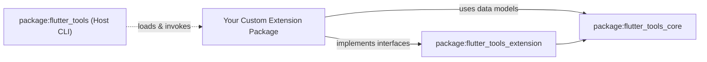

# Extension Authoring Guide: Building Flutter Tooling Extensions

This guide explains how to build, structure, and maintain Flutter Tooling extensions using the modular extensibility architecture introduced in `ft-ext-step01-pub-workspace`.

---

## Architecture & Package Hierarchy

The Flutter Tooling extensibility framework uses a decoupled package hierarchy backed by Dart Pub Workspaces. As an extension author, you work with lightweight public packages rather than internal host CLI implementations.



### Key Workspace Packages

- **`package:flutter_tools_core`**: Contains pure data structures and domain definitions (device descriptions, diagnostic checks, project templates). Zero transport or protocol dependencies.
- **`package:flutter_tools_extension`**: Contains base RPC framing, protocol request/response handling, and service contract interfaces (`ToolExtensionService`, `ToolExtensionEntryPoint`).
- **`package:flutter_tools_extension_linux_prototype`**: Reference prototype implementation illustrating how a platform extension (e.g., Linux platform capabilities) implements contracts.

> [!IMPORTANT]
> Extension packages **must never depend directly on `package:flutter_tools`**. Host CLI internal classes, tools, and transitive dependencies are subject to change without notice and carry heavy dependency footprints.

---

## Package Responsibilities & Boundaries

Understanding where responsibilities reside ensures clean separation of concerns and simplifies testing:

| Component | Responsibility Boundary |
|---|---|
| **Core Models (`flutter_tools_core`)** | Defines data payload formats and non-executable domain contracts. Implemented as lightweight Dart models without heavy dependencies. |
| **Extension Base (`flutter_tools_extension`)** | Manages RPC message serialization/deserialization, isolate handshake protocols, and execution entry points. |
| **Extension Package (Your Extension)** | Provides platform or feature-specific logic (e.g., custom device detection, doctor checks, build command integration). |
| **Host Tooling (`flutter_tools`)** | Discovers extensions, spawns isolates/processes, executes handshakes, and routes protocol messages. |

---

## Design Rationale: Why Isolate Contracts?

The design strictly decouples extension contracts from host tool CLI implementations:

1. **Dependency Minimization**: Internal `flutter_tools` CLI pulls in large transitive dependencies (`analyzer`, `shelf`, `dwds`, `process`, `file`, `crypto`, etc.). `flutter_tools_core` and `flutter_tools_extension` depend only on essential packages like `meta`, ensuring fast compilation and small bundle sizes.
2. **Stable API Boundaries**: Host CLI internal classes refactor frequently. Extension contracts establish a semantically versioned stable surface for third-party authors.
3. **Isolate Safety**: Extensions execute in isolated execution environments (Dart isolates or sub-processes). Minimal dependencies prevent class clutter and state leaks between host and extensions.

---

## How to Structure a Tooling Extension

### 1. Configure `pubspec.yaml`

Depend on `flutter_tools_core` and `flutter_tools_extension`:

```yaml
name: my_flutter_tool_extension
description: Custom extension for Flutter tools extensibility.

environment:
  sdk: ^3.11.0-0

dependencies:
  meta: ^1.18.3
  flutter_tools_core:
  flutter_tools_extension:
```

If developing within the Flutter repository workspace, set `resolution: workspace`:

```yaml
resolution: workspace
```

### 2. Implement Extension Services

Implement service handlers exposed by `flutter_tools_extension`. Reference the `flutter_tools_extension_linux_prototype` package structure for reference layout:

```
my_flutter_tool_extension/
├── lib/
│   ├── my_flutter_tool_extension.dart
│   └── src/
│       ├── device_provider.dart
│       ├── doctor_validator.dart
│       └── service_entrypoint.dart
├── pubspec.yaml
└── README.md
```

Export your public extension interfaces in `lib/my_flutter_tool_extension.dart`:

```dart
library my_flutter_tool_extension;

export 'src/service_entrypoint.dart';
```

### 3. Defining Custom Project Templates

To enable users to generate projects based on custom structures via `flutter create --template=<your-template-name>`, you can implement a custom `ProjectTemplate` and expose it through a `TemplateService`:

1. **Subclass `ProjectTemplate`**:
   Define your template details, files list, and path configuration. Specify the package URI pointing to the directory containing your template files.
   
   ```dart
   import 'package:flutter_tools_core/flutter_tools_core.dart';

   final class MyCustomProjectTemplate extends ProjectTemplate {
     @override
     String get name => 'my-custom-app';

     @override
     bool get hidden => false;

     @override
     Set<String> get templateDependencies => const <String>{};

     @override
     Set<String> get templateSources => const <String>{
       'pubspec.yaml.tmpl',
       'lib/main.dart.tmpl',
     };

     @override
     String get templatePath =>
         'package:my_flutter_tool_extension/templates/my_custom_app';

     @override
     Future<Map<String, Object?>> generateTemplateParameters(
       Map<String, Object?> toolParameters,
     ) async {
       // Customize, augment, or validate project creation parameters.
       return toolParameters;
     }
   }
   ```

2. **Implement `TemplateService`**:
   Expose your template to the host CLI by overriding the `projectTemplates` property:

   ```dart
   import 'package:flutter_tools_extension/flutter_tools_extension.dart';

   final class MyTemplateService extends TemplateService {
     @override
     Set<String> get appPlatformTemplates => const <String>{};

     @override
     Set<String> get pluginPlatformTemplates => const <String>{};

     @override
     Set<ProjectTemplate> get projectTemplates => <ProjectTemplate>{
       MyCustomProjectTemplate(),
     };
   }
   ```

3. **Register the Service**:
   Include `MyTemplateService` in the list of services registered in your extension's entrypoint.

### 4. Defining Custom Target Devices

To expose custom target devices to `flutter devices` and device discovery pipelines:

1. **Implement `DeviceService`**:
   Subclass `DeviceService` from `package:flutter_tools_extension` and return a list of `TargetDevice` DTOs from `getDevices()`:

   ```dart
   import 'package:flutter_tools_core/flutter_tools_core.dart';
   import 'package:flutter_tools_extension/flutter_tools_extension.dart';

   final class MyCustomDeviceService extends DeviceService {
     @override
     Future<List<TargetDevice>> getDevices() async {
       return <TargetDevice>[
         const TargetDevice(
           id: 'my_custom_device',
           name: 'My Custom Extension Device',
           category: 'desktop',
           platformType: 'custom',
           targetPlatform: 'linux-x64',
           sdkNameAndVersion: 'Custom Linux 1.0.0',
           ephemeral: false,
         ),
       ];
     }
   }
   ```

2. **Register the Service**:
   Add `MyCustomDeviceService()` to the list of `ToolExtensionService` instances registered in your extension's entrypoint (`ToolExtensionEntryPoint`).

### 5. Defining Custom Build Targets

To expose custom build targets to `flutter build` and run them via dynamic subcommands:

1. **Implement `BuildService`**:
   Subclass `BuildService` from `package:flutter_tools_extension` and return your custom targets and implement build executions:

   ```dart
   import 'package:flutter_tools_core/flutter_tools_core.dart';
   import 'package:flutter_tools_extension/flutter_tools_extension.dart';

   final class MyCustomBuildService extends BuildService {
     @override
     Future<List<ExtensionBuildTarget>> getBuildTargets() async {
        return <ExtensionBuildTarget>[
          const ExtensionBuildTarget(
            name: 'custom-linux-build',
            targetPlatform: 'linux-x64',
            description: 'A custom Linux build target from my extension.',
            inputs: <String>[
              '{PROJECT_DIR}/pubspec.yaml',
              '{PROJECT_DIR}/linux/CMakeLists.txt',
              '{PROJECT_DIR}/lib/main.dart',
            ],
            outputs: <String>[
              '{OUTPUT_DIR}/bundle/*',
            ],
          ),
        ];
     }

     @override
     Future<ExtensionBuildResult> build({
       required String targetName,
       required String projectRoot,
       required String mainPath,
       required String buildMode,
     }) async {
       if (targetName == 'custom-linux-build') {
         // Perform custom build steps (e.g. invoke make, run custom script)
         final bool success = await runBuildTool(projectRoot, mainPath, buildMode);
         if (success) {
           return const ExtensionBuildResult.success();
         }
         return const ExtensionBuildResult.failure(
           message: 'Custom build tool returned non-zero exit code.',
         );
       }
       return ExtensionBuildResult.failure(
         message: 'Unknown build target: $targetName',
       );
     }
   }
   ```

   **Referencing Engine Artifacts in Inputs/Outputs**:
   Extensions can also declare dependencies on Flutter engine artifacts or host artifacts by using special URI-like prefixes in their input/output lists:
   - `artifact:<ArtifactName>[?platform=<platform>&mode=<mode>]`: References a platform-specific engine artifact (e.g., `artifact:icuData`, `artifact:genSnapshot?platform=android-arm64&mode=release`). The `ArtifactName` must match one of the enum members in `Artifact` (case-sensitive).
   - `host_artifact:<HostArtifactName>`: References a host-specific artifact (e.g., `host_artifact:impellerc`). The `HostArtifactName` must match one of the enum members in `HostArtifact` (case-sensitive).

2. **Register the Service**:
   Add `MyCustomBuildService()` to the list of `ToolExtensionService` instances registered in your extension's entrypoint (`ToolExtensionEntryPoint`).

---

## Best Practices

> [Tip]
> **Keep Dependencies Minimal**  
> Rely on `package:flutter_tools_core` data types whenever possible. Avoid importing heavy utility packages into your extension core.

> [Note]
> **Use the Prototype as a Reference**  
> Examine `packages/flutter_tools/packages/flutter_tools_extension_linux_prototype` to see how concrete extensions register capabilities with host tools.

---

## Related Architecture Documentation

For in-depth technical design and subsystem specifications, refer to:

- [Extensibility Workspace Architecture](../architecture/extensibility_workspace.md)
- [Protocol & Isolate Runner Architecture](../architecture/protocol_and_isolate_runner.md)
- [Diagnostics Slice Architecture](../architecture/diagnostics_slice.md)
- [Configuration Slice Architecture](../architecture/configuration_slice.md)
- [Templates Slice Architecture](../architecture/templates_slice.md)
- [Device Service Slice Architecture](../architecture/device_service_slice.md)
- [Build Target Slice Architecture](../architecture/build_target_slice.md)


