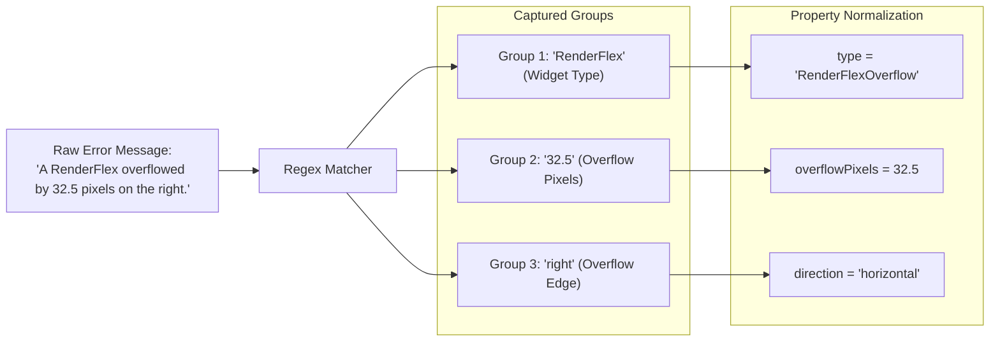
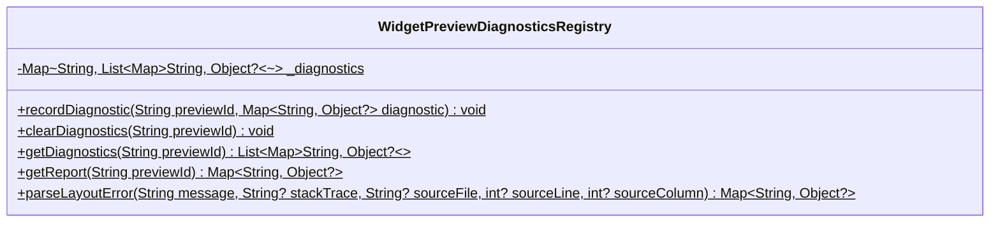
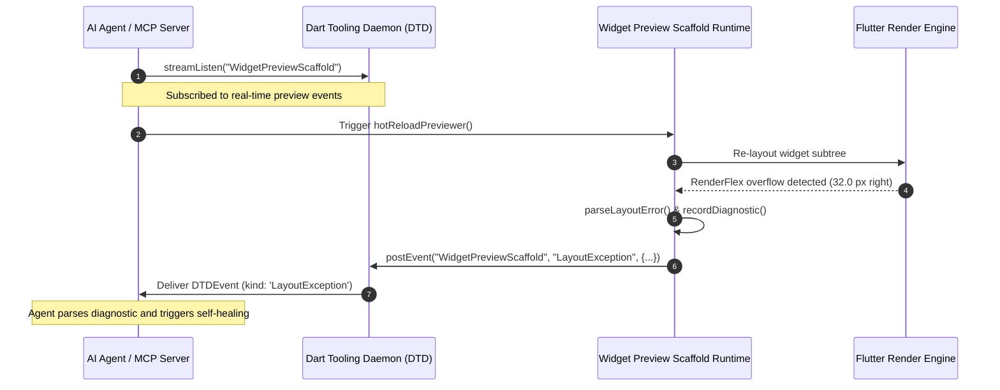
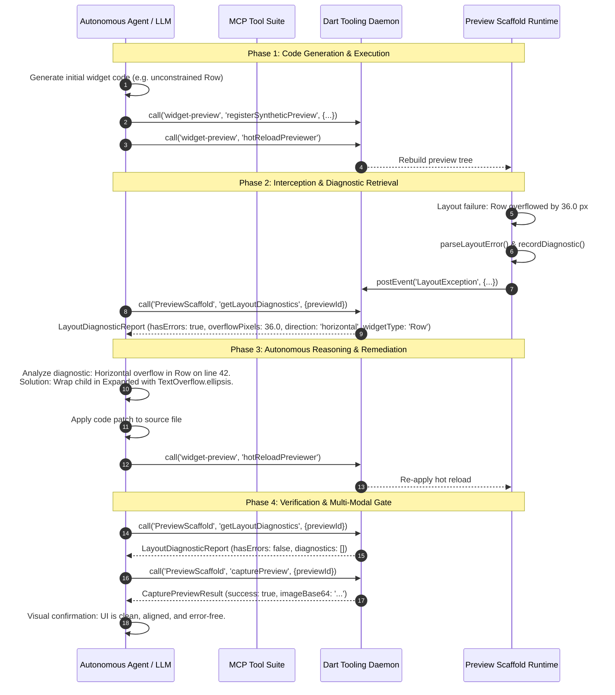

# Layout Exception & Diagnostics Pipeline for Agent Widget Preview

## Overview & Problem Statement

The Flutter Widget Preview environment provides an isolated, interactive canvas for rendering and testing UI components. For autonomous AI coding agents, Model Context Protocol (MCP) servers, and developer tooling, verifying UI layout integrity and catching visual bugs programmatically is critical.

In standard Flutter application execution, layout constraint violations (such as `RenderFlex` overflows, unbounded sizing, or viewport constraint mismatches) trigger runtime framework exceptions. In a conventional UI session, these manifest as:
1. Red and yellow striped "overflow bars" painted over the canvas.
2. Raw multi-line error dumps and stack traces printed to standard output (`stdout` / `stderr`).
3. In strict test harnesses or unhandled boundary exceptions, fatal assertions that crash or halt the test runner.

### The Challenge for Headless & Agentic Environments

For automated tooling and autonomous AI agents operating headlessly or through RPC interfaces, traditional layout crash behavior presents severe friction:
- **Unstructured Text Dumps**: Raw console logs are non-deterministic, difficult to parse reliably across Flutter engine versions, and lack machine-readable coordinates or pixel deltas.
- **Fatal Process Halts**: An unhandled exception during widget tree initialization can tear down the entire preview scaffold runner, terminating the agent's interactive session.
- **Lack of Quantitative Deltas**: Autonomous agents need to know *exactly* how many logical pixels a component overflowed, along which axis (`horizontal` vs `vertical`), and in which source file/line to formulate precise self-healing code edits.

### The Slice 3 Solution

**Slice 3 (Layout Exception & Diagnostics Pipeline)** introduces a non-fatal, structured layout diagnostics engine directly inside the widget preview framework. The pipeline captures constraint violations, normalizes error messages into structured JSON-RPC data models, records them in an in-memory registry, broadcasts real-time `LayoutException` events over DTD streams, and exposes query endpoints for on-demand diagnosis and closed-loop agent repair.

```mermaid
flowchart TB
    subgraph FlutterFramework["Flutter Layout & Rendering Engine"]
        RenderTree["Render Object Tree (e.g. RenderFlex, RenderBox)"]
        LayoutCheck{"Constraints Exceeded?<br/>(e.g., Row / Column Overflow)"}
        FlutterErrorHook["FlutterError.onError / Subtree Error Boundary"]
    end

    subgraph PreviewScaffold["Widget Preview Scaffold Runtime"]
        Parser["WidgetPreviewDiagnosticsRegistry.parseLayoutError()<br/>(Regex Engine & Direction Normalization)"]
        Registry[("WidgetPreviewDiagnosticsRegistry<br/>(In-Memory Diagnostic Cache)")]
        ScaffoldService["PreviewScaffold.getLayoutDiagnostics<br/>(DTD JSON-RPC Endpoint)"]
        ErrorBoundary["WidgetPreviewErrorWidget<br/>(Non-Fatal Visual Fallback)"]
    end

    subgraph DTD["Dart Tooling Daemon (DTD) Bus"]
        RPCBus["JSON-RPC 2.0 Router"]
        EventStream["WidgetPreviewScaffold Stream<br/>(Event: 'LayoutException')"]
    end

    subgraph AgentClient["Autonomous AI Agent / MCP Server"]
        AgentListener["Event Listener / Stream Subscriber"]
        AgentQuery["RPC Diagnostic Query"]
        SelfHealing["LLM Reasoning & Code Self-Healing Engine"]
    end

    RenderTree --> LayoutCheck
    LayoutCheck -- "Overflow Detected" --> FlutterErrorHook
    FlutterErrorHook --> Parser
    FlutterErrorHook --> ErrorBoundary
    Parser -->|Structured Diagnostic| Registry
    Parser -->|Push Diagnostic| EventStream
    
    EventStream -->|Real-time LayoutException Event| AgentListener
    AgentListener --> SelfHealing

    AgentQuery -->|dtd.call('PreviewScaffold', 'getLayoutDiagnostics')| RPCBus
    RPCBus --> ScaffoldService
    ScaffoldService -->|Lookup Report| Registry
    Registry -->|LayoutDiagnosticReport| ScaffoldService
    ScaffoldService -->|JSON-RPC Response| AgentQuery
    AgentQuery --> SelfHealing
```

### Source References
- Type definitions and data schemas: [`packages/flutter_tools/lib/src/widget_preview/dtd_types.dart`](file:///usr/local/google/home/bkonyi/.gemini/jetski/worktrees/flutter/enable_widget_preview_agents/packages/flutter_tools/lib/src/widget_preview/dtd_types.dart)
- Host DTD service definitions and constants: [`packages/flutter_tools/lib/src/widget_preview/dtd_services.dart`](file:///usr/local/google/home/bkonyi/.gemini/jetski/worktrees/flutter/enable_widget_preview_agents/packages/flutter_tools/lib/src/widget_preview/dtd_services.dart)
- In-framework diagnostics registry and regex parser: [`packages/flutter_tools/templates/widget_preview_scaffold/lib/src/widget_preview_rendering.dart.tmpl`](file:///usr/local/google/home/bkonyi/.gemini/jetski/worktrees/flutter/enable_widget_preview_agents/packages/flutter_tools/templates/widget_preview_scaffold/lib/src/widget_preview_rendering.dart.tmpl)
- Scaffold-side DTD service handlers: [`packages/flutter_tools/templates/widget_preview_scaffold/lib/src/dtd/dtd_services.dart.tmpl`](file:///usr/local/google/home/bkonyi/.gemini/jetski/worktrees/flutter/enable_widget_preview_agents/packages/flutter_tools/templates/widget_preview_scaffold/lib/src/dtd/dtd_services.dart.tmpl)
- Hermetic unit test suite: [`packages/flutter_tools/test/commands.shard/hermetic/widget_preview/dtd_services_test.dart`](file:///usr/local/google/home/bkonyi/.gemini/jetski/worktrees/flutter/enable_widget_preview_agents/packages/flutter_tools/test/commands.shard/hermetic/widget_preview/dtd_services_test.dart)

---

## 1. Layout Exception Interception & Parsing Engine

### Subtree Error Boundary & Non-Fatal Containment

To guarantee that a layout error in a single preview does not crash the entire previewer or abort active DTD connections, the preview scaffold wraps widget tree construction in error-handling boundaries.

When an unhandled exception occurs during widget construction or layout initialization:
1. `WidgetPreviewWidgetState.build()` catches the error object and stack trace.
2. The failing branch is replaced with a localized [`WidgetPreviewErrorWidget`](file:///usr/local/google/home/bkonyi/.gemini/jetski/worktrees/flutter/enable_widget_preview_agents/packages/flutter_tools/templates/widget_preview_scaffold/lib/src/widget_preview_rendering.dart.tmpl#L194-L305), rendering formatted stack frames with clickable source links.
3. The error details are passed to `WidgetPreviewDiagnosticsRegistry.parseLayoutError()` and stored for RPC retrieval.

### Regex-Based `RenderFlex` Overflow Extraction

The framework parses human-readable layout assertions and error strings into structured properties using a specialized regular expression:

```dart
final overflowRegex = RegExp(
  r'([A-Za-z0-9_]+) overflowed by ([0-9.]+) pixels on the (right|left|bottom|top|start|end)',
  caseSensitive: false,
);
```



#### Group Extraction & Normalization Rules

| Match Element | Regex Pattern | Extracted Value | Normalization Rule |
|---|---|---|---|
| **Widget Type** | `([A-Za-z0-9_]+)` | `match.group(1)` | Defaults to `'RenderFlex'` if null or unparsed. |
| **Overflow Pixels** | `([0-9.]+)` | `match.group(2)` | Parsed via `double.tryParse()`, defaulting to `0.0`. |
| **Overflow Side** | `(right\|left\|bottom\|top\|start\|end)` | `match.group(3)` | Lowercased string representing the overflowing edge. |
| **Axis Direction** | Derived from side | `'horizontal'` / `'vertical'` | `'bottom'` or `'top'` $\rightarrow$ `'vertical'`.<br/>`'right'`, `'left'`, `'start'`, or `'end'` $\rightarrow$ `'horizontal'`. |

#### Fallback for General Layout Exceptions

If an error message does not match the `RenderFlex` overflow signature (e.g. unconstrained infinite height inside a `ListView`, failed layout assertions, or parent data misconfigurations), `parseLayoutError` falls back to a generalized `LayoutException` diagnostic:

```dart
return <String, Object?>{
  'direction': 'none',
  'message': message,
  'overflowPixels': 0.0,
  if (sourceColumn != null) 'sourceColumn': sourceColumn,
  if (sourceFile != null) 'sourceFile': sourceFile,
  if (sourceLine != null) 'sourceLine': sourceLine,
  if (stackTrace != null) 'stackTrace': stackTrace,
  'type': 'LayoutException',
};
```

---

## 2. In-Memory Registry (`WidgetPreviewDiagnosticsRegistry`)

The [`WidgetPreviewDiagnosticsRegistry`](file:///usr/local/google/home/bkonyi/.gemini/jetski/worktrees/flutter/enable_widget_preview_agents/packages/flutter_tools/templates/widget_preview_scaffold/lib/src/widget_preview_rendering.dart.tmpl#L111-L187) provides static thread-safe storage for diagnostic entries indexed by `previewId`.



### Registry API Reference

- **`recordDiagnostic(String previewId, Map<String, Object?> diagnostic)`**: Appends a new diagnostic map to the list for `previewId`.
- **`clearDiagnostics(String previewId)`**: Removes all recorded diagnostics for the given preview ID (e.g. prior to re-rendering after hot reload).
- **`getDiagnostics(String previewId)`**: Returns an unmodifiable view of all diagnostics recorded for `previewId`.
- **`getReport(String previewId)`**: Compiles a full [`LayoutDiagnosticReport`](#layoutdiagnosticreport) map containing `diagnostics`, `hasErrors` (`true` if `diagnostics` is non-empty), and `previewId`.

---

## 3. `PreviewScaffold.getLayoutDiagnostics` DTD RPC Endpoint

The `PreviewScaffold.getLayoutDiagnostics` service is registered by the preview scaffold on DTD during initialization.

- **Service Domain**: `PreviewScaffold`
- **Method Name**: `getLayoutDiagnostics` (constant `kGetLayoutDiagnostics`)
- **Transport**: JSON-RPC 2.0 over WebSocket

### Protocol Registration

```dart
// packages/flutter_tools/templates/widget_preview_scaffold/lib/src/dtd/dtd_services.dart.tmpl
await dtd.registerService(
  kPreviewScaffoldService,    // 'PreviewScaffold'
  kGetLayoutDiagnostics,      // 'getLayoutDiagnostics'
  _handleGetLayoutDiagnostics,
);
```

### Request Parameters

| Parameter | Type | Required | Description |
|---|---|---|---|
| `previewId` | `String` | No | The unique identifier of the preview to inspect. If omitted or null, returns a blank report (`hasErrors: false`). |

### JSON-RPC 2.0 Request Example

```json
{
  "jsonrpc": "2.0",
  "id": 101,
  "method": "PreviewScaffold.getLayoutDiagnostics",
  "params": {
    "previewId": "custom_card_preview"
  }
}
```

---

### Response Schemas

#### 1. Preview With Layout Errors Detected

When layout constraint violations or overflow errors have occurred:

```json
{
  "jsonrpc": "2.0",
  "id": 101,
  "result": {
    "previewId": "custom_card_preview",
    "hasErrors": true,
    "diagnostics": [
      {
        "type": "RenderFlexOverflow",
        "message": "A RenderFlex overflowed by 28.5 pixels on the right.",
        "overflowPixels": 28.5,
        "direction": "horizontal",
        "widgetType": "Row",
        "sourceFile": "/workspace/my_app/lib/src/custom_card.dart",
        "sourceLine": 54,
        "sourceColumn": 16,
        "stackTrace": "package:flutter/src/rendering/flex.dart 1024:12\npackage:my_app/src/custom_card.dart 54:16"
      }
    ]
  }
}
```

#### 2. Clean Preview (No Layout Violations)

When a preview is mounted and rendered cleanly:

```json
{
  "jsonrpc": "2.0",
  "id": 102,
  "result": {
    "previewId": "custom_card_preview",
    "hasErrors": false,
    "diagnostics": []
  }
}
```

---

## 4. Real-Time Streaming over `WidgetPreviewScaffold` Stream

In addition to point-in-time RPC polling via `getLayoutDiagnostics`, the preview environment supports push-based real-time notifications via DTD event streams.



### Event Specification

| Property | Value |
|---|---|
| **Stream Name** | `WidgetPreviewScaffold` (or `WidgetPreviewScaffold-<UUID>`) |
| **Event Kind** | `LayoutException` (constant `kLayoutExceptionEvent = 'LayoutException'`) |

### Event Payload Schema

```json
{
  "stream": "WidgetPreviewScaffold",
  "event": "LayoutException",
  "data": {
    "previewId": "agent_card_preview",
    "diagnostic": {
      "type": "RenderFlexOverflow",
      "message": "A RenderFlex overflowed by 16.0 pixels on the bottom.",
      "overflowPixels": 16.0,
      "direction": "vertical",
      "widgetType": "Column",
      "sourceFile": "/workspace/my_app/lib/src/badge.dart",
      "sourceLine": 32,
      "sourceColumn": 10,
      "stackTrace": "..."
    }
  }
}
```

### Pull vs. Push Diagnostic Model

| Dimension | RPC Pull (`PreviewScaffold.getLayoutDiagnostics`) | Stream Push (`LayoutException` Event) |
|---|---|---|
| **Invocation Pattern** | Synchronous on-demand request by agent. | Asynchronous proactive notification. |
| **Best Used For** | Post-compilation verification checkpoints and assertion gating. | Live streaming, continuous monitoring, and instant reactive alerts. |
| **Payload Scope** | Full aggregated report (`LayoutDiagnosticReport`) for the given `previewId`. | Discrete per-occurrence `OverflowDiagnostic` event payload. |
| **State Reset** | Reflects current state accumulated in `WidgetPreviewDiagnosticsRegistry`. | Emitted immediately at the moment the framework encounters the error. |

---

## 5. Type-Safe Data Models & Serialization

The core data structures are defined in [`packages/flutter_tools/lib/src/widget_preview/dtd_types.dart`](file:///usr/local/google/home/bkonyi/.gemini/jetski/worktrees/flutter/enable_widget_preview_agents/packages/flutter_tools/lib/src/widget_preview/dtd_types.dart).

### `OverflowDiagnostic`

Represents an individual layout constraint violation or overflow exception.

```dart
class OverflowDiagnostic {
  const OverflowDiagnostic({
    required this.direction,
    required this.message,
    required this.overflowPixels,
    required this.type,
    this.sourceColumn,
    this.sourceFile,
    this.sourceLine,
    this.stackTrace,
    this.widgetType,
  });

  /// The diagnostic classification (e.g. `'RenderFlexOverflow'` or `'LayoutException'`).
  final String type;

  /// The human-readable error description.
  final String message;

  /// The amount of overflow in logical pixels (e.g. `24.0`).
  final double overflowPixels;

  /// The overflow direction (`'horizontal'`, `'vertical'`, or `'none'`).
  final String direction;

  /// The widget class associated with the overflow (e.g. `'Row'`, `'Column'`).
  final String? widgetType;

  /// Source file path where the error originated.
  final String? sourceFile;

  /// Source line number where the error originated.
  final int? sourceLine;

  /// Source column number where the error originated.
  final int? sourceColumn;

  /// Terse stack trace string.
  final String? stackTrace;

  Map<String, Object?> toJson() => <String, Object?>{
    'direction': direction,
    'message': message,
    'overflowPixels': overflowPixels,
    if (sourceColumn != null) 'sourceColumn': sourceColumn,
    if (sourceFile != null) 'sourceFile': sourceFile,
    if (sourceLine != null) 'sourceLine': sourceLine,
    if (stackTrace != null) 'stackTrace': stackTrace,
    'type': type,
    if (widgetType != null) 'widgetType': widgetType,
  };

  static OverflowDiagnostic fromJson(Map<String, Object?> json) {
    final direction = json['direction']! as String;
    final message = json['message']! as String;
    final double overflowPixels = (json['overflowPixels'] as num?)?.toDouble() ?? 0.0;
    final sourceColumn = json['sourceColumn'] as int?;
    final sourceFile = json['sourceFile'] as String?;
    final sourceLine = json['sourceLine'] as int?;
    final stackTrace = json['stackTrace'] as String?;
    final type = json['type']! as String;
    final widgetType = json['widgetType'] as String?;
    return OverflowDiagnostic(
      direction: direction,
      message: message,
      overflowPixels: overflowPixels,
      sourceColumn: sourceColumn,
      sourceFile: sourceFile,
      sourceLine: sourceLine,
      stackTrace: stackTrace,
      type: type,
      widgetType: widgetType,
    );
  }
}
```

### `LayoutDiagnosticReport`

Represents an aggregated diagnostic report for a specific preview instance.

```dart
class LayoutDiagnosticReport {
  const LayoutDiagnosticReport({
    required this.hasErrors,
    required this.previewId,
    this.diagnostics = const <OverflowDiagnostic>[],
  });

  /// The preview identifier.
  final String previewId;

  /// Whether any layout exceptions or overflows were detected.
  final bool hasErrors;

  /// The list of structured overflow/layout diagnostics.
  final List<OverflowDiagnostic> diagnostics;

  Map<String, Object?> toJson() => <String, Object?>{
    'diagnostics': diagnostics.map((OverflowDiagnostic d) => d.toJson()).toList(),
    'hasErrors': hasErrors,
    'previewId': previewId,
  };

  static LayoutDiagnosticReport fromJson(Map<String, Object?> json) {
    final hasErrors = json['hasErrors']! as bool;
    final previewId = json['previewId']! as String;
    final rawDiagnostics = json['diagnostics'] as List<Object?>?;
    final List<OverflowDiagnostic> diagnostics = rawDiagnostics != null
        ? rawDiagnostics
              .map((Object? item) => OverflowDiagnostic.fromJson((item! as Map).cast<String, Object?>()))
              .toList()
        : const <OverflowDiagnostic>[];
    return LayoutDiagnosticReport(
      diagnostics: diagnostics,
      hasErrors: hasErrors,
      previewId: previewId,
    );
  }
}
```

---

## 6. AI Agent Closed-Loop Diagnosis & Self-Healing Workflow

By combining structured layout diagnostics, instantaneous in-framework snapshotting (`capturePreview`), dynamic synthetic preview registration (`registerSyntheticPreview`), and hot reload (`hotReloadPreviewer`), autonomous AI agents can execute complete closed-loop self-healing cycles.



---

### Step-by-Step Remediation Scenario

#### 1. Defective Initial Implementation

An AI agent generates a user profile card widget where fixed-width elements and long text are placed inside a `Row` without flex constraints:

```dart
// lib/src/user_card.dart (Line 40-52)
Widget build(BuildContext context) {
  return Card(
    child: Row(
      children: [
        const CircleAvatar(radius: 24, child: Icon(Icons.person)),
        const SizedBox(width: 16),
        Text(
          'Dr. Elizabeth Montgomery-Smith, Senior Vice President of Engineering',
          style: Theme.of(context).textTheme.titleMedium,
        ),
        IconButton(icon: const Icon(Icons.more_vert), onPressed: () {}),
      ],
    ),
  );
}
```

#### 2. Layout Diagnostic Extraction

Upon hot reload, the preview scaffold captures the flex overflow and returns the following diagnostic report to the agent:

```json
{
  "hasErrors": true,
  "previewId": "user_card_preview",
  "diagnostics": [
    {
      "type": "RenderFlexOverflow",
      "message": "A RenderFlex overflowed by 142.0 pixels on the right.",
      "overflowPixels": 142.0,
      "direction": "horizontal",
      "widgetType": "Row",
      "sourceFile": "/workspace/my_app/lib/src/user_card.dart",
      "sourceLine": 42,
      "sourceColumn": 12
    }
  ]
}
```

#### 3. Agent Diagnostic Interpretation

The AI agent parses the structured payload:
- **`type: 'RenderFlexOverflow'`**: The error is a flex sizing violation, not a fatal logic crash.
- **`direction: 'horizontal'`**: Sizing constraints were exceeded horizontally.
- **`overflowPixels: 142.0`**: The content exceeds available horizontal constraints by 142 logical pixels.
- **`widgetType: 'Row'`**: The parent container is a horizontal `Row`.
- **`sourceLine: 42`**: The violation originates at the `Row` declaration in `user_card.dart`.

#### 4. Automated Code Remediation

The agent infers that the unbounded `Text` widget must be constrained using `Expanded` and configured with truncation:

```dart
// lib/src/user_card.dart (Remediated)
Widget build(BuildContext context) {
  return Card(
    child: Row(
      children: [
        const CircleAvatar(radius: 24, child: Icon(Icons.person)),
        const SizedBox(width: 16),
        Expanded(
          child: Text(
            'Dr. Elizabeth Montgomery-Smith, Senior Vice President of Engineering',
            style: Theme.of(context).textTheme.titleMedium,
            overflow: TextOverflow.ellipsis,
          ),
        ),
        IconButton(icon: const Icon(Icons.more_vert), onPressed: () {}),
      ],
    ),
  );
}
```

#### 5. Re-Verification & Visual Confirmation

The agent invokes `hotReloadPreviewer` and queries `getLayoutDiagnostics`:

```json
{
  "hasErrors": false,
  "previewId": "user_card_preview",
  "diagnostics": []
}
```

With `hasErrors: false` verified, the agent calls `PreviewScaffold.capturePreview` to obtain a high-resolution PNG snapshot, completing the autonomous design, test, and repair cycle.
