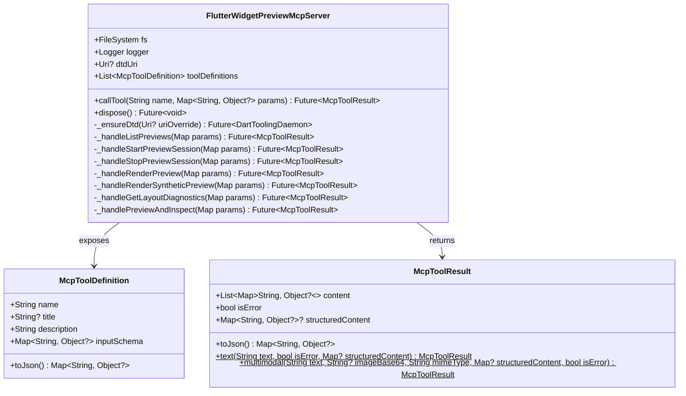
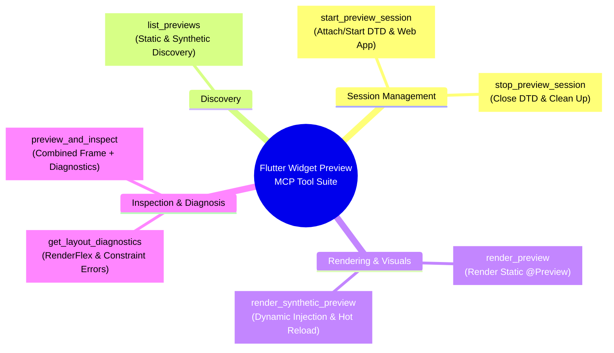
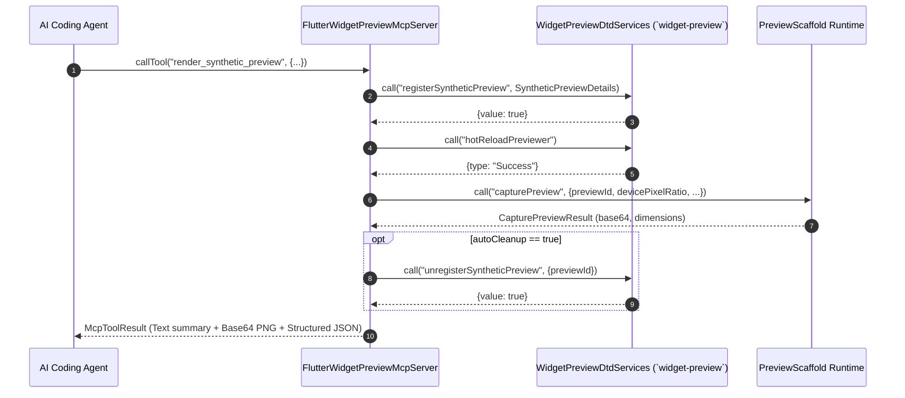
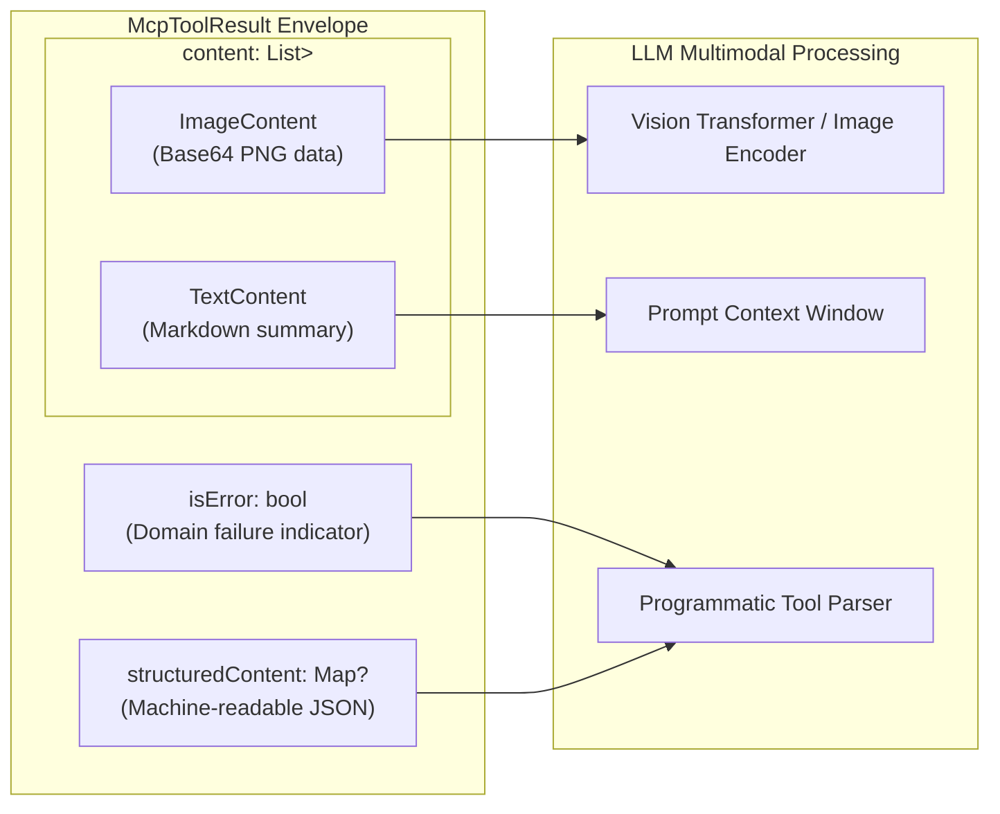
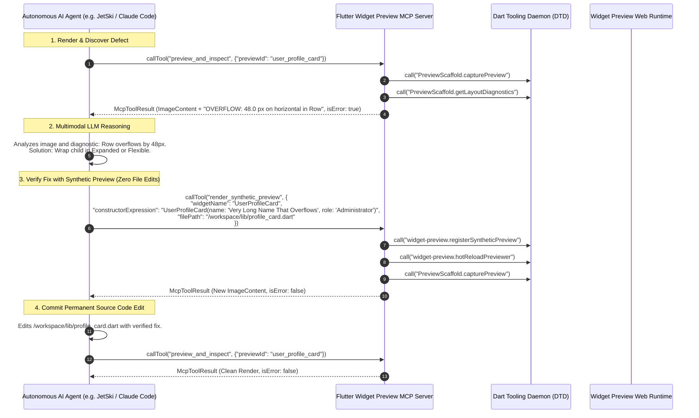

# Model Context Protocol (MCP) Tool Suite for Agent Widget Preview

## Overview & Problem Statement

The Flutter Widget Preview subsystem provides an isolated, sub-second canvas for rendering, testing, and debugging Flutter UI components. While human developers interact visually through rich IDE extension panels and web browsers, **autonomous AI coding agents** (e.g. JetSki, Claude Code, Cursor, Windsurf, Roo Code) require standardized, programmatic tool protocols to discover, render, inspect, and heal user interfaces.

Historically, AI coding assistants have faced fundamental friction when interacting with graphical application frameworks like Flutter:
1. **The "Blind Editing" Problem**: LLMs generate or modify widget source code based purely on textual intuition without perceptual visual feedback. They cannot observe visual layout defects, color contrast mismatches, clipping errors, or component alignment failures.
2. **Source Code Contamination for Ad-Hoc Previews**: To test how a widget looks under diverse constructor parameter permutations, agents were forced to inject throwaway `@Preview` annotations or test scaffolds directly into user source files, generating git diff noise and risking repository corruption.
3. **Unstructured Runtime Failure Signals**: When a widget crashes or overflows (e.g. `RenderFlex overflowed by 42 pixels`), the error has traditionally been emitted as unstructured console log dumps or raw stack traces, making automated self-healing difficult and non-deterministic.
4. **Tool Fragmentation**: Different IDEs and AI platforms implemented divergent, proprietary tool interfaces for controlling development servers.

### The Slice 6 Solution

**Slice 6 (Model Context Protocol Tool Suite Definition)** establishes an open, standard [Model Context Protocol (MCP)](https://modelcontextprotocol.io/) server interface directly on top of Flutter's Dart Tooling Daemon (DTD) infrastructure. MCP is an open standard that allows LLMs to securely discover and execute tools, read resources, and exchange multimodal data across disparate environments.

The [`FlutterWidgetPreviewMcpServer`](file:///usr/local/google/home/bkonyi/.gemini/jetski/worktrees/flutter/enable_widget_preview_agents/packages/flutter_tools/lib/src/widget_preview/preview_mcp_server.dart#L120) exposes **7 high-level, declarative MCP tools** that enable AI coding agents to perform closed-loop visual reasoning:
- **Discovery**: Query statically declared `@Preview` annotations and discover unannotated widgets.
- **Session Lifecycle**: Attach to or bootstrap resident widget preview daemons and web runtimes.
- **High-Speed Multimodal Snapshotting**: Render widgets into high-resolution PNG images with Base64 encoding.
- **Zero-Modification Synthetic Previews**: Dynamically instantiate and render arbitrary widget constructors on-the-fly with automatic wrapper scaffolding and sub-second Hot Reload (<200ms), without altering a single user source file.
- **Structured Diagnostics & Layout Assertions**: Programmatically inspect layout overflow pixel deltas, directional axes, and failing source locations.
- **Consolidated Composite Inspection**: Execute frame rendering and layout diagnostics in a single consolidated MCP call to minimize LLM latency and token consumption.

```mermaid
flowchart TB
    subgraph AIAgentHost["Autonomous AI Agent Host (JetSki / Claude Code / Cursor / Windsurf)"]
        LLM["Multimodal LLM<br/>(Gemini 1.5 Pro / Claude 3.5 Sonnet / GPT-4o)"]
        MCPClient["MCP Client Core / Tool Orchestrator"]
    end

    subgraph MCPLayer["Flutter Widget Preview MCP Server (`preview_mcp_server.dart`)"]
        McpServer["FlutterWidgetPreviewMcpServer<br/>- Tool Registry (7 Tools)<br/>- Dispatcher & Argument Validator<br/>- Multimodal Formatter (Text + Image + Structured)"]
        ToolList["1. `list_previews`<br/>2. `start_preview_session`<br/>3. `stop_preview_session`<br/>4. `render_preview`<br/>5. `render_synthetic_preview`<br/>6. `get_layout_diagnostics`<br/>7. `preview_and_inspect`"]
    end

    subgraph DTDLayer["Dart Tooling Daemon (DTD) WebSocket Bus"]
        DTDWS["DTD WebSocket Connection (`ws://127.0.0.1:port/auth`)"]
        WPService["`widget-preview` Service<br/>(Hosted by `flutter_tools`)"]
        ScaffoldService["`PreviewScaffold` Service<br/>(Hosted by Web Preview Runtime)"]
    end

    subgraph FlutterRuntime["Widget Preview Execution Environment"]
        DevFS["DevFS Incremental Hot Reload (<200ms)"]
        CodeGen["PreviewCodeGenerator<br/>(Synthetic AST Injection)"]
        RepaintBoundary["RenderRepaintBoundary.toImageSync()<br/>(<15ms Sub-tree Rasterization)"]
        DiagRegistry["Diagnostics Pipeline<br/>(RenderFlex Overflow Interception)"]
    end

    LLM <-->|Tool Call Intent & Multimodal Feedback| MCPClient
    MCPClient <-->|MCP JSON-RPC 2.0 (stdio / SSE)| McpServer
    McpServer --- ToolList
    McpServer <-->|DTD JSON-RPC 2.0 Client| DTDWS

    DTDWS <-->|`registerSyntheticPreview`, `hotReload`| WPService
    DTDWS <-->|`capturePreview`, `getLayoutDiagnostics`| ScaffoldService

    WPService --> CodeGen
    WPService --> DevFS
    ScaffoldService --> RepaintBoundary
    ScaffoldService --> DiagRegistry
```

### Source References

- MCP Server & Tool Definitions: [`packages/flutter_tools/lib/src/widget_preview/preview_mcp_server.dart`](file:///usr/local/google/home/bkonyi/.gemini/jetski/worktrees/flutter/enable_widget_preview_agents/packages/flutter_tools/lib/src/widget_preview/preview_mcp_server.dart)
- Host-side DTD Services & Event Streams: [`packages/flutter_tools/lib/src/widget_preview/dtd_services.dart`](file:///usr/local/google/home/bkonyi/.gemini/jetski/worktrees/flutter/enable_widget_preview_agents/packages/flutter_tools/lib/src/widget_preview/dtd_services.dart)
- Serialization Models & Schemas: [`packages/flutter_tools/lib/src/widget_preview/dtd_types.dart`](file:///usr/local/google/home/bkonyi/.gemini/jetski/worktrees/flutter/enable_widget_preview_agents/packages/flutter_tools/lib/src/widget_preview/dtd_types.dart)
- Hermetic Unit Tests: [`packages/flutter_tools/test/commands.shard/hermetic/widget_preview/preview_mcp_server_test.dart`](file:///usr/local/google/home/bkonyi/.gemini/jetski/worktrees/flutter/enable_widget_preview_agents/packages/flutter_tools/test/commands.shard/hermetic/widget_preview/preview_mcp_server_test.dart)
- Related Architecture Documents:
  - [Dart Tooling Daemon (DTD) Services & RPC Protocol](file:///usr/local/google/home/bkonyi/.gemini/jetski/worktrees/flutter/enable_widget_preview_agents/packages/flutter_tools/docs/dtd_services.md)
  - [Ephemeral Synthetic Preview Scaffolding & Dynamic Injection Engine](file:///usr/local/google/home/bkonyi/.gemini/jetski/worktrees/flutter/enable_widget_preview_agents/packages/flutter_tools/docs/synthetic_preview_scaffolding.md)
  - [Layout Exception & Diagnostics Pipeline](file:///usr/local/google/home/bkonyi/.gemini/jetski/worktrees/flutter/enable_widget_preview_agents/packages/flutter_tools/docs/layout_and_diagnostics_pipeline.md)
  - [Snapshotting & Viewport Injection Architecture](file:///usr/local/google/home/bkonyi/.gemini/jetski/worktrees/flutter/enable_widget_preview_agents/packages/flutter_tools/docs/snapshotting_and_viewport_injection.md)
  - [CLI Machine Mode & Snapshot Subcommand](file:///usr/local/google/home/bkonyi/.gemini/jetski/worktrees/flutter/enable_widget_preview_agents/packages/flutter_tools/docs/cli_machine_mode_and_snapshot.md)

---

## 1. Architecture & Core Components

The MCP server layer is implemented as a self-contained, modular service within `flutter_tools`. It bridges external LLM agent environments with internal Flutter CLI and web preview runtimes.

### Component Taxonomy



### 1. `McpToolDefinition`
A declarative data model representing a tool exposed to an MCP client. It conforms strictly to the Model Context Protocol JSON schema specification:
- `name`: Unique, snake_case tool identifier (e.g. `render_synthetic_preview`).
- `title`: Human-readable display label for IDE dashboards and agent inspectors.
- `description`: Detailed, actionable explanation instructing the LLM when and how to invoke the tool.
- `inputSchema`: Standard JSON Schema (`type: "object"`, `properties: {...}`, `required: [...]`) declaring parameter constraints, data types, and enum values.

### 2. `McpToolResult`
The unified response envelope returned to the MCP client. It encapsulates three distinct communication channels:
1. `content`: A list of content blocks conforming to MCP specifications:
   - **TextContent**: Human- and LLM-friendly Markdown summaries (`{"type": "text", "text": "..."}`).
   - **ImageContent**: Raw base64-encoded visual assets (`{"type": "image", "data": "...", "mimeType": "image/png"}`).
2. `isError`: A boolean flag signaling domain-level failures (e.g. layout overflow, missing preview target, unparseable constructor).
3. `structuredContent`: An optional, unescaped JSON map containing machine-readable metadata (e.g. raw diagnostic lists, pixel bounding boxes, DTD endpoint URIs) for deterministic agent workflows.

### 3. `FlutterWidgetPreviewMcpServer`
The dispatch engine that:
- Connects lazily or eagerly to the **Dart Tooling Daemon (DTD)** over WebSocket.
- Routes incoming tool invocations to private domain handlers (`_handleRenderPreview`, `_handleRenderSyntheticPreview`, etc.).
- Translates between MCP parameter maps and strongly typed DTD domain objects ([`SyntheticPreviewDetails`](file:///usr/local/google/home/bkonyi/.gemini/jetski/worktrees/flutter/enable_widget_preview_agents/packages/flutter_tools/lib/src/widget_preview/dtd_types.dart#L273), [`CapturePreviewResult`](file:///usr/local/google/home/bkonyi/.gemini/jetski/worktrees/flutter/enable_widget_preview_agents/packages/flutter_tools/lib/src/widget_preview/dtd_types.dart#L494), [`LayoutDiagnosticReport`](file:///usr/local/google/home/bkonyi/.gemini/jetski/worktrees/flutter/enable_widget_preview_agents/packages/flutter_tools/lib/src/widget_preview/dtd_types.dart#L714)).
- Persists rasterized PNG images to disk when an `outputPath` parameter is supplied.
- Manages connection lifecycle and cleans up active DTD sessions on `dispose()`.

---

## 2. Comprehensive Tool Catalog (The 7 Core Tools)



---

### Tool 1: `list_previews`

#### Purpose & Use Cases
Discovers all available widget previews across the entire Flutter project workspace or scoped to a specific target Dart source file. It surfaces both statically declared `@Preview` annotations (discovered via the Dart Analysis Server LSP) and potential widget classes eligible for synthetic preview generation.

#### Input Schema
```json
{
  "type": "object",
  "properties": {
    "filePath": {
      "type": "string",
      "description": "Optional path to a specific Dart file."
    },
    "includeSynthetic": {
      "type": "boolean",
      "description": "Whether to discover unannotated widgets for synthetic previews."
    }
  }
}
```

#### Parameter Reference
| Parameter | Type | Required | Default | Description |
|---|---|---|---|---|
| `filePath` | `string` | No | `null` | Absolute or workspace-relative path to a target Dart file (e.g. `lib/src/widgets/card.dart`). When omitted, searches the entire workspace. |
| `includeSynthetic` | `boolean` | No | `false` | When `true`, queries the AST for public `StatelessWidget` and `StatefulWidget` declarations that lack explicit `@Preview` annotations. |

#### Invocation Example
```json
{
  "name": "list_previews",
  "arguments": {
    "filePath": "/workspace/my_app/lib/src/buttons.dart",
    "includeSynthetic": true
  }
}
```

#### Return Payload (`McpToolResult`)
```json
{
  "content": [
    {
      "type": "text",
      "text": "Discovered previews across workspace."
    }
  ],
  "isError": false,
  "structuredContent": {
    "previews": [
      {
        "previewId": "primary_button_default",
        "widgetName": "PrimaryButton",
        "functionName": "primaryButtonPreview",
        "filePath": "/workspace/my_app/lib/src/buttons.dart",
        "line": 42,
        "isSynthetic": false
      }
    ],
    "totalCount": 1
  }
}
```

---

### Tool 2: `start_preview_session`

#### Purpose & Use Cases
Attaches the MCP server to a resident Flutter Widget Preview daemon session or validates the connection to an active Dart Tooling Daemon (DTD) endpoint. It queries `widget-preview.getServiceInfo` to retrieve DTD WebSocket URIs, active protocol versions, and web preview canvas URLs.

#### Input Schema
```json
{
  "type": "object",
  "properties": {
    "dtdUrl": {
      "type": "string",
      "description": "Optional address of an existing DTD instance."
    }
  }
}
```

#### Parameter Reference
| Parameter | Type | Required | Default | Description |
|---|---|---|---|---|
| `dtdUrl` | `string` | No | `null` | WebSocket URI of the running Dart Tooling Daemon (e.g. `ws://127.0.0.1:42135/xyz123=`). If omitted, uses the URI supplied during server construction. |

#### Invocation Example
```json
{
  "name": "start_preview_session",
  "arguments": {
    "dtdUrl": "ws://127.0.0.1:42135/xyz123="
  }
}
```

#### Return Payload (`McpToolResult`)
```json
{
  "content": [
    {
      "type": "text",
      "text": "Widget preview session active.\n- DTD: ws://127.0.0.1:42135/xyz123=\n- Web Preview URL: http://127.0.0.1:8080"
    }
  ],
  "isError": false,
  "structuredContent": {
    "dtdUri": "ws://127.0.0.1:42135/xyz123=",
    "serviceName": "widget-preview",
    "version": "1.0.0",
    "webPreviewUrl": "http://127.0.0.1:8080"
  }
}
```

---

### Tool 3: `stop_preview_session`

#### Purpose & Use Cases
Gracefully terminates the active preview session and closes all underlying DTD WebSocket connections. Use this tool during agent teardown or when switching project workspaces to release system resources.

#### Input Schema
```json
{
  "type": "object",
  "properties": {}
}
```

#### Parameter Reference
*No parameters required.*

#### Invocation Example
```json
{
  "name": "stop_preview_session",
  "arguments": {}
}
```

#### Return Payload (`McpToolResult`)
```json
{
  "content": [
    {
      "type": "text",
      "text": "Preview session stopped successfully."
    }
  ],
  "isError": false,
  "structuredContent": {
    "success": true
  }
}
```

---

### Tool 4: `render_preview`

#### Purpose & Use Cases
Renders a statically declared `@Preview` widget in the running preview scaffold and captures a high-resolution rasterized snapshot image. The result is returned directly to the LLM as a multimodal base64 image block and can optionally be saved to disk.

#### Input Schema
```json
{
  "type": "object",
  "properties": {
    "previewId": {
      "type": "string",
      "description": "Unique identifier of the preview to render."
    },
    "outputPath": {
      "type": "string",
      "description": "Optional file path to save the captured PNG."
    },
    "devicePixelRatio": {
      "type": "number",
      "description": "Device pixel ratio (default: 2.0)."
    },
    "returnImage": {
      "type": "boolean",
      "description": "Whether to include the Base64 image payload in the response."
    },
    "themeMode": {
      "type": "string",
      "enum": ["system", "light", "dark"],
      "description": "Optional theme mode override."
    },
    "viewportWidth": {
      "type": "number",
      "description": "Optional viewport width override in logical pixels."
    },
    "viewportHeight": {
      "type": "number",
      "description": "Optional viewport height override in logical pixels."
    }
  },
  "required": ["previewId"]
}
```

#### Parameter Reference
| Parameter | Type | Required | Default | Description |
|---|---|---|---|---|
| `previewId` | `string` | **Yes** | — | Unique identifier of the preview to render. |
| `outputPath` | `string` | No | `null` | Destination filesystem path for saving the PNG snapshot. Automatically creates parent directories. |
| `devicePixelRatio` | `number` | No | `2.0` | Device pixel ratio (DPR) for high-DPI rasterization (`1.0` = 1x standard, `2.0` = @2x Retina, `3.0` = 3x). |
| `returnImage` | `boolean` | No | `true` | When `true`, includes the base64-encoded image content block in the MCP result. |
| `themeMode` | `string` | No | `"system"` | Visual theme override (`"system"`, `"light"`, or `"dark"`). |
| `viewportWidth` | `number` | No | `null` | Viewport width in logical pixels. |
| `viewportHeight` | `number` | No | `null` | Viewport height in logical pixels. |

#### Invocation Example
```json
{
  "name": "render_preview",
  "arguments": {
    "previewId": "card_preview",
    "devicePixelRatio": 2.0,
    "outputPath": "/workspace/my_app/build/card.png",
    "themeMode": "dark"
  }
}
```

#### Return Payload (`McpToolResult`)
```json
{
  "content": [
    {
      "type": "text",
      "text": "Successfully rendered \"card_preview\" (500x300 px, DPR: 2.0). Saved to /workspace/my_app/build/card.png."
    },
    {
      "type": "image",
      "data": "iVBORw0KGgoAAAANSUhEUgAAAAEAAAABCAQAAAC1HAwCAAAAC0lEQVR42mNk+A8AAQUBAScY42YAAAAASUVORK5CYII=",
      "mimeType": "image/png"
    }
  ],
  "isError": false,
  "structuredContent": {
    "devicePixelRatio": 2.0,
    "height": 300,
    "imageBase64": "data:image/png;base64,iVBORw0KG...",
    "imagePath": "/workspace/my_app/build/card.png",
    "mimeType": "image/png",
    "previewId": "card_preview",
    "success": true,
    "width": 500
  }
}
```

---

### Tool 5: `render_synthetic_preview`

#### Purpose & Use Cases
The centerpiece tool for **autonomous AI coding agents**. Dynamically instantiates and renders an arbitrary widget constructor expression with necessary runtime context wrappers (e.g. `Material`, `Directionality`, `Scaffold`) **without modifying any user source files**.

Under the hood, `render_synthetic_preview` orchestrates a 4-step transaction:
1. Calls `widget-preview.registerSyntheticPreview` to inject the synthetic definition into `.dart_tool/widget_preview_scaffold/lib/src/generated_preview.dart`.
2. Invokes `widget-preview.hotReloadPreviewer` to incrementally compile and mount the widget in the web canvas (<200ms).
3. Executes `PreviewScaffold.capturePreview` to rasterize the snapshot and capture base64 PNG data.
4. If `autoCleanup` is `true` (the default), automatically unregisters the synthetic preview via `widget-preview.unregisterSyntheticPreview` in a guaranteed `finally` block.



#### Input Schema
```json
{
  "type": "object",
  "properties": {
    "widgetName": {
      "type": "string",
      "description": "Name of the widget class."
    },
    "constructorExpression": {
      "type": "string",
      "description": "Dart constructor call (e.g. \"PrimaryButton(label: 'Save')\")."
    },
    "filePath": {
      "type": "string",
      "description": "Source file containing the widget definition."
    },
    "previewId": {
      "type": "string",
      "description": "Optional unique ID for the synthetic preview."
    },
    "wrappers": {
      "type": "array",
      "items": { "type": "string" },
      "description": "List of wrappers to apply (e.g. [\"Material\", \"Directionality\", \"Scaffold\"])."
    },
    "devicePixelRatio": {
      "type": "number",
      "description": "Device pixel ratio (default: 2.0)."
    },
    "outputPath": {
      "type": "string",
      "description": "Optional file path to save the captured PNG."
    },
    "returnImage": {
      "type": "boolean",
      "description": "Whether to return the Base64 image payload in the response."
    },
    "autoCleanup": {
      "type": "boolean",
      "description": "Whether to automatically unregister the synthetic preview after capture."
    }
  },
  "required": ["widgetName", "constructorExpression", "filePath"]
}
```

#### Parameter Reference
| Parameter | Type | Required | Default | Description |
|---|---|---|---|---|
| `widgetName` | `string` | **Yes** | — | Name of the widget class (e.g. `"PrimaryButton"`). |
| `constructorExpression` | `string` | **Yes** | — | Full Dart instantiation expression (e.g. `"PrimaryButton(label: 'Submit', isEnabled: true)"`). |
| `filePath` | `string` | **Yes** | — | Absolute path to the source file where the widget class is defined. |
| `previewId` | `string` | No | `synthetic_<name>_<timestamp>` | Custom identifier for the synthetic preview. |
| `wrappers` | `string[]` | No | `["Material", "Directionality"]` | Context wrappers injected around the widget. Supported: `"Material"`, `"Directionality"`, `"Scaffold"`, `"Padding"`, `"Center"`. |
| `devicePixelRatio` | `number` | No | `2.0` | Device pixel ratio for rasterization scale. |
| `outputPath` | `string` | No | `null` | Optional path to write the captured PNG file to disk. |
| `returnImage` | `boolean` | No | `true` | Whether to include the base64 image block in the response. |
| `autoCleanup` | `boolean` | No | `true` | When `true`, guarantees synthetic preview deregistration after frame capture. |

#### Invocation Example
```json
{
  "name": "render_synthetic_preview",
  "arguments": {
    "widgetName": "CustomBadge",
    "constructorExpression": "CustomBadge(text: 'NEW', color: Colors.blue)",
    "filePath": "/workspace/my_app/lib/src/badge.dart",
    "wrappers": ["Material", "Directionality", "Center"],
    "devicePixelRatio": 2.0
  }
}
```

#### Return Payload (`McpToolResult`)
```json
{
  "content": [
    {
      "type": "text",
      "text": "Successfully rendered \"synthetic_custombadge_1771176250000\" (240x80 px, DPR: 2.0)."
    },
    {
      "type": "image",
      "data": "iVBORw0KGgoAAAANSUhEUgAAAAEAAAABCAQAAAC1HAwCAAAAC0lEQVR42mNk+A8AAQUBAScY42YAAAAASUVORK5CYII=",
      "mimeType": "image/png"
    }
  ],
  "isError": false,
  "structuredContent": {
    "devicePixelRatio": 2.0,
    "height": 80,
    "imageBase64": "data:image/png;base64,iVBORw0KG...",
    "mimeType": "image/png",
    "previewId": "synthetic_custombadge_1771176250000",
    "success": true,
    "width": 240
  }
}
```

---

### Tool 6: `get_layout_diagnostics`

#### Purpose & Use Cases
Queries the preview runtime's in-memory diagnostics registry for constraint violations, `RenderFlex` overflow errors, and unhandled widget build exceptions. When layout errors are detected, the tool sets `isError: true` and produces a structured markdown list detailing the exact overflow amount (in logical pixels), the affected axis, the widget type, and the source line number.

#### Input Schema
```json
{
  "type": "object",
  "properties": {
    "previewId": {
      "type": "string",
      "description": "Optional preview ID filter."
    },
    "clearAfterRead": {
      "type": "boolean",
      "description": "Whether to clear diagnostic reports after reading."
    }
  }
}
```

#### Parameter Reference
| Parameter | Type | Required | Default | Description |
|---|---|---|---|---|
| `previewId` | `string` | No | `null` | Filter diagnostics specifically for a given preview ID. When omitted, returns diagnostics across all previews. |
| `clearAfterRead` | `boolean` | No | `false` | When `true`, resets the diagnostics cache for the targeted preview after retrieval. |

#### Invocation Example
```json
{
  "name": "get_layout_diagnostics",
  "arguments": {
    "previewId": "card_preview",
    "clearAfterRead": true
  }
}
```

#### Return Payload (`McpToolResult`) - Error Detected Case
```json
{
  "content": [
    {
      "type": "text",
      "text": "Layout diagnostics detected 1 error(s):\n- OVERFLOW: 32.0 px on horizontal in Row"
    }
  ],
  "isError": true,
  "structuredContent": {
    "hasErrors": true,
    "previewId": "card_preview",
    "diagnostics": [
      {
        "direction": "horizontal",
        "message": "A RenderFlex overflowed by 32.0 pixels on the right.",
        "overflowPixels": 32.0,
        "sourceFile": "/workspace/my_app/lib/src/card.dart",
        "sourceLine": 42,
        "sourceColumn": 12,
        "type": "RenderFlexOverflow",
        "widgetType": "Row"
      }
    ]
  }
}
```

---

### Tool 7: `preview_and_inspect`

#### Purpose & Use Cases
A consolidated composite tool designed specifically for high-efficiency AI agent loops. It executes `render_preview` and `get_layout_diagnostics` concurrently within a single roundtrip. This allows an LLM to receive visual raster data and layout constraint assertions simultaneously, cutting latency in half and eliminating intermediate tool call iterations.

#### Input Schema
```json
{
  "type": "object",
  "properties": {
    "previewId": {
      "type": "string"
    },
    "devicePixelRatio": {
      "type": "number"
    },
    "outputPath": {
      "type": "string"
    },
    "themeMode": {
      "type": "string"
    },
    "viewportWidth": {
      "type": "number"
    },
    "viewportHeight": {
      "type": "number"
    }
  },
  "required": ["previewId"]
}
```

#### Parameter Reference
| Parameter | Type | Required | Default | Description |
|---|---|---|---|---|
| `previewId` | `string` | **Yes** | — | Unique identifier of the preview to render and inspect. |
| `devicePixelRatio` | `number` | No | `2.0` | Rasterization scale factor. |
| `outputPath` | `string` | No | `null` | Optional filesystem path to save the captured PNG. |
| `themeMode` | `string` | No | `"system"` | Theme override (`"system"`, `"light"`, `"dark"`). |
| `viewportWidth` | `number` | No | `null` | Logical width override. |
| `viewportHeight` | `number` | No | `null` | Logical height override. |

#### Invocation Example
```json
{
  "name": "preview_and_inspect",
  "arguments": {
    "previewId": "card_preview",
    "devicePixelRatio": 2.0
  }
}
```

#### Return Payload (`McpToolResult`)
```json
{
  "content": [
    {
      "type": "text",
      "text": "Successfully rendered \"card_preview\" (500x300 px, DPR: 2.0)."
    },
    {
      "type": "image",
      "data": "iVBORw0KGgoAAAANSUhEUgAAAAEAAAABCAQAAAC1HAwCAAAAC0lEQVR42mNk+A8AAQUBAScY42YAAAAASUVORK5CYII=",
      "mimeType": "image/png"
    },
    {
      "type": "text",
      "text": "Layout diagnostics detected 1 error(s):\n- OVERFLOW: 32.0 px on horizontal in Row"
    }
  ],
  "isError": true,
  "structuredContent": {
    "render": {
      "devicePixelRatio": 2.0,
      "height": 300,
      "imageBase64": "data:image/png;base64,iVBORw0KG...",
      "mimeType": "image/png",
      "previewId": "card_preview",
      "success": true,
      "width": 500
    },
    "diagnostics": {
      "hasErrors": true,
      "previewId": "card_preview",
      "diagnostics": [
        {
          "direction": "horizontal",
          "message": "A RenderFlex overflowed by 32.0 pixels on the right.",
          "overflowPixels": 32.0,
          "sourceFile": "/workspace/my_app/lib/src/card.dart",
          "sourceLine": 42,
          "type": "RenderFlexOverflow",
          "widgetType": "Row"
        }
      ]
    }
  }
}
```

---

## 3. Multimodal Payload Delivery & Content Architecture

The Model Context Protocol establishes a clean standard for multimodal responses. `FlutterWidgetPreviewMcpServer` delivers rich payloads through structured content encapsulation in [`McpToolResult.multimodal`](file:///usr/local/google/home/bkonyi/.gemini/jetski/worktrees/flutter/enable_widget_preview_agents/packages/flutter_tools/lib/src/widget_preview/preview_mcp_server.dart#L72-L99):



### Content Block Specifications

#### 1. TextContent Block (`type: "text"`)
Provides concise, natural-language feedback formatted in standard Markdown. It is optimized for immediate LLM comprehension:
```json
{
  "type": "text",
  "text": "Successfully rendered \"card_preview\" (500x300 px, DPR: 2.0)."
}
```

#### 2. ImageContent Block (`type: "image"`)
Transmits high-resolution raster images directly into the visual reasoning context of multimodal models (e.g. Gemini 1.5 Pro, Claude 3.5 Sonnet, GPT-4o).
- **MIME Type**: Always `image/png`.
- **Data Sanitization**: Automatically strips any leading data URI scheme prefixes (e.g. `data:image/png;base64,`) to guarantee standards compliance with the MCP specification:
```dart
final String cleanBase64 = imageBase64.contains(',')
    ? imageBase64.split(',').last
    : imageBase64;
```
```json
{
  "type": "image",
  "data": "iVBORw0KGgoAAAANSUhEUgAAAAEAAAABCAQAAAC1HAwCAAAAC0lEQVR42mNk+A8AAQUBAScY42YAAAAASUVORK5CYII=",
  "mimeType": "image/png"
}
```

#### 3. Structured Data Block (`structuredContent`)
An optional companion map containing pristine, type-safe JSON. AI agent orchestrators (such as automated CI harnesses or programmatic test scripts) can consume this field directly without performing regex or text scraping on markdown strings.

---

## 4. Integration Architecture: IDEs, AI Assistants, & DTD Bridge

The MCP server acts as an intelligent intermediary between diverse AI developer tools and the Flutter runtime.

### AI Agent Autonomous Self-Healing Loop

The following sequence illustrates how an autonomous coding agent uses the MCP tool suite to diagnose and heal a layout overflow defect completely unattended:



### Client Configuration Examples

#### JetSki MCP Configuration (`mcp_config.json`)
```json
{
  "mcpServers": {
    "flutter_widget_preview": {
      "command": "flutter",
      "args": [
        "widget-preview",
        "mcp",
        "--dtd-url=ws://127.0.0.1:42135/xyz"
      ],
      "env": {
        "FLUTTER_ROOT": "/path/to/flutter"
      }
    }
  }
}
```

#### Claude Desktop Configuration (`claude_desktop_config.json`)
```json
{
  "mcpServers": {
    "flutter-previews": {
      "command": "dart",
      "args": [
        "run",
        "flutter_tools",
        "widget-preview",
        "mcp"
      ]
    }
  }
}
```

#### Cursor IDE MCP Configuration (`.cursor/mcp.json`)
```json
{
  "mcpServers": {
    "flutter_preview_tools": {
      "command": "flutter",
      "args": ["widget-preview", "mcp"],
      "transport": "stdio"
    }
  }
}
```

---

## 5. Error Handling Contract & Resilience

The Flutter Widget Preview MCP server establishes a strict, predictable error contract separating **Domain-Level Diagnostic Errors** from **Protocol & Transport Exceptions**.

```mermaid
flowchart TD
    Invocation["Incoming MCP Tool Invocation"] --> TryCatch{"`try-catch` Boundary"}

    TryCatch -- "Unhandled Exception<br/>(Network/DTD Timeout/StateError)" --> ExceptionHandler["Protocol/Transport Error Handling"]
    ExceptionHandler --> LogTrace["logger.printTrace(error, stackTrace)"]
    LogTrace --> ProtocolError["McpToolResult.text(<br/>  'Tool execution error: ...',<br/>  isError: true<br/>)"]

    TryCatch -- "Normal Execution" --> DomainCheck{"Domain Check<br/>(Layout overflow / Render failure)"}
    DomainCheck -- "Overflow / Assertion Failure" --> DomainError["McpToolResult.text(<br/>  'Layout diagnostics detected N error(s)...',<br/>  isError: true,<br/>  structuredContent: LayoutDiagnosticReport<br/>)"]
    DomainCheck -- "Success" --> SuccessResult["McpToolResult.multimodal(<br/>  'Successfully rendered...',<br/>  isError: false,<br/>  imageBase64: ...<br/>)"]
```

### 1. Domain-Level Failures (`isError: true` with Structured Content)
When a tool executes successfully at the RPC layer but encounters a graphical or layout failure inside the widget tree (e.g. `RenderFlex` overflow, unhandled widget constructor assertion, missing preview ID):
- The tool does **not** throw an unhandled RPC exception.
- The returned `McpToolResult` sets `isError: true`.
- Human-readable text describes the defect clearly in markdown.
- `structuredContent` contains the full JSON error object for automated inspection.

```dart
// Example: Layout Overflow Response
return McpToolResult.text(
  summary.toString().trim(),
  isError: report.hasErrors,
  structuredContent: report.toJson(),
);
```

### 2. Protocol & Transport Exceptions
When an unexpected infrastructure failure occurs (such as DTD WebSocket disconnection, timeout, or missing DTD URI):
- The root `callTool()` dispatcher wraps execution in a top-level `try-catch` block.
- Detailed error traces are logged via `logger.printTrace()`.
- A formatted error result is returned safely to the MCP client without crashing the server process:
```dart
try {
  // Tool routing...
} on Object catch (e, stack) {
  logger.printTrace('MCP tool "$name" threw an error: $e\n$stack');
  return McpToolResult.text('Tool execution error: $e', isError: true);
}
```

### 3. Graceful DTD Connection Handling (`_ensureDtd`)
The server supports lazy DTD connection initialization. If an explicit DTD URI is not provided at startup, tools will attempt to use the cached connection or throw a clear, actionable state error instructing the client to supply `dtdUrl`.

---

## 6. Summary of Architectural Invariants

| Invariant | Guarantee | Enforcement Mechanism |
|---|---|---|
| **Zero User Source Modification** | Synthetic previews never modify, write, or touch user workspace files. | Handled via ephemeral in-memory AST generation in `.dart_tool/` and `autoCleanup`. |
| **Sub-Second Latency** | Synthetic preview registration + reload + snapshot roundtrip completes in <300ms. | In-framework `RenderRepaintBoundary.toImageSync()` and DevFS incremental delta compile. |
| **Multimodal Compliance** | Base64 PNG images are strictly formatted without malformed URI prefixes. | Data cleaning in `McpToolResult.multimodal`. |
| **Non-Fatal Resilience** | Layout exceptions and overflows do not crash the MCP server or the preview web app. | Non-fatal error boundary wrapping and `isError: true` domain reporting. |
| **Composite Efficiency** | AI agents can capture visual frames and assert layout diagnostics in a single roundtrip. | `preview_and_inspect` composite tool consolidation. |
