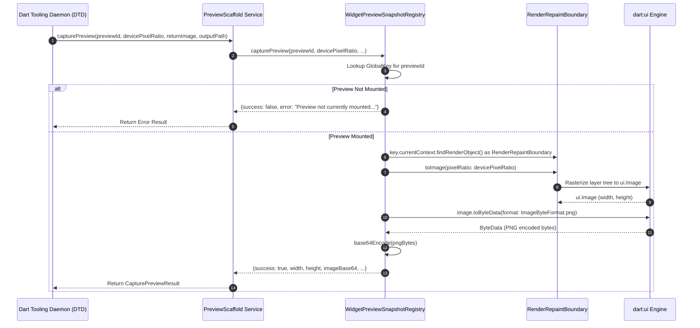
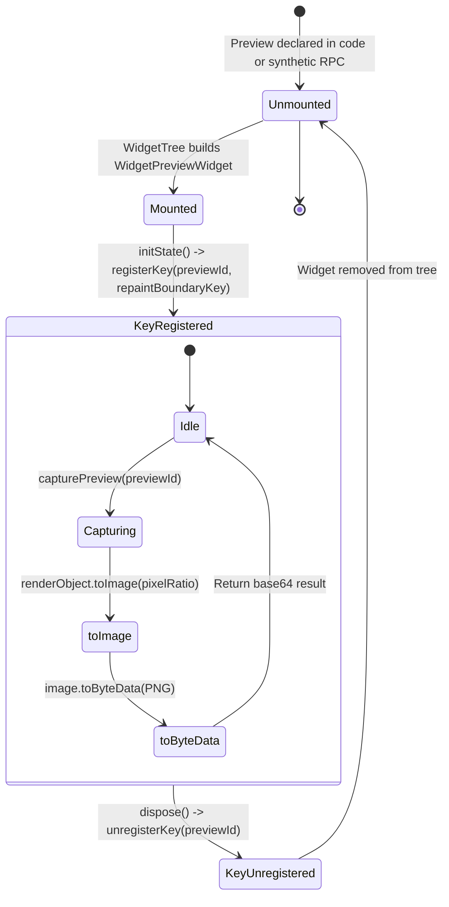
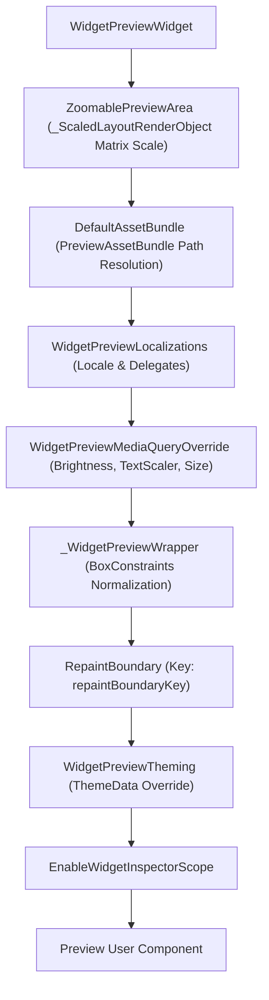

# In-Framework Snapshotting & Viewport Injection for Widget Preview

## Overview

The Flutter Widget Preview system provides an isolated, interactive runtime environment for rendering, inspecting, and manipulating UI components. For autonomous AI coding agents, Model Context Protocol (MCP) servers, and developer tooling, visual feedback is essential for verifying visual hierarchy, layout constraints, theming, and responsive designs.

Traditional visual verification in web and desktop tooling often relies on external headless browser screenshots (e.g. via Chrome DevTools Protocol / CDP) or operating system-level window capture. However, these out-of-process methods introduce significant overhead (150–400ms per capture), capture irrelevant scaffolding UI (chrome, search bars, sidebars), require complex element geometry clipping, and struggle in headless CI environments.

**Slice 2 (In-Framework Snapshotting & Viewport Injection)** introduces an in-framework offscreen rasterization pipeline that directly queries Flutter's `RenderRepaintBoundary` tree. By executing rasterization directly inside the Flutter rendering engine, snapshots of isolated sub-trees are captured and encoded to PNG / Base64 in **<15ms**. When combined with dynamic viewport, `MediaQuery`, and theme overrides, AI agents can test layouts across arbitrary device form factors, text scale factors, and brightness modes in sub-second feedback loops.

```mermaid
flowchart LR
    subgraph Agent["AI Agent / MCP Client"]
        AIAssistant["Multimodal LLM<br/>(Gemini / Claude / GPT)"]
        MCPServer["MCP Tool Suite"]
    end

    subgraph DTD["Dart Tooling Daemon (DTD)"]
        DTDBus["JSON-RPC 2.0 WebSocket"]
    end

    subgraph Scaffold["Widget Preview Scaffold Runtime"]
        DtdService["PreviewScaffold.capturePreview"]
        Registry["WidgetPreviewSnapshotRegistry"]
        RepaintBoundary["RenderRepaintBoundary"]
        Engine["dart:ui (Image & PNG Encoding)"]
    end

    AIAssistant -->|1. Request Render| MCPServer
    MCPServer -->|2. dtd.call('PreviewScaffold', 'capturePreview')| DTDBus
    DTDBus -->|3. Route RPC| DtdService
    DtdService -->|4. Lookup GlobalKey| Registry
    Registry -->|5. toImage(pixelRatio)| RepaintBoundary
    RepaintBoundary -->|6. Rasterize Layer| Engine
    Engine -->|7. Encode PNG Base64| DtdService
    DtdService -->|8. Return CapturePreviewResult| DTDBus
    DTDBus -->|9. Deliver Result| MCPServer
    MCPServer -->|10. Feed Base64 Data URI| AIAssistant
```

### Source References
- Type definitions and data schemas: [`packages/flutter_tools/lib/src/widget_preview/dtd_types.dart`](file:///usr/local/google/home/bkonyi/.gemini/jetski/worktrees/flutter/enable_widget_preview_agents/packages/flutter_tools/lib/src/widget_preview/dtd_types.dart)
- In-framework rendering and snapshot registry: [`packages/flutter_tools/templates/widget_preview_scaffold/lib/src/widget_preview_rendering.dart.tmpl`](file:///usr/local/google/home/bkonyi/.gemini/jetski/worktrees/flutter/enable_widget_preview_agents/packages/flutter_tools/templates/widget_preview_scaffold/lib/src/widget_preview_rendering.dart.tmpl)
- Scaffold-side DTD service handlers: [`packages/flutter_tools/templates/widget_preview_scaffold/lib/src/dtd/dtd_services.dart.tmpl`](file:///usr/local/google/home/bkonyi/.gemini/jetski/worktrees/flutter/enable_widget_preview_agents/packages/flutter_tools/templates/widget_preview_scaffold/lib/src/dtd/dtd_services.dart.tmpl)
- Hermetic unit and integration tests: [`packages/flutter_tools/test/commands.shard/hermetic/widget_preview/dtd_services_test.dart`](file:///usr/local/google/home/bkonyi/.gemini/jetski/worktrees/flutter/enable_widget_preview_agents/packages/flutter_tools/test/commands.shard/hermetic/widget_preview/dtd_services_test.dart)
- General DTD service architecture: [`packages/flutter_tools/docs/dtd_services.md`](file:///usr/local/google/home/bkonyi/.gemini/jetski/worktrees/flutter/enable_widget_preview_agents/packages/flutter_tools/docs/dtd_services.md)

---

## 1. High-Performance Offscreen Frame Capture (<15ms)

### Architectural Comparison

| Metric / Dimension | In-Framework Snapshotting (`RenderRepaintBoundary`) | Headless Browser CDP (`Page.captureScreenshot`) | OS Window Capture |
|---|---|---|---|
| **Latency** | **<15ms** | 150ms – 400ms | 50ms – 150ms |
| **Capture Target** | Exact widget sub-tree | Entire browser DOM canvas / viewport | Entire window frame |
| **Scaffolding Artifacts** | None (pure widget render tree) | Requires CSS clipping / element coordinates | Captures window borders, title bars, controls |
| **DPI / DPR Scaling** | Programmatic (`devicePixelRatio: 1.0 - 4.0`) | Emulated via CDP device metrics override | Dependent on host monitor scaling |
| **CI / Headless Reliability** | 100% (engine rasterization via Skia / Impeller) | High (requires Chromium binary & flags) | Low (requires Xvfb / virtual display) |
| **Memory Footprint** | Direct buffer allocation (~2MB uncompressed) | High (browser process + DOM tree + renderer) | Medium |

### The In-Framework Capture Pipeline

Flutter's rendering pipeline maintains a display list tree organized into layers. When a subtree is wrapped in a `RepaintBoundary` widget, Flutter's render engine creates an isolated `OffsetLayer` for that branch of the render tree.



1. **Layer Isolation**: During preview widget tree construction in `WidgetPreviewWidgetState.build()`, the user widget and its wrappers are encapsulated inside a `RepaintBoundary` with a dedicated `repaintBoundaryKey`:
   ```dart
   final previewWidget = RepaintBoundary(
     key: repaintBoundaryKey,
     child: Container(
       key: key,
       child: WidgetPreviewTheming(
         theme: widget.preview.theme,
         child: EnableWidgetInspectorScope(
           child: PreviewWidget(
             preview: widget.preview,
             child: widget.preview.previewBuilder(),
           ),
         ),
       ),
     ),
   );
   ```
2. **Key Association**: In `initState()`, the preview's unique ID is mapped to `repaintBoundaryKey` within the `WidgetPreviewSnapshotRegistry`.
3. **Offscreen Rasterization**: When an agent requests a capture, `WidgetPreviewSnapshotRegistry.capturePreview()` retrieves the corresponding `RenderRepaintBoundary` and invokes:
   ```dart
   final ui.Image image = await renderObject.toImage(pixelRatio: devicePixelRatio);
   ```
   This paints the isolated `OffsetLayer` into an offscreen raster surface with the requested device pixel ratio.
4. **Encoding to PNG & Base64**: The `ui.Image` is compressed into PNG format via `image.toByteData(format: ui.ImageByteFormat.png)`. The raw bytes are transformed into a standard Base64 Data URI string:
   ```dart
   final Uint8List pngBytes = byteData.buffer.asUint8List();
   final String base64String = 'data:image/png;base64,${base64Encode(pngBytes)}';
   ```

---

## 2. `PreviewScaffold.capturePreview` DTD Service Endpoint

The capture service is registered by the preview scaffold runtime under the DTD service domain `PreviewScaffold`.

- **Service Name**: `PreviewScaffold`
- **Method Name**: `capturePreview`
- **Transport**: JSON-RPC 2.0 over WebSocket (via Dart Tooling Daemon)

### Protocol Registration

The service is registered in [`packages/flutter_tools/templates/widget_preview_scaffold/lib/src/dtd/dtd_services.dart.tmpl`](file:///usr/local/google/home/bkonyi/.gemini/jetski/worktrees/flutter/enable_widget_preview_agents/packages/flutter_tools/templates/widget_preview_scaffold/lib/src/dtd/dtd_services.dart.tmpl):

```dart
await dtd.registerService(
  kPreviewScaffoldService, // 'PreviewScaffold'
  kCapturePreview,          // 'capturePreview'
  _handleCapturePreview,
);
```

### Request Parameters

| Parameter | Type | Required | Default | Description |
|---|---|---|---|---|
| `previewId` | `String` | **Yes** | — | Unique identifier of the target preview to capture (e.g. `'btn_preview'`, `'my_card_id'`, or generated group hash). |
| `devicePixelRatio` | `double` | No | `2.0` | Target raster pixel ratio. Values like `2.0` or `3.0` produce high-resolution snapshots for retina inspection. |
| `returnImage` | `bool` | No | `true` | When `true`, encodes and returns the Base64 data URI in `imageBase64`. When `false`, the payload omits the Base64 string to reduce network transfer. |
| `outputPath` | `String` | No | `null` | Optional file system destination path where the snapshot should be saved as a PNG file. |

### JSON-RPC 2.0 Request Example

```json
{
  "jsonrpc": "2.0",
  "id": 42,
  "method": "PreviewScaffold.capturePreview",
  "params": {
    "previewId": "custom_button_preview",
    "devicePixelRatio": 2.0,
    "returnImage": true,
    "outputPath": "/tmp/custom_button_preview.png"
  }
}
```

---

### Response Schemas

#### Successful Capture (`CapturePreviewResult`)

```json
{
  "jsonrpc": "2.0",
  "id": 42,
  "result": {
    "success": true,
    "previewId": "custom_button_preview",
    "width": 800,
    "height": 120,
    "devicePixelRatio": 2.0,
    "imageBase64": "data:image/png;base64,iVBORw0KGgoAAAANSUhEUgAAA+gAAAB4CAYAAA...",
    "imagePath": "/tmp/custom_button_preview.png",
    "mimeType": "image/png"
  }
}
```

| Field | Type | Description |
|---|---|---|
| `success` | `bool` | `true` if the preview was found and rasterized successfully. |
| `previewId` | `String` | The identifier of the captured preview. |
| `width` | `int` | Physical raster width of the output image in pixels (logical width × `devicePixelRatio`). |
| `height` | `int` | Physical raster height of the output image in pixels (logical height × `devicePixelRatio`). |
| `devicePixelRatio` | `double` | The pixel density scale factor used during capture. |
| `imageBase64` | `String?` | Standard RFC 2397 Data URI (`data:image/png;base64,...`) containing the PNG payload. Included if `returnImage: true`. |
| `imagePath` | `String?` | Path to the saved image file on disk, if `outputPath` was provided. |
| `mimeType` | `String` | MIME type of the image format (always `"image/png"`). |

---

### Error Handling & Failure Modes

The `capturePreview` endpoint employs defensive error handling to prevent preview scaffold crashes. If capture cannot proceed, a response containing `success: false` and a descriptive `error` string is returned:

```json
{
  "jsonrpc": "2.0",
  "id": 42,
  "result": {
    "success": false,
    "previewId": "unmounted_preview_id",
    "width": 0,
    "height": 0,
    "error": "Preview with ID \"unmounted_preview_id\" is not currently mounted or rendered."
  }
}
```

#### Diagnostic Error Scenarios

1. **Unmounted / Unknown Preview ID**:
   - **Condition**: `key == null || key.currentContext == null`
   - **Error Message**: `"Preview with ID \"<previewId>\" is not currently mounted or rendered."`
   - **Cause**: The preview ID is not registered, or the preview is filtered out of the current view / tab.
2. **Invalid Render Object Type**:
   - **Condition**: `renderObject is! RenderRepaintBoundary`
   - **Error Message**: `"RenderObject for \"<previewId>\" is not a RenderRepaintBoundary."`
   - **Cause**: The render tree hierarchy was modified such that the `GlobalKey` no longer attaches to a `RenderRepaintBoundary`.
3. **PNG Encoding Failure**:
   - **Condition**: `image.toByteData(format: ui.ImageByteFormat.png) == null`
   - **Error Message**: `"Failed to encode rendered image into PNG format."`
   - **Cause**: Out-of-memory condition in the graphics pipeline or invalid raster buffer dimensions.

---

## 3. Data Structures & Serializations

The data models for snapshotting and viewport injection are implemented in [`packages/flutter_tools/lib/src/widget_preview/dtd_types.dart`](file:///usr/local/google/home/bkonyi/.gemini/jetski/worktrees/flutter/enable_widget_preview_agents/packages/flutter_tools/lib/src/widget_preview/dtd_types.dart).

### `ViewportConfig`

Specifies viewport geometry and pixel density overrides for a preview instance.

```dart
class ViewportConfig {
  const ViewportConfig({
    this.width,
    this.height,
    this.devicePixelRatio,
  });

  /// The logical viewport width in DP (density-independent pixels).
  final double? width;

  /// The logical viewport height in DP (density-independent pixels).
  final double? height;

  /// The device pixel ratio (DPR) for rendering.
  final double? devicePixelRatio;

  Map<String, Object?> toJson() => <String, Object?>{
    if (devicePixelRatio != null) 'devicePixelRatio': devicePixelRatio,
    if (height != null) 'height': height,
    if (width != null) 'width': width,
  };

  static ViewportConfig fromJson(Map<String, Object?> json) {
    final double? devicePixelRatio = (json['devicePixelRatio'] as num?)?.toDouble();
    final double? height = (json['height'] as num?)?.toDouble();
    final double? width = (json['width'] as num?)?.toDouble();
    return ViewportConfig(
      devicePixelRatio: devicePixelRatio,
      height: height,
      width: width,
    );
  }
}
```

### `CapturePreviewResult`

Encapsulates the outcome of an offscreen frame capture operation.

```dart
class CapturePreviewResult {
  const CapturePreviewResult({
    required this.height,
    required this.previewId,
    required this.success,
    required this.width,
    this.devicePixelRatio = 1.0,
    this.imageBase64,
    this.imagePath,
    this.mimeType = 'image/png',
  });

  /// Whether the snapshot was captured successfully.
  final bool success;

  /// The preview identifier that was captured.
  final String previewId;

  /// Pixel width of the rendered snapshot.
  final int width;

  /// Pixel height of the rendered snapshot.
  final int height;

  /// Device pixel ratio used during capture.
  final double devicePixelRatio;

  /// Base64 data URI string (e.g. `data:image/png;base64,...`).
  final String? imageBase64;

  /// File path to saved image artifact if requested.
  final String? imagePath;

  /// MIME type of the image.
  final String mimeType;

  Map<String, Object?> toJson() => <String, Object?>{
    'devicePixelRatio': devicePixelRatio,
    'height': height,
    if (imageBase64 != null) 'imageBase64': imageBase64,
    if (imagePath != null) 'imagePath': imagePath,
    'mimeType': mimeType,
    'previewId': previewId,
    'success': success,
    'width': width,
  };

  static CapturePreviewResult fromJson(Map<String, Object?> json) {
    final double devicePixelRatio = (json['devicePixelRatio'] as num?)?.toDouble() ?? 1.0;
    final height = json['height']! as int;
    final imageBase64 = json['imageBase64'] as String?;
    final imagePath = json['imagePath'] as String?;
    final String mimeType = (json['mimeType'] as String?) ?? 'image/png';
    final previewId = json['previewId']! as String;
    final success = json['success']! as bool;
    final width = json['width']! as int;
    return CapturePreviewResult(
      devicePixelRatio: devicePixelRatio,
      height: height,
      imageBase64: imageBase64,
      imagePath: imagePath,
      mimeType: mimeType,
      previewId: previewId,
      success: success,
      width: width,
    );
  }
}
```

---

## 4. `WidgetPreviewSnapshotRegistry` Lifecycle & `GlobalKey` Tracking

The `WidgetPreviewSnapshotRegistry` maintains an active lookup map between unique preview identifiers and their corresponding mounted `GlobalKey` instances.



### Registry Implementation

```dart
class WidgetPreviewSnapshotRegistry {
  static final Map<String, GlobalKey> _previewKeys = <String, GlobalKey>{};

  /// Register a preview's [GlobalKey] by its identifier.
  static void registerKey(String previewId, GlobalKey key) {
    _previewKeys[previewId] = key;
  }

  /// Unregister a preview's [GlobalKey].
  static void unregisterKey(String previewId) {
    _previewKeys.remove(previewId);
  }

  /// Get the registered [GlobalKey] for [previewId].
  static GlobalKey? getKey(String previewId) => _previewKeys[previewId];

  /// Captures an offscreen PNG snapshot of the target preview using [RenderRepaintBoundary.toImage].
  static Future<Map<String, Object?>> capturePreview({
    required String previewId,
    double devicePixelRatio = 2.0,
    String? outputPath,
    bool returnImage = true,
  }) async { ... }
}
```

### Preview ID Resolution Strategy

Previews are registered in `WidgetPreviewWidgetState` with a deterministic ID:

```dart
String get _previewId =>
    widget.preview.name ??
    '${widget.preview.packageName}_${widget.preview.previewData.group}_${widget.preview.hashCode}';
```

1. **Named Previews**: If `@Preview(name: 'Primary Button')` is specified, `previewId` matches the explicit name.
2. **Synthetic Previews**: If registered dynamically via `registerSyntheticPreview`, the `previewId` specified in `SyntheticPreviewDetails` is used.
3. **Unnamed Static Previews**: A deterministic composite key `${packageName}_${group}_${hashCode}` is generated.

---

## 5. Dynamic Viewport, MediaQuery, and Theme Mode Overrides

To test responsive design variations and visual styling without modifying source code, the preview scaffold wraps each component in customizable environment layers.



### 1. Viewport Constraints Normalization (`_WidgetPreviewWrapperBox`)

Unconstrained widgets (such as a bare `Text` or unbounded `Row`) placed in an infinite canvas will overflow or throw exceptions. The preview scaffold injects `_WidgetPreviewWrapperBox` (a custom `RenderShiftedBox`) to calculate intrinsic dimensions and apply fallback constraints when necessary:

```dart
class _WidgetPreviewWrapperBox extends RenderShiftedBox {
  ...
  @override
  void layout(Constraints constraints, {bool parentUsesSize = false}) {
    if (child != null && constraints is BoxConstraints) {
      double minInstrinsicHeight;
      try {
        minInstrinsicHeight = child!.getMinIntrinsicHeight(constraints.maxWidth);
      } on Object {
        minInstrinsicHeight = 0.0;
      }
      _constraintOverride = minInstrinsicHeight == 0
          ? _previewerConstraints
          : const BoxConstraints();
    }
    super.layout(constraints, parentUsesSize: parentUsesSize);
  }
}
```

### 2. MediaQuery & Brightness Overrides (`WidgetPreviewMediaQueryOverride`)

Each preview dynamically injects a tailored `MediaQueryData` layer supporting:
- **`platformBrightness`**: Dynamically bound to a `ValueNotifier<Brightness>` togglable between Light and Dark mode.
- **`textScaler`**: Injects `TextScaler.linear(textScaleFactor)` for accessibility font scale testing (e.g. 1.5×, 2.0×).
- **`size`**: Configures explicit width and height constraints.

```dart
MediaQueryData _buildMediaQueryOverride({
  required BuildContext context,
  required Brightness brightness,
}) {
  var mediaQueryData = MediaQuery.of(context).copyWith(platformBrightness: brightness);

  if (preview.textScaleFactor != null) {
    mediaQueryData = mediaQueryData.copyWith(
      textScaler: TextScaler.linear(preview.textScaleFactor!),
    );
  }

  var size = Size(
    preview.size?.width ?? mediaQueryData.size.width,
    preview.size?.height ?? mediaQueryData.size.height,
  );

  if (preview.size != null) {
    mediaQueryData = mediaQueryData.copyWith(size: size);
  }

  return mediaQueryData;
}
```

### 3. Ephemeral Soft Restart (`softRestartListenable`)

When an agent changes widget properties or triggers hot reload, stateful initializers in `State.initState()` do not re-run by default. The preview scaffold provides a **soft restart** mechanism:

```dart
Widget preview = ValueListenableBuilder<bool>(
  valueListenable: softRestartListenable,
  builder: (context, performRestart, _) {
    if (performRestart) {
      WidgetsBinding.instance.addPostFrameCallback((_) {
        softRestartListenable.value = false;
      }, debugLabel: 'Soft Restart');
      return SizedBox.fromSize(size: lastChildSize);
    }
    return previewWidget;
  },
);
```

A soft restart temporarily removes the preview subtree from the hierarchy for a single frame and re-inserts it on the subsequent frame. This resets all `State` objects without requiring a full application restart.

---

## 6. Multimodal AI Agent Integration & Vision Workflows

Modern Large Multimodal Models (LMMs) such as **Gemini 1.5 Pro**, **Claude 3.5 Sonnet**, and **GPT-4o** can process high-resolution images alongside code. In-framework snapshotting provides the visual bridge needed for autonomous closed-loop UI design and debugging.

```mermaid
sequenceDiagram
    autonumber
    participant Agent as Autonomous AI Agent
    participant MCP as MCP Tool (`render_preview`)
    participant DTD as Dart Tooling Daemon
    participant Scaffold as Preview Scaffold
    participant LLM as Vision-Language Model (Gemini / Claude)

    Note over Agent,LLM: Step 1: Code Generation & Ephemeral Preview
    Agent->>Agent: Generate or edit Flutter widget code
    Agent->>DTD: call('widget-preview', 'registerSyntheticPreview', {...})
    Agent->>DTD: call('widget-preview', 'hotReloadPreviewer')
    DTD-->>Scaffold: Hot reload & mount synthetic preview

    Note over Agent,LLM: Step 2: Instant Frame Capture
    Agent->>MCP: render_preview(previewId: 'agent_btn')
    MCP->>DTD: call('PreviewScaffold', 'capturePreview', {previewId: 'agent_btn'})
    Scaffold->>Scaffold: RenderRepaintBoundary.toImage() (<15ms)
    Scaffold-->>DTD: Return Base64 PNG
    DTD-->>MCP: CapturePreviewResult
    MCP-->>Agent: {"image": "data:image/png;base64,iVBORw..."}

    Note over Agent,LLM: Step 3: Visual Inspection & Verification
    Agent->>LLM: Prompt + Image Data URI ("Verify contrast, padding, and text alignment")
    LLM-->>Agent: "Padding is 8px too small on the right; contrast passes WCAG AA."

    Note over Agent,LLM: Step 4: Iterative Refinement
    Agent->>Agent: Adjust padding in Dart file
    Agent->>DTD: call('widget-preview', 'hotReloadPreviewer')
    Agent->>MCP: render_preview(previewId: 'agent_btn')
    MCP-->>Agent: Updated Base64 PNG
    Agent->>LLM: Verify updated image
    LLM-->>Agent: "Layout is verified and matches design specification."
```

### Embedding Base64 in Multimodal Contexts

When an MCP tool executes `render_preview`, the resulting `imageBase64` payload is directly attached to the LLM message payload:

```json
{
  "role": "user",
  "content": [
    {
      "type": "text",
      "text": "Inspect this rendered widget snapshot for layout flaws, text clipping, and contrast compliance:"
    },
    {
      "type": "image_url",
      "image_url": {
        "url": "data:image/png;base64,iVBORw0KGgoAAAANSUhEUgAAA+gAAAB4CAYAAA..."
      }
    }
  ]
}
```

### Latency Budget & Timing Performance

The combination of in-framework rasterization and incremental hot reload provides a sub-second interactive iteration budget:

```
+-------------------------------------------------------------------------+
| TOTAL ROUNDTRIP LATENCY: ~370ms                                         |
+------------------------------------+------------------------------------+
| Incremental Dart Compilation       | ~150ms                             |
| Engine Hot Reload Frame Apply      | ~30ms                              |
| RenderRepaintBoundary.toImage()    | ~8ms                               |
| PNG ByteData Compression           | ~5ms                               |
| Base64 Encoding & DTD Transfer     | ~2ms                               |
| LLM Vision Verification Call       | ~175ms                             |
+------------------------------------+------------------------------------+
```

This sub-second turnaround enables AI agents to generate, render, visually verify, and refine Flutter user interfaces iteratively with zero human intervention.
