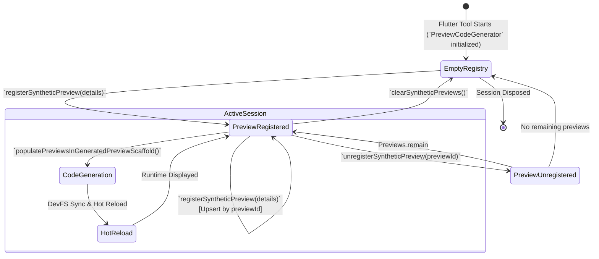
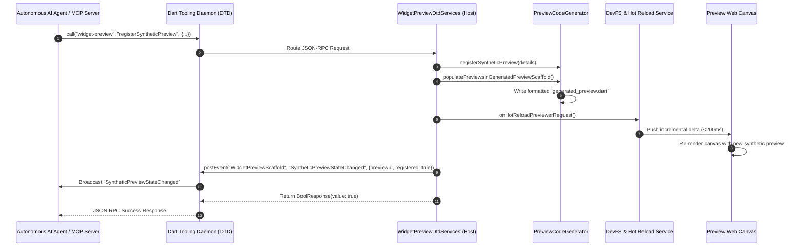

# Ephemeral Synthetic Preview Scaffolding & Dynamic Injection Engine

## Overview & Problem Statement

The Flutter Widget Preview environment provides an isolated, fast-refresh canvas for previewing and testing UI components. In standard Flutter development, widget previews are declared statically in user code by annotating functions or classes with the `@Preview` annotation:

```dart
@Preview()
Widget primaryButtonPreview() => const PrimaryButton(label: 'Submit');
```

While static `@Preview` declarations work well for human developers designing curated component catalogs in an IDE, they impose severe limitations on **autonomous AI coding agents**, **automated testing pipelines**, and **interactive developer tooling**:

1. **Source Code Pollution & Git Diff Noise**: Requiring `@Preview` annotations forces AI agents or IDE extensions to modify user source files directly. This contaminates version control (`git diff`, `git status`), triggers linter warnings, and risks committing throwaway or broken preview scaffolding into production codebases.
2. **Inability to Explore Dynamic Permutations**: Testing multiple constructor parameter combinations (e.g. edge-case string lengths, localization variants, theme overrides, disabled states) requires modifying and recompiling user files repeatedly.
3. **Missing Framework Parent Context**: Standalone Flutter widgets (such as a custom `Text`, `InkWell`, or button) typically fail to render in isolation if they lack ancestor widgets providing ambient inherited context—most notably [`Directionality`](file:///usr/local/google/home/bkonyi/.gemini/jetski/worktrees/flutter/enable_widget_preview_agents/packages/flutter_tools/lib/src/widget_preview/preview_code_generator.dart#L299), [`Material`](file:///usr/local/google/home/bkonyi/.gemini/jetski/worktrees/flutter/enable_widget_preview_agents/packages/flutter_tools/lib/src/widget_preview/preview_code_generator.dart#L294), or a [`Scaffold`](file:///usr/local/google/home/bkonyi/.gemini/jetski/worktrees/flutter/enable_widget_preview_agents/packages/flutter_tools/lib/src/widget_preview/preview_code_generator.dart#L307) canvas.

### The Slice 4 Solution

**Slice 4 (Ephemeral Synthetic Preview Injection Engine)** introduces an in-memory, dynamic preview injection pipeline within [`PreviewCodeGenerator`](file:///usr/local/google/home/bkonyi/.gemini/jetski/worktrees/flutter/enable_widget_preview_agents/packages/flutter_tools/lib/src/widget_preview/preview_code_generator.dart). 

This engine allows AI agents, MCP servers, and IDEs to register, render, and inspect arbitrary widget constructor expressions on-the-fly without touching the developer's source files. Synthetic previews are registered dynamically over the **Dart Tooling Daemon (DTD)**, integrated into the scaffold's generated Dart entrypoint alongside statically discovered `@Preview` annotations, wrapped automatically in necessary runtime scaffolding (e.g. `Material`, `Directionality`, `Scaffold`), and delivered via sub-second Hot Reload (<200ms).

```mermaid
flowchart TB
    subgraph AgentClient["Autonomous AI Agent / MCP Server / IDE"]
        AgentLogic["AI Code Generation / Inspection Engine"]
        DTDClient["DTD Client / JSON-RPC Bus"]
    end

    subgraph FlutterToolHost["Flutter CLI Host Process (`flutter widget-preview`)"]
        DTDServices["WidgetPreviewDtdServices<br/>- `registerSyntheticPreview`<br/>- `unregisterSyntheticPreview`<br/>- `clearSyntheticPreviews`"]
        CodeGen["PreviewCodeGenerator<br/>- In-Memory Registry (`_syntheticPreviews`)<br/>- Code Builder & AST Generation<br/>- Automatic Wrapper Injection"]
        Detector["PreviewDetector / LSP Analysis Server<br/>(Static `@Preview` Annotations)"]
    end

    subgraph PreviewScaffoldFS["Project Ephemeral Storage (`.dart_tool/widget_preview_scaffold/`)"]
        GeneratedFile["`lib/src/generated_preview.dart`<br/>`List<WidgetPreview> previews() => [...]`"]
    end

    subgraph PreviewWebRuntime["Widget Preview Runtime Canvas (Web Application)"]
        DevFS["DevFS Fast Incremental Hot Reload (<200ms)"]
        CanvasRenderer["Flutter Web Render Tree & Error Boundary"]
        SnapshotEngine["RenderRepaintBoundary.toImageSync() (<15ms)"]
    end

    AgentLogic -->|1. Register Synthetic Preview| DTDClient
    DTDClient -->|2. DTD RPC Request| DTDServices
    DTDServices -->|3. Delegate Registration| CodeGen
    Detector -.->|Statically Discovered Previews| CodeGen
    CodeGen -->|4. Generate Merged AST & Format| GeneratedFile
    DTDServices -->|5. Trigger Hot Reload| DevFS
    DevFS -->|6. Mount Dynamic Preview| CanvasRenderer
    DTDServices -->|7. Emit `SyntheticPreviewStateChanged`| DTDClient
    CanvasRenderer -->|8. High-Speed Snapshot| SnapshotEngine
    SnapshotEngine -->|9. Base64 PNG / Diagnostic| AgentLogic
```

### Source References
- Synthetic preview code generation and wrapper injection: [`packages/flutter_tools/lib/src/widget_preview/preview_code_generator.dart`](file:///usr/local/google/home/bkonyi/.gemini/jetski/worktrees/flutter/enable_widget_preview_agents/packages/flutter_tools/lib/src/widget_preview/preview_code_generator.dart)
- Data model and JSON schema definitions: [`packages/flutter_tools/lib/src/widget_preview/dtd_types.dart`](file:///usr/local/google/home/bkonyi/.gemini/jetski/worktrees/flutter/enable_widget_preview_agents/packages/flutter_tools/lib/src/widget_preview/dtd_types.dart)
- Host DTD service endpoints and event broadcasting: [`packages/flutter_tools/lib/src/widget_preview/dtd_services.dart`](file:///usr/local/google/home/bkonyi/.gemini/jetski/worktrees/flutter/enable_widget_preview_agents/packages/flutter_tools/lib/src/widget_preview/dtd_services.dart)
- Hermetic unit tests: [`packages/flutter_tools/test/commands.shard/hermetic/widget_preview/preview_code_generator_test.dart`](file:///usr/local/google/home/bkonyi/.gemini/jetski/worktrees/flutter/enable_widget_preview_agents/packages/flutter_tools/test/commands.shard/hermetic/widget_preview/preview_code_generator_test.dart)

---

## 1. Synthetic Preview Data Model (`SyntheticPreviewDetails`)

The [`SyntheticPreviewDetails`](file:///usr/local/google/home/bkonyi/.gemini/jetski/worktrees/flutter/enable_widget_preview_agents/packages/flutter_tools/lib/src/widget_preview/dtd_types.dart#L273-L347) class encapsulates the parameters required to instantiate and render a widget dynamically:

```dart
class SyntheticPreviewDetails {
  const SyntheticPreviewDetails({
    required this.constructorExpression,
    required this.filePath,
    required this.previewId,
    required this.widgetName,
    this.wrappers = const <String>[],
  });

  /// The Dart instantiation expression for the widget (e.g. `PrimaryButton(label: 'Test')`).
  final String constructorExpression;

  /// The absolute file path to the source file where the widget is defined.
  final String filePath;

  /// A unique identifier for this synthetic preview.
  final String previewId;

  /// The name of the widget class being previewed.
  final String widgetName;

  /// Optional list of wrapper widget types to wrap around the preview (e.g. `Material`, `Directionality`, `Scaffold`).
  final List<String> wrappers;
}
```

### Field Specification

| Property | Type | Required | Description | Example |
|---|---|---|---|---|
| `constructorExpression` | `String` | **Yes** | Valid Dart code expression that instantiates the target widget. | `CustomCard(title: 'Agent Test', count: 42)` |
| `filePath` | `String` | **Yes** | Absolute path on the host filesystem to the Dart source file containing the widget class. | `/workspace/app/lib/src/card.dart` |
| `previewId` | `String` | **Yes** | Unique identifier for targeting, snapshotting, and lifecycle management. | `agent_card_test_01` |
| `widgetName` | `String` | **Yes** | Name of the widget class (used for display titles, grouping, and inspector labeling). | `CustomCard` |
| `wrappers` | `List<String>` | No | Ordered list of ambient framework wrappers to apply around the widget instance. Default: `[]`. | `["Material", "Directionality"]` |

### JSON Serialization & Wire Format

```json
{
  "constructorExpression": "PrimaryButton(label: 'Submit', onPressed: null)",
  "filePath": "/workspace/my_app/lib/src/buttons.dart",
  "previewId": "agent_preview_primary_btn",
  "widgetName": "PrimaryButton",
  "wrappers": [
    "Directionality",
    "Material"
  ]
}
```

---

## 2. Ephemeral In-Memory Registry & Lifecycle

The [`PreviewCodeGenerator`](file:///usr/local/google/home/bkonyi/.gemini/jetski/worktrees/flutter/enable_widget_preview_agents/packages/flutter_tools/lib/src/widget_preview/preview_code_generator.dart#L24-L56) maintains an internal in-memory map of active synthetic previews:

```dart
class PreviewCodeGenerator {
  ...
  final Map<String, SyntheticPreviewDetails> _syntheticPreviews =
      <String, SyntheticPreviewDetails>{};

  /// Registers an ephemeral synthetic preview.
  void registerSyntheticPreview(SyntheticPreviewDetails preview) {
    _syntheticPreviews[preview.previewId] = preview;
  }

  /// Unregisters an ephemeral synthetic preview by its identifier.
  bool unregisterSyntheticPreview(String previewId) {
    return _syntheticPreviews.remove(previewId) != null;
  }

  /// Clears all registered synthetic previews and returns the count of removed previews.
  int clearSyntheticPreviews() {
    final int count = _syntheticPreviews.length;
    _syntheticPreviews.clear();
    return count;
  }

  /// List of currently registered synthetic previews.
  List<SyntheticPreviewDetails> get syntheticPreviews =>
      List<SyntheticPreviewDetails>.unmodifiable(_syntheticPreviews.values);
  ...
}
```

### Registry Lifecycle & State Machine



### Key Lifecycle Invariants
1. **Idempotent Upsert**: Registering a synthetic preview with an existing `previewId` overwrites the existing configuration, allowing fast in-place parameter mutations without requiring an explicit unregister step.
2. **Zero Working Tree Footprint**: Previews exist solely in host memory and within the scaffold's internal `.dart_tool/widget_preview_scaffold/` directory. No edits are made to `lib/` or `test/` in the user's workspace.
3. **Deterministic Unregistration**: `unregisterSyntheticPreview` returns `true` if the preview existed and was removed, or `false` otherwise.
4. **Bulk Purge**: `clearSyntheticPreviews` cleans all synthetic previews in a single atomic operation and returns the integer count of purged items.

---

## 3. AST and Code Generation Pipeline

The preview scaffold runner compiles a dedicated entrypoint file located at:
```
.dart_tool/widget_preview_scaffold/lib/src/generated_preview.dart
```

This file defines a single top-level function `previews()` that returns a `List<WidgetPreview>`.

### Merged Generation Pipeline

The generation pipeline in [`PreviewCodeGenerator`](file:///usr/local/google/home/bkonyi/.gemini/jetski/worktrees/flutter/enable_widget_preview_agents/packages/flutter_tools/lib/src/widget_preview/preview_code_generator.dart#L226-L286) supports both analysis engines (Analyzer graph and LSP):

```mermaid
flowchart TD
    subgraph Inputs["Discovery & Registration Inputs"]
        StaticGraph["Static Previews (`PreviewDependencyGraph` or `FlutterWidgetPreviews`)"]
        SyntheticMap["Synthetic Previews (`_syntheticPreviews.values`)"]
    end

    subgraph GenerationMethod["`_buildGeneratedPreviewMethod()`"]
        SortStatic["1. Sort Static Previews by Library URI (Deterministic Imports)"]
        BuildStatic["2. Emit `_buildPreviews()` / `_buildPreviewsLsp()`"]
        BuildSynthetic["3. Iterate & Emit `_buildSyntheticPreview()` for Each Synthetic Preview"]
        WrapList["4. Construct `List<WidgetPreview> previews() => [...]` Code AST"]
    end

    subgraph CodeFormatting["Dart Code Formatting & Output"]
        CodeBuilder["`package:code_builder` DartEmitter"]
        Formatter["`DartFormatter(languageVersion: Version(3, 7, 0))`"]
        OutputFile["`.dart_tool/widget_preview_scaffold/lib/src/generated_preview.dart`"]
    end

    StaticGraph --> SortStatic
    SortStatic --> BuildStatic
    SyntheticMap --> BuildSynthetic
    BuildStatic --> WrapList
    BuildSynthetic --> WrapList
    WrapList --> CodeBuilder
    CodeBuilder --> Formatter
    Formatter --> OutputFile
```

### AST Generation Logic

Inside `_buildGeneratedPreviewMethod` and `_buildGeneratedPreviewMethodLsp`:

```dart
builder
  ..body = cb.literalList([
    // 1. Static previews from developer source files
    for (final libraryPreviews in sortedPreviews)
      for (final preview in libraryPreviews.value.previews)
        _buildPreviews(
          preview: preview,
          uri: libraryPreviews.key.uri,
          libraryDetails: libraryPreviews.value,
        ),
    // 2. Dynamic synthetic previews registered by agents / IDE
    for (final synthetic in _syntheticPreviews.values)
      _buildSyntheticPreview(synthetic),
  ]).code
  ..name = _kPreviewsFunctionName
  ..returns = (cb.TypeReferenceBuilder()
        ..symbol = _kListType
        ..types = ListBuilder<cb.Reference>(<cb.Reference>[
          cb.refer(_kWidgetPreviewClass, _kWidgetPreviewLibraryUri),
        ]))
      .build();
```

### Generated File Output Example

When static previews exist alongside synthetic agent previews, `generated_preview.dart` is produced with formatted, prefixed imports:

```dart
// ignore_for_file: implementation_imports

// ignore_for_file: no_leading_underscores_for_library_prefixes
import 'widget_preview.dart' as _i1;
import 'utils.dart' as _i2;
import 'package:foo_project/foo.dart' as _i3;
import 'package:flutter/src/widget_previews/widget_previews.dart' as _i4;
import 'package:flutter/material.dart' as _i5;
import 'package:flutter/widgets.dart' as _i6;
import 'dart:ui' as _i7;

List<_i1.WidgetPreview> previews() => [
  // Static Preview
  _i2.buildWidgetPreview(
    packageName: 'foo_project',
    scriptUri: 'file:///workspace/foo_project/lib/foo.dart',
    line: 4,
    column: 1,
    previewFunction: () => _i3.preview(),
    transformedPreview: const _i4.Preview().transform(),
  ),

  // Synthetic Preview 1: PrimaryButton wrapped in Material
  _i1.WidgetPreview(
    name: 'PrimaryButton',
    child: _i5.Material(
      child: PrimaryButton(label: 'Submit'),
    ),
  ),

  // Synthetic Preview 2: Badge wrapped in Directionality (LTR)
  _i1.WidgetPreview(
    name: 'Badge',
    child: _i6.Directionality(
      textDirection: _i7.TextDirection.ltr,
      child: Badge(count: 42),
    ),
  ),
];
```

---

## 4. Automatic UI Wrapper Injection Engine

When rendering arbitrary widget constructor expressions, child components frequently depend on ambient inherited widgets provided by higher layers of the Flutter framework. For instance:
- `Text` requires a [`Directionality`](file:///usr/local/google/home/bkonyi/.gemini/jetski/worktrees/flutter/enable_widget_preview_agents/packages/flutter_tools/lib/src/widget_preview/preview_code_generator.dart#L299) ancestor to determine text layout orientation (`TextDirection.ltr` or `TextDirection.rtl`).
- `InkWell`, `ListTile`, and `ElevatedButton` require a [`Material`](file:///usr/local/google/home/bkonyi/.gemini/jetski/worktrees/flutter/enable_widget_preview_agents/packages/flutter_tools/lib/src/widget_preview/preview_code_generator.dart#L294) ancestor to paint splash effects and resolve elevation surface tints.
- App bars, floating action buttons, snackbars, and full-screen views require a [`Scaffold`](file:///usr/local/google/home/bkonyi/.gemini/jetski/worktrees/flutter/enable_widget_preview_agents/packages/flutter_tools/lib/src/widget_preview/preview_code_generator.dart#L307) canvas.

### Wrapper Implementation in `_buildSyntheticPreview`

[`PreviewCodeGenerator._buildSyntheticPreview`](file:///usr/local/google/home/bkonyi/.gemini/jetski/worktrees/flutter/enable_widget_preview_agents/packages/flutter_tools/lib/src/widget_preview/preview_code_generator.dart#L288-L318) constructs nested `code_builder` expressions by iterating over the specified `wrappers` list:

```dart
cb.Expression _buildSyntheticPreview(SyntheticPreviewDetails preview) {
  cb.Expression child = cb.CodeExpression(cb.Code(preview.constructorExpression));

  for (final String wrapper in preview.wrappers) {
    final String normalized = wrapper.toLowerCase();
    if (normalized == 'material') {
      child = cb.refer('Material', 'package:flutter/material.dart').call(
        [],
        <String, cb.Expression>{'child': child},
      );
    } else if (normalized == 'directionality') {
      child = cb.refer('Directionality', 'package:flutter/widgets.dart').call(
        [],
        <String, cb.Expression>{
          'textDirection': cb.refer('TextDirection.ltr', 'dart:ui'),
          'child': child,
        },
      );
    } else if (normalized == 'scaffold') {
      child = cb.refer('Scaffold', 'package:flutter/material.dart').call(
        [],
        <String, cb.Expression>{'body': child},
      );
    }
  }

  return cb.refer(_kWidgetPreviewClass, _kWidgetPreviewLibraryUri).call(
    [],
    <String, cb.Expression>{'name': cb.literalString(preview.widgetName), 'child': child},
  );
}
```

### Supported Wrappers Reference

| Wrapper String | Normalized | Target Package | Generated Dart Construction | Purpose |
|---|---|---|---|---|
| `'Material'` | `'material'` | `package:flutter/material.dart` | `Material(child: <child>)` | Provides Material surface canvas, ink splash painting, and theme elevation context. |
| `'Directionality'` | `'directionality'` | `package:flutter/widgets.dart`<br/>`dart:ui` | `Directionality(textDirection: TextDirection.ltr, child: <child>)` | Injects Left-to-Right reading direction for text and bidirectional layouts. |
| `'Scaffold'` | `'scaffold'` | `package:flutter/material.dart` | `Scaffold(body: <child>)` | Provides full viewport background, body sizing constraints, and app structure. |

### Case-Insensitive Normalization & Ordering
- Wrapper identifiers are normalized via `wrapper.toLowerCase()`, supporting `'Material'`, `'material'`, `'DIRECTIONALITY'`, etc.
- Wrappers are composed sequentially in the order listed in `wrappers`. For example, `wrappers: ['Material', 'Directionality']` wraps the raw constructor in `Material`, which is then wrapped in `Directionality`.

---

## 5. Hot Reload & DTD Orchestration

The host Flutter tool exposes synthetic preview management endpoints over DTD and broadcasts real-time state change events.

### DTD Service Endpoints in `WidgetPreviewDtdServices`

The following methods are registered under the `widget-preview` service (or `widget-preview-<UUID>`):

| Method Name | Parameters | Return Type | Description |
|---|---|---|---|
| `registerSyntheticPreview` | [`SyntheticPreviewDetails`](#1-synthetic-preview-data-model-syntheticpreviewdetails) | `BoolResponse` (`{"type": "BoolResponse", "value": bool}`) | Adds or updates an ephemeral synthetic preview and triggers code re-generation. |
| `unregisterSyntheticPreview` | `{"previewId": String}` | `BoolResponse` (`{"type": "BoolResponse", "value": bool}`) | Removes the specified synthetic preview. |
| `clearSyntheticPreviews` | `{}` | `{"clearedCount": int}` | Removes all registered synthetic previews simultaneously. |
| `hotReloadPreviewer` | `{}` | `Success` (`{"type": "Success"}`) | Triggers fast incremental DevFS compilation and Hot Reload. |

### `SyntheticPreviewStateChanged` Event Stream

When synthetic previews are registered or unregistered, [`WidgetPreviewDtdServices`](file:///usr/local/google/home/bkonyi/.gemini/jetski/worktrees/flutter/enable_widget_preview_agents/packages/flutter_tools/lib/src/widget_preview/dtd_services.dart#L475-L488) emits an event onto the `WidgetPreviewScaffold` stream:

```dart
Future<void> postSyntheticPreviewStateChangedEvent({
  required String previewId,
  required bool registered,
}) async {
  final DartToolingDaemon? dtd = _dtd;
  if (dtd == null) {
    return;
  }
  await dtd.postEvent(
    widgetPreviewScaffoldStream,
    kSyntheticPreviewStateChangedEvent,
    <String, Object?>{'previewId': previewId, 'registered': registered},
  );
}
```

#### Event Payload Schema

```json
{
  "stream": "WidgetPreviewScaffold",
  "event": "SyntheticPreviewStateChanged",
  "data": {
    "previewId": "agent_preview_primary_btn",
    "registered": true
  }
}
```

### Complete DTD Registration & Reload Sequence



---

## 6. Multimodal Agent Workflow for On-The-Fly Widget Inspection

By combining synthetic preview injection, fast DevFS hot reload (<200ms), in-framework snapshotting (`capturePreview` <15ms), and layout diagnostics (`getLayoutDiagnostics`), multimodal AI agents (such as Gemini 1.5 Pro, Claude 3.5 Sonnet, or GPT-4o) can perform closed-loop visual inspection and iterative UI repair without altering repository files.

```mermaid
sequenceDiagram
    autonumber
    participant Agent as AI Coding Agent / LLM
    participant MCP as MCP Tool Suite
    participant DTD as Dart Tooling Daemon
    participant Host as Flutter Tool Host
    participant Scaffold as Preview Scaffold Runtime

    Note over Agent: Phase 1: Dynamic Synthetic Preview Registration
    Agent->>Agent: Determine widget under test (e.g. `UserAvatar(imageUrl: '...', size: 48)`)
    Agent->>MCP: render_synthetic_preview(widgetName, constructorExpression, wrappers: ['Material'])
    MCP->>DTD: call("widget-preview", "registerSyntheticPreview", {...})
    DTD->>Host: Update in-memory registry & re-generate `generated_preview.dart`
    Host->>Scaffold: Hot Reload (<200ms)
    
    Note over Agent: Phase 2: Instant Snapshot Capture (<15ms)
    MCP->>DTD: call("PreviewScaffold", "capturePreview", {previewId: 'synth_avatar_01'})
    DTD->>Scaffold: RenderRepaintBoundary.toImage(pixelRatio: 2.0)
    Scaffold-->>DTD: Return Base64 PNG Data URI
    DTD-->>MCP: CapturePreviewResult (imageBase64)
    MCP-->>Agent: Deliver Image & Viewport Metrics

    Note over Agent: Phase 3: Multimodal Vision & Layout Inspection
    Agent->>Agent: Multimodal LLM inspects image:<br/>"Avatar border is clipped on right; contrast passes WCAG."
    
    Note over Agent: Phase 4: Clean Workspace Teardown
    Agent->>MCP: clear_synthetic_previews()
    MCP->>DTD: call("widget-preview", "clearSyntheticPreviews")
    DTD->>Host: Purge in-memory registry & re-generate clean `generated_preview.dart`
    Host->>Scaffold: Hot Reload
    Note over Agent: Git working tree remains 100% clean!
```

---

## 7. Testing Strategy & Hermetic Verification

The synthetic preview scaffolding engine is verified through comprehensive hermetic tests in [`packages/flutter_tools/test/commands.shard/hermetic/widget_preview/preview_code_generator_test.dart`](file:///usr/local/google/home/bkonyi/.gemini/jetski/worktrees/flutter/enable_widget_preview_agents/packages/flutter_tools/test/commands.shard/hermetic/widget_preview/preview_code_generator_test.dart):

```dart
testUsingContext('manages and generates synthetic previews correctly', () async {
  await previewDetector.initialize();
  final File generatedPreviewFile = project.widgetPreviewScaffold.childFile(
    PreviewCodeGenerator.getGeneratedPreviewFilePath(fs),
  );
  generatedPreviewFile.createSync(recursive: true);

  const synthetic1 = SyntheticPreviewDetails(
    constructorExpression: "PrimaryButton(label: 'Submit')",
    filePath: '/project/lib/buttons.dart',
    previewId: 'synth_1',
    widgetName: 'PrimaryButton',
    wrappers: <String>['Material'],
  );

  const synthetic2 = SyntheticPreviewDetails(
    constructorExpression: 'Badge(count: 42)',
    filePath: '/project/lib/badge.dart',
    previewId: 'synth_2',
    widgetName: 'Badge',
    wrappers: <String>['Directionality'],
  );

  expect(codeGenerator.syntheticPreviews, isEmpty);

  // 1. Register synthetic previews
  codeGenerator.registerSyntheticPreview(synthetic1);
  codeGenerator.registerSyntheticPreview(synthetic2);

  expect(codeGenerator.syntheticPreviews, hasLength(2));
  expect(codeGenerator.syntheticPreviews, contains(synthetic1));
  expect(codeGenerator.syntheticPreviews, contains(synthetic2));

  // 2. Generate preview scaffold with synthetic previews
  codeGenerator.populatePreviewsInGeneratedPreviewScaffold(
    const <PreviewPath, LibraryPreviewNode>{},
  );

  final String content = generatedPreviewFile.readAsStringSync();
  expect(content, contains('PrimaryButton'));
  expect(content, contains('Material'));
  expect(content, contains('Badge'));
  expect(content, contains('Directionality'));

  // 3. Unregister single preview
  expect(codeGenerator.unregisterSyntheticPreview('synth_1'), isTrue);
  expect(codeGenerator.syntheticPreviews, hasLength(1));
  expect(codeGenerator.unregisterSyntheticPreview('non_existent'), isFalse);

  // 4. Clear all synthetic previews
  expect(codeGenerator.clearSyntheticPreviews(), 1);
  expect(codeGenerator.syntheticPreviews, isEmpty);
});
```

### Test Coverage Highlights
- **In-Memory CRUD**: Validates registration, unregistration, non-existent ID handling, and batch clearing.
- **Code Generation & Wrapping**: Verifies that generated Dart AST correctly incorporates wrapper widgets (`Material`, `Directionality`, `Scaffold`) with proper constructor parameters (such as `TextDirection.ltr` and `body: child`).
- **Formatting**: Asserts that `DartFormatter` formats the generated output without syntax violations or invalid import references.
- **Coexistence**: Verifies that static previews discovered from project files render alongside dynamically injected synthetic previews without ordering conflicts or duplicate imports.
